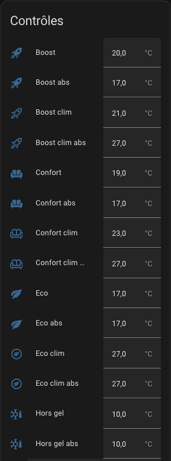

# Presets (Pre-configured Settings)

- [Presets (Pre-configured Settings)](#presets-pre-configured-settings)
  - [Configure Pre-configured Temperatures](#configure-pre-configured-temperatures)

## Configure Pre-configured Temperatures

The preset mode allows you to pre-configure the target temperature. Used in conjunction with Scheduler (see [scheduler](additions.md#the-scheduler-component)), you'll have a powerful and simple way to optimize the temperature relative to the electricity consumption in your home. The managed presets are as follows:
 - **Eco**: the device is in energy-saving mode
 - **Comfort**: the device is in comfort mode
 - **Boost**: the device fully opens all valves

If the AC mode is used, you can also configure temperatures when the equipment is in air conditioning mode.

**None** is always added to the list of modes, as it is a way to not use presets but instead set a **manual temperature**.

The presets are configured directly from the _VTherm_ entities or the central configuration if you're using centralized control. Upon creating the _VTherm_, you will have different entities that will allow you to set the temperatures for each preset:

.

The list of entities varies depending on your feature choices:
1. If the 'presence detection' function is activated, you will have the presets with an "absence" version prefixed with _abs_.
2. If you have selected the _AC_ option, you will also have presets for 'air conditioning' prefixed with _clim_.

>  _*Notes*_
>
> 1. When you manually change the target temperature, the preset switches to None (no preset).
> 2. The standard preset `Away` is a hidden preset that cannot be directly selected. Versatile Thermostat uses presence management or motion detection to automatically and dynamically adjust the target temperature based on presence in the home or activity in the room. See [presence management](feature-presence.md).
> 3. If you're using load shedding management, you will see a hidden preset named `power`. The heating element's preset is set to "power" when overload conditions are met and load shedding is active for that heating element. See [power management](feature-power.md).
> 4. If you're using advanced configuration, you will see the preset set to `safety` if the temperature could not be retrieved after a certain delay. See [Safety Mode](feature-advanced.md#safety-mode).