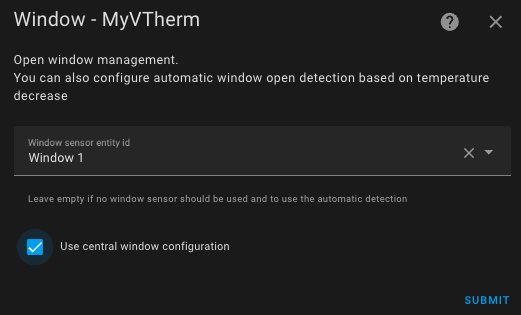
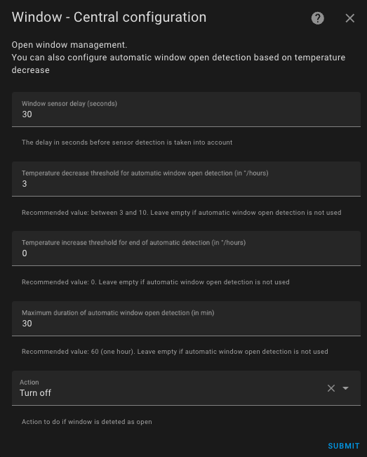
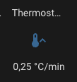
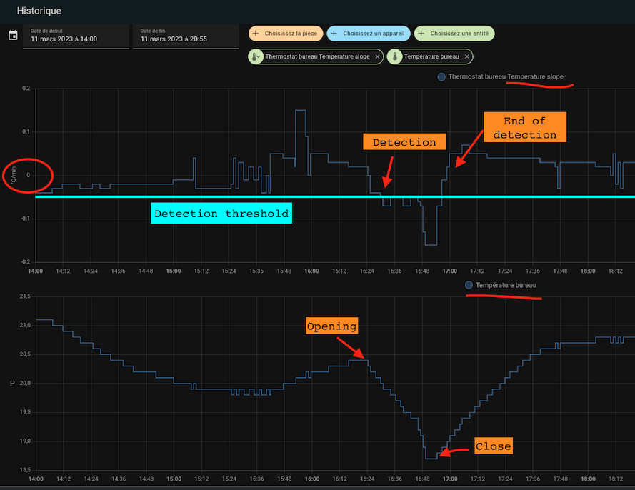

# Door/Window Open Detection

- [Door/Window Open Detection](#doorwindow-open-detection)
  - [Sensor Mode](#sensor-mode)
  - [Auto Mode](#auto-mode)

You must have selected the `With Open Detection` feature on the first page to reach this page.
Open detection can be done in two ways:
1. By using a sensor placed on the opening (sensor mode),
2. By detecting a sudden temperature drop (auto mode)

## Sensor Mode
To switch to sensor mode, you need to provide an entity of type `binary_sensor` or `input_boolean`.
In this mode, you need to fill in the following information:

1. A **delay in seconds** before any change. This allows you to open a window quickly without stopping the heating.
2. The action to take when the opening is detected as open. The possible actions are:
   1. _Turn off_: the _VTherm_ will be turned off.
   2. _Fan only_: heating or cooling will be turned off, but the equipment will continue to ventilate (for compatible equipment).
   3. _Frost protection_: the "Frost Protection" preset temperature will be selected on the _VTherm_ without changing the current preset (see notes below).
   4. _Eco_: the "Eco" preset temperature will be applied to the _VTherm_ without changing the current preset (see notes below).

When the detector switches to open:
1. _VTherm_ waits for the specified delay.
2. If the window is still open after the delay, the _VTherm_ state (Heating / Cooling / ..., current preset, current target temperature) is saved and the action is performed.

Similarly, when the detector switches to closed:
1. _VTherm_ waits for the specified delay.
2. If the window is still closed after the delay, the state before the window opening is restored.

## Auto Mode
In auto mode, the configuration is as follows:

1. A **delay in seconds** before any change. This allows you to open a window quickly without stopping the heating.
2. A detection threshold in degrees per hour. When the temperature drops beyond this threshold, the thermostat will turn off. The lower this value, the faster the detection (with a higher risk of false positives).
3. A threshold for ending detection in degrees per hour. When the temperature drop exceeds this value, the thermostat will return to the previous mode (mode and preset).
4. A maximum detection duration. Beyond this duration, the thermostat will return to its previous mode and preset even if the temperature continues to drop.
5. The action to take when the opening is detected as open. The actions are the same as in sensor mode described above.

To adjust the thresholds, it is recommended to start with the reference values and adjust the detection thresholds. Some tests gave me the following values (for an office):
- Detection threshold: 3°C/hour
- No detection threshold: 0°C/hour
- Max duration: 30 min.

A new sensor called "slope" has been added for all thermostats. It provides the slope of the temperature curve in °C/hour (or °K/hour). This slope is smoothed and filtered to avoid aberrant thermometer values that could interfere with the measurement.

To adjust it properly, it is recommended to display both the temperature curve and the slope of the curve ("slope") on the same historical graph:

>  _*Notes*_
>
> 1. If you want to use **multiple door/window sensors** to automate your thermostat, simply create a group with the usual behavior (https://www.home-assistant.io/integrations/binary_sensor.group/)
> 2. If you don't have a door/window sensor in your room, simply leave the sensor entity ID empty.
> 3. **Only one mode is allowed**. You cannot configure a thermostat with both a sensor and auto detection. The two modes might contradict each other, so both modes cannot be active at the same time.
> 4. It is not recommended to use auto mode for equipment subjected to frequent and normal temperature variations (hallways, open areas, etc.).
> 5. To avoid interfering with your current preset settings, the actions _Frost protection_ and _Eco_ change the target temperature without changing the preset. So, you may notice a discrepancy between the selected preset and the setpoint.
> 6. If you use the Versatile Thermostat UI card (see [here](additions.md#even-better-with-the-versatile-thermostat-ui-card)), open detection is represented as follows: .