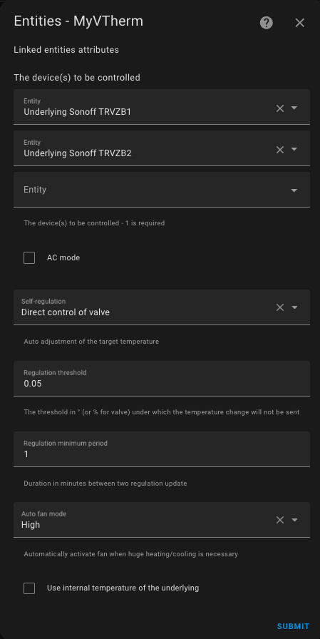

# `over_climate` Type Thermostat

- [`over_climate` Type Thermostat](#over_climate-type-thermostat)
  - [Prerequisites](#prerequisites)
  - [Configuration](#configuration)
    - [The Underlying Entities](#the-underlying-entities)
    - [AC Mode](#ac-mode)
    - [Self-Regulation](#self-regulation)
    - [Auto-Fan (Auto Ventilation)](#auto-fan-auto-ventilation)
    - [Compensating for the Internal Temperature of the Underlying Equipment](#compensating-for-the-internal-temperature-of-the-underlying-equipment)
  - [Specific Functions](#specific-functions)
  - [Follow Underlying Temperature Changes](#follow-underlying-temperature-changes)

## Prerequisites

The installation should look like this:

1. The user or automation, or the Scheduler, sets a setpoint via a preset or directly using a temperature.
2. Periodically, the internal thermometer (2), external thermometer (2b), or equipment's internal thermometer (2c) sends the measured temperature. The internal thermometer should be placed in a relevant spot for the user's comfort: ideally in the middle of the living space. Avoid placing it too close to a window or equipment.
3. Based on the setpoint values, differences, and self-regulation parameters (see [auto-regulation](self-regulation.md)), VTherm will calculate a setpoint to send to the underlying `climate` entity.
4. The `climate` entity controls the equipment using its own protocol.
5. Depending on the chosen regulation options, VTherm may directly control the opening of a thermostatic valve or calibrate the equipment so that its internal temperature reflects the room temperature.

## Configuration

First, configure the main settings common to all _VTherms_ (see [main settings](base-attributes.md)).
Then, click on the "Underlying Entities" option from the menu, and you will see this configuration page:

### The Underlying Entities
In the "Equipment to Control" list, you should add the `climate` entities that will be controlled by VTherm. Only entities of type `climate` are accepted.

### AC Mode

You can choose an `over_climate` thermostat to control an air conditioner (reversible or not) by checking the "AC Mode" box. If the equipment allows it, both 'Heating' and 'Cooling' modes will be available.

### Self-Regulation

In `over_climate` mode, the device uses its own regulation algorithm: it turns on/off and pauses automatically based on the setpoint transmitted by VTherm through its `climate` entity. It uses its internal thermometer and the received setpoint.

Depending on the equipment, this internal regulation may vary in quality. It greatly depends on the quality of the equipment, the functionality of its internal thermometer, and its internal algorithm. To improve equipment that regulates poorly, VTherm offers a way to adjust the setpoint it sends by increasing or decreasing it based on the room temperature measured by VTherm, rather than the internal temperature.

The self-regulation options are described in detail [here](self-regulation.md).

To avoid overloading the underlying equipment (some may beep unpleasantly, others run on batteries, etc.), two thresholds are available to limit the number of requests:
1. Regulation Threshold: a threshold in ° (or %) below which a new setpoint will not be sent. If the last setpoint was 22°, the next one will be 22° ± regulation threshold. If a direct valve regulation is used (`over_valve` or `over_climate` with direct valve regulation, this value should in percentage and should not below 3% for Sonoff TRVZB.
2. Minimum Regulation Period (in minutes): a minimum time interval below which a new setpoint will not be sent. If the last setpoint was sent at 11:00, the next one cannot be sent before 11:00 + minimum regulation period.

Improperly setting these thresholds may prevent correct self-regulation as new setpoints won't be sent.

### Auto-Fan (Auto Ventilation)

This mode, introduced in version 4.3, forces the use of ventilation if the temperature difference is significant. By activating ventilation, heat distribution occurs more quickly, which helps achieve the target temperature faster.
You can choose which ventilation level to activate from the following options: Low, Medium, High, Turbo.

Of course, your underlying equipment must have ventilation, and it must be controllable for this to work. If your equipment doesn't include the Turbo mode, the High mode will be used instead. Once the temperature difference becomes small again, the ventilation will switch to a "normal" mode, which depends on your equipment (in order): `Mute`, `Auto`, `Low`. The first available mode for your equipment will be chosen.

### Compensating for the Internal Temperature of the Underlying Equipment

Warning: This option must not be used with direct valve control regulation if a calibration entity has been provided.

Sometimes, the internal thermometer of the underlying equipment (TRV, air conditioner, etc.) is inaccurate to the point that self-regulation is insufficient. This happens when the internal thermometer is placed too close to the heat source. The internal temperature rises much faster than the room temperature, leading to regulation failures.
Example:
1. Room temperature is 18°, setpoint is 20°.
2. The internal temperature of the equipment is 22°.
3. If VTherm sends a setpoint of 21° (= 20° + 1° of self-regulation), the equipment will not heat because its internal temperature (22°) is higher than the setpoint (21°).

To address this, a new optional feature has been added in version 5.4: 

When activated, this feature adds the difference between the internal temperature and the room temperature to the setpoint to force heating.
In the above example, the difference is +4° (22° - 18°), so VTherm will send 25° (21° + 4°) to the equipment, forcing it to heat.

This difference is calculated for each underlying equipment since each has its own internal temperature. For example, a VTherm connected to three TRVs, each with its own internal temperature.

This results in much more effective self-regulation that avoids issues with large internal temperature differences due to faulty sensors.

However, be aware that some internal temperatures fluctuate so quickly and inaccurately that they completely skew the calculation. In this case, it’s better to disable this option.

You will find advice on how to adjust these settings properly on the page [self-regulation](self-regulation.md).

>  _*Notes*_
> It is very rare to need to check this box. Most of the time, self-regulation solves the issues. The results highly depend on the equipment and the behavior of its internal temperature.
> You should only use this option if all other methods have failed.

## Specific Functions

Specific functions can be configured through a dedicated option in the menu.

The specific functions that require configuration for this type of VTherm are:
1. Auto-Start/Stop: Automatic start and stop of VTherm based on usage forecasts. This is described here: [auto-start/stop function](feature-auto-start-stop.md).
2. If valve regulation is chosen, the TPI algorithm configuration is accessible from the menu. See ([algorithms](algorithms.md)).

## Follow Underlying Temperature Changes

Some users want to continue using their equipment as before (without _VTherm_). For example, you might want to use the remote control of your _PAC_ or turn the knob on your _TRV_.
If you are in this case, an entity has been added to the _VTherm_ device called `Follow underlying temp changes`:

When this entity is 'On', all temperature or state changes made directly on the underlying equipment are reflected in _VTherm_.

Be careful, if you use this feature, your equipment is now controlled in two ways: _VTherm_ and directly by you. The commands might be contradictory, which could lead to confusion about the equipment's state. _VTherm_ is equipped with a delay mechanism that prevents loops: the user gives a setpoint, which is captured by _VTherm_ and changes the setpoint, ... This delay may cause the change made directly on the equipment to be ignored if these changes are too close together in time.

Some equipment (like Daikin, for example) changes state by itself. If the checkbox is checked, it may turn off the _VTherm_ when that's not what you intended.
That's why it's better not to use it. It generates a lot of confusion and many support requests.
