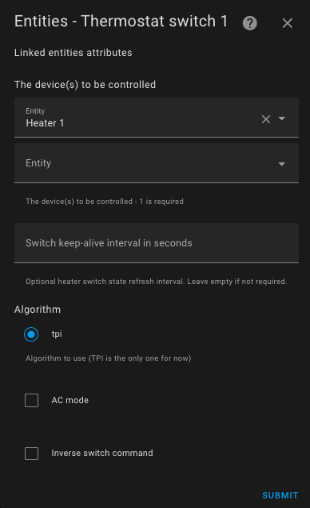
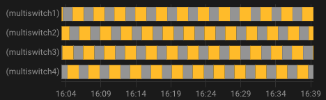
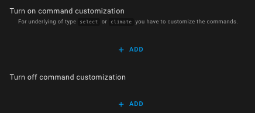
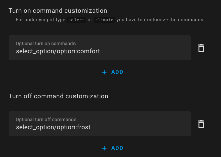

# `over_switch` Type Thermostat

- [`over_switch` Type Thermostat](#over_switch-type-thermostat)
  - [Prerequisites](#prerequisites)
  - [Configuration](#configuration)
    - [The underlying devices](#the-underlying-devices)
    - [Keep-Alive](#keep-alive)
    - [AC Mode](#ac-mode)
    - [Command Inversion](#command-inversion)
    - [Command Customization](#command-customization)

## Prerequisites

The installation should look like this:

1. The user or automation, or the Scheduler, sets a setpoint via a preset or directly using a temperature.
2. Periodically, the internal thermometer (2) or external thermometer (2b) sends the measured temperature. The internal thermometer should be placed in a relevant spot for the user's comfort: ideally in the middle of the living space. Avoid placing it too close to a window or too near the radiator.
3. Based on the setpoint values, the different temperatures, and the TPI algorithm parameters (see [TPI](algorithms.md#lalgorithme-tpi)), VTherm will calculate a percentage of the on-time.
4. It will then regularly command the turning on and off of the underlying `switch` (or `select` or `climate`) entities.
5. These underlying entities will control the physical device.
6. The physical switch will turn the radiator on or off.

> The on-time percentage is recalculated each cycle, which is what allows regulating the room temperature.

## Configuration

First, configure the main settings common to all _VTherms_ (see [main settings](base-attributes.md)).
Then, click on the "Underlying Entities" option from the menu, and you will see this configuration page:

### The underlying devices

In the "list of devices to control," you add the switches that will be controlled by VTherm. Only entities of type `switch`, `input_boolean`, `select`, `input_select`, or `climate` are accepted.

If one of the underlying devices is not a `switch`, then command customization is mandatory. By default, for `switch` entities, the commands are the standard switch on/off commands (`turn_on`, `turn_off`).

The algorithm currently available is TPI. See [algorithm](#algorithm).
If multiple entities are configured, the thermostat staggers the activations to minimize the number of switches on at any given time. This allows for better power distribution, as each radiator will turn on in turn.

VTherm will smooth the consumed power as much as possible by alternating activations. Example of staggered activations:

Of course, if the requested power (`on_percent`) is too high, there will be an overlap of activations.

### Keep-Alive

Some equipment requires periodic activation to prevent a safety shutdown. Known as "keep-alive," this function can be activated by entering a non-zero number of seconds in the thermostat's keep-alive interval field. To disable the function or if in doubt, leave it empty or enter zero (default value).

### AC Mode

It is possible to choose a `thermostat_over_switch` to control an air conditioner by checking the "AC Mode" box. In this case, only the cooling mode will be visible.

### Command Inversion

If your equipment is controlled by a pilot wire with a diode, you may need to check the "Invert the Command" box. This will set the switch to `On` when you need to turn off the equipment and to `Off` when you need to turn it on. The cycle times will be inverted with this option.

### Command Customization

This configuration section allows you to customize the on and off commands sent to the underlying device.
These commands are mandatory if one of the underlying devices is not a `switch` (for `switch` entities, standard on/off commands are used).

To customize the commands, click on `Add` at the bottom of the page for both the on and off commands:

Then, specify the on and off commands using the format `command[/attribute[:value]]`.
The available commands depend on the type of underlying device:

| Underlying Device Type      | Possible On Commands                  | Possible Off Commands                          | Applies To                        |
| --------------------------- | ------------------------------------- | ---------------------------------------------- | --------------------------------- |
| `switch` or `input_boolean` | `turn_on`                             | `turn_off`                                     | All switches                      |
| `select` or `input_select`  | `select_option/option:comfort`        | `select_option/option:frost_protection`        | Nodon SIN-4-FP-21 and similar (*) |
| `climate` (hvac_mode)       | `set_hvac_mode/hvac_mode:heat`        | `set_hvac_mode/hvac_mode:off`                  | eCosy (via Tuya Local)            |
| `climate` (preset)          | `set_preset_mode/preset_mode:comfort` | `set_preset_mode/preset_mode:frost_protection` | Heatzy (*)                        |

(*) Check the values accepted by your device in **Developer Tools / States** and search for your device. You will see the options it supports. They must be identical, including case sensitivity.

Of course, these examples can be adapted to your specific case.

Example for a Nodon SIN-4-FP-21:

Click "Validate" to confirm the modifications.

If the following error occurs:

> The command customization configuration is incorrect. It is required for non-switch underlying devices, and the format must be 'service_name[/attribute:value]'. More details in the README.

This means that one of the entered commands is invalid. The following rules must be followed:
1. Each command must follow the format `command[/attribute[:value]]` (e.g., `select_option/option:comfort` or `turn_on`) without spaces or special characters except `_`.
2. There must be as many commands as there are declared underlying devices, except when all underlying devices are `switch` entities, in which case command customization is not required.
3. If multiple underlying devices are configured, the commands must be in the same order. The number of on commands must equal the number of off commands and the number of underlying devices (in the correct order). It is possible to mix different types of underlying devices. As soon as one underlying device is not a `switch`, all commands for all underlying devices, including `switch` entities, must be configured.
