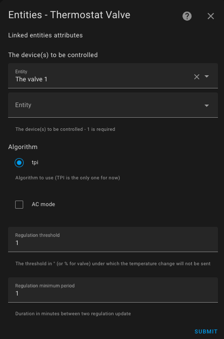

# `thermostat_over_valve` Type Thermostat

>  _*Notes*_
> 1. The `over_valve` type is often confused with the `over_climate` type equipped with auto-regulation and direct valve control.
> 2. You should only choose this type when you do not have an associated `climate` entity for your _TRV_ in Home Assistant, and if you only have a `number` type entity to control the valve's opening percentage. The `over_climate` with auto-regulation on the valve is much more powerful than the `over_valve` type.

## Prerequisites

The installation should be similar to the `over_switch` VTherm setup, except that the controlled equipment is directly the valve of a _TRV_:

1. The user or automation, or the Scheduler, sets a setpoint via a preset or directly using a temperature.
2. Periodically, the internal thermometer (2) or external thermometer (2b) or internal thermometer of the equipment (2c) sends the measured temperature. The internal thermometer should be placed in a relevant spot for the user's comfort: ideally in the middle of the living space. Avoid placing it too close to a window or too near the equipment.
3. Based on the setpoint values, the different temperatures, and the TPI algorithm parameters (see [TPI](algorithms.md#lalgorithme-tpi)), VTherm will calculate the valve's opening percentage.
4. It will then modify the value of the underlying `number` entities.
5. These underlying `number` entities will control the valve opening rate on the _TRV_.
6. This will regulate the radiator's heating.

> The opening rate is recalculated each cycle, which allows regulating the room temperature.

## Configuration

First, configure the main settings common to all _VTherms_ (see [main settings](base-attributes.md)).
Then, click on the "Underlying Entities" option from the menu, and you will see this configuration page, you should add the `number` entities that will be controlled by VTherm. Only `number` or `input_number` entities are accepted.

The algorithm currently available is TPI. See [algorithm](#algorithm).

### Valve opening control

`over_valve` can adjust the TPI opening command to match the physical limits of
each valve. The configuration uses the same parameters as direct valve control
with `over_climate`:

1. `opening_threshold_degree`: below this raw TPI percentage, the valve is
	considered closed.
2. `max_closing_degree`: maximum closing percentage. The command under the
	threshold is `100 - max_closing_degree`; keep the default `100` to close it
	fully.
3. `min_opening_degrees`: comma-separated minimum opening values, one per
	underlying valve. A value is applied as soon as the threshold is reached.
4. `max_opening_degrees`: comma-separated maximum opening values, one per
	underlying valve. Omitted values use the maximum supported by the related
	`number` entity.

For several valves, values are applied in the same order as the underlying
entities. Short lists use defaults for remaining valves; lists longer than the
underlying list are rejected. With the defaults (`0`, empty lists, `100`), the
command sent to the valve remains identical to the raw TPI percentage.

It is possible to choose a `thermostat_over_valve` to control an air conditioner by checking the "AC Mode" box. In this case, only the cooling mode will be visible.

### Sleep mode

`over_valve` supports sleep mode. Selecting `sleep`, or calling the
`versatile_thermostat.set_hvac_mode_sleep` action, presents VTherm as off while
sending a raw 100% opening request to every underlying valve. This request still
uses the normal opening-control conversion: `max_opening_degrees` and the
underlying `number` limits can therefore cap the physical opening. Sleep mode
does not request central boiler heating; `is_sleeping` identifies this state.
