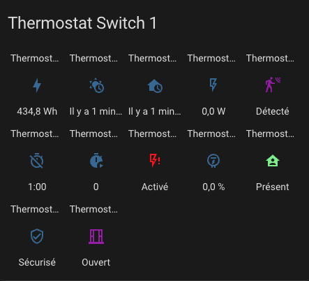
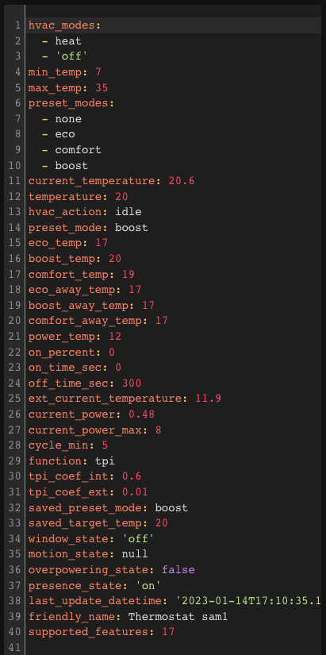

# Reference Documentation

- [Reference Documentation](#reference-documentation)
  - [Parameter Summary](#parameter-summary)
- [Sensors](#sensors)
- [Actions (Services)](#actions-services)
  - [Force Presence/Occupation](#force-presenceoccupation)
  - [Modify the Preset Temperature](#modify-the-preset-temperature)
  - [Modify Security Settings](#modify-security-settings)
  - [ByPass Window Check](#bypass-window-check)
- [Events](#events)
- [Custom Attributes](#custom-attributes)

## Parameter Summary

| Parameter                                 | Label                                                      | "over switch" | "over climate"      | "over valve" | "central configuration" |
| ----------------------------------------- | ---------------------------------------------------------- | ------------- | ------------------- | ------------ | ----------------------- |
| ``name``                                  | Name                                                       | X             | X                   | X            | -                       |
| ``thermostat_type``                       | Thermostat type                                            | X             | X                   | X            | -                       |
| ``temperature_sensor_entity_id``          | Temperature sensor entity id                               | X             | X (auto-regulation) | X            | -                       |
| ``external_temperature_sensor_entity_id`` | External temperature sensor entity id                      | X             | X (auto-regulation) | X            | X                       |
| ``cycle_min``                             | Cycle duration (minutes)                                   | X             | X                   | X            | -                       |
| ``temp_min``                              | Minimum allowed temperature                                | X             | X                   | X            | X                       |
| ``temp_max``                              | Maximum allowed temperature                                | X             | X                   | X            | X                       |
| ``device_power``                          | Device power                                               | X             | X                   | X            | -                       |
| ``use_central_mode``                      | Enable centralized control                                 | X             | X                   | X            | -                       |
| ``use_window_feature``                    | With window detection                                      | X             | X                   | X            | -                       |
| ``use_motion_feature``                    | With motion detection                                      | X             | X                   | X            | -                       |
| ``use_power_feature``                     | With power management                                      | X             | X                   | X            | -                       |
| ``use_presence_feature``                  | With presence detection                                    | X             | X                   | X            | -                       |
| ``heater_entity1_id``                     | 1st heater                                                 | X             | -                   | -            | -                       |
| ``heater_entity2_id``                     | 2nd heater                                                 | X             | -                   | -            | -                       |
| ``heater_entity3_id``                     | 3rd heater                                                 | X             | -                   | -            | -                       |
| ``heater_entity4_id``                     | 4th heater                                                 | X             | -                   | -            | -                       |
| ``heater_keep_alive``                     | Switch refresh interval                                    | X             | -                   | -            | -                       |
| ``proportional_function``                 | Algorithm                                                  | X             | -                   | -            | -                       |
| ``climate_entity1_id``                    | Underlying thermostat                                      | -             | X                   | -            | -                       |
| ``climate_entity2_id``                    | 2nd underlying thermostat                                  | -             | X                   | -            | -                       |
| ``climate_entity3_id``                    | 3rd underlying thermostat                                  | -             | X                   | -            | -                       |
| ``climate_entity4_id``                    | 4th underlying thermostat                                  | -             | X                   | -            | -                       |
| ``valve_entity1_id``                      | Underlying valve                                           | -             | -                   | X            | -                       |
| ``valve_entity2_id``                      | 2nd underlying valve                                       | -             | -                   | X            | -                       |
| ``valve_entity3_id``                      | 3rd underlying valve                                       | -             | -                   | X            | -                       |
| ``valve_entity4_id``                      | 4th underlying valve                                       | -             | -                   | X            | -                       |
| ``ac_mode``                               | Use of air conditioning (AC)?                              | X             | X                   | X            | -                       |
| ``tpi_coef_int``                          | Coefficient for internal temperature delta                 | X             | -                   | X            | X                       |
| ``tpi_coef_ext``                          | Coefficient for external temperature delta                 | X             | -                   | X            | X                       |
| ``frost_temp``                            | Frost preset temperature                                   | X             | X                   | X            | X                       |
| ``window_sensor_entity_id``               | Window sensor (entity id)                                  | X             | X                   | X            | -                       |
| ``window_delay``                          | Delay before turn-off (seconds)                            | X             | X                   | X            | X                       |
| ``window_auto_open_threshold``            | High drop threshold for automatic detection (°/min)        | X             | X                   | X            | X                       |
| ``window_auto_close_threshold``           | Low drop threshold for automatic closure detection (°/min) | X             | X                   | X            | X                       |
| ``window_auto_max_duration``              | Maximum duration of automatic turn-off (minutes)           | X             | X                   | X            | X                       |
| ``motion_sensor_entity_id``               | Motion sensor entity id                                    | X             | X                   | X            | -                       |
| ``motion_delay``                          | Delay before motion is considered (seconds)                | X             | X                   | X            | -                       |
| ``motion_off_delay``                      | Delay before end of motion is considered (seconds)         | X             | X                   | X            | X                       |
| ``motion_preset``                         | Preset to use if motion is detected                        | X             | X                   | X            | X                       |
| ``no_motion_preset``                      | Preset to use if no motion is detected                     | X             | X                   | X            | X                       |
| ``power_sensor_entity_id``                | Total power sensor (entity id)                             | X             | X                   | X            | X                       |
| ``max_power_sensor_entity_id``            | Max power sensor (entity id)                               | X             | X                   | X            | X                       |
| ``power_temp``                            | Temperature during load shedding                           | X             | X                   | X            | X                       |
| ``presence_sensor_entity_id``             | Presence sensor entity id (true if someone is present)     | X             | X                   | X            | -                       |
| ``minimal_activation_delay``              | Minimum activation delay                                   | X             | -                   | -            | X                       |
| ``security_delay_min``                    | Maximum delay between two temperature measurements         | X             | -                   | X            | X                       |
| ``security_min_on_percent``               | Minimum power percentage to enter security mode            | X             | -                   | X            | X                       |
| ``auto_regulation_mode``                  | Auto-regulation mode                                       | -             | X                   | -            | -                       |
| ``auto_regulation_dtemp``                 | Auto-regulation threshold                                  | -             | X                   | -            | -                       |
| ``auto_regulation_period_min``            | Minimum auto-regulation period                             | -             | X                   | -            | -                       |
| ``inverse_switch_command``                | Inverse the switch command (for switches with pilot wire)  | X             | -                   | -            | -                       |
| ``auto_fan_mode``                         | Automatic fan mode                                         | -             | X                   | -            | -                       |
| ``auto_regulation_use_device_temp``       | Use of internal temperature of the underlying device       | -             | X                   | -            | -                       |
| ``use_central_boiler_feature``            | Add central boiler control                                 | -             | -                   | -            | X                       |
| ``central_boiler_activation_service``     | Boiler activation service                                  | -             | -                   | -            | X                       |
| ``central_boiler_deactivation_service``   | Boiler deactivation service                                | -             | -                   | -            | X                       |
| ``used_by_controls_central_boiler``       | Indicates if the VTherm controls the central boiler        | X             | X                   | X            | -                       |
| ``use_auto_start_stop_feature``           | Indicates if the auto start/stop feature is enabled        | -             | X                   | -            | -                       |
| ``auto_start_stop_level``                 | The detection level for auto start/stop                    | -             | X                   | -            | -                       |

# Sensors

With the thermostat, sensors are available to visualize alerts and the internal state of the thermostat. These are available in the entities of the device associated with the thermostat:


In order, there are:
1. the main ``climate`` entity for thermostat control,
2. the entity allowing the auto-start/stop feature,
3. the entity allowing _VTherm_ to follow changes in the underlying device,
4. the energy consumed by the thermostat (value that increments continuously),
5. the time of receipt of the last external temperature,
6. the time of receipt of the last internal temperature,
7. the average power of the device during the cycle (for TPI only),
8. the time spent in the off state during the cycle (TPI only),
9. the time spent in the on state during the cycle (TPI only),
10. the load shedding state,
11. the power percentage during the cycle (TPI only),
12. the presence state (if presence management is configured),
13. the security state,
14. the window state (if window management is configured),
15. the motion state (if motion management is configured),
16. the valve opening percentage (for `over_valve` type),

The presence of these entities depends on whether the associated feature is enabled.

To color the sensors, add these lines and customize them as needed in your `configuration.yaml`:

```yaml
frontend:
  themes:
    versatile_thermostat_theme:
      state-binary_sensor-safety-on-color: "#FF0B0B"
      state-binary_sensor-power-on-color: "#FF0B0B"
      state-binary_sensor-window-on-color: "rgb(156, 39, 176)"
      state-binary_sensor-motion-on-color: "rgb(156, 39, 176)"
      state-binary_sensor-presence-on-color: "lightgreen"
      state-binary_sensor-running-on-color: "orange"
```

and choose the theme ```versatile_thermostat_theme``` in the panel configuration. You will get something like this:



# Actions (Services)

This custom implementation offers specific actions (services) to facilitate integration with other Home Assistant components.

## Force Presence/Occupation
This service allows you to force the presence state independently of the presence sensor. This can be useful if you want to manage presence via a service rather than a sensor. For example, you can use your alarm to force absence when it is turned on.

The code to call this service is as follows:

```yaml
service : versatile_thermostat.set_presence
Les données:
    présence : "off"
cible:
    entity_id : climate.my_thermostat
```

## Modify the Preset Temperature
This service is useful if you want to dynamically change the preset temperature. Instead of switching presets, some use cases require modifying the temperature of the preset. This way, you can keep the scheduler unchanged to manage the preset while adjusting the preset temperature.
If the modified preset is currently selected, the target temperature change is immediate and will be applied in the next calculation cycle.

You can modify one or both temperatures (when present or absent) of each preset.

Use the following code to set the preset temperature:
```yaml
service: versatile_thermostat.set_preset_temperature
data:
    preset: boost
    temperature: 17.8
    temperature_away: 15
target:
    entity_id: climate.my_thermostat
```

Or, to change the preset for the Air Conditioning (AC) mode, add the `_ac` prefix to the preset name like this:
```yaml
service: versatile_thermostat.set_preset_temperature
data:
    preset: boost_ac
    temperature: 25
    temperature_away: 30
target:
    entity_id: climate.my_thermostat
```

>  _*Notes*_
>
>    - After a restart, presets are reset to the configured temperature. If you want your change to be permanent, you need to modify the preset temperature in the integration configuration.

## Modify Security Settings
This service allows you to dynamically modify the security settings described here [Advanced Configuration](#advanced-configuration).
If the thermostat is in ``security`` mode, the new settings are applied immediately.

To change the security settings, use the following code:
```yaml
service: versatile_thermostat.set_safety
data:
    min_on_percent: "0.5"
    default_on_percent: "0.1"
    delay_min: 60
target:
    entity_id: climate.my_thermostat
```

## ByPass Window Check
This service allows you to enable or disable a bypass for the window check.
It allows the thermostat to continue heating even if the window is detected as open.
When set to ``true``, changes to the window's status will no longer affect the thermostat. When set to ``false``, the thermostat will be disabled if the window is still open.

To change the bypass setting, use the following code:
```yaml
service: versatile_thermostat.set_window_bypass
data:
    bypass: true
target:
    entity_id: climate.my_thermostat
```

# Events
The key events of the thermostat are notified via the message bus.
The following events are notified:

- ``versatile_thermostat_security_event``: the thermostat enters or exits the ``security`` preset
- ``versatile_thermostat_power_event``: the thermostat enters or exits the ``power`` preset
- ``versatile_thermostat_temperature_event``: one or both temperature measurements of the thermostat haven't been updated for more than `security_delay_min`` minutes
- ``versatile_thermostat_hvac_mode_event``: the thermostat is turned on or off. This event is also broadcast at the thermostat's startup
- ``versatile_thermostat_preset_event``: a new preset is selected on the thermostat. This event is also broadcast at the thermostat's startup
- ``versatile_thermostat_central_boiler_event``: an event indicating a change in the boiler's state
- ``versatile_thermostat_auto_start_stop_event``: an event indicating a stop or restart made by the auto-start/stop function

If you've followed along, when a thermostat switches to security mode, 3 events are triggered:
1. ``versatile_thermostat_temperature_event`` to indicate that a thermometer is no longer responding,
2. ``versatile_thermostat_preset_event`` to indicate the switch to the ``security`` preset,
3. ``versatile_thermostat_hvac_mode_event`` to indicate the potential shutdown of the thermostat

Each event carries the event's key values (temperatures, current preset, current power, ...) as well as the thermostat's states.

You can easily capture these events in an automation, for example, to notify users.

# Custom Attributes

To adjust the algorithm, you have access to the entire context seen and calculated by the thermostat via dedicated attributes. You can view (and use) these attributes in the "Developer Tools / States" section of HA. Enter your thermostat and you will see something like this:


The custom attributes are as follows:
| Attribute                         | Meaning                                                                                                                             |
| --------------------------------- | ----------------------------------------------------------------------------------------------------------------------------------- |
| ``hvac_modes``                    | The list of modes supported by the thermostat                                                                                       |
| ``temp_min``                      | The minimum temperature                                                                                                             |
| ``temp_max``                      | The maximum temperature                                                                                                             |
| ``preset_modes``                  | The presets visible for this thermostat. Hidden presets are not displayed here                                                      |
| ``temperature_actuelle``          | The current temperature as reported by the sensor                                                                                   |
| ``temperature``                   | The target temperature                                                                                                              |
| ``action_hvac``                   | The action currently being executed by the heater. Can be idle, heating                                                             |
| ``preset_mode``                   | The preset currently selected. Can be one of the 'preset_modes' or a hidden preset like power                                       |
| ``[eco/confort/boost]_temp``      | The temperature configured for preset xxx                                                                                           |
| ``[eco/confort/boost]_away_temp`` | The temperature configured for preset xxx when presence is disabled or not_home                                                     |
| ``temp_power``                    | The temperature used during loss detection                                                                                          |
| ``on_percent``                    | The calculated on percentage by the TPI algorithm                                                                                   |
| ``on_time_sec``                   | The on period in seconds. Should be ```on_percent * cycle_min```                                                                    |
| ``off_time_sec``                  | The off period in seconds. Should be ```(1 - on_percent) * cycle_min```                                                             |
| ``cycle_min``                     | The calculation cycle in minutes                                                                                                    |
| ``function``                      | The algorithm used for the cycle calculation                                                                                        |
| ``tpi_coef_int``                  | The ``coef_int`` of the TPI algorithm                                                                                               |
| ``tpi_coef_ext``                  | The ``coef_ext`` of the TPI algorithm                                                                                               |
| ``saved_preset_mode``             | The last preset used before automatic preset switching                                                                              |
| ``saved_target_temp``             | The last temperature used before automatic switching                                                                                |
| ``window_state``                  | The last known state of the window sensor. None if the window is not configured                                                     |
| ``is_window_bypass``              | True if the window open detection bypass is enabled                                                                                 |
| ``motion_state``                  | The last known state of the motion sensor. None if motion detection is not configured                                               |
| ``overpowering_state``            | The last known state of the overpower sensor. None if power management is not configured                                            |
| ``presence_state``                | The last known state of the presence sensor. None if presence detection is not configured                                           |
| ``security_delay_min``            | The delay before activating security mode when one of the two temperature sensors stops sending measurements                        |
| ``security_min_on_percent``       | The heating percentage below which the thermostat will not switch to security                                                       |
| ``security_default_on_percent``   | The heating percentage used when the thermostat is in security mode                                                                 |
| ``last_temperature_datetime``     | The date and time in ISO8866 format of the last internal temperature reception                                                      |
| ``last_ext_temperature_datetime`` | The date and time in ISO8866 format of the last external temperature reception                                                      |
| ``security_state``                | The security state. True or false                                                                                                   |
| ``minimal_activation_delay_sec``  | The minimal activation delay in seconds                                                                                             |
| ``last_update_datetime``          | The date and time in ISO8866 format of this state                                                                                   |
| ``friendly_name``                 | The name of the thermostat                                                                                                          |
| ``supported_features``            | A combination of all features supported by this thermostat. See the official climate integration documentation for more information |
| ``valve_open_percent``            | The valve opening percentage                                                                                                        |
| ``regulated_target_temperature``  | The target temperature calculated by self-regulation                                                                                |
| ``is_inversed``                   | True if the control is inverted (pilot wire with diode)                                                                             |
| ``is_controlled_by_central_mode`` | True if the VTherm can be centrally controlled                                                                                      |
| ``last_central_mode``             | The last central mode used (None if the VTherm is not centrally controlled)                                                         |
| ``is_used_by_central_boiler``     | Indicates if the VTherm can control the central boiler                                                                              |
| ``auto_start_stop_enable``        | Indicates if the VTherm is allowed to auto start/stop                                                                               |
| ``auto_start_stop_level``         | Indicates the auto start/stop level                                                                                                 |
| ``hvac_off_reason``               | Indicates the reason for the thermostat's off state (hvac_off). It can be Window, Auto-start/stop, or Manual                        |
| ``last_change_time_from_vtherm``  | The date and time of the last change done by VTherm                                                                                 |
| ``nb_device_actives``             | The number of underlying devices seen as active                                                                                     |
| ``device_actives``                | The list of underlying devices seen as active                                                                                       |


These attributes will be requested when you need assistance.