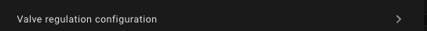
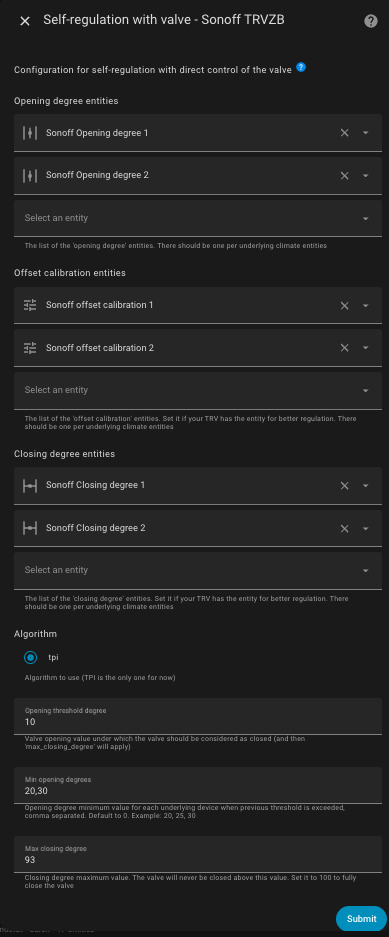
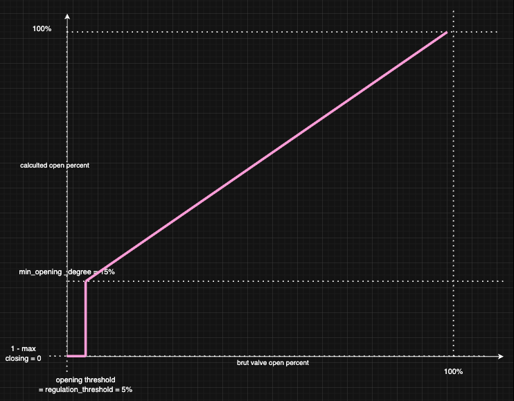
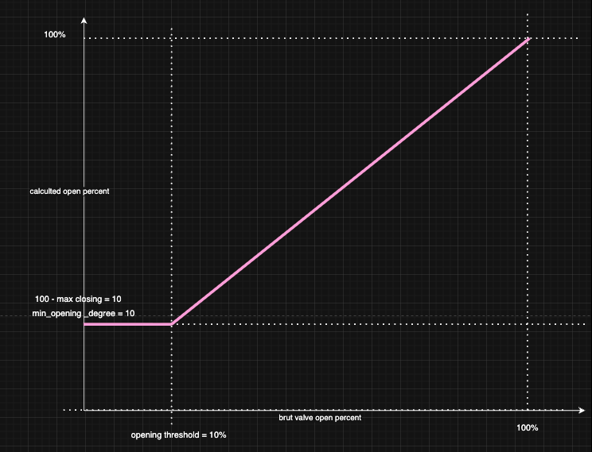

# Self-regulation

- [Self-regulation](#self-regulation)
  - [Configuration](#configuration)
    - [Self-regulation by direct valve control](#self-regulation-by-direct-valve-control)
      - [How to properly adjust the parameters that control the opening?](#how-to-properly-adjust-the-parameters-that-control-the-opening)
        - [Case 1: you have a 15% dead zone on your valve (the first 15% do not allow hot water to circulate)](#case-1-you-have-a-15-dead-zone-on-your-valve-the-first-15-do-not-allow-hot-water-to-circulate)
        - [Case 2: you never want to completely close the valve nor open totally the valve](#case-2-you-never-want-to-completely-close-the-valve-nor-open-totally-the-valve)
    - [Other self-regulation](#other-self-regulation)
      - [Self-regulation in Expert Mode](#self-regulation-in-expert-mode)
  - [Summary of the Auto-Regulation Algorithm](#summary-of-the-auto-regulation-algorithm)

You have the option to activate the self-regulation feature only for _VTherms_ of type `over_climate`.

There are generally two cases:
1. If your underlying device is a _TRV_ and the valve is directly controllable in Home Assistant (e.g., Sonoff TRVZB), this function will allow _VTherm_ to directly manipulate the valve opening to regulate the temperature. The opening is then calculated by a _TPI_-type algorithm (see [here](algorithms.md)).
2. Otherwise, Versatile Thermostat will adjust the temperature setpoint given to the underlying climate to ensure the room temperature actually reaches the setpoint.

## Configuration

### Self-regulation by direct valve control

This type of self-regulation called `Direct valve control` requires:
1. a `climate` entity that is set in the underlying entities of the _VTherm_,
2. a `number` entity that allows controlling the valve opening rate of the _TRV_,
3. an optional `number` entity allowing to control the valve closing

When the chosen self-regulation is `Direct valve control` on an `over_climate` _VTherm_, a new configuration page called `Valve regulation configuration` appears:



It allows configuring the valve control entities:



You must provide:
1. as many valve opening control entities as there are underlying entities and in the same order. These parameters are mandatory,
2. as many closing rate control entities as there are underlying entities and in the same order. These parameters are optional; they must all be provided or none,
3. `opening_threshold`: the minimum valve opening below which the valve should be considered closed, and consequently, the 'max_closing_degree' parameter applies,
4. `max_closing_degree`: the absolute maximum closing percentage. The valve will never close more than what is indicated in this value. If you want to allow complete valve closing, then leave this parameter at 100,
5. `minimum_opening_degrees`: the minimum opening percentage when the `opening_threshold` is exceeded and the VTherm needs to heat. This field is customizable per valve in the case of a VTherm with multiple valves. You specify the list of minimum openings separated by ','. The default value is 0. Example: '20, 25, 30'. When heating starts (ie the requested opening is greater than `opening_threshold`), the valve will open with a value greater than or equal to this and will continue to increase regularly if necessary.
6. `max_opening_degrees`: the maximum opening percentage that the valve can reach. This field is customizable per valve in the case of a VTherm with multiple valves. You specify the list of maximum openings separated by ','. The default value is 100 (full opening). Example: '80, 85, 90'. The valve will never open beyond this value, allowing you to limit the hot water flow and optimize energy consumption. This value must be strictly greater than `minimum_opening_degrees` for each valve.

The opening rate calculation algorithm is based on _TPI_ which is described [here](algorithms.md). It is the same algorithm used for `over_switch` and `over_valve` _VTherm_.

If a valve closing rate entity is configured, it will be set to the value `100 - opening rate` to force the valve into a state, otherwise it is set to 100.

>  _*Notes*_
> 1. the `hvac_action` attribute of Sonoff TRVZB TRVs is capricious. If the internal temperature of the TRV is too offset from the room temperature, the `climate` entity may indicate that the _TRV_ is not heating even though the valve is forced open by _VTherm_. This defect has no consequences since the `climate` entity of the _VTherm_ is corrected and takes into account the valve opening to set its `hvac_action` attribute. This defect is minimized but not completely eliminated by configuring the offset calibration.
> 2. the _VTherm_ attribute `valve_open_percent` may not be equal to the 'opening degree' value sent to the valve. If you use one of the four parameters `opening_threshold`, `max_closing_degree`, `minimum_opening_degrees` or `max_opening_degrees`, an adjustment is made. The custom attribute `valve_open_percent` is then the raw value calculated by _VTherm_. The 'opening degree' value sent to the valve may be adapted.
> 3. some equipment has values that do not necessarily range from 0 to 100. _VTherm_ automatically adapts to the allowed ranges for your equipment.
> 4. If you use the regulation parameter `regulation_threshold` (see [over_climate regulation](./over-climate.md#lauto-régulation)), then the `opening_threshold` will be adjusted so that it is never below this value. Indeed, the `regulation_threshold` is the regulation unit below which the setpoint is not sent. Setting an `opening_threshold` would have no effect.
> 5. A _VTherm_ is considered active if `opening_threshold` is exceeded. Consequently, if the _VTherm_ controls a central boiler, it will not be turned on below this value.

#### How to properly adjust the parameters that control the opening?

**Note :** a graphical visualization of the impacts of the valve opening adjustment parameters is available [here](https://github.com/jmcollin78/versatile_thermostat/discussions/1629). Thanks a lot to @nicklassim80 for this contribution.

The 4 valve opening adjustment parameters allow fine-tuning of valve behavior, especially at the beginning of the heating cycle. If we represent the opening requested by the TPI algorithm on the x-axis and the opening actually sent to the valve on the y-axis, we get this curve:


##### Case 1: you have a 15% dead zone on your valve (the first 15% do not allow hot water to circulate)

The settings can then be:
1. `minimum_opening_degrees`: 15. As soon as heating is needed, it must heat at least 15%,
2. `max_closing_degree`: the default value (100) to allow complete closing,
3. `opening_threshold`: the default value (0) to trigger heating as soon as necessary

You then have the following curve:



or if you have not defined a `regulation_threshold`:


##### Case 2: you never want to completely close the valve nor open totally the valve

This case allows handling parasitic noise during complete closing or as a safety measure to always let some water circulate and avoid damaging the circulator.
The settings can then be as follows:
1. `minimum_opening_degrees`: 10 to heat at least 10% when heating is needed,
2. `max_closing_degree`: 90 to always leave at least 10% opening,
3. `opening_threshold`: 10 to consider that the first 10% do not heat. The TRV is then in `Idle` mode
4. `max_opening_degrees`: 50 to limit the openess of the valve to 50%.

You then have the following curve:



### Other self-regulation

In the second case, Versatile Thermostat calculates an offset based on the following information:
1. The current difference between the actual temperature and the setpoint temperature, called the gross error.
2. The accumulation of past errors.
3. The difference between the outdoor temperature and the setpoint.

These three pieces of information are combined to calculate the offset, which will be added to the current setpoint and sent to the underlying climate.

Self-regulation is configured with:
1. A regulation degree:
   1. Light - for small self-regulation needs. In this mode, the maximum offset will be 1.5°C.
   2. Medium - for medium self-regulation needs. A maximum offset of 2°C is possible in this mode.
   3. Strong - for high self-regulation needs. The maximum offset is 3°C in this mode, and the self-regulation will react strongly to temperature changes.
2. A self-regulation threshold: the value below which no new regulation will be applied. For example, if at time t the offset is 2°C, and at the next calculation, the offset is 2.4°C, the regulation will not be applied. It will only be applied when the difference between the two offsets is at least equal to this threshold.
3. Minimum period between two self-regulations: this number, expressed in minutes, indicates the duration between two regulation changes.

These three parameters allow you to adjust the regulation and avoid applying too many regulation changes. Some devices, like TRVs or boilers, don't like frequent setpoint changes.

>  _*Setup advice*_
> 1. Do not start self-regulation immediately. Observe how your equipment's natural regulation works. If you notice that the setpoint is not reached or takes too long to reach, start the regulation.
> 2. Start with light self-regulation and keep both parameters at their default values. Wait a few days and check if the situation improves.
> 3. If it's not enough, switch to medium self-regulation and wait for stabilization.
> 4. If it's still not enough, switch to strong self-regulation.
> 5. If it's still not correct, you will need to switch to expert mode to finely adjust the regulation parameters.

Self-regulation forces the equipment to push further by regularly adjusting its setpoint. This can increase both its consumption and wear.

#### Self-regulation in Expert Mode

In **Expert** mode, you can finely adjust the self-regulation parameters to meet your goals and optimize performance. The algorithm calculates the gap between the setpoint and the actual room temperature. This gap is called the error.

The adjustable parameters are as follows:
1. `kp`: the factor applied to the gross error,
2. `ki`: the factor applied to the accumulated errors,
3. `k_ext`: the factor applied to the difference between the indoor temperature and the outdoor temperature,
4. `offset_max`: the maximum correction (offset) that the regulation can apply,
5. `accumulated_error_threshold`: the maximum for error accumulation.
6. `overheat_protection`: if enabled, the accumulated error will be divided by 2 in case of sign inversion.

For tuning, the following observations should be considered:
1. `kp * error` will give the offset related to the gross error. This offset is directly proportional to the error and will be 0 when the target is reached.
2. The accumulation of the error helps correct the stabilization curve even if there is still an error. The error accumulates and the offset increases progressively, which should stabilize the temperature around the target. To have a noticeable effect, this parameter should not be too small. A medium value is 30.
3. `ki * accumulated_error_threshold` will give the maximum offset related to the accumulated error.
4. `k_ext` allows immediate (without waiting for accumulated errors) correction when the outdoor temperature is much different from the target temperature. If the stabilization occurs too high when the temperature differences are large, this parameter might be too high. It should be adjustable to zero to allow the first two offsets to do the work.

The pre-programmed values are as follows:

**Slow regulation**:

    kp: 0.2  # 20% of the current internal regulation offset are caused by the current difference of target temperature and room temperature
    ki: 0.8 / 288.0  # 80% of the current internal regulation offset are caused by the average offset of the past 24 hours
    k_ext: 1.0 / 25.0  # this will add 1°C to the offset when it's 25°C colder outdoor than indoor
    offset_max: 2.0  # limit to a final offset of -2°C to +2°C
    accumulated_error_threshold: 2.0 * 288  # this allows up to 2°C long term offset in both directions
    overheat_protection: true

**Light regulation**:

    kp: 0.2
    ki: 0.05
    k_ext: 0.05
    offset_max: 1.5
    accumulated_error_threshold: 10
    overheat_protection: true

**Medium regulation**:

    kp: 0.3
    ki: 0.05
    k_ext: 0.1
    offset_max: 2
    accumulated_error_threshold: 20
    overheat_protection: true

**Strong regulation**:

    """Strong parameters for regulation
    A set of parameters which doesn't take into account the external temp
    and concentrate on internal temp error + accumulated error.
    This should work for cold external conditions which otherwise generate
    high external_offset"""

    kp: 0.4
    ki: 0.08
    k_ext: 0.0
    offset_max: 5
    accumulated_error_threshold: 50
    overheat_protection: true

To use Expert mode, you must declare the values you wish to use for each of these parameters in your `configuration.yaml` as follows. Example for 'Extreme regulation':

```yaml
versatile_thermostat:
    auto_regulation_expert:
        kp: 0.6
        ki: 0.1
        k_ext: 0.0
        offset_max: 10
        accumulated_error_threshold: 80
        overheat_protection: true
```
and of course, configure the auto-regulation mode of the VTherm to Expert mode. All _VTherms_ in **Expert** mode will use the same parameters, it is not possible to have different expert settings.

To apply the changes, you must either **restart Home Assistant completely** or just the Versatile Thermostat integration (Developer Tools / YAML / Reload Configuration / Versatile Thermostat).

>  _*Notes*_
>
> 1. In expert mode, it is rarely necessary to use the option [Compensate the internal temperature of the underlying](over-climate.md#compensate-the-internal-temperature-of-the-underlying). This could result in very high setpoints.

## Summary of the Auto-Regulation Algorithm

A summary of the auto-regulation algorithm is described [here](algorithms.md#the-auto-regulation-algorithm-without-valve-control)
