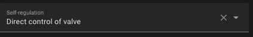
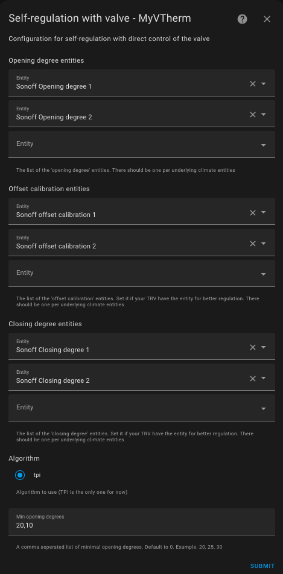

# Self-regulation

- [Self-regulation](#self-regulation)
      - [Self-regulation in Expert Mode](#self-regulation-in-expert-mode)
      - [Summary of the Self-regulation Algorithm](#summary-of-the-self-regulation-algorithm)

You have the option to activate the self-regulation feature only for _VTherms_ of type `over_climate`.

There are generally two cases:
1. If your underlying device is a _TRV_ and the valve is directly controllable in Home Assistant (e.g., Sonoff TRVZB), this function will allow _VTherm_ to directly manipulate the valve opening to regulate the temperature. The opening is then calculated by a _TPI_-type algorithm (see [here](algorithms.md)).
2. Otherwise, Versatile Thermostat will adjust the temperature setpoint given to the underlying climate to ensure the room temperature actually reaches the setpoint.

## Configuration

### Self-regulation by direct valve control

This type of self-regulation, named `Direct Valve Control`, requires:
1. An entity of type `climate` that is included in the _VTherm_'s underlying devices.
2. An entity of type `number` to control the valve opening rate of the _TRV_.
3. An optional entity of type `number` for calibrating the internal temperature of the underlying device.
4. An optional entity of type `number` to control the valve closure.

When the chosen self-regulation is `Direct Valve Control` on an _VTherm_ `over_climate`, a new configuration page named `Valve Regulation Configuration` appears:



This allows you to configure the valve control entities:



You need to provide:
1. As many valve opening control entities as there are underlying devices, and in the same order. These parameters are mandatory.
2. As many temperature calibration entities as there are underlying devices, and in the same order. These parameters are optional; they must either all be provided or none.
3. As many valve closure control entities as there are underlying devices, and in the same order. These parameters are optional; they must either all be provided or none.
4. A list of minimum opening values ​​for the valve when it needs to be opened. This field is a list of integers. If the valve needs to be opened, it will be opened at a minimum of this opening value. This allows enough water to pass through when it needs to be opened.

The opening rate calculation algorithm is based on the _TPI_ algorithm described [here](algorithms.md). This is the same algorithm used for _VTherms_ `over_switch` and `over_valve`.

If a valve closure rate entity is configured, it will be set to 100 minus the opening rate to force the valve into a particular state.

### Other self-regulation

In the second case, Versatile Thermostat calculates an offset based on the following information:
1. The current difference between the actual temperature and the setpoint temperature, called the gross error.
2. The accumulation of past errors.
3. The difference between the outdoor temperature and the setpoint.

These three pieces of information are combined to calculate the offset, which will be added to the current setpoint and sent to the underlying climate.

Self-regulation is configured with:
1. A regulation degree:
   1. Light - for small self-regulation needs. In this mode, the maximum offset will be 1.5°C.
   2. Medium - for medium self-regulation needs. A maximum offset of 2°C is possible in this mode.
   3. Strong - for high self-regulation needs. The maximum offset is 3°C in this mode, and the self-regulation will react strongly to temperature changes.
2. A self-regulation threshold: the value below which no new regulation will be applied. For example, if at time t the offset is 2°C, and at the next calculation, the offset is 2.4°C, the regulation will not be applied. It will only be applied when the difference between the two offsets is at least equal to this threshold.
3. Minimum period between two self-regulations: this number, expressed in minutes, indicates the duration between two regulation changes.

These three parameters allow you to adjust the regulation and avoid applying too many regulation changes. Some devices, like TRVs or boilers, don't like frequent setpoint changes.

>  _*Setup advice*_
> 1. Do not start self-regulation immediately. Observe how your equipment's natural regulation works. If you notice that the setpoint is not reached or takes too long to reach, start the regulation.
> 2. Start with light self-regulation and keep both parameters at their default values. Wait a few days and check if the situation improves.
> 3. If it's not enough, switch to medium self-regulation and wait for stabilization.
> 4. If it's still not enough, switch to strong self-regulation.
> 5. If it's still not correct, you will need to switch to expert mode to finely adjust the regulation parameters.

Self-regulation forces the equipment to push further by regularly adjusting its setpoint. This can increase both its consumption and wear.

#### Self-regulation in Expert Mode

In **Expert** mode, you can finely adjust the self-regulation parameters to meet your goals and optimize performance. The algorithm calculates the gap between the setpoint and the actual room temperature. This gap is called the error.

The adjustable parameters are as follows:
1. `kp`: the factor applied to the gross error,
2. `ki`: the factor applied to the accumulated errors,
3. `k_ext`: the factor applied to the difference between the indoor temperature and the outdoor temperature,
4. `offset_max`: the maximum correction (offset) that the regulation can apply,
5. `stabilization_threshold`: a stabilization threshold, which when reached by the error resets the accumulated errors to 0,
6. `accumulated_error_threshold`: the maximum for error accumulation.

For tuning, the following observations should be considered:
1. `kp * error` will give the offset related to the gross error. This offset is directly proportional to the error and will be 0 when the target is reached.
2. The accumulation of the error helps correct the stabilization curve even if there is still an error. The error accumulates and the offset increases progressively, which should stabilize the temperature around the target. To have a noticeable effect, this parameter should not be too small. A medium value is 30.
3. `ki * accumulated_error_threshold` will give the maximum offset related to the accumulated error.
4. `k_ext` allows immediate (without waiting for accumulated errors) correction when the outdoor temperature is much different from the target temperature. If the stabilization occurs too high when the temperature differences are large, this parameter might be too high. It should be adjustable to zero to allow the first two offsets to do the work.

The pre-programmed values are as follows:

**Slow regulation**:

    kp: 0.2  # 20% of the current internal regulation offset are caused by the current difference of target temperature and room temperature
    ki: 0.8 / 288.0  # 80% of the current internal regulation offset are caused by the average offset of the past 24 hours
    k_ext: 1.0 / 25.0  # this will add 1°C to the offset when it's 25°C colder outdoor than indoor
    offset_max: 2.0  # limit to a final offset of -2°C to +2°C
    stabilization_threshold: 0.0  # this needs to be disabled as otherwise the long term accumulated error will always be reset when the temp briefly crosses from/to below/above the target
    accumulated_error_threshold: 2.0 * 288  # this allows up to 2°C long term offset in both directions

**Light regulation**:

    kp: 0.2
    ki: 0.05
    k_ext: 0.05
    offset_max: 1.5
    stabilization_threshold: 0.1
    accumulated_error_threshold: 10

**Medium regulation**:

    kp: 0.3
    ki: 0.05
    k_ext: 0.1
    offset_max: 2
    stabilization_threshold: 0.1
    accumulated_error_threshold: 20

**Strong regulation**:

    """Strong parameters for regulation
    A set of parameters which doesn't take into account the external temp
    and concentrate on internal temp error + accumulated error.
    This should work for cold external conditions which otherwise generate
    high external_offset"""

    kp: 0.4
    ki: 0.08
    k_ext: 0.0
    offset_max: 5
    stabilization_threshold: 0.1
    accumulated_error_threshold: 50

To use Expert mode, you must declare the values you wish to use for each of these parameters in your `configuration.yaml` as follows. Example for 'Extreme regulation':

```yaml
versatile_thermostat:
    auto_regulation_expert:
        kp: 0.6
        ki: 0.1
        k_ext: 0.0
        offset_max: 10
        stabilization_threshold: 0.1
        accumulated_error_threshold: 80
```
and of course, configure the auto-regulation mode of the VTherm to Expert mode. All _VTherms_ in **Expert** mode will use the same parameters, it is not possible to have different expert settings.

To apply the changes, you must either **restart Home Assistant completely** or just the Versatile Thermostat integration (Developer Tools / YAML / Reload Configuration / Versatile Thermostat).

>  _*Notes*_
>
> 1. In expert mode, it is rarely necessary to use the option [Compensate the internal temperature of the underlying](over-climate.md#compensate-the-internal-temperature-of-the-underlying). This could result in very high setpoints.

## Summary of the Auto-Regulation Algorithm

A summary of the auto-regulation algorithm is described [here](algorithms.md#the-auto-regulation-algorithm-without-valve-control)