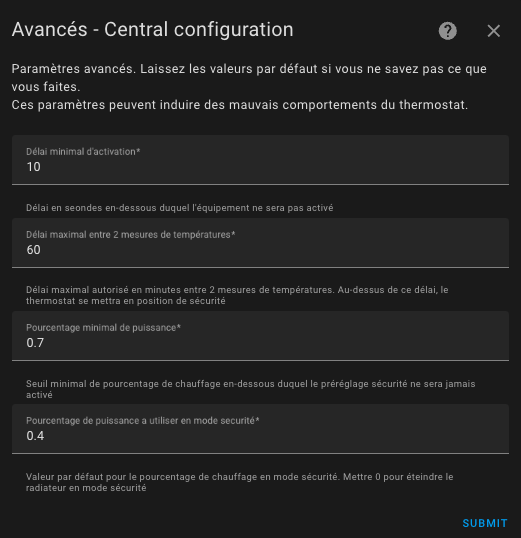

# Tuning Examples

- [Tuning Examples](#tuning-examples)
  - [Electric Heating](#electric-heating)
  - [Central Heating (gas or oil heating)](#central-heating-gas-or-oil-heating)
  - [Battery-Powered Temperature Sensor](#battery-powered-temperature-sensor)
  - [Reactive Temperature Sensor (plugged in)](#reactive-temperature-sensor-plugged-in)
  - [My Presets](#my-presets)

## Electric Heating
- Cycle: between 5 and 10 minutes,
- minimal_activation_delay_sec: 30 seconds

## Central Heating (gas or oil heating)
- Cycle: between 30 and 60 minutes,
- minimal_activation_delay_sec: 300 seconds (due to response time)

## Battery-Powered Temperature Sensor
These sensors are often sluggish and do not always send temperature readings when the temperature is stable. Therefore, the settings should be loose to avoid false positives.

- security_delay_min: 60 minutes (because these sensors are sluggish)
- security_min_on_percent: 0.7 (70% - the system goes into security mode if the heater was on more than 70% of the time)
- security_default_on_percent: 0.4 (40% - in security mode, we maintain 40% heating time to avoid getting too cold)

These settings should be understood as follows:

> If the thermometer stops sending temperature readings for 1 hour and the heating percentage (``on_percent``) was greater than 70%, then the heating percentage will be reduced to 40%.

Feel free to adjust these settings to your specific case!

The important thing is not to take too much risk with these parameters: assume you are absent for a long period, and the batteries of your thermometer are running low, your heater will run 40% of the time during the whole failure period.

Versatile Thermostat allows you to be notified when such an event occurs. Set up the appropriate alerts as soon as you start using this thermostat. See (#notifications).

## Reactive Temperature Sensor (plugged in)
A powered thermometer is supposed to be very regular in sending temperature readings. If it doesn't send anything for 15 minutes, it most likely has an issue, and we can react faster without the risk of a false positive.

- security_delay_min: 15 minutes
- security_min_on_percent: 0.5 (50% - the system goes into ``security`` preset if the heater was on more than 50% of the time)
- security_default_on_percent: 0.25 (25% - in ``security`` preset, we keep 25% heating time)

## My Presets
This is just an example of how I use the preset. You can adapt it to your configuration, but it may be useful to understand its functionality.

``Frost Protection``: 10°C
``Eco``: 17°C
``Comfort``: 19°C
``Boost``: 20°C

When presence is disabled:
``Frost Protection``: 10°C
``Eco``: 16.5°C
``Comfort``: 17°C
``Boost``: 17.5°C

The motion detector in my office is configured to use ``Boost`` when motion is detected and ``Eco`` otherwise.

The security mode is configured as follows:

