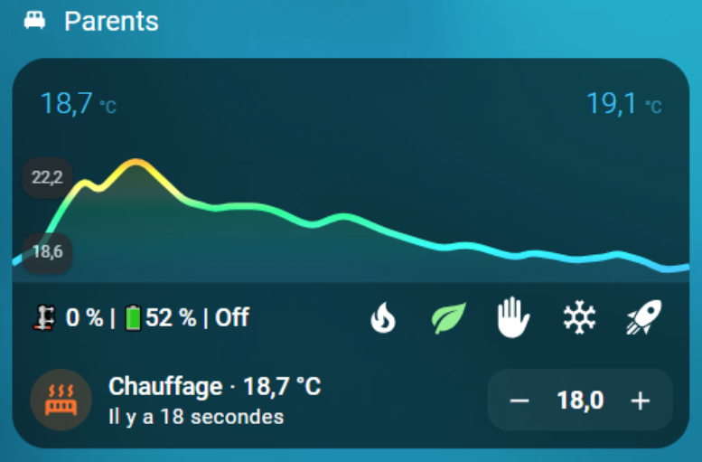

# Quelques compléments indispensables

- [Quelques compléments indispensables](#quelques-compléments-indispensables)
  - [Versatile Thermostat UI Card](#versatile-thermostat-ui-card)
  - [Composant Scheduler !](#composant-scheduler-)
  - [Courbes de régulattion avec Plotly](#courbes-de-régulattion-avec-plotly)
  - [Les notification avec l'AappDaemon NOTIFIER](#les-notification-avec-laappdaemon-notifier)
  - [Une très belle carte (merci @Jeffodilo)](#une-très-belle-carte-merci-jeffodilo)


## Versatile Thermostat UI Card
Une carte spéciale pour le Versatile Thermostat a été développée (sur la base du Better Thermostat). Elle est dispo ici [Versatile Thermostat UI Card](https://github.com/jmcollin78/versatile-thermostat-ui-card) et propose une vision moderne de tous les status du VTherm :


## Composant Scheduler !

Afin de profiter de toute la puissance du Versatile Thermostat, je vous invite à l'utiliser avec https://github.com/nielsfaber/scheduler-component
En effet, le composant Scheduler propose une gestion de la base climatique sur les modes prédéfinis. Cette fonctionnalité a un intérêt limité avec le thermostat générique mais elle devient très puissante avec le Versatile Thermostat :

À partir d'ici, je suppose que vous avez installé Versatile Thermostat et Scheduler Component.

Dans Scheduler, ajoutez un planning :


Choisissez le groupe "climat", choisissez une (ou plusieurs) entité(s), sélectionnez "MAKE SCHEME" et cliquez sur suivant :
(il est possible de choisir "SET PRESET", mais je préfère utiliser "MAKE SCHEME")


Définissez votre schéma de mode et enregistrez :


Dans cet exemple, j'ai réglé le mode ECO pendant la nuit et le jour lorsqu'il n'y a personne à la maison, BOOST le matin et CONFORT le soir.


J'espère que cet exemple vous aidera, n'hésitez pas à me faire part de vos retours !

## Courbes de régulattion avec Plotly
Vous pouvez obtenir une courbe comme celle présentée dans [some results](../../README-fr.md#quelques-résultats) avec une sorte de configuration de graphique Plotly uniquement en utilisant les attributs personnalisés du thermostat décrits [ici](reference.md#attributs-personnalisés) :

Remplacez les valeurs entre [[ ]] par les votres.
<details>

```yaml
- type: custom:plotly-graph
  entities:
    - entity: '[[climate]]'
      attribute: temperature
      yaxis: y1
      name: Consigne
    - entity: '[[climate]]'
      attribute: current_temperature
      yaxis: y1
      name: T°
    - entity: '[[ema_temperature]]'
      yaxis: y1
      name: Ema
    - entity: '[[power_percent]]'
      yaxis: y2
      name: Power percent
      fill: tozeroy
      fillcolor: rgba(200, 10, 10, 0.3)
      line:
        color: rgba(200, 10, 10, 0.9)
    - entity: '[[slope]]'
      name: Slope
      fill: tozeroy
      yaxis: y9
      fillcolor: rgba(100, 100, 100, 0.3)
      line:
        color: rgba(100, 100, 100, 0.9)
  hours_to_show: 4
  refresh_interval: 10
  height: 800
  config:
    scrollZoom: true
  layout:
    margin:
      r: 50
    legend:
      x: 0
      'y': 1.2
      groupclick: togglegroup
      title:
        side: top right
    yaxis:
      visible: true
      position: 0
    yaxis2:
      visible: true
      position: 0
      fixedrange: true
      range:
        - 0
        - 1
    yaxis9:
      visible: true
      fixedrange: false
      range:
        - -2
        - 2
      position: 1
    xaxis:
      rangeselector:
        'y': 1.1
        x: 0.7
        buttons:
          - count: 1
            step: hour
          - count: 12
            step: hour
          - count: 1
            step: day
          - count: 7
            step: day
```
</details>

Exemple de courbes obtenues avec Plotly :


## Les notification avec l'AappDaemon NOTIFIER
Cette automatisation utilise l'excellente App Daemon nommée NOTIFIER développée par Horizon Domotique que vous trouverez en démonstration [ici](https://www.youtube.com/watch?v=chJylIK0ASo&ab_channel=HorizonDomotique) et le code est [ici](https://github.com/jlpouffier/home-assistant-config/blob/master/appdaemon/apps/notifier.py). Elle permet de notifier les utilisateurs du logement lorsqu'un des évènements touchant à la sécurité survient sur un des Versatile Thermostats.

C'est un excellent exemple de l'utilisation des notifications décrites ici [Evènement](reference.md#evènements).

<details>

```yaml
alias: Surveillance Mode Sécurité chauffage
description: Envoi une notification si un thermostat passe en mode sécurité ou power
trigger:
  - platform: event
    event_type: versatile_thermostat_safety_event
    id: versatile_thermostat_safety_event
  - platform: event
    event_type: versatile_thermostat_power_event
    id: versatile_thermostat_power_event
  - platform: event
    event_type: versatile_thermostat_temperature_event
    id: versatile_thermostat_temperature_event
condition: []
action:
  - choose:
      - conditions:
          - condition: trigger
            id: versatile_thermostat_safety_event
        sequence:
          - event: NOTIFIER
            event_data:
              action: send_to_jmc
              title: >-
                Radiateur {{ trigger.event.data.name }} - {{
                trigger.event.data.type }} Sécurité
              message: >-
                Le radiateur {{ trigger.event.data.name }} est passé en {{
                trigger.event.data.type }} sécurité car le thermomètre ne répond
                plus.\n{{ trigger.event.data }}
              callback:
                - title: Stopper chauffage
                  event: stopper_chauffage
              image_url: /media/local/alerte-securite.jpg
              click_url: /lovelace-chauffage/4
              icon: mdi:radiator-off
              tag: radiateur_security_alerte
              persistent: true
      - conditions:
          - condition: trigger
            id: versatile_thermostat_power_event
        sequence:
          - event: NOTIFIER
            event_data:
              action: send_to_jmc
              title: >-
                Radiateur {{ trigger.event.data.name }} - {{
                trigger.event.data.type }} Délestage
              message: >-
                Le radiateur {{ trigger.event.data.name }} est passé en {{
                trigger.event.data.type }} délestage car la puissance max est
                dépassée.\n{{ trigger.event.data }}
              callback:
                - title: Stopper chauffage
                  event: stopper_chauffage
              image_url: /media/local/alerte-delestage.jpg
              click_url: /lovelace-chauffage/4
              icon: mdi:radiator-off
              tag: radiateur_power_alerte
              persistent: true
      - conditions:
          - condition: trigger
            id: versatile_thermostat_temperature_event
        sequence:
          - event: NOTIFIER
            event_data:
              action: send_to_jmc
              title: >-
                Le thermomètre du radiateur {{ trigger.event.data.name }} ne
                répond plus
              message: >-
                Le thermomètre du radiateur {{ trigger.event.data.name }} ne
                répond plus depuis longtemps.\n{{ trigger.event.data }}
              image_url: /media/local/thermometre-alerte.jpg
              click_url: /lovelace-chauffage/4
              icon: mdi:radiator-disabled
              tag: radiateur_thermometre_alerte
              persistent: true
mode: queued
max: 30
```
</details>

## Une très belle carte (merci @Jeffodilo)

@Jeffodilo a réalisé et partagé le code d'une très belle carte adaptée au TRV :



Cette carte n’utilise pas card_mod, elle utilise les cartes custom assez courante suivantes
On garde une partie de l’interface UI, sauf pour l’horizontale de la 2ème ligne
- custom:vertical-stack-in-card
- custom:stack-in-card
- custom:mini-graph-card
- custom:mushroom-template-card
- custom:button-card

L'original est ici (En Français): [forum HACF](https://forum.hacf.fr/t/carte-mise-en-forme-vanne-avec-thermostant-versatile/56132)

Evidemment, vous devez l'adapter à votre code.

Le code:

<details>

```yaml
type: vertical-stack
cards:
  - type: heading
    icon: mdi:bed-double
    heading: Parents
    heading_style: title
  - type: custom:vertical-stack-in-card
    cards:
      - type: custom:mini-graph-card
        entities:
          - entity: sensor.sonde_parents_temperature
            name: Température
            state_adaptive_color: true
          - entity: climate.valve_parents
            name: Temp
            attribute: current_temperature
            unit: °C
            state_adaptive_color: true
            show_graph: false
            show_state: true
        hour24: true
        hours_to_show: 24
        points_per_hour: 2
        font_size: 50
        show:
          name: false
          icon: false
          legend: false
          labels: true
          extrema: false
        color_thresholds:
          - color: "#33ccff"
            value: 19
          - color: "#00ffff"
            value: 19.5
          - color: "#33ffcc"
            value: 20
          - color: "#00ff99"
            value: 20.5
          - color: "#ffff99"
            value: 21
          - color: "#ffff33"
            value: 21.5
          - color: "#ff9933"
            value: 22
          - color: "#cc6633"
            value: 24
          - color: "#ff6000"
            value: 26
      - type: custom:stack-in-card
        mode: horizontal
        cards:
          - type: custom:mushroom-template-card
            secondary: ""
            layout: horizontal
            tap_action:
              action: more-info
            entity: sensor.sonde_parents_temperature
            fill_container: false
            multiline_secondary: false
            primary: >-
              
               🗜️ {{ states('number.valve_parents_valve_opening_degree', with_unit=True,)}} |🔋{{ states('sensor.valve_parents_battery') }} % | Inactif
              
               🗜️ {{ states('number.valve_parents_valve_opening_degree', with_unit=True,)}} |🔋{{ states('sensor.valve_parents_battery') }} % | Chauffe
               🗜️ {{
              states('number.valve_parents_valve_opening_degree',
              with_unit=True,)}} | 🔋{{ states('sensor.valve_parents_battery')
              }} % | Off 
            icon: ""
          - type: horizontal-stack
            cards:
              - type: custom:button-card
                name: Conf.
                entity: climate.versatile_parents
                show_state: false
                show_icon: true
                show_name: false
                icon: mdi:fire
                size: 80%
                styles:
                  icon:
                    - color: |
                        [[[
                          if (states['climate.versatile_parents']) {
                          if (states['climate.versatile_parents'].attributes.preset_mode == 'comfort')
                            return 'darkorange';
                          else
                            return 'white'; }
                        ]]]
                  name:
                    - color: white
                    - font-size: 60%
                  card:
                    - height: 40px
                    - width: 30px
                tap_action:
                  action: perform-action
                  perform_action: climate.set_preset_mode
                  target:
                    entity_id:
                      - climate.versatile_parents
                  data:
                    preset_mode: comfort
              - type: custom:button-card
                name: Eco
                entity: climate.versatile_parents
                show_state: false
                show_icon: true
                show_name: false
                icon: mdi:leaf
                size: 80%
                styles:
                  icon:
                    - color: |
                        [[[
                          if (states['climate.versatile_parents']) {
                          if (states['climate.versatile_parents'].attributes.preset_mode == 'eco')
                            return 'lightgreen';
                          else
                            return 'white'; }
                        ]]]
                  name:
                    - color: white
                    - font-size: 60%
                  card:
                    - height: 40px
                    - width: 30px
                tap_action:
                  action: perform-action
                  perform_action: climate.set_preset_mode
                  target:
                    entity_id:
                      - climate.versatile_parents
                  data:
                    preset_mode: eco
              - type: custom:button-card
                name: Manu
                entity: climate.versatile_parents
                show_state: false
                show_icon: true
                show_name: false
                icon: mdi:hand-back-left
                size: 80%
                styles:
                  icon:
                    - color: |
                        [[[
                          if (states['climate.versatile_parents']) {
                          if (states['climate.versatile_parents'].attributes.preset_mode == 'none')
                            return 'indianred';
                          else
                            return 'white'; }
                        ]]]
                  name:
                    - color: white
                    - font-size: 60%
                  card:
                    - height: 40px
                    - width: 30px
                tap_action:
                  action: perform-action
                  perform_action: climate.set_preset_mode
                  target:
                    entity_id:
                      - climate.versatile_parents
                  data:
                    preset_mode: none
              - type: custom:button-card
                name: Abs.
                entity: climate.versatile_parents
                show_state: false
                show_icon: true
                show_name: false
                icon: mdi:snowflake
                size: 80%
                styles:
                  icon:
                    - color: |
                        [[[
                          if (states['climate.versatile_parents']) {
                          if (states['climate.versatile_parents'].attributes.preset_mode == 'frost')
                            return 'skyblue';
                          else
                            return 'white'; }
                        ]]]
                  name:
                    - color: white
                    - font-size: 60%
                  card:
                    - height: 40px
                    - width: 30px
                tap_action:
                  action: perform-action
                  perform_action: climate.set_preset_mode
                  target:
                    entity_id:
                      - climate.versatile_parents
                  data:
                    preset_mode: frost
              - type: custom:button-card
                name: Boost
                entity: climate.versatile_parents
                show_state: false
                show_icon: true
                show_name: false
                icon: mdi:rocket-launch
                size: 80%
                styles:
                  icon:
                    - color: |
                        [[[
                          if (states['climate.versatile_parents']) {
                          if (states['climate.versatile_parents'].attributes.preset_mode == 'boost')
                            return 'red';
                          else
                            return 'white'; }
                        ]]]
                  name:
                    - color: white
                    - font-size: 60%
                  card:
                    - height: 40px
                    - width: 30px
                tap_action:
                  action: perform-action
                  perform_action: climate.set_preset_mode
                  target:
                    entity_id:
                      - climate.versatile_parents
                  data:
                    preset_mode: boost
      - type: custom:mushroom-climate-card
        entity: climate.versatile_parents
        show_temperature_control: true
        hvac_modes: []
        tap_action:
          action: more-info
        primary_info: state
        icon: mdi:radiator
        secondary_info: last-updated
        fill_container: false
        layout: horizontal
```
</details>