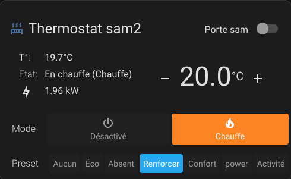
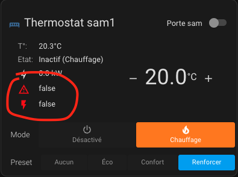
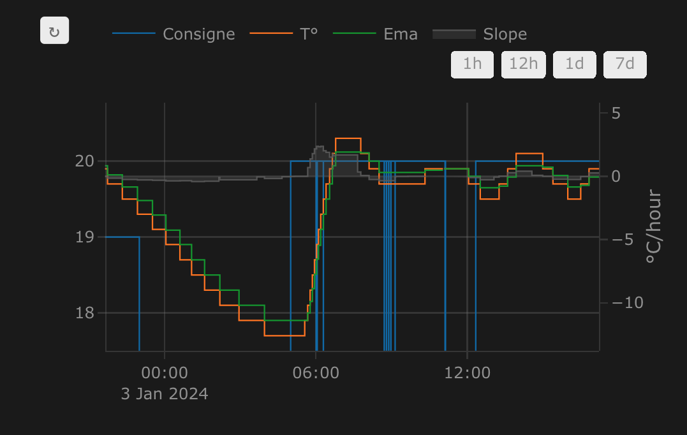

# Quelques compléments indispensables

## Bien mieux avec le Versatile Thermostat UI Card
Une carte spéciale pour le Versatile Thermostat a été développée (sur la base du Better Thermostat). Elle est dispo ici [Versatile Thermostat UI Card](https://github.com/jmcollin78/versatile-thermostat-ui-card) et propose une vision moderne de tous les status du VTherm :


## Encore mieux avec le composant Scheduler !

Afin de profiter de toute la puissance du Versatile Thermostat, je vous invite à l'utiliser avec https://github.com/nielsfaber/scheduler-component
En effet, le composant scheduler propose une gestion de la base climatique sur les modes prédéfinis. Cette fonctionnalité a un intérêt limité avec le thermostat générique mais elle devient très puissante avec le Versatile Thermostat :

À partir d'ici, je suppose que vous avez installé Versatile Thermostat et Scheduler Component.

Dans Scheduler, ajoutez un planning :


Choisissez le groupe "climat", choisissez une (ou plusieurs) entité(s), sélectionnez "MAKE SCHEME" et cliquez sur suivant :
(il est possible de choisir "SET PRESET", mais je préfère utiliser "MAKE SCHEME")


Définissez votre schéma de mode et enregistrez :


Dans cet exemple, j'ai réglé le mode ECO pendant la nuit et le jour lorsqu'il n'y a personne à la maison BOOST le matin et CONFORT le soir.


J'espère que cet exemple vous aidera, n'hésitez pas à me faire part de vos retours !

## Encore bien mieux avec la custom:simple-thermostat front integration
Le ``custom:simple-thermostat`` [ici](https://github.com/nervetattoo/simple-thermostat) est une excellente intégration qui permet une certaine personnalisation qui s'adapte bien à ce thermostat.
Vous pouvez avoir quelque chose comme ça très facilement 
Exemple de configuration :

```
      type: custom:simple-thermostat
      entity: climate.thermostat_sam2
      layout:
        step: row
      label:
        temperature: T°
        state: Etat
      hide:
        state: false
      control:
        hvac:
          _name: Mode
        preset:
          _name: Preset
      sensors:
        - entity: sensor.total_puissance_radiateur_sam2
          icon: mdi:lightning-bolt-outline
      header:
        toggle:
          entity: input_boolean.etat_ouverture_porte_sam
          name: Porte sam
```

Vous pouvez personnaliser ce composant à l'aide du composant HACS card-mod pour ajuster les couleurs des alertes. Exemple pour afficher en rouge les alertes sécurité et délestage :

```
          card_mod:
            style: |
              
              ha-card .body .sensor-heading ha-icon[icon="mdi:alert-outline"] {
                color: red;
              }
              
              
              ha-card .body .sensor-heading ha-icon[icon="mdi:flash"] {
                color: red;
              }
              
```


## Toujours mieux avec Plotly pour régler votre thermostat
Vous pouvez obtenir une courbe comme celle présentée dans [some results](#some-results) avec une sorte de configuration de graphique Plotly uniquement en utilisant les attributs personnalisés du thermostat décrits [ici](#custom-attributes) :

Remplacez les valeurs entre [[ ]] par les votres.
```
- type: custom:plotly-graph
  entities:
    - entity: '[[climate]]'
      attribute: temperature
      yaxis: y1
      name: Consigne
    - entity: '[[climate]]'
      attribute: current_temperature
      yaxis: y1
      name: T°
    - entity: '[[climate]]'
      attribute: ema_temp
      yaxis: y1
      name: Ema
    - entity: '[[climate]]'
      attribute: regulated_target_temperature
      yaxis: y1
      name: Regulated T°
    - entity: '[[slope]]'
      name: Slope
      fill: tozeroy
      yaxis: y9
      fillcolor: rgba(100, 100, 100, 0.3)
      line:
        color: rgba(100, 100, 100, 0.9)
  hours_to_show: 4
  refresh_interval: 10
  height: 800
  config:
    scrollZoom: true
  layout:
    margin:
      r: 50
    legend:
      x: 0
      'y': 1.2
      groupclick: togglegroup
      title:
        side: top right
    yaxis:
      visible: true
      position: 0
    yaxis9:
      visible: true
      fixedrange: false
      range:
        - -0.5
        - 0.5
      position: 1
    xaxis:
      rangeselector:
        'y': 1.1
        x: 0.7
        buttons:
          - count: 1
            step: hour
          - count: 12
            step: hour
          - count: 1
            step: day
          - count: 7
            step: day
```

Exemple de courbes obtenues avec Plotly :



## Et toujours de mieux en mieux avec l'AappDaemon NOTIFIER pour notifier les évènements
Cette automatisation utilise l'excellente App Daemon nommée NOTIFIER développée par Horizon Domotique que vous trouverez en démonstration [ici](https://www.youtube.com/watch?v=chJylIK0ASo&ab_channel=HorizonDomotique) et le code est [ici](https://github.com/jlpouffier/home-assistant-config/blob/master/appdaemon/apps/notifier.py). Elle permet de notifier les utilisateurs du logement lorsqu'un des évènements touchant à la sécurité survient sur un des Versatile Thermostats.

C'est un excellent exemple de l'utilisation des notifications décrites ici [notification](#notifications).

```
alias: Surveillance Mode Sécurité chauffage
description: Envoi une notification si un thermostat passe en mode sécurité ou power
trigger:
  - platform: event
    event_type: versatile_thermostat_security_event
    id: versatile_thermostat_security_event
  - platform: event
    event_type: versatile_thermostat_power_event
    id: versatile_thermostat_power_event
  - platform: event
    event_type: versatile_thermostat_temperature_event
    id: versatile_thermostat_temperature_event
condition: []
action:
  - choose:
      - conditions:
          - condition: trigger
            id: versatile_thermostat_security_event
        sequence:
          - event: NOTIFIER
            event_data:
              action: send_to_jmc
              title: >-
                Radiateur {{ trigger.event.data.name }} - {{
                trigger.event.data.type }} Sécurité
              message: >-
                Le radiateur {{ trigger.event.data.name }} est passé en {{
                trigger.event.data.type }} sécurité car le thermomètre ne répond
                plus.\n{{ trigger.event.data }}
              callback:
                - title: Stopper chauffage
                  event: stopper_chauffage
              image_url: /media/local/alerte-securite.jpg
              click_url: /lovelace-chauffage/4
              icon: mdi:radiator-off
              tag: radiateur_security_alerte
              persistent: true
      - conditions:
          - condition: trigger
            id: versatile_thermostat_power_event
        sequence:
          - event: NOTIFIER
            event_data:
              action: send_to_jmc
              title: >-
                Radiateur {{ trigger.event.data.name }} - {{
                trigger.event.data.type }} Délestage
              message: >-
                Le radiateur {{ trigger.event.data.name }} est passé en {{
                trigger.event.data.type }} délestage car la puissance max est
                dépassée.\n{{ trigger.event.data }}
              callback:
                - title: Stopper chauffage
                  event: stopper_chauffage
              image_url: /media/local/alerte-delestage.jpg
              click_url: /lovelace-chauffage/4
              icon: mdi:radiator-off
              tag: radiateur_power_alerte
              persistent: true
      - conditions:
          - condition: trigger
            id: versatile_thermostat_temperature_event
        sequence:
          - event: NOTIFIER
            event_data:
              action: send_to_jmc
              title: >-
                Le thermomètre du radiateur {{ trigger.event.data.name }} ne
                répond plus
              message: >-
                Le thermomètre du radiateur {{ trigger.event.data.name }} ne
                répond plus depuis longtemps.\n{{ trigger.event.data }}
              image_url: /media/local/thermometre-alerte.jpg
              click_url: /lovelace-chauffage/4
              icon: mdi:radiator-disabled
              tag: radiateur_thermometre_alerte
              persistent: true
mode: queued
max: 30
```
