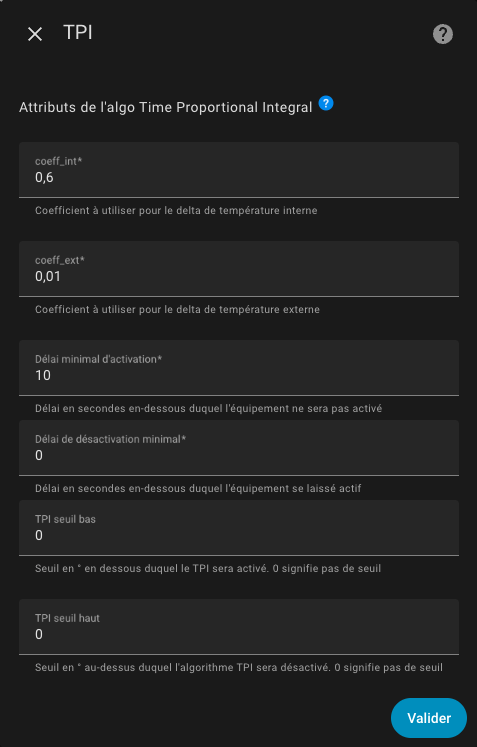

# Les différents algorithmes utilisés

- [Les différents algorithmes utilisés](#les-différents-algorithmes-utilisés)
  - [L'algorithme TPI](#lalgorithme-tpi)
    - [Configurez les coefficients de l'algorithme TPI](#configurez-les-coefficients-de-lalgorithme-tpi)
    - [Principe](#principe)
    - [Délai minimal d'activation ou de désactivation](#délai-minimal-dactivation-ou-de-désactivation)
    - [Seuils haut et bas d'activation de l'algorithme](#seuils-haut-et-bas-dactivation-de-lalgorithme)
  - [L'algorithme d'auto-régulation (sans contrôle de la vanne)](#lalgorithme-dauto-régulation-sans-contrôle-de-la-vanne)
  - [L'algorithme de la fonction d'auto-start/stop](#lalgorithme-de-la-fonction-dauto-startstop)

## L'algorithme TPI

### Configurez les coefficients de l'algorithme TPI

Si vous avez choisi un thermostat de type ```over_switch``` ou  ```over_valve``` ou `over_climate` avec l'auto-régulation `Controle direct de la vanne` et que vous sélectionnez l'option "TPI" vous menu, vous arriverez sur cette page :



Vous devez donner :
1. le coefficient coef_int de l'algorithme TPI,
2. le coefficient coef_ext de l'algorithme TPI,
3. une durée minimale d'activation en secondes,
4. une durée minimale d'extinction en secondes,
5. un seuil haut en °C (ou °K) d'écart de température en dessus duquel l'algorithme sera éteint,
6. un seuil bas en °C (ou °K) d'écart de température en dessous duquel l'algorithme sera activé


### Principe

L'algorithme TPI consiste à calculer à chaque cycle un pourcentage d'état On vs Off pour le radiateur en utilisant la température cible, la température actuelle dans la pièce et la température extérieure actuelle. Cet algorithme n'est donc valable que pour les Versatile Thermostat qui régulent : `over_switch` et `over_valve`.

Le pourcentage est calculé avec cette formule :

    on_percent = coef_int * (température cible - température actuelle) + coef_ext * (température cible - température extérieure)
    Ensuite, l'algo fait en sorte que 0 <= on_percent <= 1

Les valeurs par défaut pour coef_int et coef_ext sont respectivement : ``0.6`` et ``0.01``. Ces valeurs par défaut conviennent à une pièce standard bien isolée.

Pour régler ces coefficients, gardez à l'esprit que :
1. **si la température cible n'est pas atteinte** après une situation stable, vous devez augmenter le ``coef_ext`` (le ``on_percent`` est trop bas),
2. **si la température cible est dépassée** après une situation stable, vous devez diminuer le ``coef_ext`` (le ``on_percent`` est trop haut),
3. **si l'atteinte de la température cible est trop lente**, vous pouvez augmenter le ``coef_int`` pour donner plus de puissance au réchauffeur,
4. **si l'atteinte de la température cible est trop rapide et que des oscillations apparaissent** autour de la cible, vous pouvez diminuer le ``coef_int`` pour donner moins de puissance au radiateur.

En type `over_valve` le `on_percent` est ramené à une valeur entre 0 et 100% et sert directement à commander l'ouverture de la vanne.

### Délai minimal d'activation ou de désactivation

Le premier délai (`minimal_activation_delay_sec`) en secondes est le délai minimum acceptable pour allumer le radiateur. Lorsque le calcul donne un délai de mise sous tension inférieur à cette valeur, le chauffage reste éteint. Si le temps d'allumage est trop court, la, commutation rapide ne permettra pas à l'équipement de monter en température.

Idem avec le deuxième délai (`minimal_deactivation_delay_sec`) en secondes lui aussi mais pour la durée d'extinction. Si la durée d'extinction est inférieure à cette durée, le radiateur ne sera pas éteint. Ca évite les clignotements rapides qui servent très peu à la régulation de température.

### Seuils haut et bas d'activation de l'algorithme

Depuis la version 7.4, deux seuils supplémentaires sont disponibles. Ils permettent de couper (resp. mettre en marche) l'algorithme TPI lui même en fonction de l'écart entre la consigne et la température courante.

Si la température monte et que l'écart est supérieur au seuil haut alors le radiateur est coupé (ie. le on_percent est forcé à 0).
Si la température descend et que l'écart est inférieur au seuil bas alors le radiateur est relancé (ie le on_percent est calculé avec l'algo tel que présenté ci-dessus).

Ces deux seuils permettent de couper le cycle d'extinction / allumage lorsque la température dépasse la consigne. Un hystéresis permet d'éviter un bagottement rapide.

Exemples:
1. supposons que la consigne soit réglée sur 20°, le seuil haut sur 2° et le seuil bas sur 1°,
2. lorsque la température monte et dépasse les 22° (consigne + seuil haut), le on_percent est forcé à 0,
3. lorsque la température redescend et passe en dessous des 21° (consigne + seuil bas), le on_percent est de nouveau calculé

>  _*Notes*_
> 1. laissez les 2 valeurs à 0, si vous ne voulez pas utiliser les seuils. Cela permet d'avoir le comportement d'avant la version 7.4,
> 2. les 2 valeurs sont nécessaires. Si vous laissez une à 0, aucun seuils ne sera appliqué. En effet, les 2 sont nécessaires pour avoir un fonctionnement correct.
> 3. en cas de pilotage (mode Refroidissement), les tests sont inversés mais le principe reste le même.
> 4. le seuil haut devrait toujours est supérieur au seuil bas. Même en cas de refroidissement

## L'algorithme d'auto-régulation (sans contrôle de la vanne)

L'algorithme d'auto-régulation peut être synthétisé comme suit:

1. initialiser la température cible comme la consigne du VTherm,
1. Si l'auto-régulation est activée,
   1. calcule de la température régulée (valable pour un VTherm),
   2. prendre cette température comme cible,
2. Pour chaque sous-jacent du VTherm,
     1. Si "utiliser la température interne" est cochée,
          1. calcule de la compensation (trv internal temp - room temp),
     2. ajout de l'écart à la température cible,
     3. envoie de la température cible ( = temp regulee + (temp interne - temp pièce)) au sous-jacent

## L'algorithme de la fonction d'auto-start/stop

L'algorithme utilisé dans la fonction d'auto-start/stop est le suivant :
1. Si `auto-start/stop` n'est pas activé, on s'arréte là.
2. Si `VTherm` est allumé et en mode `Chauffage`, alors si `erreur_accumulée` < -`seuil_d_erreur` -> éteindre et sauver le mode `HVAC`,
3. Si `VTherm` est allumé et en mode `Clim`, alors si `erreur_accumulée` > `seuil_d_erreur` -> éteindre et sauver le mode `HVAC`,
4. Si `VTherm` est éteint et le mode `HVAC` sauvé est `Chauffage` et `temperature_actuel` + `pente` x `dt` <= `temperature_cible` alors on allume et sauver le mode `HVAC`,
5. Si `VTherm` est éteint et le mode `HVAC` sauvé est `Clim` et `temperature_actuel` + `pente` x `dt` >= `temperature_cible` alors on allume et sauver le mode `HVAC`,

`seuil_d_erreur` est fixé à `10 (° * min)` en mode lent, `5` en mode moyen et `2` en mode rapide.

`dt` est fixé à `30 min` en mode lent, `15` en mode moyen et `7` en mode rapide.

La fonction est décrite dans le détail [ici](https://github.com/jmcollin78/versatile_thermostat/issues/585).

