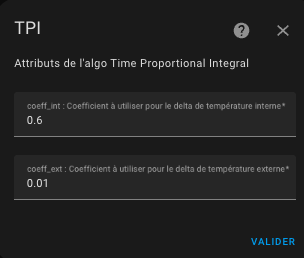

# Les différents algorithmes utilisés

- [Les différents algorithmes utilisés](#les-différents-algorithmes-utilisés)
  - [L'algorithme TPI](#lalgorithme-tpi)
    - [Configurez les coefficients de l'algorithme TPI](#configurez-les-coefficients-de-lalgorithme-tpi)
    - [Principe](#principe)
  - [L'algorithme d'auto-régulation (sans contrôle de la vanne)](#lalgorithme-dauto-régulation-sans-contrôle-de-la-vanne)
  - [L'algorithme de la fonction d'auto-start/stop](#lalgorithme-de-la-fonction-dauto-startstop)

## L'algorithme TPI

### Configurez les coefficients de l'algorithme TPI

Si vous avez choisi un thermostat de type ```over_switch``` ou  ```over_valve``` ou `over_climate` avec l'auto-régulation `Controle direct de la vanne` et que vous sélectionnez l'option "TPI" vous menu, vous arriverez sur cette page :



Vous devez donner :
1. le coefficient coef_int de l'algorithme TPI,
2. le coefficient coef_ext de l'algorithme TPI


### Principe

L'algorithme TPI consiste à calculer à chaque cycle un pourcentage d'état On vs Off pour le radiateur en utilisant la température cible, la température actuelle dans la pièce et la température extérieure actuelle. Cet algorithme n'est donc valable que pour les Versatile Thermostat qui régulent : `over_switch` et `over_valve`.

Le pourcentage est calculé avec cette formule :

    on_percent = coef_int * (température cible - température actuelle) + coef_ext * (température cible - température extérieure)
    Ensuite, l'algo fait en sorte que 0 <= on_percent <= 1

Les valeurs par défaut pour coef_int et coef_ext sont respectivement : ``0.6`` et ``0.01``. Ces valeurs par défaut conviennent à une pièce standard bien isolée.

Pour régler ces coefficients, gardez à l'esprit que :
1. **si la température cible n'est pas atteinte** après une situation stable, vous devez augmenter le ``coef_ext`` (le ``on_percent`` est trop bas),
2. **si la température cible est dépassée** après une situation stable, vous devez diminuer le ``coef_ext`` (le ``on_percent`` est trop haut),
3. **si l'atteinte de la température cible est trop lente**, vous pouvez augmenter le ``coef_int`` pour donner plus de puissance au réchauffeur,
4. **si l'atteinte de la température cible est trop rapide et que des oscillations apparaissent** autour de la cible, vous pouvez diminuer le ``coef_int`` pour donner moins de puissance au radiateur.

En type `over_valve` le `on_percent` est ramené à une valeur entre 0 et 100% et sert directement à commander l'ouverture de la vanne.

## L'algorithme d'auto-régulation (sans contrôle de la vanne)

L'algorithme d'auto-régulation peut être synthétisé comme suit:

1. initialiser la température cible comme la consigne du VTherm,
1. Si l'auto-régulation est activée,
   1. calcule de la température régulée (valable pour un VTherm),
   2. prendre cette température comme cible,
2. Pour chaque sous-jacent du VTherm,
     1. Si "utiliser la température interne" est cochée,
          1. calcule de la compensation (trv internal temp - room temp),
     2. ajout de l'écart à la température cible,
     3. envoie de la température cible ( = temp regulee + (temp interne - temp pièce)) au sous-jacent

## L'algorithme de la fonction d'auto-start/stop

L'algorithme utilisé dans la fonction d'auto-start/stop est le suivant :
1. if enable aut-start/stop is off, stop here.
2. If VTherm is on and in heating mode, when error_accumulated is < -error_threshold -> turn off and save hvac mode,
3. If VTherm is on and in Cooling mode, when error_accumulated is > error_threshold -> turn off and save hvac mode,
4. If VTherm is off and saved hvac mode is Heating and current_temperature + slope x dt <= target_temperature then turn on and set havc mode to the saved hvac_mode,
5. If VTherm is off and saved hvac mode is Cooling and current_temperature + slope x dt >= target_temperature then turn on and set havc mode to the saved hvac_mode
6. error_threshold is set to respectively 10 (° * min) in slow, 5 in medium and 2 in fast.

dt is set to respectively 30 min in slow, 15 min in medium and 7 min in fast detection level.

La fonction est décrite dans le détail [ici](https://github.com/jmcollin78/versatile_thermostat/issues/585).

