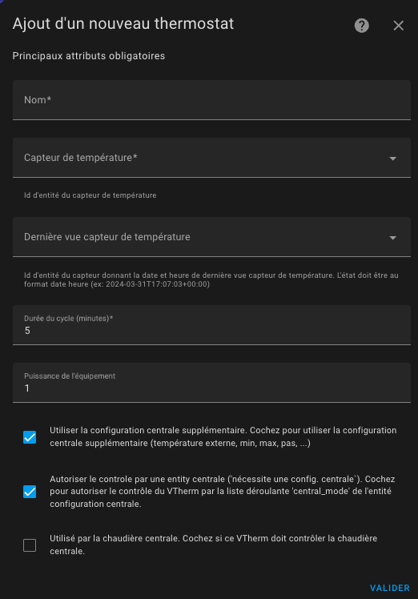
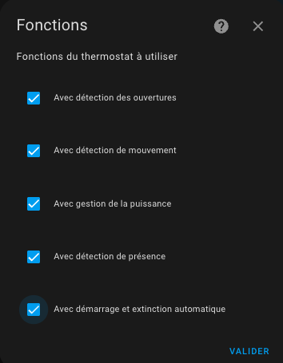

- [Choix des attributs de base](#choix-des-attributs-de-base)
- [Choix des fonctions utilisées](#choix-des-fonctions-utilisées)

# Choix des attributs de base

Choisisez le menu "Principaux attributs".



Donnez les principaux attributs obligatoires. Ces attributs sont communs à tous les VTherms :
1. un nom (sera le nom de l'intégration et aussi le nom de l'entité `climate`)
4. un identifiant d'entité de capteur de température qui donne la température de la pièce dans laquelle le radiateur est installé,
5. une entité facultative de capteur de donnant la date et heure de dernière vue du capteur (`last_seen`). Si vous avez ce capteur donnez le ici, il permet d'éviter des mises en sécurité lorsque la température est stable et que le capteur ne remonte plus de température pendant longtemps. (cf. [ici](troubleshooting.md#pourquoi-mon-versatile-thermostat-se-met-en-securite-)),
6. une durée de cycle en minutes. A chaque cycle :
   1. `over_switch` : VTherm allumera/éteindra le radiateur en modulant la proportion de temps allumé,
   2. `over_valve` : VTherm calculera une nouvelle ouverture de la vanne et lui enverra si elle a changée,
   3. `over_climate` : le cycle permet d'effectuer les contrôles de base et recalcule les coefficients de l'auto-régulation. Le cycle peut déboucher sur une nouvelle consigne envoyée au sous-jacents ou sur une modification d'ouverture de la vanne dans le cas d'un _TRV_ dont la vanne est commandable.
7. une puissance de l'équipement ce qui va activer les capteurs de puissance et énergie consommée par l'appareil. Si plusieurs équipements sont reliés au même VTherm, il faut indiquer ici le total des puissances max des équipements,
8.  la possibilité d'utiliser des paramètres complémentaires venant de la configuration centralisée :
    1.  capteur de température extérieure,
    2.  température minimale / maximale et pas de température
9.  la possibilité de controler le thermostat de façon centralisée. Cf [controle centralisé](#le-contrôle-centralisé),
10. une case à cocher si ce VTherm est utilisé pour déclencher une éventuelle chaudière centrale.

>  _*Notes*_
>  1. avec les types ```over_switch``` et ```over_valve```, les calculs sont effectués à chaque cycle. Donc en cas de changement de conditions, il faudra attendre le prochain cycle pour voir un changement. Pour cette raison, le cycle ne doit pas être trop long. **5 min est une bonne valeur** mais doit être adapté à votre type de chauffage. Plus l'inertie est grande et plus le cycle doit être long. Cf. [Exemples de réglages](tuning-examples.md),
>  2. si le cycle est trop court, le radiateur ne pourra jamais atteindre la température cible. Pour le radiateur à accumulation par exemple il sera sollicité inutilement.

# Choix des fonctions utilisées

Choisissez le menu "Fonctions".



Les différentes fonctions que vous souhaitez utiliser pour ce VTherm :
1. la détection d'ouvertures (portes, fenêtres) permettant de stopper le chauffage lorsque l'ouverture est ouverte. (cf. [gestion des ouvertures](feature-window.md))
2. la détection de mouvement : VTherm peut adapter une consigne de température lorsqu'un mouvement est détecté dans la pièce. (cf. [détection du mouvement](feature-motion.md))
3. la gestion de la puissance : VTherm peut stopper un équipement si la puissance consommée dans votre habitation dépasse un seuil. (cf. [gestion du délestage](feature-power.md))
4. la détection de présence : si vous avez un capteur indiquant une présence ou non dans votre habitation, vous pouvez l'utiliser pour changer la température de consigne. Cf. [gestion de la présence](feature-presence.md). Attention de ne pas confondre cette fonction avec la détection de mouvement. La présence est plus faite pour être à l'échelle de l'habitation alors que le mouvement est plus fait pour être à l'échelle de la pièce.
5. l'arrêt/démarrage automatique : pour les VTherm de type `over_climate` uniquement. Cette fonction permet d'arrêter un équipement lorsque VTherm détete qu'il ne sera plus néessaire pendant un certain temps. Il utilise la courbe de température pour prévoir quand l'équipement sera de nouveau utile et le rallumera à ce moment là. Cf. [gestion de l'arrêt/démarrage automatique](feature-auto-start-stop.md)


>  _*Notes*_
> 1. La liste des fonctions disponibles s'adapte à votre type de VTherm.
> 2. Lorsque vous cochez une fonction, une nouvelle entrée menu s'ajoute pour configurer la fonction.
> 3. Vous ne pourrez pas valider la création d'un VTherm si tous les paramètres de toutes les fonctions n'ont pas été saisis.
