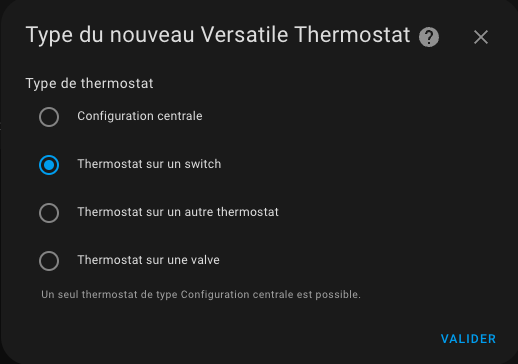

# Choix du Vtherm

- [Choix du Vtherm](#choix-du-vtherm)
  - [Création d'un nouveau Versatile Thermostat](#création-dun-nouveau-versatile-thermostat)
- [Choix d'un type de VTherm](#choix-dun-type-de-vtherm)
  - [Configuration centralisée](#configuration-centralisée)
  - [VTherm sur un switch](#vtherm-sur-un-switch)
  - [Vtherm sur un autre thermostat](#vtherm-sur-un-autre-thermostat)
  - [VTherm sur une vanne](#vtherm-sur-une-vanne)
- [Le bon choix](#le-bon-choix)
- [Article en référence](#article-en-référence)


>  _*Notes*_
>
> Trois façons de travailler avec les VTherms sont disponibles :
> 1. Chaque Versatile Thermostat est entièrement configurée de manière indépendante. Choisissez cette option si vous ne souhaitez avoir aucune configuration ou gestion centrale.
> 2. Certains aspects peuvent être configurés de manière centralisée. Cela permet par ex. définir la température min/max, les paramètres de détection de fenêtre ouverte,… au niveau d'une instance centrale et unique. Pour chaque VTherm que vous configurez, vous pouvez alors choisir d'utiliser la configuration centrale ou de la remplacer par des paramètres personnalisés.
> 3. En plus de cette configuration centralisée, tous les VTherm peuvent être contrôlées par une seule entité de type `select`. Cette fonction est nommé `central_mode`. Cela permet de stopper / démarrer / mettre en hors gel / etc tous les VTherms en une seule fois. Pour chaque VTherm, l'utilisateur indique si il est concerné par ce `central_mode`.


## Création d'un nouveau Versatile Thermostat

Cliquez sur le bouton Ajouter une intégration dans la page d'intégration (ou cliquez directement sur 'Ajouter un appareil' depuis la page de configuration de l'intégration)


puis



La configuration peut être modifiée via la même interface. Sélectionnez simplement le thermostat à modifier, appuyez sur "Configurer" et vous pourrez modifier certains paramètres ou la configuration.

Suivez ensuite les étapes de configuration en sélectionnant dans le menu l'option à configurer.

# Choix d'un type de VTherm

## Configuration centralisée
Ce choix permet de configurer une fois pour tous les VTherms certains aspects qui peuvent être répétitifs comme :
1. les paramètres des différents algorithmes (TPI, détection d'ouvertures, détection de mouvements, capteurs de puissance de votre habitation, la détection de présence). Tous ces paramètres sont transverses à tous les VTherms. Vous pouvez donc ne les saisir qu'une seule fois dans la `Configuration centralisée`. Cette configuration ne créé pas de VTherm à proprement parler. Elle permet juste de mettre en commun des paramètres qu'il serait fastidieux de resaisir pour chaque VTherm. Noter que vous pouvez surcharger les paramètres sur les VTherms pour les spécialisés au besoin,
2. la configuration de la commande d'un chauffage central,
3. certains paramètre avancés comme la mise en sécurité

## VTherm sur un switch
Ce VTherm permet de contrôler un interrupteur qui allume ou étient un radiateur. Cet interrupteur peut être un interrupteur physique qui allume ou éteint directement un radiateur (souvent électrique) ou un interrupteur virtuel qui pourra effectuer les actions que vous voulez sur demande d'allumage ou extinction. Ce dernier type permet par exemple de commander des switchs avec fil pilote ou deu DIY avec diode pour fil pilote. VTherm va moduler la proportion de temps allumé vs éteint pour obtenir la température souhaitée. Si il fait froid, il allume plus souvent (jusqu'à 100%), si il fait chaud il baisse le pourcentage d'allumage. Ce pourcentage d'allumage en nommé `on_percent`.

Les entités sous-jacentes sont donc des `switchs` ou des `input_boolean`.

## Vtherm sur un autre thermostat
Lorsque votre équipement est contrôlé par une entité de type `climate` dans Home Assistant et que vous n'avez que ça à disposition, vous devez utiliser ce type de VTherm. Dans ce cas, le VTherm va simplement commander la température de consigne du `climate` sous-jacent.
Ce type est aussi équipé de fonction d' auto-régulations avancées permettant de moduler la consigne donnée aux sous-jacent pour atteindre plus vite la consigne et de s'affranchir de la régulation interne de ces équipements qui est parfois mauvaise. C'est le cas, si le thermomètre interne de l'équipement est trop proche du corps de chauffe. L'équipement peut croire qu'il fait chaud alors qu'au bout de la pièce, la consigne n'est pas du tout atteinte.

Depuis la version 6.8, ce type de VTherm permet aussi de réguler avec une action directe sur la vanne. Idéal pour les _TRV_ pour lesquels la vanne est commandable, comme les Sonoff TRVZB, ce type est recommandé si vous êtes équipés.

Les entités sous-jacentes de ce type de VTherm sont donc des `climate` exclusivement.

## VTherm sur une vanne
Lorsque tout ce que vous avez à disposition pour réguler la température de votre radiateur est une entité de type `number` vous devez utiliser le type `over_valve`. VTherm ouvre ou ferme la vanne en fonction de l'écart entre la consigne et la température réelle de la pièce (et de la température extérieure).

Ce type peut être utilisé pour les _TRV_ qui n'ont pas de `climate` associé ou tout autre solution type DIY qui expose une entité `number`.

# Le bon choix
>  _*Comment choisir le type*_
> Le choix du type est important. Il n'est plus possible de le modifier via l'IHM de configuration. Pour bien chsoisir, il faut se poser les quelques questions suivantes :
> 1. **quel type d'équipement je vais piloter ?** Dans l'ordre voici ce qu'il faut faire :
>    1. si vous avez une vanne thermostatique (_TRV_) commandable dans Home Assistant via une entité de type ```number``` (par exemple une _Shelly TRV_), choisissez le type `over_valve`. C'est le type le plus direct et qui assure la meilleure régulation,
>    2. si vous avez un radiateur électrique (avec ou sans fil pilote) et qu'une entité de type ```switch``` permet de l'allumer ou de l'éteindre, alors le type ```over_switch``` est préférable. La régulation sera faite par le Versatile Thermostat en fonction de la température mesuré par votre thermomètre, à l'endroit ou vous l'avez placé,
>    3. dans tous les autres cas, utilisez le mode ```over_climate```. Vous gardez votre entité ```climate``` d'origine et le Versatile Thermostat "ne fait que" piloter le on/off et la température cible de votre thermostat d'origine. La régulation est faite par votre thermostat d'origine dans ce cas. Ce mode est particulièrement adapté aux climatisations réversible tout-en-un dont l'exposition dans Home Assistant se limite à une entité de type ```climate```. Une auto-régulation avancée permet d'atteindre la consigne en forçant la consigne ou un pilotant directement la vanne lorsque c'est possible.
> 2. **quelle type de régulation je veux ?** Si l'équipement piloté possède son propre mécanisme de régulation (clim, certaine vanne TRV) et que cette régulation fonctionne bien, optez pour un ```over_climate```. Si l'équipement est de type _TRV_ avec une vanne pilotable sous HA, alors le type `over_climate` avec une auto-régulation `Contrôle direct de la vanne` est le meilleur choix.

# Article en référence
Un article permettant d'aller plus loin sur les concepts est visible ici (en Français) : https://www.hacf.fr/optimisation-versatile-thermostat/#optimiser-vos-vtherm
