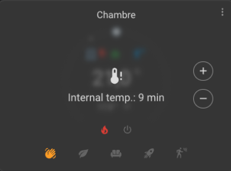

# La configuration avancée

- [La configuration avancée](#la-configuration-avancée)
  - [Configuration avancée](#configuration-avancée)
    - [Délai minimal d'activation](#délai-minimal-dactivation)
    - [La mise en sécurité](#la-mise-en-sécurité)

Ces paramètres permettent d'affiner le fonctionnement du thermostat et notamment la mise en sécurité d'un _VTherm_. L'absence d'un capteur de température (pièce ou extérieur) peut être dangereux pour votre logement. Supposez que le capteur de température soit bloqué sur 10°. Le _VTherm_ de type `over_climate` ou `over_valve` va alors commander un chauffage maximal des équipements sous-jacents, ce qui peut conduire à une surchauffe de la pièce voire des dommages sur le logement avec au pire un début d'incendie.

Pour éviter cela, _VTherm_ s'assure que les thermomètres répondent bien de façon régulière et met le _VTherm_ dans un mode particulier nommée le mode sécurité si ce n'est plus le cas. Le mode sécurité consiste à assurer un minimum de chauffe pour éviter l'effet inverse : une habitation qui ne serait plus chauffée du tout en plein hiver par exemple.

Là où le problème devient compliqué, c'est que certain thermomètre - notamment à pile - n'envoie leur température que si elle change. Il est donc tout à fait possible de ne plus recevoir de mises à jour de température pendant plusieurs heures sans que le thermomètre soit en défaut. Les différents paramètres ci-dessous vont permettre de régler finement les seuils de passage en mode sécurité.

Si votre thermomètre est muni d'un capteur nommé `last seen` qui donne l'heure de son dernier contact, il est possible de le spécifier dans les attributs principaux du _VTherm_ pour limiter grandement les fausses mises en sécurité. Cf. [configuration](base-attributes.md#choix-des-attributs-de-base) et [dépannage](troubleshooting.md#pourquoi-mon-versatile-thermostat-se-met-en-securite-).

Pour les _VTherm_ `over_climate` et donc qui se régule lui-même, le mode sécurité est désactivé. En effet il n'y a pas de risque de danger si l'équipement se régule lui-même mais juste un risque de mauvaise température.

## Configuration avancée

Le formulaire de configuration avancée est le suivant :


### La mise en sécurité

| Paramètre | Description | Valeur par défaut | Nom d'attribut |
| ---------- | ----------- | ----------------- | -------------- |
| **Délai maximal** | Délai maximal entre deux mesures de température avant de passer le _VTherm_ en mode sécurité. | 60 minutes | `safety_delay_min` |
| **Valeur minimale de `on_percent`** | Valeur minimale de `on_percent` en dessous de laquelle le mode sécurité ne s'active pas. Évite l'activation si le radiateur ne chauffe pas assez (risque de surchauffe/sous-chauffe sans danger physique). `0.00` active toujours le mode, `1.00` le désactive. | 0.5 (50%) | `safety_min_on_percent` |
| **Valeur par défaut de `on_percent` en sécurité** | Valeur de `on_percent` utilisée en mode sécurité. `0` coupe le thermostat, `0.1` maintient un chauffage minimal pour éviter le gel en cas de panne de thermomètre. | 0.1 (10%) | `safety_default_on_percent` |

Il est possible de désactiver la mise en sécurité suite à une absence de données du thermomètre extérieure. En effet, celui-ci ayant la plupart du temps un impact faible sur la régulation (dépendant de votre paramètrage), il est possible qu'il soit absent sans mettre en danger le logement. Pour cela, il faut ajouter les lignes suivantes dans votre `configuration.yaml` :
```yaml
versatile_thermostat:
...
    safety_mode:
        check_outdoor_sensor: false
```
Par défaut, le thermomètre extérieur peut déclencher une mise en sécurité si il n'envoit plus de valeur. N'oubliez pas que Home Assisstant doit être redémarré pour que ces modifications soient prises en compte. Ce réglage est commun à tous les _VTherm_ (qui devraient partager le thermomètre extérieur.

>  _*Notes*_
> 1. Lorsque le capteur de température viendra à la vie et renverra les températures, le préréglage sera restauré à sa valeur précédente,
> 2. Attention, deux températures sont nécessaires : la température interne et la température externe et chacune doit donner la température, sinon le thermostat sera en préréglage "security",
> 3. Une action est disponible qui permet de régler les 3 paramètres de sécurité. Ca peut servir à adapter la fonction de sécurité à votre usage,
> 4. Pour un usage naturel, le ``safety_default_on_percent`` doit être inférieur à ``safety_min_on_percent``,
> 5. Si vous utilisez la carte Verstatile Thermostat UI (cf. [ici](additions.md#bien-mieux-avec-le-versatile-thermostat-ui-card)), un _VTherm_ en mode sécurité est signalé par un voile grisatre qui donne le thermomètre en défaut et depuis combien de temps le thermomètre n'a pas remonté de valeur : .
