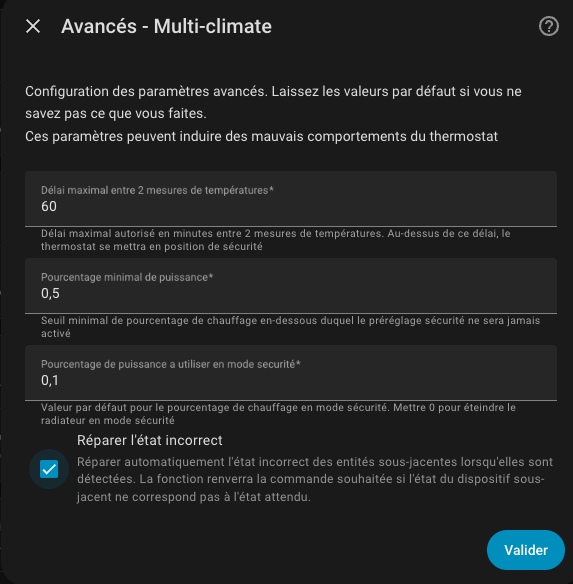

# La configuration avancée

- [La configuration avancée](#la-configuration-avancée)
  - [Pourquoi cette fonctionnalité ?](#pourquoi-cette-fonctionnalité-)
  - [Contexte de sécurité](#contexte-de-sécurité)
  - [Principe de fonctionnement du mode sécurité](#principe-de-fonctionnement-du-mode-sécurité)
    - [Qu'est-ce que le mode sécurité ?](#quest-ce-que-le-mode-sécurité-)
    - [Cas d'application](#cas-dapplication)
    - [Limitations](#limitations)
  - [Configuration](#configuration)
  - [Paramètres de sécurité](#paramètres-de-sécurité)
  - [Attributs exposés](#attributs-exposés)
  - [Actions disponibles](#actions-disponibles)
  - [Configuration avancée globale](#configuration-avancée-globale)
  - [Conseils pratiques](#conseils-pratiques)
  - [Réparer l'état incorrect des équipements](#réparer-létat-incorrect-des-équipements)
    - [Pourquoi cette fonctionnalité ?](#pourquoi-cette-fonctionnalité--1)
    - [Cas d'usage](#cas-dusage)
    - [Principe de fonctionnement](#principe-de-fonctionnement)
    - [Configuration](#configuration-1)
    - [Paramètres](#paramètres)
    - [Attributs exposés](#attributs-exposés-1)
    - [Limitations et sécurité](#limitations-et-sécurité)

## Pourquoi cette fonctionnalité ?

La configuration avancée de _VTherm_ offre des outils essentiels pour garantir la sécurité et la fiabilité de votre système de chauffage. Ces paramètres permettent de gérer des situations où les capteurs de température ne communiquent plus correctement, ce qui pourrait conduire à des commandes dangereuses ou inefficaces.

## Contexte de sécurité

L'absence d'un capteur de température ou son dysfonctionnement peut être **très dangereux** pour votre logement. Prenons un exemple concret :

- Votre capteur de température se bloque sur une valeur de 10°
- Votre _VTherm_ de type `over_climate` ou `over_valve` détecte une température très basse
- Il commande un chauffage maximal des équipements sous-jacents
- **Résultat** : la pièce surchauffe considérablement

Les conséquences peuvent aller de simples dégâts matériels à des risques plus graves comme un début d'incendie ou une explosion (dans le cas d'un radiateur électrique défaillant).

## Principe de fonctionnement du mode sécurité

### Qu'est-ce que le mode sécurité ?

Le mode sécurité est un mécanisme de protection qui détecte quand les capteurs de température ne répondent plus régulièrement. Lorsqu'une absence de données est détectée, _VTherm_ active un mode particulier qui :

1. **Réduit le risque immédiat** : le système ne commande plus une puissance maximale
2. **Maintient une chauffe minimale** : assure que le logement ne se refroidit pas complètement
3. **Vous alerte** : via un changement d'état du thermostat, visible dans Home Assistant

### Cas d'application

Le mode sécurité se déclenche quand :

- **Température interne manquante** : aucune mesure reçue depuis le délai maximal configuré
- **Température externe manquante** : aucune mesure reçue depuis le délai maximal configuré (optionnel)
- **Capteur bloqué** : le capteur n'envoie plus de changement de valeur (comportement typique des capteurs à pile)

Un défi particulier vient des capteurs à pile qui n'envoient leurs données que lorsqu'une valeur **change**. Il est donc possible de ne recevoir aucune mise à jour pendant plusieurs heures sans que le capteur soit réellement en défaut. C'est pourquoi les paramètres sont configurables pour adapter la détection à votre configuration.

### Limitations

- **_VTherm_ de type `over_climate` régulé en interne** : le mode sécurité est automatiquement désactivé. En effet, il n'y a pas de risque de danger si l'équipement se régule lui-même (il maintient sa propre température). Le seul risque est une température inconfortable, pas un danger physique.

## Configuration

Pour configurer les paramètres avancés de sécurité :

1. Ouvrez la configuration de votre _VTherm_
2. Accédez aux paramètres de configuration générale
3. Déroulez jusqu'à la section "Configuration avancée"

Le formulaire de configuration avancée est le suivant :



>  _*Conseil*_
>
> Si votre thermomètre est muni d'un attribut `last_seen` ou similaire qui donne l'heure de son dernier contact, **configurez cet attribut** dans les sélections principales du _VTherm_. Cela améliore considérablement la détection et réduit les fausses alertes. Consultez la [configuration des attributs de base](base-attributes.md#choix-des-attributs-de-base) et le [dépannage](troubleshooting.md#pourquoi-mon-versatile-thermostat-se-met-en-securite-) pour plus de détails.

## Paramètres de sécurité

| Paramètre                                             | Description                                                                                                                                                                                                                                                                                                     | Valeur par défaut | Nom d'attribut              |
| ----------------------------------------------------- | --------------------------------------------------------------------------------------------------------------------------------------------------------------------------------------------------------------------------------------------------------------------------------------------------------------- | ----------------- | --------------------------- |
| **Délai maximal avant mise en sécurité**              | Délai maximum autorisé entre deux mesures de température avant que le _VTherm_ passe en mode sécurité. Si aucune nouvelle mesure n'est reçue après ce délai, le mode sécurité s'active.                                                                                                                         | 60 minutes        | `safety_delay_min`          |
| **Seuil d'`on_percent` minimum pour la sécurité**     | Pourcentage minimum de `on_percent` en dessous duquel le mode sécurité ne s'activate pas. Cela évite d'activer le mode sécurité quand le radiateur fonctionne très peu (`on_percent` bas), car il n'y a pas de risque immédiat de surchauffe. `0.00` active toujours le mode, `1.00` le désactive complètement. | 0.5 (50%)         | `safety_min_on_percent`     |
| **Valeur d'`on_percent` par défaut en mode sécurité** | La puissance de chauffage utilisée quand le thermostat est en mode sécurité. `0` arrête complètement le chauffage (risque de gel), `0.1` maintient un chauffage minimal pour éviter la congélation en cas de défaillance prolongée du thermomètre.                                                              | 0.1 (10%)         | `safety_default_on_percent` |

## Attributs exposés

Quand le mode sécurité est actif, les _VTherm_ exposent les attributs suivants :

```yaml
safety_mode: "on"                # "on" ou "off"
safety_delay_min: 60             # Délai configuré en minutes
safety_min_on_percent: 0.5       # Seuil d'on_percent (0.0 à 1.0)
safety_default_on_percent: 0.1   # Puissance en mode sécurité (0.0 à 1.0)
last_safety_event: "2024-03-20 14:30:00"  # Heure du dernier événement
```

## Actions disponibles

Une action _VTherm_ permet de reconfigurer dynamiquement les 3 paramètres de sécurité sans redémarrer Home Assistant :

- **Service** : `versatile_thermostat.set_safety_parameters`
- **Paramètres** :
  - `entity_id` : le _VTherm_ à reconfigurer
  - `safety_delay_min` : nouveau délai (minutes)
  - `safety_min_on_percent` : nouveau seuil (0.0 à 1.0)
  - `safety_default_on_percent` : nouvelle puissance (0.0 à 1.0)

Cela permet d'adapter dynamiquement la sensibilité du mode sécurité selon votre usage (par exemple, réduire le délai quand les gens sont à la maison, l'augmenter quand le logement est inoccupé).

## Configuration avancée globale

Il est possible de désactiver la vérification du **capteur de température extérieur** pour la mise en sécurité. En effet, le capteur extérieur impacte généralement peu la régulation (selon votre paramètrage) et peut être absent sans mettre en danger le logement.

Pour cela, ajoutez les lignes suivantes dans votre `configuration.yaml` :

```yaml
versatile_thermostat:
  safety_mode:
    check_outdoor_sensor: false
```

>  _*Important*_
>
> - Cette modification est **commune à tous les _VTherm_** du système
> - Elle affecte la détection du thermomètre extérieur pour tous les thermostats
> - **Home Assistant doit être redémarré** pour que les changements prennent effet
> - Par défaut, le thermomètre extérieur peut bien déclencher une mise en sécurité s'il n'envoie plus de données

## Conseils pratiques

>  _*Notes et bonnes pratiques*_

1. **Restauration après correction** : Lorsque le capteur de température reviendra à la vie et enverra à nouveau des données, le mode de préréglage sera restauré à sa valeur précédente.

2. **Deux températures requises** : Le système a besoin de la température interne ET de la température externe pour fonctionner correctement. Si l'une des deux manque, le thermostat passera en mode sécurité.

3. **Relation entre les paramètres** : Pour un fonctionnement naturel, la valeur `safety_default_on_percent` devrait être **inférieure** à `safety_min_on_percent`. Par exemple : `safety_min_on_percent = 0.5` et `safety_default_on_percent = 0.1`.

4. **Adaptation à votre capteur** :
   - Si vous avez des **fausses alertes**, augmentez le délai (`safety_delay_min`) ou réduisez `safety_min_on_percent`
   - Si vous avez des capteurs à pile, augmentez le délai davantage (ex: 2-4 heures)
   - Si vous utilisez l'attribut `last_seen`, le délai peut être réduit (le système est plus précis)

5. **Visualisation dans l'UI** : Si vous utilisez la [carte _Versatile Thermostat UI_](additions.md#bien-mieux-avec-le-versatile-thermostat-ui-card), un _VTherm_ en mode sécurité est signalé visuellement par :
   - Un voile grisâtre sur le thermostat
   - L'affichage du capteur défaillant
   - Le temps écoulé depuis la dernière mise à jour

   .

## Réparer l'état incorrect des équipements

### Pourquoi cette fonctionnalité ?

Lors de l'utilisation d'un _VTherm_ avec des équipements de chauffage (`over_switch`, `over_valve`, `over_climate`, `over_climate_valve`), il peut arriver que l'équipement ne suive pas correctement la commande envoyée par le thermostat. Par exemple :

- Un relais bloqué qui ne bascule pas à l'état commandé
- Une vanne thermostatique qui n'obéit pas aux commandes
- Une perte de communication temporaire avec l'équipement
- Un équipement qui met trop de temps à réagir

La fonctionnalité **"Reparer l'état incorrect"** détecte ces situations et re-envoie automatiquement la commande pour synchroniser l'état réel avec l'état désiré.

### Cas d'usage

Cette fonctionnalité est particulièrement utile pour :

- **Relais instables** : les relais qui collent ou ne basculent pas toujours correctement
- **Communication Zigbee/WiFi intermittente** : les équipements qui perdent occasionnellement la connexion
- **Vannes lentes** : les vannes thermostatiques qui prennent du temps à réagir aux commandes
- **Équipements défaillants** : les radiateurs électriques ou vannes qui ne répondent plus aux commandes
- **PAC** : pour s'assurer que la PAC exécute bien les commandes de chauffage/climatisation

### Principe de fonctionnement

À chaque cycle de contrôle du thermostat, la fonctionnalité :

1. **Compare les états** : vérifie que l'état réel de chaque équipement correspond à ce qui a été commandé
2. **Détecte les discordances** : si l'équipement n'a pas suivi la commande, c'est une discordance
3. **Re-envoie la commande** : si une discordance est détectée, renvoi la commande pour synchroniser l'état
4. **Compte les tentatives** : le nombre de réparations consécutives est limité pour éviter les boucles infinies
5. **Contrôle le délai d'activation** : la fonctionnalité ne s'active qu'après un délai minimum pour laisser les équipements finir leur initialisation

### Configuration

Cette fonctionnalité se configure dans l'interface de configuration du _VTherm_ :

1. Ouvrez la configuration de votre _VTherm_
2. Accédez aux paramètres de configuration générale
3. Déroulez jusqu'à la section "Configuration avancée"
4. Activez l'option **"Reparer l'état incorrect des équipements"**

### Paramètres

| Paramètre                    | Description                                                                                                                                                         | Valeur par défaut |
| ---------------------------- | ------------------------------------------------------------------------------------------------------------------------------------------------------------------- | ----------------- |
| **Reparer l'état incorrect** | Active ou désactive la détection et réparation automatique des discordances d'état. Quand activée, chaque discordance détectée provoque un re-envoi de la commande. | Désactivé         |

>  _*Paramètres système internes*_
>
> Certains paramètres sont configurés au niveau système et ne peuvent pas être modifiés :
> - **Délai minimum avant activation** : 30 secondes après le démarrage du thermostat (permet à tous les équipements de s'initialiser)
> - **Nombre maximal de tentatives consécutives** : 5 réparations consécutives avant d'arrêter temporairement
> - **Délai de réinitialisation** : le compteur de réparations se réinitialise une fois que les équipements reviennent à l'état correct

### Attributs exposés

Quand la fonctionnalité de réparation est activée, les _VTherm_ exposent l'attribut suivant :

```yaml
repair_incorrect_state_manager:
  consecutive_repair_count: 2       # Nombre de réparations consécutives effectuées
  max_attempts: 5                  # Plafond avant arrêt temporaire
  min_delay_after_init_sec: 30     # Délai minimum avant activation
is_repair_incorrect_state_configured: true  # Statut de la fonctionnalité
```

Le compteur `consecutive_repair_count` vous permet de :
- Diagnostiquer les problèmes matériels fréquents
- Identifier les équipements défaillants
- Surveiller la stabilité de votre installation

### Limitations et sécurité

>  _*Important*_

1. **Pas de modification du comportement** : Cette fonctionnalité ne change pas la logique de chauffage. Elle se contente de s'assurer que vos commandes sont bien exécutées.

2. **Plafond de sécurité** : Le nombre maximal de tentatives consécutives (5) évite les boucles infinies. Si ce plafond est atteint, un message d'erreur est enregistré et les réparations s'arrêtent temporairement.

3. **Délai de démarrage** : La fonctionnalité n'est active qu'après 30 secondes pour laisser tous les équipements le temps de s'initialiser complètement.

4. **Applicable à tous les types de _VTherm_** : Cette fonctionnalité fonctionne pour tous les types `over_switch`, `over_valve`, `over_climate` et `over_climate_valve` (les `over_climate` avec régulation par contrôle direct de la vanne). Pour ces derniers, l'état du `climate` sous-jacent est vérifié mais aussi l'état d'ouverture de la vanne.

5. **Symptômes de suractivité** : Si vous voyez régulièrement des messages d'avertissement indiquant une réparation, cela signifie qu'il y a un problème matériel :
   - Vérifiez la connexion de l'équipement
   - Vérifiez la stabilité de votre réseau (Zigbee/WiFi)
   - Testez l'équipement manuellement via Home Assistant
   - Envisagez un remplacement si le problème persiste

6. **Réinitialisation du compteur** : Le compteur se réinitialise automatiquement dès que les équipements reprennent l'état correct, permettant de nouvelles tentatives en cas de problème récurrent.

7. **Relance régulière** : après 5 tentatives de réparation échouées, la réparation se met en pause pour éviter les boucles infinies. Elle reprend après 10 cycles sans réparation, permettant de nouvelles tentatives en cas de problème intermittent.

````
