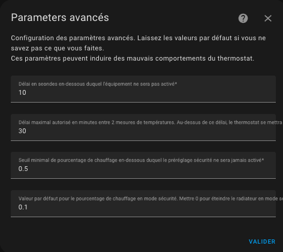

# La configuration avancée

## Configuration avancée

Ces paramètres permettent d'affiner le réglage du thermostat.
Le formulaire de configuration avancée est le suivant :



Le premier délai (minimal_activation_delay_sec) en secondes est le délai minimum acceptable pour allumer le chauffage. Lorsque le calcul donne un délai de mise sous tension inférieur à cette valeur, le chauffage reste éteint.

Le deuxième délai (``security_delay_min``) est le délai maximal entre deux mesures de température avant de régler le préréglage sur ``security``. Si le capteur de température ne donne plus de mesures de température, le thermostat et le radiateur passeront en mode ``security`` après ce délai. Ceci est utile pour éviter une surchauffe si la batterie de votre capteur de température est trop faible.

Le troisième paramétre (``security_min_on_percent``) est la valeur minimal de ``on_percent`` en dessous de laquelle le préréglage sécurité ne sera pas activé. Ce paramètre permet de ne pas mettre en sécurité un thermostat, si le radiateur piloté ne chauffe pas suffisament.
Mettre ce paramètre à ``0.00`` déclenchera le préréglage sécurité quelque soit la dernière consigne de chauffage, à l'inverse ``1.00`` ne déclenchera jamais le préréglage sécurité ( ce qui revient à désactiver la fonction).

Le quatrième param§tre (``security_default_on_percent``) est la valeur de ``on_percent`` qui sera utilisée lorsque le thermostat passe en mode ``security``. Si vous mettez ``0`` alors le thermostat sera coupé lorsqu'il passe en mode ``security``, mettre 0,2% par exemple permet de garder un peu de chauffage (20% dans ce cas), même en mode ``security``. Ca évite de retrouver son logement totalement gelé lors d'une panne de thermomètre.

Note: les paramètres `security_min_on_percent` et `security_default_on_percent` ne s'applique pas aux VTherms `over_climate`.

Depuis la version 5.3 il est possible de désactiver la mise en sécurité suite à une absence de données du thermomètre extérieure. En effet, celui-ci ayant la plupart du temps un impact faible sur la régulation (dépendant de votre paramètrage), il est possible qu'il soit absent sans mettre en danger le logement. Pour cela, il faut ajouter les lignes suivantes dans votre `configuration.yaml` :
```
versatile_thermostat:
...
    safety_mode:
        check_outdoor_sensor: false
```
Par défaut, le thermomètre extérieur peut déclencher une mise en sécurité si il n'envoit plus de valeur.

Voir [exemple de réglages](#examples-tuning) pour avoir des exemples de réglage communs

>  _*Notes*_
> 1. Lorsque le capteur de température viendra à la vie et renverra les températures, le préréglage sera restauré à sa valeur précédente,
> 2. Attention, deux températures sont nécessaires : la température interne et la température externe et chacune doit donner la température, sinon le thermostat sera en préréglage "security",
> 3. Un service est disponible qui permet de régler les 3 paramètres de sécurité. Ca peut servir à adapter la fonction de sécurité à votre usage,
> 4. Pour un usage naturel, le ``security_default_on_percent`` doit être inférieur à ``security_min_on_percent``,
> 5. Les thermostats de type ``thermostat_over_climate`` ne sont pas concernés par le mode security.