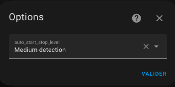

# Le démarrage / arrêt automatique (auto-start/stop)

- [Le démarrage / arrêt automatique (auto-start/stop)](#le-démarrage--arrêt-automatique-auto-startstop)
  - [Configurer l'auto-start/stop](#configurer-lauto-startstop)
  - [Usage](#usage)

Cette fonction permet d'autoriser VTherm à stopper un équipement qui n'a pas besoin d'être allumé et de le redémarrer lorsque les conditions le réclame. Cette fonction est munie de 3 réglages qui permettent d'arrêter / relancer plus ou moins rapidement l'équipement.
Exclusivement réservé au _VTherm_ de type `over_climate`, elle répond au cas d'usage suivant :
1. votre équipement est allumé électriquement en permanence et consomme de l'électricité même lorsqu'il n'y a pas besoin de chauffer (resp. refroidir). C'est souvent le cas sur les _PAC_ qui consomment même en veille,
2. les conditions de température font qu'il n'y a pas besoin de chauffer (resp. refroidir) pendant longtemps : la consigne est supérieure (resp. inférieur) à la température de la pièce,
3. la température monte (resp. descend), est stable ou descend (resp. monte) doucement

Dans ce cas, il est préférable de demander à l'équipement de s'éteindre pour éviter la consommation électrique en mode veille.

## Configurer l'auto-start/stop

Pour l'utiliser, vous devez :
1. Ajouter la fonction `Avec démarrage et extinction automatique` dans le menu 'Fonctions',
2. Paramétrer le niveau de détection dans l'option 'Allumage/extinction automatique' qui s'affiche lorsque la fonction a été activée. Vous choisissez le niveau de détection entre 'Lent', 'Moyen' et 'Rapide'. Les arrêts/relances seront plus nombreux avec le niveau 'Rapide'.

Le réglage 'Lent' permet d'avoir environ 30 min entre un arrêt et une relance,
Le réglage 'Moyen' met le seuil a environ 15 min et le réglage rapide le met à 7 min.

Attention, ce ne sont pas des réglages absolus puisque l'algorithme tient compte de la pente de la courbe température de la pièce pour réagir. Il est toujours possible qu'un démarrage ait lieu peu après une extinction si la chute de température est importante.

## Usage

Une fois la fonction paramétrée, vous aurez maintenant une nouvelle entité de type `switch` qui vous permet d'autoriser ou non l'arrêt/relance automatique sans toucher à la configuration. Cette entité est disponible sur l'appareil VTherm et se nomme `switch.<name>_enable_auto_start_stop`.

Cochez la pour autoriser le démarrage et extinction automatique et laissez là décocher si vous voulez désactiver la fonction auto-start/stop.

A noter : la fonction auto-start/stop ne rallumera un _VTherm_ que si celui-ci a été éteint par cette fonction. Ca évite des allumages intempestifs non désirés. Evidement l'état d'extinction est résistant à un redémarrage de Home Assistant.

>  _*Notes*_
> 1. L'algorithme de détection est décrit [ici](algorithms.md#lalgorithme-de-la-fonction-dauto-startstop).
> 2. Certains équipements (chaudière, chauffage au sol, _PAC_, ...) n'aiment pas forcément être arrêtés / stoppés trop souvent. Si vous êtes dans ce cas, il peut être préférable de désactiver la fonction lorsque vous savez qu'il va être utilisé. Par exemple, je désactive cette fonction en journée si il y a une présence de détectée car je sais que ma _PAC_ va s'allumer souvent. J'autorise l'auto-start/stop la nuit ou en cas d'absence puisque la consigne est abaissée et qu'elle se déclenche peu, voir pas du tout.
> 3. Si vous utilisez la carte Verstatile Thermostat UI (cf. [ici](additions.md#bien-mieux-avec-le-versatile-thermostat-ui-card)), une case à cocher est directement visible sur la carte pour désactiver l'auto-start/stop et un _VTherm_ stoppé par l'auto-start/stop est signalé par l'icone : .
