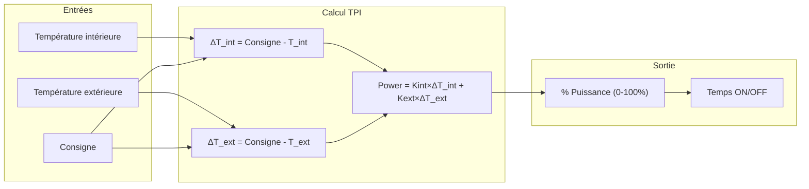
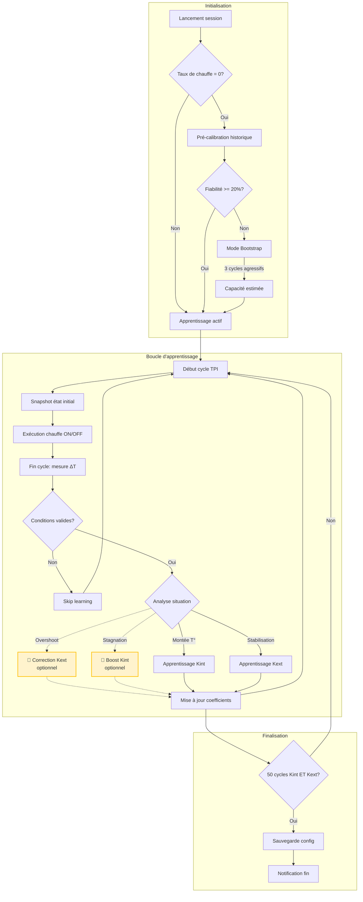
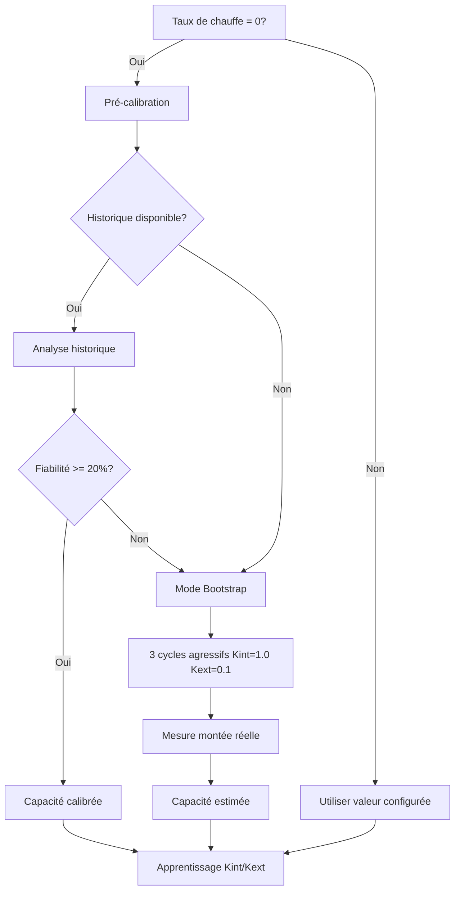
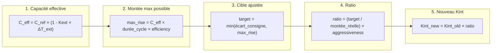
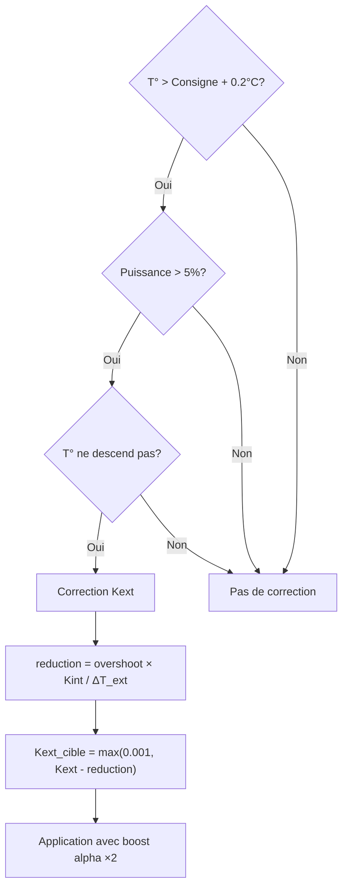
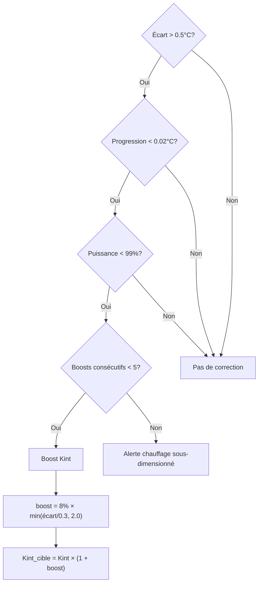
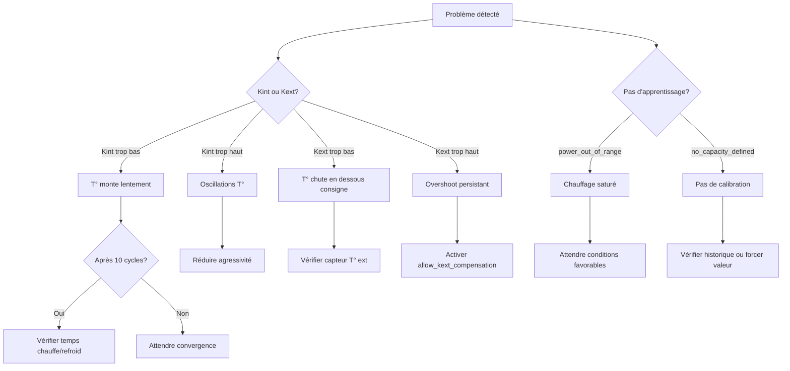

# 🧠 Auto TPI : Guide Technique Approfondi

> [!NOTE]
> Ce document est destiné aux utilisateurs avancés qui souhaitent comprendre en détail le fonctionnement de l'algorithme Auto TPI. Pour une introduction plus accessible, consultez le [Guide Utilisateur Auto TPI](feature-autotpi.md).

---

## Sommaire

1. [L'algorithme TPI](#lalgorithme-tpi)
2. [Cycle d'apprentissage détaillé](#cycle-dapprentissage-détaillé)
3. [Calibration de la capacité thermique](#calibration-de-la-capacité-thermique)
4. [Algorithmes de calcul des coefficients](#algorithmes-de-calcul-des-coefficients)
5. [Mécanismes de correction automatique](#mécanismes-de-correction-automatique)
6. [Paramètres avancés et constantes](#paramètres-avancés-et-constantes)
7. [Services et API](#services-et-api)
8. [Diagnostic et dépannage avancé](#diagnostic-et-dépannage-avancé)

---

## L'algorithme TPI

### Principe fondamental

L'algorithme **TPI** (Time Proportional & Integral) calcule un **pourcentage de puissance** de chauffe à chaque cycle. Ce pourcentage détermine le temps pendant lequel le chauffage sera actif durant le cycle (ex: 60% sur un cycle de 10 minutes = 6 minutes de chauffe).

### Formule de base

```
Power = (Kint × ΔT_intérieur) + (Kext × ΔT_extérieur)
```

Où :
- **Kint** (`tpi_coef_int`) : Coefficient intérieur, réagit à l'écart avec la consigne
- **Kext** (`tpi_coef_ext`) : Coefficient extérieur, compense les pertes thermiques
- **ΔT_intérieur** = Consigne − Température intérieure
- **ΔT_extérieur** = Consigne − Température extérieure



### Rôle des coefficients

| Coefficient | Rôle | Situation d'apprentissage |
|-------------|------|---------------------------|
| **Kint** | Contrôle la **réactivité** : plus il est élevé, plus le chauffage réagit vite aux écarts | Pendant la **montée en température** (écart > 0.05°C, puissance < 99%) |
| **Kext** | Compense les **pertes thermiques** : plus il est élevé, plus le chauffage anticipe le refroidissement | Pendant la **stabilisation** autour de la consigne (écart < 0.5°C) |

---

## Cycle d'apprentissage détaillé

### Vue d'ensemble du flux



> [!NOTE]
> Les **cases jaunes avec lignes pointillées** (🔸) représentent les mécanismes de correction **optionnels**. Ils doivent être activés explicitement via les paramètres du service `set_auto_tpi_mode`.

### Détail du snapshot de cycle

À chaque début de cycle, l'algorithme capture l'état actuel :

| Donnée capturée | Utilisation |
|-----------------|-------------|
| `last_temp_in` | Température intérieure au début du cycle |
| `last_temp_out` | Température extérieure au début du cycle |
| `last_order` | Consigne au début du cycle |
| `last_power` | Puissance calculée pour ce cycle (0.0 à 1.0) |
| `last_state` | Mode HVAC (heat/cool) |

À la fin du cycle, on compare ces valeurs avec les mesures actuelles pour calculer la progression.

### Conditions de validation d'un cycle

Un cycle est **ignoré** pour l'apprentissage si :

| Condition | Raison |
|-----------|--------|
| Puissance = 0% ou 100% | Saturation : pas d'information exploitable sur l'efficacité |
| Consigne modifiée | L'objectif a changé en cours de cycle |
| Délestage actif | Le chauffage a été forcé OFF par le Power Manager |
| Détection panne | Anomalie détectée (chauffage inefficace) |
| Chaudière centrale OFF | Le thermostat demande mais la chaudière ne répond pas |
| Premier cycle après redémarrage | Pas de donnée de référence valide |

---

## Calibration de la capacité thermique

### Définition

La **capacité thermique** (ou **taux de chauffe**) représente la vitesse de montée en température maximale de votre système, exprimée en **°C par heure** (°C/h).

Exemple : Une capacité de 2.0 °C/h signifie que votre radiateur peut faire monter la température de 2°C en une heure à pleine puissance (dans des conditions adiabatiques idéales).

### Méthodes de détermination



### Pré-calibration par analyse d'historique

Le service `auto_tpi_calibrate_capacity` analyse l'historique des capteurs :

1. **Récupération** des données `temperature_slope` et `power_percent` sur 30 jours
2. **Filtrage** : ne conserve que les points où `power >= 95%`
3. **Élimination des outliers** par méthode IQR (Interquartile Range)
4. **Calcul du 75ème percentile** des pentes (plus représentatif que la médiane)
5. **Correction adiabatique** : `Capacité = P75 + Kext × ΔT`
6. **Application marge de sécurité** : 20% par défaut

### Mode Bootstrap

Si l'historique est insuffisant (fiabilité < 20%), le système entre en **mode bootstrap** :

- **Coefficients agressifs** : Kint = 1.0, Kext = 0.1
- **Durée** : 3 cycles minimum
- **Objectif** : Provoquer une montée en température significative pour mesurer la capacité réelle
- **Sécurité timeout** : Si échec après 5 cycles, capacité par défaut = 0.3 °C/h (systèmes lents)

---

## Algorithmes de calcul des coefficients

### Apprentissage de Kint (Coefficient Intérieur)

L'algorithme ajuste Kint quand la température **monte** en direction de la consigne.

#### Formule détaillée



#### Variables utilisées

| Variable | Description | Valeur typique |
|----------|-------------|----------------|
| `C_ref` | Capacité de référence calibrée | 1.5 °C/h |
| `Kext` | Coefficient extérieur actuel | 0.02 |
| `ΔT_ext` | Écart T° intérieure/extérieure | 15°C |
| `durée_cycle` | En heures | 0.167 (10 min) |
| `efficiency` | Pourcentage de puissance utilisée | 0.70 |
| `aggressiveness` | Facteur de modération | 0.9 |

### Apprentissage de Kext (Coefficient Extérieur)

L'algorithme ajuste Kext quand la température est **proche de la consigne** (|écart| < 0.5°C).

#### Formule

```
Correction = Kint × (écart_intérieur / écart_extérieur)
Kext_new = Kext_old + Correction
```

- Si écart_intérieur **négatif** (overshoot) → Correction négative → **Kext diminue**
- Si écart_intérieur **positif** (undershoot) → Correction positive → **Kext augmente**

### Méthodes de lissage

Deux méthodes sont disponibles pour lisser les nouvelles valeurs :

#### Moyenne Pondérée (mode "Découverte")

```
Kint_final = (Kint_old × count + Kint_new) / (count + 1)
```

| Cycle | Poids ancien | Poids nouveau | Impact nouvelle valeur |
|-------|--------------|---------------|------------------------|
| 1 | 1 | 1 | 50% |
| 10 | 10 | 1 | 9% |
| 50 | 50 | 1 | 2% |

> Le compteur est plafonné à 50 pour maintenir une réactivité minimale.

#### EWMA (mode "Ajustement fin")

```
Kint_final = (1 - α) × Kint_old + α × Kint_new
α(n) = α₀ / (1 + decay_rate × n)
```

| Paramètre | Défaut | Description |
|-----------|--------|-------------|
| `α₀` (alpha initial) | 0.08 | Poids initial des nouvelles valeurs |
| `decay_rate` | 0.12 | Vitesse de diminution de alpha |

---

## Mécanismes de correction automatique

### Correction d'overshoot (Deboost Kext)

> **Activation** : Paramètre `allow_kext_compensation_on_overshoot` dans le service `set_auto_tpi_mode`

Détecte et corrige quand la température **dépasse la consigne** sans redescendre.



### Correction de stagnation (Boost Kint)

> **Activation** : Paramètre `allow_kint_boost_on_stagnation` dans le service `set_auto_tpi_mode`

Détecte et corrige quand la température **stagne** malgré un écart significatif.



---

## Paramètres avancés et constantes

### Constantes internes (non configurables)

| Constante | Valeur | Description |
|-----------|--------|-------------|
| `MIN_KINT` | 0.01 | Plancher de Kint pour garder une réactivité |
| `OVERSHOOT_THRESHOLD` | 0.2°C | Seuil de dépassement pour déclencher correction |
| `OVERSHOOT_POWER_THRESHOLD` | 5% | Puissance min pour considérer un overshoot comme erreur Kext |
| `OVERSHOOT_CORRECTION_BOOST` | 2.0 | Multiplicateur alpha pendant correction |
| `NATURAL_RECOVERY_POWER_THRESHOLD` | 20% | Puissance max pour skip apprentissage en retour naturel |
| `INSUFFICIENT_RISE_GAP_THRESHOLD` | 0.5°C | Écart min pour déclencher boost Kint |
| `MAX_CONSECUTIVE_KINT_BOOSTS` | 5 | Limite avant alerte sous-dimensionnement |
| `MIN_PRE_BOOTSTRAP_CALIBRATION_RELIABILITY` | 20% | Fiabilité min pour skip bootstrap |

### Paramètres configurables

| Paramètre | Type | Défaut | Range |
|-----------|------|--------|-------|
| **Agressivité** | Slider | 1.0 | 0.5 - 1.0 |
| **Temps de chauffe** | Minutes | 5 | 1 - 30 |
| **Temps de refroidissement** | Minutes | 7 | 1 - 60 |
| **Taux de chauffe** | °C/h | 0 (auto) | 0 - 5.0 |
| **Poids initial** (Découverte) | Entier | 1 | 1 - 50 |
| **Alpha** (Ajustement fin) | Float | 0.08 | 0.01 - 0.3 |
| **Decay rate** | Float | 0.12 | 0.0 - 0.5 |

---

## Services et API

### `versatile_thermostat.set_auto_tpi_mode`

Contrôle le démarrage/arrêt de l'apprentissage.

```yaml
service: versatile_thermostat.set_auto_tpi_mode
target:
  entity_id: climate.mon_thermostat
data:
  auto_tpi_mode: true                    # true = démarrer, false = arrêter
  reinitialise: true                     # true = reset complet, false = reprendre
  allow_kint_boost_on_stagnation: false  # Boost Kint si stagnation
  allow_kext_compensation_on_overshoot: false  # Correction Kext si overshoot
```

### `versatile_thermostat.auto_tpi_calibrate_capacity`

Calibre la capacité thermique à partir de l'historique.

```yaml
service: versatile_thermostat.auto_tpi_calibrate_capacity
target:
  entity_id: climate.mon_thermostat
data:
  start_date: "2024-01-01T00:00:00+00:00"  # Optionnel
  end_date: "2024-02-01T00:00:00+00:00"    # Optionnel
  min_power_threshold: 95                   # % min de puissance
  capacity_safety_margin: 20                # Marge de sécurité %
  save_to_config: true                      # Sauvegarder dans config
```

**Retours du service** :

| Clé | Description |
|-----|-------------|
| `max_capacity` | Capacité brute calculée (°C/h) |
| `recommended_capacity` | Capacité après marge (°C/h) |
| `reliability` | Indice de fiabilité (%) |
| `samples_used` | Nombre d'échantillons |
| `outliers_removed` | Nombre d'outliers éliminés |

---

## Diagnostic et dépannage avancé

### Capteur de diagnostic

Entité : `sensor.<nom>_auto_tpi_learning_state`

| Attribut | Description |
|----------|-------------|
| `active` | Apprentissage en cours |
| `heating_cycles_count` | Total cycles observés |
| `coeff_int_cycles` | Cycles Kint validés |
| `coeff_ext_cycles` | Cycles Kext validés |
| `model_confidence` | Confiance 0.0 - 1.0 |
| `calculated_coef_int` | Kint actuel |
| `calculated_coef_ext` | Kext actuel |
| `last_learning_status` | Raison dernier cycle |
| `capacity_heat_status` | `learning` ou `learned` |
| `capacity_heat_value` | Capacité actuelle (°C/h) |

### Statuts d'apprentissage courants

| Statut | Signification | Action suggérée |
|--------|---------------|-----------------|
| `learned_indoor_heat` | Kint mis à jour avec succès | Normal |
| `learned_outdoor_heat` | Kext mis à jour avec succès | Normal |
| `power_out_of_range` | Puissance à 0% ou 100% | Attendre un cycle non saturé |
| `real_rise_too_small` | Montée < 0.01°C | Vérifier capteur ou durée cycle |
| `setpoint_changed_during_cycle` | Consigne modifiée | Éviter de toucher la consigne |
| `no_capacity_defined` | Pas de capacité calibrée | Attendre calibration/bootstrap |
| `corrected_kext_overshoot` | Correction overshoot appliquée | Normal si Kext trop élevé |
| `corrected_kint_insufficient_rise` | Boost Kint appliqué | Normal si Kint trop bas |
| `max_kint_boosts_reached` | 5 boosts consécutifs | **Chauffage sous-dimensionné** |

### Arbre de décision de diagnostic



### Fichier de persistance

**Emplacement** : `.storage/versatile_thermostat_{unique_id}_auto_tpi_v2.json`

Ce fichier contient l'état complet de l'apprentissage et est restauré au redémarrage de Home Assistant. Il peut être supprimé pour forcer un reset complet (non recommandé).

---

## Annexes

### Références aux valeurs recommandées

| Type de chauffage | Temps chauffe | Temps refroid | Capacité typique |
|-------------------|---------------|---------------|------------------|
| Convecteur électrique | 2-5 min | 3-7 min | 2.0-3.0 °C/h |
| Radiateur à inertie | 5-10 min | 10-20 min | 1.0-2.0 °C/h |
| Plancher chauffant | 15-30 min | 30-60 min | 0.3-0.8 °C/h |
| Chaudière centrale | 5-15 min | 10-30 min | 1.0-2.5 °C/h |

### Formules mathématiques complètes

**Capacité effective** :
$$C_{eff} = C_{ref} \times (1 - K_{ext} \times \Delta T_{ext})$$

**Alpha adaptatif (EWMA)** :
$$\alpha(n) = \frac{\alpha_0}{1 + k \times n}$$

**Fiabilité calibration** :
$$reliability = 100 \times \min\left(\frac{samples}{20}, 1\right) \times \max\left(0, 1 - \frac{CV}{2}\right)$$

Où CV = Coefficient de Variation (écart-type / moyenne)
