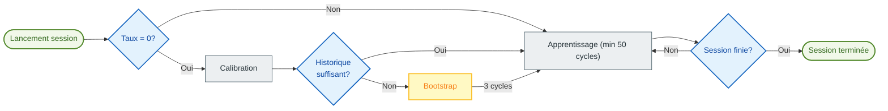

# 🧠 Auto TPI : Apprentissage Automatique

> [!NOTE]
> Cette fonctionnalité est principalement dédiée aux systèmes de chauffage de type **Switch** (On/Off), comme les radiateurs électriques, les chaudières, chauffage par le sol ou les poêles à granulés. L'adaptation pour les vannes thermostatiques (TRV) du fait de leur non linéarité est encore problématique.

L'**Auto TPI** permet à votre thermostat d'apprendre par lui-même les caractéristiques thermiques de votre pièce. Il ajuste automatiquement les coefficients $K_{int}$ (Inertie interne) et $K_{ext}$ (Isolation externe) pour atteindre et maintenir votre consigne avec une précision optimale.

> [!TIP]
> **Pour les utilisateurs avancés** : Une documentation technique détaillée expliquant les algorithmes, les formules mathématiques et les mécanismes internes est disponible ici : [Documentation Technique Auto TPI](feature-autotpi-technical.md).

---

## 🔄 Le Cycle d'une Session

L'Auto TPI fonctionne par **sessions d'apprentissage ponctuelles**. Durant une session, le système analyse dynamiquement la réaction de votre pièce : il commence par évaluer la puissance réelle de votre chauffage, puis ajuste Kint Kext au cours de 50 cycles TPI minimum par coefficient.

1.  **Initialisation** : Si le **Taux de chauffe** est à 0, le système tente d'abord une **Calibration** en analysant vos données historiques de température, slope et de puissance (via le service `calibrate_capacity`).
2.  **Mode Bootstrap** : Si l'historique n'est pas assez fiable pour estimer le taux de chauffe, le système entre en mode **Bootstrap**. Il effectue 3 cycles de chauffe intense pour déterminer la capacité de chauffe de votre radiateur.
3.  **Apprentissage actif** : Une fois le taux de chauffe connu, le système affine les coefficients TPI à chaque cycle. Cette phase dure au **minimum 50 cycles** par coefficient pour garantir leur stabilité.
4.  **Sauvegarde** : À la fin de la session (environ 48h), les coefficients appris **et** le taux de chauffe final sont automatiquement enregistrés dans votre configuration permanente.

### Quand Kint et Kext sont-ils ajustés ?

Le système apprend les deux coefficients dans des situations différentes :

| Coefficient | Situation d'apprentissage | Explication |
| :--- | :--- | :--- |
| **Kint** (Inertie interne) | Pendant la **montée en température**, quand l'écart avec la consigne est significatif (> 0.05°C) et que le chauffage n'est pas en saturation (100%). | Kint contrôle la réactivité du chauffage. Il s'ajuste quand le système doit "rattraper" la consigne. |
| **Kext** (Isolation externe) | Pendant la **stabilisation autour de la consigne**, quand l'écart est faible (< 1°C). | Kext compense les pertes thermiques vers l'extérieur. Il s'ajuste quand le système maintient la température. |

> [!TIP]
> C'est pourquoi il est important de créer des cycles de chauffe variés pendant l'apprentissage : la montée en température permet d'ajuster Kint, et la stabilisation permet d'ajuster Kext.

> [!NOTE]
> **Cycles en saturation** : Les cycles à **0%** ou **100%** de puissance sont **ignorés** pour le calcul des coefficients Kint et Kext (car ils ne fournissent pas d'information exploitable sur la réponse thermique). En revanche, les cycles à 100% sont utilisés pour ajuster le **taux de chauffe**.

---

## 🚀 Démarrage de l'apprentissage

Une fois la fonctionnalité **Auto TPI** activée et configurée pour votre thermostat, l'apprentissage ne démarre pas automatiquement. Vous devez le lancer manuellement :

1.  **Via la carte dédiée (Recommandé)** : Utilisez le bouton "Play" sur la [carte Auto TPI Learning](https://github.com/KipK/auto-tpi-learning-card).
2.  **Via le service "Définir le mode Auto TPI"** : Appelez ce service (`set_auto_tpi_mode`) depuis les outils de développement. C'est ce service qui active démarre ou arrête une session d'auto TPI.

---

## ⚙️ Configuration Standard

Lors de l'activation de l'Auto TPI, les paramètres suivants vous sont proposés :

| Paramètre | Description |
| :--- | :--- |
| **Type d'apprentissage** | **Découverte** (pour un premier apprentissage) ou **Ajustement fin** (pour peaufiner des réglages existants). |
| **Agressivité** | Facteur de réduction des coefficients (1.0 = 100%). Réduisez cette valeur (ex: 0.8) si vous observez des dépassements de consigne fréquents (overshoot). |
| **Temps de chauffe** | Temps nécessaire à votre équipement pour atteindre sa pleine puissance (ex: 5 min pour un radiateur électrique). |
| **Temps de refroidissement** | Temps nécessaire pour refroidir après l'arrêt (ex: 7 min pour un radiateur électrique). |
| **Taux de chauffe** | Capacité de montée en température (°C/heure). Laissez à **0** pour laisser le système le calculer automatiquement via la calibration ou le bootstrap. |

---

## 🛠️ Configuration Avancée

Si vous cochez "Activer les paramètres avancés", vous accédez aux réglages fins des algorithmes.

### Méthode "Découverte" (Moyenne pondérée)
Utilisée pour stabiliser rapidement un nouveau système.
-   **Poids Initial** (1 à 50) : Définit l'importance des coefficients actuels par rapport aux nouvelles découvertes.
    -   À **1** : Les nouveaux coefficients calculés remplacent quasi-intégralement les anciens. L'apprentissage est rapide mais sensible aux perturbations.
    -   À **50** : Les anciens coefficients ont beaucoup plus de poids. L'apprentissage est très lent mais très stable.
    -   **Conseil** : Laissez à 1 pour un premier apprentissage. Si vous souhaitez reprendre un apprentissage interrompu en conservant une partie des acquis, mettez une valeur intermédiaire (ex: 25).

### Méthode "Ajustement fin" (EWMA)
Utilisée pour une adaptation douce et  très précise.
-   **Alpha** : Facteur de lissage. Plus il est élevé, plus le système réagit vite aux changements récents.
-   **Taux de décroissance** : Permet de réduire progressivement la vitesse d'apprentissage pour se stabiliser sur les meilleures valeurs trouvées.

---

## 💡 Bonnes Pratiques

### Évitez les perturbations externes
Pendant une session d'apprentissage (surtout les premières heures), essayez d'éviter :
-   Le plein soleil direct sur le capteur de température.
-   L'utilisation d'une source de chaleur secondaire (cheminée, poêle).
-   Les courants d'air massifs (portes ouvertes).
Ces facteurs faussent la perception qu'a le système de l'isolation de votre pièce.

### Évitez les conditions extrêmes

> [!CAUTION]
> **Ne lancez pas d'apprentissage si vos chauffages sont en saturation** (100% de puissance en permanence). Cela se produit typiquement lors de vagues de froid exceptionnelles où le chauffage n'arrive plus à atteindre la consigne. Dans ces conditions, le système ne peut pas apprendre correctement car il n'a aucune marge de manœuvre pour ajuster la puissance. Attendez des conditions météo plus clémentes pour lancer une session d'apprentissage.

### Déroulement idéal d'une session "Découverte"

> [!TIP]
> **Exemple concret** : Si votre consigne habituelle est de **18°C**, baissez-la temporairement à **15°C** et attendez que la pièce se stabilise. Puis relancez l'apprentissage et remettez la consigne à **18°C**. Cela crée un écart de 3°C que le système va observer pour apprendre.

1.  **Préparation** : Baissez la consigne d'au moins 3°C par rapport à votre température habituelle. Laissez la pièce se refroidir et se stabiliser à cette nouvelle température.
2.  **Lancement** : Activez l'apprentissage et **remettez la consigne à sa valeur habituelle**. Le système va observer la montée en température.
3.  **Stabilisation** : Laissez le système stabiliser la température autour de la consigne pendant plusieurs heures.
4.  **Sollicitation** : Une fois que les coefficients ne bougent plus vraiment, provoquez un nouveau cycle de chauffe en baissant la consigne de 2°C puis en la remontant.
5.  **Stabilisation** : Laissez le système stabiliser la température autour de la consigne pendant plusieurs heures.
6.  **Finalisation** : Si l'apprentissage n'est pas encore terminé, laissez le système tourner jusqu'à son terme en reprenant vos habitudes de vie normales. L'Auto TPI s'arrêtera de lui-même une fois les coefficients stabilisés après au moins 50 cycles chacun.

> [!NOTE]
> **À propos de l'overshoot (dépassement de consigne)** : Un overshoot lors de la première montée en température est **normal** et même bénéfique ! Il fournit des données précieuses pour l'apprentissage. Le système va s'en servir pour affiner les coefficients. En revanche, si les overshoots **persistent ou s'aggravent** après plusieurs cycles, cela peut indiquer un problème de configuration Auto TPI (temps de chauffe/refroidissement incorrects, agressivité trop élevée) ou un problème de configuration du VTherm lui-même.

### Déroulement idéal d'une session "Ajustement fin"
1.  **Stabilité** : Conservez vos habitudes de chauffage habituelles en évitant simplement les perturbations exceptionnelles (fenêtres ouvertes longtemps, chauffage d'appoint).
2.  **Observation** : Laissez le système observer les micro-variations et ajuster les coefficients sur 50 cycles.
3.  **Ré-évaluation** : Si vous constatez que les coefficients dérivent fortement ou que le confort se dégrade, il est préférable de relancer une session complète en mode **Découverte**.

---

## 🔄 Apprentissage Continu du Kext

Alors que les sessions Auto TPI standard sont conçues pour un apprentissage ponctuel (découverte initiale ou ajustement fin), la fonctionnalité d'**Apprentissage Continu du Kext** permet au thermostat de s'adapter aux changements climatiques à long terme et aux variations d'isolation du bâtiment sans nécessiter de sessions manuelles.

### Comment ça marche
Une fois activé, le système surveille en permanence la précision du coefficient $K_{ext}$ (Isolation externe) pendant le fonctionnement normal. S'il détecte un écart systématique (ex: la température est toujours 0,2°C en dessous de la consigne lors de vagues de froid), il applique des micro-corrections via une **Moyenne Mobile Exponentielle (EWMA)**.

### Points clés
- **Adaptation Passive** : Fonctionne en arrière-plan tant que le thermostat est en service.
- **Sécurité** : Actif uniquement lorsque la puissance n'est pas saturée et que le système est stable.
- **Alpha Configurable** : Vous pouvez ajuster le facteur "Alpha" (0,04 par défaut) pour contrôler la vitesse d'adaptation. Une valeur plus élevée signifie une adaptation plus rapide mais une plus grande sensibilité au bruit.
- **Bootstrap Requis** : L'apprentissage continu ne démarre qu'après au moins un cycle d'apprentissage extérieur réussi lors d'une session standard.

---

## 📊 Suivi visualisé

Pour suivre l'évolution de l'apprentissage en temps réel, il est fortement recommandé d'installer la carte personnalisée **Auto TPI Learning Card**.

### Installation via HACS

Ou ajoutez manuellement le dépôt personnalisé : [https://github.com/KipK/auto-tpi-learning-card](https://github.com/KipK/auto-tpi-learning-card)

### Fonctionnalités de la carte

-   📈 Progression de la calibration et de l'apprentissage en temps réel
-   🔢 Coefficients `Kint`, `Kext` et taux de chauffe en cours de calcul
-   ▶️ Bouton de contrôle pour démarrer/arrêter la session
-   🔧 Options pour réinitialiser la session, activer le Boost Kint ou le Deboost Kext
