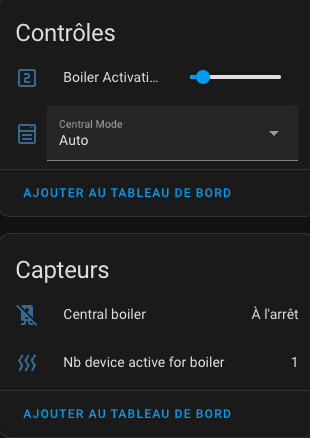

# Le contrôle d'une chaudière centrale

- [Le contrôle d'une chaudière centrale](#le-contrôle-dune-chaudière-centrale)
  - [Principe](#principe)
  - [Configuration](#configuration)
    - [Comment trouver la bonne action ?](#comment-trouver-la-bonne-action-)
  - [Les évènements](#les-évènements)
  - [Avertissement](#avertissement)

Vous avez la possibilité de contrôler une chaudière centralisée. A partir du moment où il est possible de déclencher ou stopper cette chaudière depuis Home Assistant, alors Versatile Thermostat va pouvoir la commander directement.

## Principe
Le principe mis en place est globalement le suivant :
1. une nouvelle entité de type `binary_sensor` et nommée par défaut `binary_sensor.central_boiler` est ajoutée,
2. dans la configuration des _VTherm_ vous indiquez si le VTherm doit contrôler la chaudière. En effet, dans une installation hétérogène, certains VTherm doivent commander la chaudière et d'autres non. Vous devez donc indiquer dans chaque configuration de VTherm si il contrôle la chaudière ou pas,
3. le `binary_sensor.central_boiler` écoute les changements d'états des équipements des VTherm marqués comme contrôlant la chaudière,
4. dès que le nombre d'équipements pilotés par le VTherm demandant du chauffage (ie son `hvac_action` passe à `Heating`) dépasse un seuil paramétrable, alors le `binary_sensor.central_boiler` passe à `on` et **si un service d'activation a été configuré, alors ce service est appelé**,
5. si le nombre d'équipements nécessitant du chauffage repasse en dessous du seuil, alors le `binary_sensor.central_boiler` passe à `off` et si **un service de désactivation a été configuré, alors ce service est appelé**,
6. vous avez accès à deux entités :
   - une de type `number` nommé par défaut `number.boiler_activation_threshold`, donne le seuil de déclenchement. Ce seuil est en nombre d'équipements (radiateurs) qui demande du chauffage.
   - une de type `sensor` nommé par défaut `sensor.nb_device_active_for_boiler`, donne le nombre d'équipements qui demande du chauffage. Par exemple, un VTherm ayant 4 vannes dont 3 demandes du chauffage fera passé ce capteur à 3. Seuls les équipements des _VTherm_ qui sont marqués pour contrôler la chaudière centrale sont comptabilisés.

Vous avez donc en permanence, les informations qui permettent de piloter et régler le déclenchement de la chaudière.

Toutes ces entités sont rattachées au service de configuration centrale :



## Configuration
Pour configurer cette fonction, vous devez avoir une configuration centralisée (cf. [Configuration](#configuration)) et cochez la case 'Ajouter une chaudière centrale' :


Sur la page suivante vous pouvez donner la configuration des actions (ex services) à appeler lors de l'allumage / extinction de la chaudière :


Les actions (ex services) se configurent comme indiqué dans la page :
1. le format général est `entity_id/service_id[/attribut:valeur]` (où `/attribut:valeur` est facultatif),
2. `entity_id` est le nom de l'entité qui commande la chaudière sous la forme `domain.entity_name`. Par exemple: `switch.chaudiere` pour les chaudière commandée par un switch ou `climate.chaudière` pour une chaudière commandée par un thermostat ou tout autre entité qui permet le contrôle de la chaudière (il n'y a pas de limitation).  On peut aussi commuter des entrées (`helpers`) comme des `input_boolean` ou `input_number`.
3. `service_id` est le nom du service à appeler sous la forme `domain.service_name`. Par exemple: `switch.turn_on`, `switch.turn_off`, `climate.set_temperature`, `climate.set_hvac_mode` sont des exemples valides.
4. pour certain service vous aurez besoin d'un paramètre. Cela peut être le 'Mode CVC' `climate.set_hvac_mode` ou la température cible pour `climate.set_temperature`. Ce paramètre doit être configuré sous la forme `attribut:valeur` en fin de chaine.

Exemples (à ajuster à votre cas) :
- `climate.chaudiere/climate.set_hvac_mode/hvac_mode:heat` : pour allumer le thermostat de la chaudière en mode chauffage,
- `climate.chaudiere/climate.set_hvac_mode/hvac_mode:off` : pour stopper le thermostat de la chaudière,
- `switch.pompe_chaudiere/switch.turn_on` : pour allumer le swicth qui alimente la pompe de la chaudière,
- `switch.pompe_chaudiere/switch.turn_off` : pour allumer le swicth qui alimente la pompe de la chaudière,
- ...

### Comment trouver la bonne action ?
Pour trouver l'action à utiliser, le mieux est d'aller dans "Outils de développement / Actions", chercher l'action à appeler, l'entité à commander et l'éventuel paramètre à donner.
Cliquez sur 'Appeler l'action'. Si votre chaudière s'allume vous avez la bonne configuration. Passez alors en mode Yaml et recopiez les paramètres.

Exemple:

Sous "Outils de développement / Actions" :


En mode yaml :


Le service à configurer est alors le suivant: `climate.empty_thermostast/climate.set_hvac_mode/hvac_mode:heat` (notez la suppression du blanc dans `hvac_mode:heat`)

Faite alors de même pour le service d'extinction et vous êtes parés.

## Les évènements

A chaque allumage ou extinction réussie de la chaudière un évènement est envoyé par Versatile Thermostat. Il peut avantageusement être capté par une automatisation, par exemple pour notifier un changement.
Les évènements ressemblent à ça :

Un évènement d'allumage :
```yaml
event_type: versatile_thermostat_central_boiler_event
data:
  central_boiler: true
  entity_id: binary_sensor.central_boiler
  name: Central boiler
  state_attributes: null
origin: LOCAL
time_fired: "2024-01-14T11:33:52.342026+00:00"
context:
  id: 01HM3VZRJP3WYYWPNSDAFARW1T
  parent_id: null
  user_id: null
```

Un évènement d'extinction :
```yaml
event_type: versatile_thermostat_central_boiler_event
data:
  central_boiler: false
  entity_id: binary_sensor.central_boiler
  name: Central boiler
  state_attributes: null
origin: LOCAL
time_fired: "2024-01-14T11:43:52.342026+00:00"
context:
  id: 01HM3VZRJP3WYYWPNSDAFBRW1T
  parent_id: null
  user_id: null
```

## Avertissement

>  _*Notes*_
>
> Le contrôle par du logiciel ou du matériel de type domotique d'une chaudière centrale peut induire des risques pour son bon fonctionnement. Assurez-vous avant d'utiliser ces fonctions, que votre chaudière possède bien des fonctions de sécurité et que celles-ci fonctionnent. Allumer une chaudière si tous les robinets sont fermés peut générer de la sur-pression par exemple.
