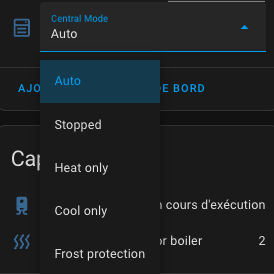
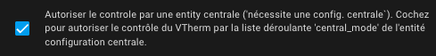

# Le contrôle centralisé

- [Le contrôle centralisé](#le-contrôle-centralisé)
  - [Configuration du contrôle centralisée](#configuration-du-contrôle-centralisée)
  - [Usage](#usage)

Cette fonction vous permet de contrôler tous vos _VTherm_ depuis un unique point de contrôle.
Le cas d'usage typique est lorsque vous partez pour une longue durée, vous voulez mettre tous vos _VTherm_ en Hors-gel et lorsque vous rentrez, vous voulez les remettre dans l'état initial.

Le contrôle centralisé se fait depuis un _Vtherm_ spécial nommé configuration centralisée. Cf. [ici](creation.md#configuration-centralisée) pour plus d'informations.

## Configuration du contrôle centralisée

Si vous avez défini une configuration centralisée, vous avez une nouvelle entité nommée `select.central_mode` qui permet de piloter tous les VTherms avec une seule action.

Cette entité se présente sous la forme d'une liste de choix qui contient les choix suivants :
1. `Auto` : le mode 'normal' dans lequel chaque VTherm se comporte de façon autonome,
2. `Stopped` : tous les VTherms sont mis à l'arrêt (`hvac_off`),
3. `Heat only` : tous les VTherms sont mis en mode chauffage lorsque ce mode est supporté par le VTherm, sinon il est stoppé,
4. `Cool only` : tous les VTherms sont mis en mode climatisation lorsque ce mode est supporté par le VTherm, sinon il est stoppé,
5. `Frost protection` : tous les VTherms sont mis en preset hors-gel lorsque ce preset est supporté par le VTherm, sinon il est stoppé.

## Usage

Pour qu'un VTherm soit contrôlable de façon centralisée, il faut que son attribut de configuration nommé `use_central_mode` soit vrai. Cet attribut est disponible dans la page de configuration `Principaux ttributs`

Il est donc possible de contrôler tous les VTherms (que ceux que l'on désigne explicitement) avec un seul contrôle.
