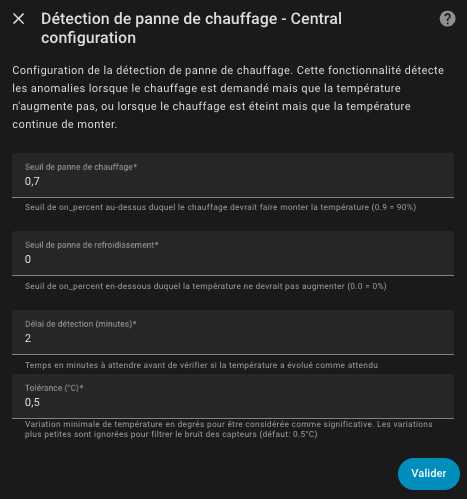

# La détection d'anomalie de chauffe

- [La détection d'anomalie de chauffe](#la-détection-danomalie-de-chauffe)
  - [Pourquoi cette fonctionnalité ?](#pourquoi-cette-fonctionnalité-)
  - [Principe de fonctionnement](#principe-de-fonctionnement)
    - [Détection d'un défaut de chauffage](#détection-dun-défaut-de-chauffage)
    - [Détection d'un défaut de refroidissement](#détection-dun-défaut-de-refroidissement)
  - [Configuration](#configuration)
  - [Paramètres](#paramètres)
  - [Attributs exposés](#attributs-exposés)
  - [Capteur binaire](#capteur-binaire)
  - [Évènements](#évènements)
  - [Exemples d'automatisation](#exemples-dautomatisation)
    - [Notification persistante en cas de défaut de chauffage](#notification-persistante-en-cas-de-défaut-de-chauffage)
    - [Notification persistante pour tous les types de défauts](#notification-persistante-pour-tous-les-types-de-défauts)
    - [Suppression automatique de la notification quand le défaut est résolu](#suppression-automatique-de-la-notification-quand-le-défaut-est-résolu)

## Pourquoi cette fonctionnalité ?

La détection d'anomalie de chauffe permet de surveiller le bon fonctionnement de votre système de chauffage. Elle détecte deux types de situations anormales :

1. **Défaut de chauffage** : le thermostat demande beaucoup de puissance (`on_percent` élevé) mais la température n'augmente pas. Cela peut indiquer :
   - un radiateur défaillant ou éteint,
   - une vanne thermostatique bloquée,
   - une fenêtre ouverte non détectée,
   - un problème de circulation d'eau chaude (chauffage central).

2. **Défaut de refroidissement** : le thermostat ne demande pas de puissance (`on_percent` à 0) mais la température continue d'augmenter. Cela peut indiquer :
   - un radiateur qui reste allumé malgré la commande d'arrêt,
   - un relais bloqué en position "on",
   - un équipement sous-jacent qui ne répond plus.

>  _*Important*_
>
> Cette fonctionnalité **ne modifie pas le comportement du thermostat**. Elle se contente d'envoyer des évènements pour vous alerter d'une situation anormale. C'est à vous de créer les automatisations nécessaires pour réagir à ces évènements (notifications, alertes, etc.).

## Principe de fonctionnement

Cette fonctionnalité s'applique uniquement aux _VTherm_ utilisant l'algorithme TPI (over_switch, over_valve, ou over_climate avec régulation par vanne). Donc les _VTherm_ `over_climate` qui commande une PAC par exemple, ne sont pas concernés. En effet, dans ce cas, la décision de chauffe ou non est faite par l'équipement sous-jacent lui-même ce qui empêche d'avoir accès à des informations fiables.

Cette fonction ne s'applique qu'au mode Chauffage (`hvac_mode=heat`). En mode climatisation (`hvac_mode=cool`) aucune détection n'est effectuée pour éviter les faux positifs.

### Détection d'un défaut de chauffage

1. Le _VTherm_ est en mode chauffage,
2. Le `on_percent` est supérieur ou égal au seuil configuré (par défaut 90%),
3. Cette situation dure depuis plus longtemps que le délai de détection (par défaut 15 minutes),
4. La température n'a pas augmenté pendant cette période.

➡️ Un évènement `versatile_thermostat_heating_failure_event` est émis avec `failure_type: heating` et `type: heating_failure_start`.

Lorsque la situation revient à la normale (température qui augmente ou `on_percent` qui redescend), un évènement avec `type: heating_failure_end` est émis.

### Détection d'un défaut de refroidissement

1. Le _VTherm_ est en mode chauffage,
2. Le `on_percent` est inférieur ou égal au seuil configuré (par défaut 0%),
3. Cette situation dure depuis plus longtemps que le délai de détection (par défaut 15 minutes),
4. La température continue d'augmenter.

➡️ Un évènement `versatile_thermostat_heating_failure_event` est émis avec `failure_type: cooling` et `type: cooling_failure_start`.

Lorsque la situation revient à la normale, un évènement avec `type: cooling_failure_end` est émis.

## Configuration

Comme beaucoup de fonctions de _VTherm_, cette fonctionnalité peut se configurer **dans la configuration centrale** pour mettre en commun les paramètres. Pour l'appliquer aux _VTherm_ choisis, l'utilisateur doit ajouter la fonction (cf. menu "Fonctions") et choisir d'utiliser les paramètres communs de la configuration centrale ou en spécifier des nouveaux qui ne seront appliqués qu'à ce _VTherm_.

Pour y accéder :
1. Allez dans la configuration de votre _VTherm_ de type "Configuration Centrale"
2. Dans le menu, sélectionnez "Heating failure detection" (Détection d'anomalie de chauffe)
3. Allez ensuite dans la configuration des _VTherm_ concernés,
4. Sélectionnez le menu "Fonctions",
5. Cochez la fonction "Détection d'anomalies de chauffage",
6. Choisissez d'utiliser les paramètres de la configuration centrale ou spécifiez en des nouveaux.



## Paramètres

| Paramètre                                      | Description                                                                                                                       | Valeur par défaut |
| ---------------------------------------------- | --------------------------------------------------------------------------------------------------------------------------------- | ----------------- |
| **Activer la détection d'anomalie de chauffe** | Active ou désactive la fonctionnalité                                                                                             | Désactivé         |
| **Seuil de défaut de chauffage**               | Pourcentage de `on_percent` au-dessus duquel le chauffage devrait faire augmenter la température. Valeur entre 0 et 1 (0.9 = 90%) | 0.9 (90%)         |
| **Seuil de défaut de refroidissement**         | Pourcentage de `on_percent` en-dessous duquel la température ne devrait pas augmenter. Valeur entre 0 et 1 (0 = 0%)               | 0.0 (0%)          |
| **Délai de détection (minutes)**               | Temps d'attente avant de déclarer un défaut. Permet d'éviter les faux positifs dus aux fluctuations normales                      | 15 minutes        |
| **Tolérance de variation de température (°C)** | Variation minimale de température en degrés pour être considérée comme significative. Permet de filtrer le bruit des capteurs     | 0.5°C             |

>  _*Conseils de réglage*_
>
> - **Seuil de chauffage** : Si vous avez des faux positifs (détection de défaut alors que tout fonctionne), augmentez ce seuil vers 0.95 ou 1.0.
> - **Seuil de refroidissement** : Si vous voulez détecter un radiateur qui reste allumé même avec un faible `on_percent`, augmentez ce seuil vers 0.05 ou 0.1.
> - **Délai de détection** : Augmentez ce délai si vous avez des pièces avec une forte inertie thermique (grandes pièces, chauffage au sol, etc.). Vous pouvez regarder les courbes de chauffe (cf. [additions](additions.md#courbes-de-régulattion-avec-plotly)) et regarder en combien de temps votre thermomètre augmente après une déclenchement de chauffage. Cette durée doit être le minimum pour ce paramètre.
> - **Tolérance** : Si vous avez des capteurs imprécis ou bruyants, augmentez cette valeur (ex: 0.8°C). Beaucoup de capteurs ont une précision de ±0.5°C.

## Attributs exposés

Les _VTherm_ avec TPI exposent les attributs suivants :

```yaml
is_heating_failure_detection_configured: true
heating_failure_detection_manager:
  heating_failure_state: "off"      # "on", "off", "unknown", "unavailable"
  cooling_failure_state: "off"      # "on", "off", "unknown", "unavailable"
  heating_failure_threshold: 0.9
  cooling_failure_threshold: 0.0
  detection_delay_min: 15
  temperature_change_tolerance: 0.5
  heating_tracking:                 # Suivi de la détection de défaut de chauffage
    is_tracking: true               # Détection en cours ?
    initial_temperature: 19.5       # Température au début du tracking
    current_temperature: 19.7       # Température actuelle
    remaining_time_min: 8.5         # Minutes restantes avant alerte
    elapsed_time_min: 6.5           # Minutes écoulées depuis le début
  cooling_tracking:                 # Suivi de la détection de défaut de refroidissement
    is_tracking: false
    initial_temperature: null
    current_temperature: null
    remaining_time_min: null
    elapsed_time_min: null
```

## Capteur binaire

Lorsque la détection d'anomalie de chauffe est activée, un capteur binaire est créé automatiquement pour chaque _VTherm_ concerné :

| Entité                                      | Description                                                             |
| ------------------------------------------- | ----------------------------------------------------------------------- |
| `binary_sensor.<nom>_heating_failure_state` | Indique si une anomalie de chauffage ou de refroidissement est détectée |

Le nom affiché du capteur est traduit selon la langue de votre Home Assistant "État d'anomalie de chauffe".

Ce capteur est :
- **ON** lorsqu'une anomalie (chauffage ou refroidissement) est détectée
- **OFF** lorsque le système fonctionne normalement

Caractéristiques :
- **Device class** : `problem` (permet les alertes natives de Home Assistant)
- **Icônes** :
  - `mdi:radiator-off` quand une anomalie est détectée
  - `mdi:radiator` quand tout fonctionne

Ce capteur binaire peut être utilisé directement dans vos automatisations comme déclencheur, ou pour créer des alertes via les notifications natives de Home Assistant.

## Évènements

L'évènement `versatile_thermostat_heating_failure_event` est émis lors de la détection ou de la fin d'un défaut.

Données de l'évènement :
| Champ                    | Description                                                                                                       |
| ------------------------ | ----------------------------------------------------------------------------------------------------------------- |
| `entity_id`              | L'identifiant du _VTherm_                                                                                         |
| `name`                   | Le nom du _VTherm_                                                                                                |
| `type`                   | Type d'évènement : `heating_failure_start`, `heating_failure_end`, `cooling_failure_start`, `cooling_failure_end` |
| `failure_type`           | Type de défaut : `heating` ou `cooling`                                                                           |
| `on_percent`             | Le pourcentage de puissance demandé au moment de la détection                                                     |
| `temperature_difference` | La différence de température observée pendant la période de détection                                             |
| `current_temp`           | La température actuelle                                                                                           |
| `target_temp`            | La température cible                                                                                              |
| `threshold`              | Le seuil configuré qui a déclenché la détection                                                                   |
| `detection_delay_min`    | Le délai de détection configuré                                                                                   |
| `state_attributes`       | Tous les attributs de l'entité au moment de l'évènement                                                           |

## Exemples d'automatisation

### Notification persistante en cas de défaut de chauffage

Cette automatisation crée une notification persistante lorsqu'un défaut de chauffage est détecté :

```yaml
alias: "Alerte défaut de chauffage"
description: "Crée une notification persistante en cas de défaut de chauffage"
trigger:
    - platform: event
      event_type: versatile_thermostat_heating_failure_event
condition:
    - condition: template
      value_template: "{{ trigger.event.data.type == 'heating_failure_start' }}"
action:
    - service: persistent_notification.create
      data:
        title: "🔥 Défaut de chauffage détecté"
        message: >
        Le thermostat **{{ trigger.event.data.name }}** a détecté un défaut de chauffage.

        📊 **Détails :**
        - Puissance demandée : {{ (trigger.event.data.on_percent * 100) | round(0) }}%
        - Température actuelle : {{ trigger.event.data.current_temp }}°C
        - Température cible : {{ trigger.event.data.target_temp }}°C
        - Variation de température : {{ trigger.event.data.temperature_difference | round(2) }}°C

        ⚠️ Le chauffage fonctionne à pleine puissance mais la température n'augmente pas.
        Vérifiez que le radiateur fonctionne correctement.
        notification_id: "heating_failure_{{ trigger.event.data.entity_id }}"
```

### Notification persistante pour tous les types de défauts

Cette automatisation gère les deux types de défauts (chauffage et refroidissement) :

```yaml
alias: "Alerte anomalie de chauffe"
description: "Notification pour tous les types de défauts de chauffage"
trigger:
    - platform: event
      event_type: versatile_thermostat_heating_failure_event
condition:
    - condition: template
      value_template: "{{ trigger.event.data.type in ['heating_failure_start', 'cooling_failure_start'] }}"
action:
    - service: persistent_notification.create
      data:
        title: >
        
            🔥 Défaut de chauffage détecté
        
            ❄️ Défaut de refroidissement détecté
        
      message: >
        Le thermostat **{{ trigger.event.data.name }}** a détecté une anomalie.

        📊 **Détails :**
        - Type de défaut : {{ trigger.event.data.failure_type }}
        - Puissance demandée : {{ (trigger.event.data.on_percent * 100) | round(0) }}%
        - Température actuelle : {{ trigger.event.data.current_temp }}°C
        - Température cible : {{ trigger.event.data.target_temp }}°C
        - Variation de température : {{ trigger.event.data.temperature_difference | round(2) }}°C

        
        ⚠️ Le chauffage fonctionne à {{ (trigger.event.data.on_percent * 100) | round(0) }}% mais la température n'augmente pas.
        Vérifiez que le radiateur fonctionne correctement.
        
        ⚠️ Le chauffage est éteint mais la température continue d'augmenter.
        Vérifiez que le radiateur s'éteint correctement.
        
      notification_id: "heating_failure_{{ trigger.event.data.entity_id }}"
```

### Suppression automatique de la notification quand le défaut est résolu

Cette automatisation supprime la notification persistante lorsque le défaut est résolu :

```yaml
alias: "Fin d'alerte anomalie de chauffe"
description: "Supprime la notification quand le défaut est résolu"
trigger:
    - platform: event
      event_type: versatile_thermostat_heating_failure_event
condition:
    - condition: template
      value_template: "{{ trigger.event.data.type in ['heating_failure_end', 'cooling_failure_end'] }}"
action:
    - service: persistent_notification.dismiss
      data:
        notification_id: "heating_failure_{{ trigger.event.data.entity_id }}"
    - service: persistent_notification.create
      data:
        title: "✅ Anomalie résolue"
        message: >
        Le thermostat **{{ trigger.event.data.name }}** fonctionne à nouveau normalement.
        notification_id: "heating_failure_resolved_{{ trigger.event.data.entity_id }}"
    # Supprime automatiquement la notification de résolution après 1 heure
    - delay:
        hours: 1
    - service: persistent_notification.dismiss
      data:
        notification_id: "heating_failure_resolved_{{ trigger.event.data.entity_id }}"
```

>  _*Notes*_
>
> 1. Les notifications persistantes restent affichées jusqu'à ce que l'utilisateur les ferme ou qu'elles soient supprimées par une automatisation.
> 2. L'utilisation de `notification_id` permet de mettre à jour ou supprimer une notification spécifique.
> 3. Vous pouvez adapter ces automatisations pour envoyer des notifications sur mobile, Telegram, ou tout autre service de notification.
> 4. Cette fonctionnalité ne fonctionne qu'avec les _VTherm_ utilisant l'algorithme TPI (over_switch, over_valve, ou over_climate avec régulation par vanne).
