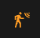
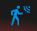

# La détection de mouvement ou d'activité

- [La détection de mouvement ou d'activité](#la-détection-de-mouvement-ou-dactivité)
  - [Configurer le mode d'activité ou la détection de mouvement](#configurer-le-mode-dactivité-ou-la-détection-de-mouvement)
  - [Usage](#usage)

Cette fonction vous permet de changer de preset lorsqu'un mouvement est détectée dans une pièce. Si vous ne souhaitez chauffer votre bureau, lorsque la pièce est occupée et uniquement si la pièce est occupée, il vous faut un capteur de mouvement (ou de présence) dans la pièce et configurer cette fonction.

Cette fonction est souvent confondue avec la fonction de présence. Elles sont complémentaires mais ne se remplace pas. La fonction 'mouvement' est locale à une pièce équipe d'un capteur de mouvement alors que la fonction 'présence' est prévue pour être globale à tout le logement.

## Configurer le mode d'activité ou la détection de mouvement

Si vous avez choisi la fonctionnalité `Avec détection de mouvement`, :

Ce dont nous avons besoin:
- un **capteur de mouvement**. ID d'entité d'un capteur de mouvement. Les états du capteur de mouvement doivent être « on » (mouvement détecté) ou « off » (aucun mouvement détecté)
- une durée de **délai d'activation** (en secondes) définissant combien de temps nous attendons la confirmation du mouvement avant de considérer le mouvement. Ce paramètre peut être **supérieur à la temporisation de votre détecteur de mouvement**, sinon la détection se fera à chaque mouvement signalé par le détecteur,
- une durée de fin **délai de désactivation** (en secondes) définissant combien de temps nous attendons la confirmation d'une fin de mouvement avant de ne plus considérer le mouvement.
- un **préréglage de "mouvement"**. Nous utiliserons la température de ce préréglage lorsqu'une activité sera détectée.
- un **préréglage "pas de mouvement"**. Nous utiliserons la température de ce deuxième préréglage lorsqu'aucune activité n'est détectée.

## Usage

Pour indiquer à un _VTherm_ qu'il doit écouter le capteur de mouvement, vous devez le mettre dans le preset spécial 'Activité'. Si vous avez installé la carte Versatile Thermostat UI (cf. [ici](additions.md#bien-mieux-avec-le-versatile-thermostat-ui-card)), ce preset est représenté comme suit : .

Vous pouvez ainsi, sur demande, mettre un _VTherm_ en mode détection de mouvement.

Le comportement va être le suivant :
- nous avons une pièce avec un thermostat réglé en mode activité, le mode "mouvement" choisi est confort (21,5°C), le mode "pas de mouvement" choisi est Eco (18.5°C) et la temporisation du mouvement est de 30 sec lors de la détection et de 5 minutes sur fin de détection.
- la pièce est vide depuis un moment (aucune activité détectée), la température de consigne de cette pièce est de 18,5°
- quelqu'un entre dans la pièce, une activité est détectée si le mouvement est présent pendant au moins 30 sec. La température passe alors à 21,5°
- si le mouvement est présent pendant moins de 30 sec (passage rapide), la température reste sur 18,5°,
- imaginons que la température soit passée sur 21,5°, lorsque la personne quitte la pièce, au bout de 5 min la température est ramenée à 18,5°.
- si la personne revient avant les 5 minutes, la température reste sur 21,5°

>  _*Notes*_
>    1. Sachez que comme pour les autres preset, `Activité` ne sera proposé que s'il est correctement configuré. En d'autres termes, les 4 clés de configuration doivent être définies
>    2. Si vous utilisez la carte Verstatile Thermostat UI (cf. [ici](additions.md#bien-mieux-avec-le-versatile-thermostat-ui-card)), une détection de mouvement est représenté comme suit : .
