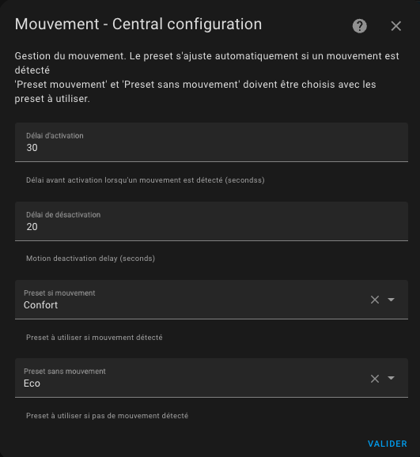

# La détection de mouvement ou d'activité

## Configurer le mode d'activité ou la détection de mouvement

Si vous avez choisi la fonctionnalité ```Avec détection de mouvement```, cliquez sur 'Valider' sur la page précédente et vous y arriverez :



Nous allons maintenant voir comment configurer le nouveau mode Activité.
Ce dont nous avons besoin:
- un **capteur de mouvement**. ID d'entité d'un capteur de mouvement. Les états du capteur de mouvement doivent être « on » (mouvement détecté) ou « off » (aucun mouvement détecté)
- une durée de **délai de mouvement** (en secondes) définissant combien de temps nous attendons la confirmation du mouvement avant de considérer le mouvement. Ce paramètre peut être supérieur à la temporision de votre détecteur de mouvement, sinon la détection se fera à chaque mouvement signalé par le détecteur,
- une durée de fin **délai de mouvement** (en secondes) définissant combien de temps nous attendons la confirmation d'une fin de mouvement avant de ne plus considérer le mouvement.
- un **préréglage de "mouvement" **. Nous utiliserons la température de ce préréglage lorsqu'une activité sera détectée.
- un **préréglage "pas de mouvement"**. Nous utiliserons la température de ce deuxième préréglage lorsqu'aucune activité n'est détectée.

Alors imaginons que nous voulions avoir le comportement suivant :
- nous avons une pièce avec un thermostat réglé en mode activité, le mode "mouvement" choisi est confort (21,5°C), le mode "pas de mouvement" choisi est Eco (18.5°C) et la temporisation du mouvement est de 30 sec lors de la détection et de 5 minutes sur fin de détection.
- la pièce est vide depuis un moment (aucune activité détectée), la température de cette pièce est de 18,5°
- quelqu'un entre dans la pièce, une activité est détectée si le mouvement est présent pendant au moins 30 sec. La température passe alors à 21,5°
- si le mouvement est présent pendant moins de 30 sec (passage rapide), la température reste sur 18,5°,
- imaginons que la température soit passée sur 21,5°, lorsque la personne quitte la pièce, au bout de 5 min la température est ramenée à 18,5°.
- si la personne revient avant les 5 minutes, la température reste sur 21,5°

Pour que cela fonctionne, le thermostat doit être en mode préréglé « Activité ».

>  _*Notes*_
    1. Sachez que comme pour les autres modes prédéfinis, ``Activity`` ne sera proposé que s'il est correctement configuré. En d'autres termes, les 4 clés de configuration doivent être définies si vous souhaitez voir l'activité dans l'interface de l'assistant domestique
