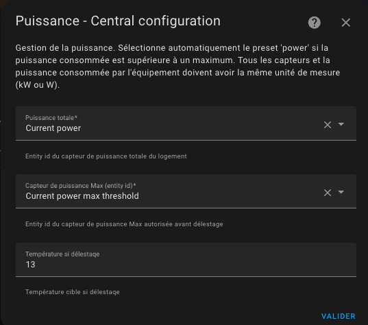

# Gestion de la puissance - délestage

- [Gestion de la puissance - délestage](#gestion-de-la-puissance---délestage)
  - [Configurer la gestion de la puissance](#configurer-la-gestion-de-la-puissance)

Cette fonction vous permet de réguler la consommation électrique de vos radiateurs. Connue sous le nom de délestage, cette fonction vous permet de limiter la consommation électrique de votre appareil de chauffage si des conditions de surpuissance sont détectées.
Vous aurez besoin d'un **capteur de la puissance totale instantanée consommée** de votre logement ainsi que d'un **capteur donnant la puissance maximale autorisée**.

Le comportement de cette fonction est basique :
1. lorsque le _VTherm_ va allumer un équipement,
2. il compare la dernière valeur connue du capteur de puissance consommée avec la dernière valeur de la puissance maximale autorisée. Si il reste une marge supérieure égale à la puissance déclarée des équipements du _VTherm_ alors le VTherm et ses équipements seront allumés. Sinon ils resteront éteints jusqu'au prochain cycle.

ATTENTION: ce fonctionnement très basique **n'est pas une fonction de sécurité** mais plus une fonction permettant une optimisation de la consommation au prix d'une dégradation du chauffage. Des dépassements sont possibles selon la fréquence de remontée de vos capteurs de consommation, la puissance réellement utilisée par votre équipements. Vous devez donc toujours garder une marge de sécurité.

Cas d'usage type:
1. vous avez un compteur électrique limité à 11 kW,
2. vous chargez de temps en temps un véhicle électrique à 5 kW,
3. il reste donc 6 kW pour tout le reste y compris le chauffage,
4. vous avez 1 kW d'autres équipements en cours,
5. vous avez déclaré un capteur (`input_number`) de puissance max autorisée à 9 kW (= 11 kW  - la réserve pour les autres équipements - marge)

Si la vehicle est en charge, la puissance totale consommé est de 6 kW (5+1) et un _VTherm_ ne s'allumera que si sa puissance déclarée est de 3 kW max (9 kW - 6 kW).
Si la vehicle est en charge et qu'un autre _VTherm_ de 2 kW est allumé, la puissance totale consommé est de 8 kW (5+1+2) et un _VTherm_ ne s'allumera que si sa puissance déclarée est de 1 kW max (9 kW - 8 kW). Sinon il passe son tour (cycle).

Si le vehicle n'est pas en charge, la puissance totale consommé est de 1 kW, un _VTherm_ ne s'allumera que si sa puissance déclarée est de 8 kW max (9 kW - 1 kW).

## Configurer la gestion de la puissance

Si vous avez choisi la fonctionnalité `Avec détection de la puissance`, vous la configurez de la façon suivante :

1. l'id d'entité du **capteur de puissance instantané consommé** de votre logement,
2. l'id d'entité du **capteur de puissance maximale autorisée**,
3. la température à appliquer si le délestage est appliqué.

Notez que toutes les valeurs de puissance doivent avoir les mêmes unités (kW ou W par exemple).
Le fait d'avoir un **capteur de puissance maximale autorisée**, vous permet de modifier la puissance maximale au fil du temps à l'aide d'un planificateur ou d'une automatisation.

>  _*Notes*_
> 1. En cas de délestage, le radiateur est réglé sur le préréglage nommé `power`. Il s'agit d'un préréglage caché, vous ne pouvez pas le sélectionner manuellement.
> 2. Gardez toujours une marge, car la puissance max peut être brièvement dépassée en attendant le calcul du prochain cycle typiquement ou par des équipements non régulés.
> 3. Si vous ne souhaitez pas utiliser cette fonctionnalité, décochez la dans le menu 'Fonctions'.
> 4. Si une _VTherm_ controlez plusieurs équipements, la **consommation électrique de votre chauffage** renseigné doit correspondre à la somme des puissances.
> 5. Si vous utilisez la carte Verstatile Thermostat UI (cf. [ici](additions.md#bien-mieux-avec-le-versatile-thermostat-ui-card)), le délestage est représenté comme suit : .