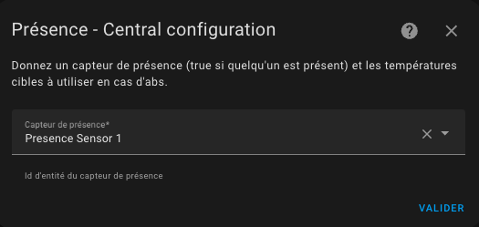

# Gestion de la présence / absence

- [Gestion de la présence / absence](#gestion-de-la-présence--absence)
  - [Configurer la présence (ou l'absence)](#configurer-la-présence-ou-labsence)

## Configurer la présence (ou l'absence)

Si cette fonction est sélectionnée, elle vous permet de modifier dynamiquement la température des préréglages du thermostat lorsqu'une présence (ou absence) est détectée. Pour cela, vous devez configurer la température qui sera utilisée pour chaque préréglage lorsque la présence est désactivée. Lorsque le capteur de présence s'éteint, ces températures seront utilisées. Lorsqu'il se rallume, la température "normale" configurée pour le préréglage est utilisée. Voir [gestion des préréglages](feature-presets.md).

Pour configurer la présence remplissez ce formulaire :

Pour cela, vous devez simplement configurer un **capteur d'occupation** dont l'état doit être 'on' ou 'home' si quelqu'un est présent ou 'off' ou 'not_home' sinon,

Les températures sont configurées dans les entités de l'équipement correspondant à votre _VTherm_ (Paramètres/Intégration/Versatile Thermostat/le vtherm)

ATTENTION : les groupes de personnes ne fonctionnent pas en tant que capteur de présence. Ils ne sont pas reconnus comme un capteur de présence. Vous devez utiliser, un template comme décrit ici [Utilisation d'un groupe de personnes comme capteur de présence](troubleshooting.md#utilisation-dun-groupe-de-personnes-comme-capteur-de-présence).

>  _*Notes*_
> 1. le changement de température est immédiat et se répercute sur le volet avant. Le calcul prendra en compte la nouvelle température cible au prochain calcul du cycle,
> 2. vous pouvez utiliser le capteur direct person.xxxx ou un groupe de capteurs de Home Assistant. Le capteur de présence gère les états ``on`` ou ``home`` comme présents et les états ``off`` ou ``not_home`` comme absents.
> 3. pour pré-chauffer votre logement alors que tout le monde est absent, vous pouvez ajouter une entité de type `input_boolean` dans votre groupe de personne. Si vous passez cet `input_boolean` sur 'On' alors le capteur de présence sera forcé sur 'On' et les presets avec présence seront utilisés. Vous pouvez aussi positionner cet `input_boolean` sur 'On' via une automatisation par exemple lorsque vous quittez une zone pour lancer le préchauffage de votre logement.

