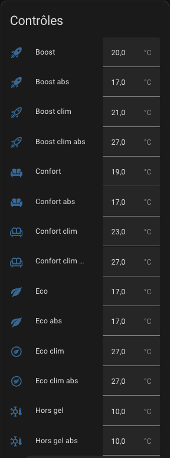

# Les pre-réglages (preset)

- [Les pre-réglages (preset)](#les-pre-réglages-preset)
  - [Configurer les températures préréglées](#configurer-les-températures-préréglées)

## Configurer les températures préréglées

Le mode préréglé (preset) vous permet de préconfigurer la température ciblée. Utilisé en conjonction avec Scheduler (voir [scheduler](additions##encore-mieux-avec-le-composant-scheduler-)) vous aurez un moyen puissant et simple d'optimiser la température par rapport à la consommation électrique de votre maison. Les préréglages gérés sont les suivants :
 - **Eco** : l'appareil est en mode d'économie d'énergie
 - **Confort** : l'appareil est en mode confort
 - **Boost** : l'appareil tourne toutes les vannes à fond

 Si le mode AC est utilisé, vous pourrez aussi configurer les températures lorsque l'équipement en mode climatisation.

**Aucun** est toujours ajouté dans la liste des modes, car c'est un moyen de ne pas utiliser les preset mais une **température manuelle** à la place.

Les pré-réglages se font directement depuis les entités du _VTherm_ ou de la configuration centrale si vous utilisez la configuration centrale. A la création du _VTherm_, vous aurez différentes entités qui vont vous permettre de fixer les températures de chaque preset :

.

La liste des entités varient en fonction de vos choix de fonction :
1. si la fonction 'détection de présence' est activée vous aurez les presets en version absence préfixé par _abs_,
2. si vous avez choisi l'option _AC_, vous aurez en plus les presets en version 'climatisation' préfixé par _clim_

>  _*Notes*_
>  1. Lorsque vous modifiez manuellement la température cible, le préréglage passe sur Aucun (pas de préréglage),
>  2. Le préréglage standard ``Away`` est un préréglage caché qui n'est pas directement sélectionnable. Versatile Thermostat utilise la gestion de présence ou la gestion de mouvement pour régler automatiquement et dynamiquement la température cible en fonction d'une présence dans le logement ou d'une activité dans la pièce. Voir [gestion de la présence](feature-presence.md).
>  3. Si vous utilisez la gestion du délestage, vous verrez un préréglage caché nommé ``power``. Le préréglage de l'élément chauffant est réglé sur « puissance » lorsque des conditions de surpuissance sont rencontrées et que le délestage est actif pour cet élément chauffant. Voir [gestion de l'alimentation](feature-power.md).
>  4. si vous utilisez la configuration avancée, vous verrez le préréglage défini sur ``sécurité`` si la température n'a pas pu être récupérée après un certain délai. Voir [Mise en sécurité](feature-advanced.md#la-mise-en-sécurité)
