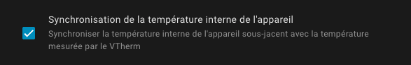
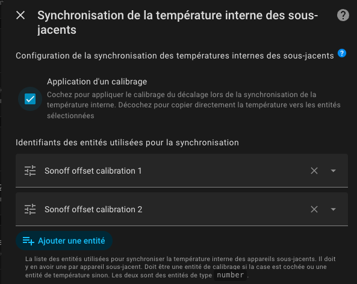

# La synchronisation de la température interne des équipements

- [La synchronisation de la température interne des équipements](#la-synchronisation-de-la-température-interne-des-équipements)
  - [Principe](#principe)
  - [Pré-requis](#pré-requis)
  - [Configuration](#configuration)
  - [Mode de synchronisation](#mode-de-synchronisation)
    - [Mode 1 : utilisation d'une entité de calibrage](#mode-1--utilisation-dune-entité-de-calibrage)
      - [Mode 2 : copie directe de la température externe](#mode-2--copie-directe-de-la-température-externe)

## Principe

Cette fonction permet de synchroniser de deux façons différentes la température interne des équipements sous-jacents dans un VTherm de type `over_climate`. Basiquement, elle permet d'utiliser un thermomètre déporté si votre équipement le supporte. Elle est particulièrement utile pour les vannes thermostatiques (TRV) qui possèdent leur propre capteur de température intégré. Elle va permettre d'améliorer grandement la régulation interne des équipements sous-jacents de type `over_climate` qui le supporte.

Les deux modes de synchronisation disponibles sont :
1. Mode 1 - **Utiliser l'offset de calibrage** : VTherm utilise l'entité d'offset de calibrage interne de l'équipement pour compenser l'écart avec la température de la pièce,
2. Mode 2 - **Synchroniser directement la température avec l'équipement** : VTherm envoie directeme nt la température de la pièce directement à l'équipement pour que celui-ci l'utilise dans sa propre régulation.

Le choix dépendra de ce que sait faire votre équipement sous-jacent.
Par exemples :
1. le Sonoff TRVZB sait faire les 2. Vous utiliserez soit l'offset de calibration via l'entité exposée avec un compas, ou la température externe nommée (`external_temperature_input`). Attention de positionner l'option `sensor_select` sur `external` dans ce cas,
2. le Aqara W600 ne possède que l'entité de calibrage (l'icone est un compas par défaut)

## Pré-requis

Cette fonction nécessite :
1. un VTherm de type `over_climate`,
2. pour le mode 1 : un équipement qui supporte l'entité `local_temperature_calibration` ou équivalent permettant de calibrer sa température interne,
3. pour le mode 2: un équipement qui supporet l'entité `external_temperature_input` ou équivalent.

>  _*Notes*_
> - Cette fonction n'est pas disponible pour les VTherm de type `over_switch` ou `over_valve` qui n'ont pas d'équipement climate sous-jacent.
> - Vérifiez la compatibilité de vos équipements pour choisir le bon mode.

## Configuration

La configuration de cette fonction se fait en deux temps.

Dans la configuration des sous-jacents, vous indiquez que vos équipements sont munis d'une des 2 fonctions de synchronisation de la température interne en cochant l'option adaptée :

Cela ajoute un menu nommé `Synchronisation de la température de l'appareil` qu'il faudra configuré :

Vous devez cochez la l'option `Application d'un calibrage` pour choisir l'option 1. Sinon l'option 2 sera appliquée.
Ensuite vous donnez la liste des entités à piloter :
1. soit la liste des entités de `local_temperature_calibration` si vous êtes dans le cas 1,
2. soit la liste des entités de `external_temperature_input` si vous êtes dans le cas 2.

Les entités doivent être dans l'ordre de déclaration des sous-jacents et il doit y en avoir le même nombre.

>  _*Notes*_
> - Les deux modes sont mutuellement exclusifs. Vous ne pouvez en activer qu'un seul à la fois.
> - Il n'est pas possible de mixer au sein d'un même _VTherm_ deux méthodes de synchronisation. Vous devez utiliser 2 _VTherms_ si vous en avez besoin.
> - Dans le cas de la méthode 2, votre équipement peut avoir besoin d'une configuration supplémentaire. Comme cette configuration est dépendante de l'équipement, elle n'est pas prise en charge par _VTherm_. Par exemple, sur le Sonoff TRVZB, l'option `select.xxx_sensor_select` doit être positinné sur `external`.

## Mode de synchronisation

### Mode 1 : utilisation d'une entité de calibrage

Dans cette méthode, vous devez fournir l'entité `number` qui permet de calibrer l'offset de température de votre équipement. Cette entité est généralement nommée `local_temperature_calibration` ou `temperature_calibration_offset`.

VTherm :
1. récupère la température interne de l'équipement,
2. calcule l'offset nécessaire : `offset = température_pièce - température_interne`,
3. envoie cet offset à l'entité de calibrage fournie via le service `number.set_value`.

**Exemple** :
- Température de la pièce (capteur externe) : 19°C
- Température interne de la TRV : 21°C
- Offset calculé : 19°C - 21°C = -2°C
- L'offset -2°C est ajouté à l'offset courant et est envoyé à l'entité `number.salon_trv_local_temperature_calibration`

**Avantages** :
- L'équipement régule avec la température réelle de la pièce,
- Évite les oscillations dues à la compensation,
- Fonctionne avec tous les équipements exposant une entité `number` de calibration,
- La calibration est envoyée à chaque réception d'une nouvelle température du capteur de la pièce indépendamment du cycle de calcul du _Vtherm_.

#### Mode 2 : copie directe de la température externe

Dans cette méthode, VTherm envoie directement la température de la pièce à l'équipement en utilisant l'entité `external_temperature_input` ou équivalent.

VTherm :
1. récupère la température de la pièce depuis son capteur externe,
2. appelle `number.set_value` avec comme valeur, la témpature de la pièce

**Exemple** :
- Température cible du VTherm : 20°C
- Température de la pièce : 19°C
- VTherm envoie : `number.set_value(19)` sur l'entité `external_temperature_input`
- L'équipement reçoit directement la température de la pièce

**Avantages** :
- Méthode la plus simple,
- Fonctionne avec certains équipements qui acceptent le paramètre `external_temperature_input`,
- L'équipement peut utiliser directement cette température pour sa régulation,
- La température est envoyée à chaque réception d'une nouvelle température du capteur de la pièce indépendamment du cycle de calcul du _Vtherm_.

**Inconvénients** :
- **Peu d'équipements supportent cette méthode** : peu d'équipements ont cette option,
- Fonctionne principalement avec certains équipements Zigbee spécifiques (ex: Sonoff TRVZB),
- L'utilisation de cette température est souvent liée à une autre configuration.
