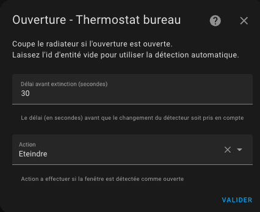
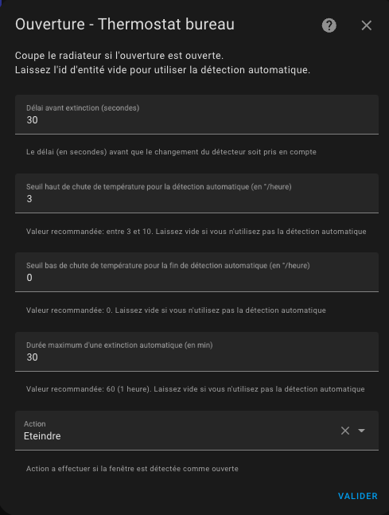
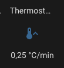

# La détection d'ouverture - portes/fenêtres

- [La détection d'ouverture - portes/fenêtres](#la-détection-douverture---portesfenêtres)
  - [Le mode capteur](#le-mode-capteur)
  - [Le mode auto](#le-mode-auto)

Vous devez avoir choisi la fonctionnalité ```Avec détection des ouvertures``` dans la première page pour arriver sur cette page.
La détection des ouvertures peut se faire de 2 manières:
1. soit avec un capteur placé sur l'ouverture (mode capteur),
2. soit en détectant une chute brutale de température (mode auto)

## Le mode capteur
Pour passer en mode capteur, vous devez donner une entité de type `binary_sensor` ou `input_boolean`.
Dans ce mode, vous devez renseigner les informations suivantes:



1. un **délai en secondes** avant tout changement. Cela permet d'ouvrir rapidement une fenêtre sans arrêter le chauffage,
2. l'action a réaliser lorsque l'ouverture est détectée ouverte. Les actions possibles sont :
   1. _Eteindre_ : le VTherm sera étient,
   2. _Ventilateur seul_ : le chauffage ou refroidissement sera coupé mais l'équipement continuera à ventiler (pour les équipements compatibles),
   3. _Hors gel_ : la température du preset 'Hors Gel' sera alors sélectionné sur le _VTherm_ sans changement du preset courant (cf. notes ci-dessous),
   4. _Eco_ : la température du preset _Eco_ sera appliquée sur le _VTherm_ sans changement du preset courant (cf. notes ci-dessous).

Lorsque le détecteur passe à ouvert :
1. _VTherm_ attend le délai indiqué,
2. si l'ouverture est toujours ouverte au bout du délai, l'état du _VTherm_ est mémorisée (mode Chauffe / Froid / ..., preset courant, temperature de consigne courante) et l'action est réalisée

Pareil, lorsque le détecteur passe à fermé :
1. _VTherm_ attend le délai indiqué,
2. si l'ouverture est toujours fermée au bout du délai, l'état avant ouverture mémorisé est restauré.

## Le mode auto
En mode auto, la configuration est la suivante:



1. un **délai en secondes** avant tout changement. Cela permet d'ouvrir rapidement une fenêtre sans arrêter le chauffage,
2. un seuil de détection en degré par heure. Lorsque la température chute au delà de ce seuil, le thermostat s'éteindra. Plus cette valeur est faible et plus la détection sera rapide (en contre-partie d'un risque de faux positif),
3. un seuil de fin de détection en degré par heure. Lorsque la chute de température repassera au-dessus cette valeur, le thermostat se remettra dans le mode précédent (mode et preset),
4. une durée maximale de détection. Au delà de cette durée, le thermostat se remettra dans son mode et preset précédent même si la température continue de chuter
5. l'action a réaliser lorsque l'ouverture est détectée ouverte. Les actions sont les mêmes qu'en mode capteur décrit ci-dessus.

Pour régler les seuils il est conseillé de commencer avec les valeurs de référence et d'ajuster les seuils de détection. Quelques essais m'ont donné les valeurs suivantes (pour un bureau):
- seuil de détection : 3 °C/heure
- seuil de non détection: 0 °C/heure
- durée max : 30 min.

Un nouveau capteur nommé "slope" a été ajouté pour tous les thermostats. Il donne la pente de la courbe de température en °C/heure (ou °K/heure). Cette pente est lissée et filtrée pour éviter les valeurs abérrantes des thermomètres qui viendraient pertuber la mesure.



Pour bien régler il est conseillé d'affocher sur un même graphique historique la courbe de température et la pente de la courbe (le "slope") :


>  _*Notes*_
>
>  1. Si vous souhaitez utiliser **plusieurs capteurs de porte/fenêtre** pour automatiser votre thermostat, créez simplement un groupe avec le comportement habituel (https://www.home-assistant.io/integrations/binary_sensor.group/)
>  2. Si vous n'avez pas de capteur de fenêtre/porte dans votre chambre, laissez simplement l'identifiant de l'entité du capteur vide,
>  3. **Un seul mode est permis**. On ne peut pas configurer un thermostat avec un capteur et une détection automatique. Les 2 modes risquant de se contredire, il n'est pas possible d'avoir les 2 modes en même temps,
>  4. Il est déconseillé d'utiliser le mode automatique pour un équipement soumis à des variations de température fréquentes et normales (couloirs, zones ouvertes, ...)
>  5. Pour éviter d'interférer avec votre réglage de preset courant, Les actions _Hors gel_ et _Eco_ change la température cible sans changer le preset. Donc, vous pouvez constater un écart entre le preset sélectionné et la consigne. Voir plus d'explications [ici](troubleshooting.md#la-détection-de-fenêtre-ouverte-nempêche-pas-le-changement-de-preset)
>  6. Si vous utilisez la carte Verstatile Thermostat UI (cf. [ici](additions.md#bien-mieux-avec-le-versatile-thermostat-ui-card)), une détection d'ouverture est représenté comme suit : .