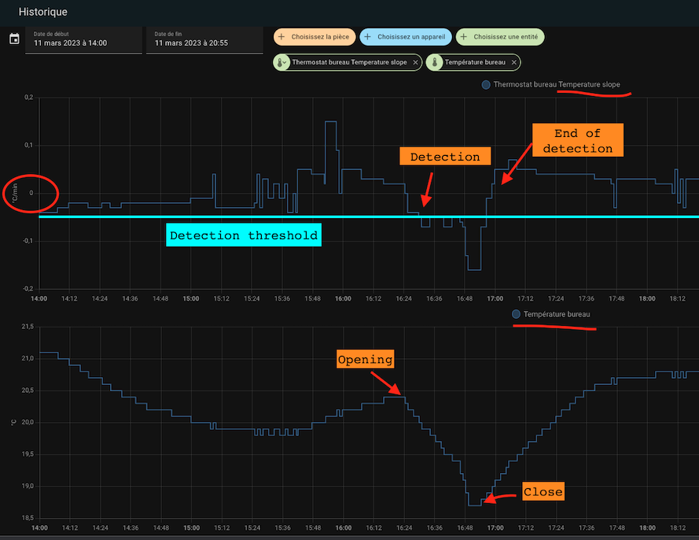

# La détection d'ouverture - portes/fenêtres

## Configurer les portes/fenêtres en allumant/éteignant les thermostats

Vous devez avoir choisi la fonctionnalité ```Avec détection des ouvertures``` dans la première page pour arriver sur cette page.
La détecttion des ouvertures peut se faire de 2 manières:
1. soit avec un capteur placé sur l'ouverture (mode capteur),
2. soit en détectant une chute brutale de température (mode auto)

### Le mode capteur
En mode capteur, vous devez renseigner les informations suivantes:


1. un identifiant d'entité d'un **capteur de fenêtre/porte**. Cela devrait être un binary_sensor ou un input_boolean. L'état de l'entité doit être 'on' lorsque la fenêtre est ouverte ou 'off' lorsqu'elle est fermée
2. un **délai en secondes** avant tout changement. Cela permet d'ouvrir rapidement une fenêtre sans arrêter le chauffage.


### Le mode auto
En mode auto, la configuration est la suivante:


1. un seuil de détection en degré par minute. Lorsque la température chute au delà de ce seuil, le thermostat s'éteindra. Plus cette valeur est faible et plus la détection sera rapide (en contre-partie d'un risque de faux positif),
2. un seuil de fin de détection en degré par minute. Lorsque la chute de température repassera au-dessus cette valeur, le thermostat se remettra dans le mode précédent (mode et preset),
3. une durée maximale de détection. Au delà de cette durée, le thermostat se remettra dans son mode et preset précédent même si la température continue de chuter.

Pour régler les seuils il est conseillé de commencer avec les valeurs de référence et d'ajuster les seuils de détection. Quelques essais m'ont donné les valeurs suivantes (pour un bureau):
- seuil de détection : 0,05 °C/min
- seuil de non détection: 0 °C/min
- durée max : 60 min.

Un nouveau capteur "slope" a été ajouté pour tous les thermostats. Il donne la pente de la courbe de température en °C/min (ou °K/min). Cette pente est lissée et filtrée pour éviter les valeurs abérrantes des thermomètres qui viendraient pertuber la mesure.


Pour bien régler il est conseillé d'affocher sur un même graphique historique la courbe de température et la pente de la courbe (le "slope") :


Et c'est tout ! votre thermostat s'éteindra lorsque les fenêtres seront ouvertes et se rallumera lorsqu'il sera fermé.

>  _*Notes*_
>  1. Si vous souhaitez utiliser **plusieurs capteurs de porte/fenêtre** pour automatiser votre thermostat, créez simplement un groupe avec le comportement habituel (https://www.home-assistant.io/integrations/binary_sensor.group/)
>  2. Si vous n'avez pas de capteur de fenêtre/porte dans votre chambre, laissez simplement l'identifiant de l'entité du capteur vide,
>  3. **Un seul mode est permis**. On ne peut pas configurer un thermostat avec un capteur et une détection automatique. Les 2 modes risquant de se contredire, il n'est pas possible d'avoir les 2 modes en même temps,
>  4. Il est déconseillé d'utiliser le mode automatique pour un équipement soumis à des variations de température fréquentes et normales (couloirs, zones ouvertes, ...)