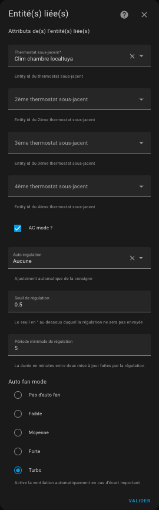
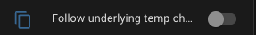

# Thermostat de type `over_climate`

- [Thermostat de type `over_climate`](#thermostat-de-type-over_climate)
  - [Pré-requis](#pré-requis)
  - [Configuration](#configuration)
    - [Les sous-jacents](#les-sous-jacents)
    - [Le mode AC](#le-mode-ac)
    - [La synchronisation de la température interne des sous-jacents](#la-synchronisation-de-la-température-interne-des-sous-jacents)
    - [L'auto-régulation](#lauto-régulation)
    - [L'auto-ventilation (auto-fan)](#lauto-ventilation-auto-fan)
    - [Compenser la température interne du sous-jacent](#compenser-la-température-interne-du-sous-jacent)
  - [Fonctions spécifiques](#fonctions-spécifiques)
  - [Suivre les changements de température du sous-jacent](#suivre-les-changements-de-température-du-sous-jacent)

## Pré-requis

L'installation doit ressembler à ça :

1. L'utilisateur ou une automatisation ou le Scheduler programme une consigne (setpoint) par le biais d'un pre-réglage ou directement d'une température,
2. régulièrement le thermomètre intérieur (2) ou extérieur (2b) ou interne à l'équipement (2c) envoie la température mesurée. Le thermomètre intérieur doit être placé à une place pertinente pour le ressenti de l'utilisateur : idéalement au milieu du lieu de vie. Evitez de le mettre trop près d'une fenêtre ou trop proche de l'équipement,
3. avec les valeurs de consigne, des différents thermomètres et les paramètres de l'auto-régulation (cf. [auto-regulation](self-regulation.md)), VTherm va calculer une consigne qui sera envoyée à l'entité `climate` sous-jacente,
4. l'entité `climate` sous-jacente contrôle l'équipement avec son propre protocole,
5. selon les options de régulation choisies le VTherm pourra potentiellement contrôler directement l'ouverture d'une vanne thermostatique ou calibrer l'équipement pour que sa température interne soit le reflet de la température de la pièce.

## Configuration

Configurez d'abord les paramètres principaux et communs à tous les _VTherm_ (cf. [paramètres principaux](base-attributes.md)).
Cliquez ensuite sur l'option de menu "Sous-jacents" et vous allez avoir cette page de configuration :

### Les sous-jacents
Dans la "liste des équipements à contrôler" vous mettez les entités `climate` qui vont être controllées par le VTherm. Seules les entités de type `climate` sont acceptées.

### Le mode AC

Il est possible de choisir un thermostat `over_climate` qui commande une climatisation (réversible ou non) en cochant la case "AC Mode". Si l'équipement le permet, les 2 modes 'Chauffage' et 'Refroidissement' seront alors disponibles.

### La synchronisation de la température interne des sous-jacents
Cette fonction permet une bien meilleure régulation puisqu'elle synchronise le thermomètre interne des `climate` sous-jacents avec la température de la pièce mesurée par _VTherm_. Elle est décrite [ici](feature-sync_device_temp.md).

### L'auto-régulation

En mode `over_climate`, le device utilise son propre algorithme de régulation : il s'allume / s'éteint et se met en pause tout seul en fonction de la consigne transmise par le VTherm à travers son entité `climate`. Il utilise pour ça son thermomètre interne et la consigne reçue.

Selon l'équipement cette régulation interne peut être plus ou moins bonne. Ca dépend beaucoup de la qualité de l'équipement, du fonctionnement de son thermomètre interne et de son algorithme interne. Pour améliorer les équipements qui régule mal, VTherm propose de tricher un peu sur la consigne qui lui est envoyée en augmentant ou diminuant celle-ci en fonction cette fois de la température de la pièce mesurée par VTherm et non plus de la température interne.

Les choix d'auto-régulation sont décrits dans le détail [ici](self-regulation.md).

Afin d'éviter de trop solliciter l'équipement sous-jacent (certain font un bip désagréable, d'autres sont sur batterie, ...), deux seuils permettant de limiter le nombre de sollicitation sont proposés :
1. le seuil de régulation `regulation_threshold`: un seuil en ° (ou en %) en dessous duquel la nouvelle consigne ne sera pas envoyée. Si la dernière consigne était de 22°, alors la prochaine envoyée, sera de 22° +/- seuil de régulation. Si la régulation contrôle directement la vanne (`over_valve` ou `over_climate` avec contrôle direct de la vanne) alors la valeur doit être spécifiée en pourcentage et ne doit pas être inférieure à 3% pour les Sonoff TRVZB (sinon le calibrage peut être perdu),
2. la période minimale de régulation en minute : un interval de temps minimal en minute en dessous duquel la nouvelle consigne ne sera pas envoyée. Si la dernière consigne a été envoyée à 11h00, alors la prochaine ne pourra pas être envoyée avant 11h00 + periode minimal de régulation.

S'ils sont mal réglés, ces seuils peuvent empêcher une auto-régulation correcte puisque les nouvelles consignes ne seront pas envoyées.

### L'auto-ventilation (auto-fan)

Ce mode introduit en 4.3 permet de forcer l'usage de la ventilation si l'écart de température est important. En effet, en activant la ventilation, la répartition se fait plus rapidement ce qui permet de gagner du temps dans l'atteinte de la température cible.
Vous pouvez choisir quelle ventilation vous voulez activer entre les paramètres suivants : Faible, Moyenne, Forte, Turbo.

Il faut évidemment que votre équipement sous-jacent soit équipé d'une ventilation et qu'il soit pilotable pour que cela fonctionne.
Si votre équipement ne comprend pas le mode Turbo, le mode `Forte` sera utilisé en remplacement.
Une fois l'écart de température redevenu faible, la ventilation se mettra dans un mode "normal" qui dépend de votre équipement à savoir (dans l'ordre) : `Silence (mute ou quiet)`, `Auto (auto)`, `Faible (low)`. La première valeur qui est possible pour votre équipement sera choisie.

### Compenser la température interne du sous-jacent

Attention : cette option ne doit pas être utilisée avec une régulation par contrôle direct de la vanne.

Quelque fois, il arrive que le thermomètre interne du sous-jacent (TRV, climatisation, ...) soit tellement faux que l'auto-régulation ne suffise pas à réguler.
Cela arrive lorsque le thermomètre interne est trop près de la source de chaleur. La température interne monte alors beaucoup plus vite que la température de la pièce, ce qui génère des défauts dans la régulation.
Exemple :
1. la température de la pièce est 18°, la consigne est à 20°,
2. la température interne de l'équipement est de 22°,
3. si VTherm envoie 21° comme consigne (= 20° + 1° d'auto-regulation), alors l'équipement ne chauffera pas car sa température interne (22°) est au-dessus de la consigne (21°)

Pour palier à ça, une nouvelle option facultative a été ajoutée en version 5.4 : 

Lorsqu'elle est activée, cette fonction ajoutera l'écart entre la température interne et la température de la pièce à la consigne pour forcer le chauffage.
Dans l'exemple ci-dessus, l'écart est de +4° (22° - 18°), donc VTherm enverra 25° (21°+4°) à l'équipement le forçant ainsi à chauffer.

Cet écart est calculé pour chaque sous-jacent car chacun à sa propre température interne. Pensez à un VTherm qui serait relié à 3 TRV chacun avec sa température interne par exemple.

On obtient alors une auto-régulation bien plus efficace qui évite l'eccueil des gros écarts de température interne défaillante.

Attention toutefois, certaines températures internes varient tellement vite et sont tellement fausses qu'elles faussent totalement le calcul. Dans ce cas, là, il vaut mieux désactiver cette option.

Vous trouverez des conseils pour régler au mieux ces paramètres dans la page [auto-regulation](self-regulation.md).

>  _*Notes*_
> Il est très rare d'avoir besoin de cocher cette case. La plupart du temps, une auto-regulation permet de résoudre les cas. Les résultats sont très dépendant de l'équipement et du comportement de la température interne de l'équipement. Vous ne devriez l'utiliser que si toutes les autres méthodes ont échouées.

## Fonctions spécifiques

Les fonctions spécifiques sont paramétrables avec une option dédiée du menu.

Les fonctions spécifiques qui nécessite un paramétrage à ce type de VTherm sont :
1. l'auto-start/stop : arrêt et démarrage automatique du _VTherm selon la prévision d'usage. Elle est décrite ici fonction [auto-start/sop](feature-auto-start-stop.md),
2. si la régulation par vanne est choisie, le paramétrage de l'algo TPI est accessible depuis le menu. cf ([algorithmes](algorithms.md))
3. si la régulation par vanne est choisie, vous pouvez mettre le _VTherm_ en mode dormant (sleep). Le mode dormant est un mode réservé à ce type de thermostat qui permet de couper le _VTherm_ tout en maintenant la vanne totalement 100% ouverte. Pour appliquer le mode dormant vous avez 2 moyens :
   1. soit avec la [VTherm UI Card](additions.md#versatile-thermostat-ui-card) en appuyant sur le bouton du mode 'Zzz',
   2. soit en appelant une action nommée `service_set_hvac_mode_sleep`. Cf. [Actions](reference.md#actions-services)

## Suivre les changements de température du sous-jacent

Certains utilisateurs veulent continuer à utiliser leur équipement comme avant (sans _VTherm_). Par exemple vous pouvez vouloir utiliser la télécommande de votre _PAC_ ou tourner le bouton de votre _TRV_.
Si vous êtes dans ce cas, une entité a été ajoutée dans l'appareil _VTherm_ nommée `Follow underlying temp changes` :

Lorsque cette entité est 'On', tous les changements de température ou d'état faits directement sur l'équipement sous-jacents sont répercutés sur le _VTherm_.

Attention, si vous utilisez cette fonction, votre équipement est maintenant contrôlé par 2 moyens : _VTherm_ et par vous même directement. Les ordres peuvent être contradictoires et cela peut induire une incompréhension sur l'état de l'équipement. _VTherm_ est équipé d'un mécanisme de temporisation qui évite les boucles : l'utilisateur donne une consigne qui est captée par _VTherm_ qui change la consigne, ... Cette temporisation peut faire que le changement fait directement sur l'équipement est ignoré si ces changements sont trop rapprochés dans le temps.

Certains équipements (Daikin par exemple), changent d'état tout seul. Si la case est cochée, cela peut éteindre le _VTherm_ alors que ce n'est pas ce que vous souhaitiez.
C'est pour ça qu'il est préférable de ne pas l'utiliser. Cela génère beaucoup d'incompréhensions et de nombreuses demandes de support.
