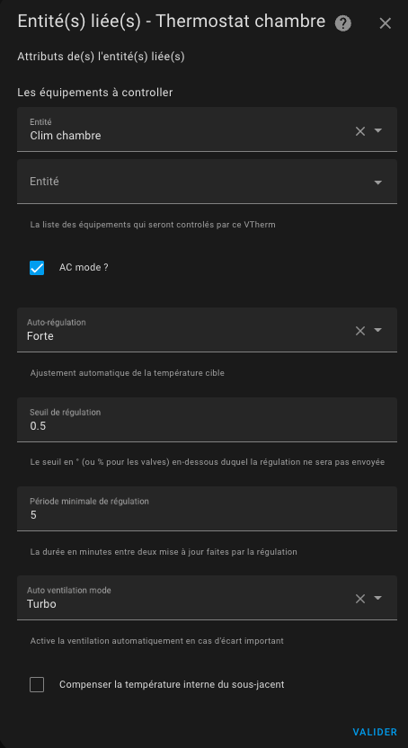

# Thermostat de type ```thermostat_over_climate```

## Pré-requis

L'installation doit ressembler à ça :


1. L'utilisateur ou une automatisation ou le Sheduler programme une consigne (setpoint) par le biais d'un pre-réglage ou directement d'une température,
2. régulièrement le thermomètre intérieur (2) ou extérieur (2b) ou interne à l'équipement (2c) envoie la température mesurée. Le thermomètre intérieur doit être placé à une place pertinente pour le ressenti de l'utilisateur : idéalement au milieu du lieu de vie. Evitez de le mettre trop près d'une fenêtre ou trop proche de l'équipement,
3. avec les valeurs de consigne, des différents et les paramètres de l'auto-régulation (cf. TODO), VTherm va calculer une consigne qui sera envoyée à l'entité `climate` sous-jacentes,
4. l'entité `climate` sous-jacente contrôle l'équipement avec son propre protocole,
5. selon les options de régulation choisie le VTherm pourra potentiellement contrôler directement l'ouverture d'une vanne thermostatique ou calibrer l'équipement pour que sa température interne soit le reflet de la température de la pièce.


## Configuration

Cliquer sur l'option de menu "Sous-jacents" et vous allez avoir cette page de configuration :


### les sous-jacents
Dans la "liste des équipements à contrôler" vous mettez les entités `climate` qui vont être controllés par le VTherm. Seuls les entités de type `climate` sont acceptées.

### Le mode AC

Il est possible de choisir un thermostat `over_climate` qui commande une climatisation (réversible ou non) en cochant la case "AC Mode". Si l'équipement le permet, les 2 modes 'Chauffage' et 'Refroidissement' seront alors disponibles.

### L'auto-régulation

En mode `over_cliamte`, le device utilise son propre algorithme de régulation : il s'allume / s'éteint et se met en pause tout seul en fonction de la consigne transmise par le VTherm à travers son entité `climate`. Il utilise pour ça son thermomètre interne et la consigne reçue.

Selon l'équipement cette régulation interne peut être plus ou moins bonne. Ca dépend beaucoup de la qualité de l'équipement, du fonctionnement de son thermomètre interne et de son algorithme interne. Pour améliorer les équipements qui régule mal, VTherm propose de tricher un peu sur la consigne qui lui est envoyée en augmentant ou diminuant celle-ci en fonction cette fois de la température de la pièce mesurée par VTherm et non plus de la température interne.

Les choix d'auto-régulation sont décrits dans le détail ici (TODO).

Afin d'éviter de trop solliciter l'équipement sous-jacent (certain font un bip désagréable, d'autres sont sur batterie, ...), deux seuils permettant de limiter le nombre de sollicitation sont proposés :
1. le seuil de régulation : un seuil en ° en dessous duquel la nouvelle consigne ne sera pas envoyée. Si la dernière consigne était de 22°, alors la prochaine envoyée, sera de 22° +/- seuil de régulation,
2. la période minimale de régulation en minute : un interval de temps minimal en minute en dessous duquel la nouvelle consigne ne sera pas envoyée. Si la dernière consigne a été envoyée à 11h00, alors la prochaine ne pourra pas être envoyée avant 11h00 + periode minimal de régulation.

Si ils sont mal réglés, ces seuils peuvent empêcher une auto-régulation correcte puisque les nouvelles consignes ne seront pas envoyées.

### L'auto-ventilation (auto-fan)

Ce mode introduit en 4.3 permet de forcer l'usage de la ventilation si l'écart de température est important. En effet, en activant la ventilation, la répartition se fait plus rapidement ce qui permet de gagner du temps dans l'atteinte de la température cible.
Vous pouvez choisir quelle ventilation vous voulez activer entre les paramètres suivants : Faible, Moyenne, Forte, Turbo.

Il faut évidemment que votre équipement sous-jacent soit équipée d'une ventilation et quelle soit pilotable pour que cela fonctionne.
Si votre équipement ne comprend pas le mode Turbo, le mode Forte` sera utilisé en remplacement.
Une fois l'écart de température redevenu faible, la ventilation se mettra dans un mode "normal" qui dépend de votre équipement à savoir (dans l'ordre) : `Silence (mute)`, `Auto (auto)`, `Faible (low)`. La première valeur qui est possible pour votre équipement sera choisie.

### Compenser la température interne du sous-jacent

Quelque fois, il arrive que le thermomètre interne du sous-jacent (TRV, climatisation, ...) soit tellement faux que l' auto-régulation ne suffise pas à réguler.
Cela arrive lorsque le thermomètre interne est trop près de la source de chaleur. La température interne monte alors beaucoup plus vite que la température de la pièce, ce qui génère des défauts dans la régulation.
Exemple :
1. la température de la pièce est 18°, la consigne est à 20°,
2. la température interne de l'équipement est de 22°,
3. si VTherm envoie 21° comme consigne (= 20° + 1° d'auto-regulation), alors l'équipement ne chauffera pas car sa température interne (22°) est au-dessus de la consigne (21°)

Pour palier à ça, une nouvelle option facultative a été ajoutée en version 5.4 : 

Lorsqu'elle est activée, cette fonction ajoutera l'écart entre la température interne et la température de la pièce à la consigne pour forcer le chauffage.
Dans l'exemple ci-dessus, l'écart est de +4° (22° - 18°), donc VTherm enverra 25° (21°+4°) à l'équipement le forçant ainsi à chauffer.

Cet écart est calculé pour chaque sous-jacent car chacun à sa propre température interne. Pensez à un VTherm qui serait relié à 3 TRV chacun avec sa température interne par exemple.

On obtient alors une auto-régulation bien plus efficace qui évite l'eccueil des gros écarts de température interne défaillante.

Attention toutefois, certaine température interne varient tellement vite et sont tellement fausse qu'elles faussent totalement le calcul. Dans ce cas, là, il vaut mieux désactiver cette option.

Vous trouverez des conseils pour régler au mieux ces paramètres dans la page (TODO optimiser)