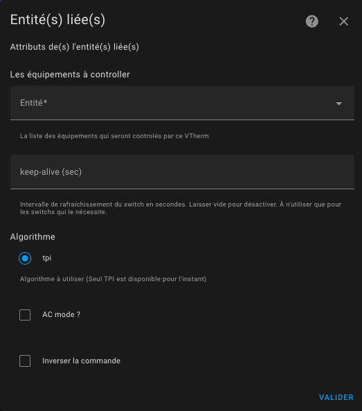
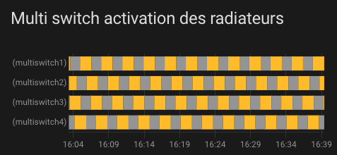

# Thermostat de type ```thermostat_over_switch```

## Pré-requis

L'installation doit ressembler à ça :


1. L'utilisateur ou une automatisation ou le Sheduler programme une consigne (setpoint) par le biais d'un pre-réglage ou directement d'une température,
2. régulièrement le thermomètre intérieur (2) ou extérieur (2b) envoie la température mesurée. Le thermomètre interieur doit être placé à une place pertinente pour le ressenti de l'utilisateur : idéalement au milieu du lieu de vie. Evitez de le mettre trop près d'une fenêtre ou trop proche du radiateur,
3. avec les valeurs de consigne, les différentes températures et des paramètres de l'algorithme TPI (cf. TODO), VTherm va calculer un pourcentage de temps d'allumage,
4. et va régulièrement commander l'allumage et l'extinction du ou des entités `switch` sous-jacentes,
5. ces entités switchs sous-jacentes vont alors commander le switch physique
6. la commande du switch physique allumera ou éteindra le radiateur.

Le pourcentage d'allumage est recalculé à chaque cycle et c'est ce qui permet de réguler la température de la pièce.

## Configuration

Cliquer sur l'option de menu "Sous-jacents" et vous allez avoir cette page de configuration :


### les sous-jacents
Dans la "liste des équipements à contrôler" vous mettez les switchs qui vont être controllés par le VTherm. Seuls les entités de type `switch` ou `input_boolean` sont acceptées.

L'algorithme à utiliser est aujourd'hui limité à TPI est disponible. Voir [algorithme](#algorithme).
Si plusieurs entités de type sont configurées, la thermostat décale les activations afin de minimiser le nombre de switch actif à un instant t. Ca permet une meilleure répartition de la puissance puisque chaque radiateur va s'allumer à son tour.

VTherm va donc lisser la puissance consommée le plus possible en alternant les activations. Exemple d'activations décalées :



Evidemment si la puissance demandée (`on_percent`) est trop forte, alors il y aura un recouvrement des activations.

### Le keep-alive

Certains équipements nécessitent d'être périodiquement sollicités pour empêcher un arrêt de sécurité. Connu sous le nom de "keep-alive" cette fonction est activable en entrant un nombre de secondes non nul dans le champ d'intervalle keep-alive du thermostat. Pour désactiver la fonction ou en cas de doute, laissez-le vide ou entrez zéro (valeur par défaut).

### Le mode AC

Il est possible de choisir un thermostat over switch qui commande une climatisation en cochant la case "AC Mode". Dans ce cas, seul le mode refroidissement sera visible.

### L'inversion de la commande

Si votre équipement est commandé par un fil pilote avec un diode, vous aurez certainement besoin de cocher la case "Inverser la case". Elle permet de mettre le switch à `On` lorsqu'on doit étiendre l'équipement et à `Off` lorsqu'on doit l'allumer. Les temps de cycle sont donc inversés avec cette option.

