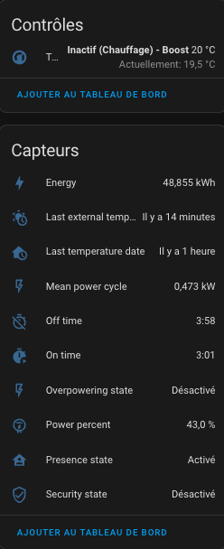
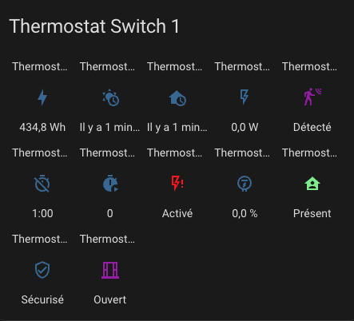

# Documentation de référence

## Synthèse des paramètres

| Paramètre                                 | Libellé                                                                           | "over switch" | "over climate"      | "over valve" | "configuration centrale" |
| ----------------------------------------- | --------------------------------------------------------------------------------- | ------------- | ------------------- | ------------ | ------------------------ |
| ``name``                                  | Nom                                                                               | X             | X                   | X            | -                        |
| ``thermostat_type``                       | Type de thermostat                                                                | X             | X                   | X            | -                        |
| ``temperature_sensor_entity_id``          | Temperature sensor entity id                                                      | X             | X (auto-regulation) | X            | -                        |
| ``external_temperature_sensor_entity_id`` | Température de l'exterieur sensor entity id                                       | X             | X (auto-regulation) | X            | X                        |
| ``cycle_min``                             | Durée du cycle (minutes)                                                          | X             | X                   | X            | -                        |
| ``temp_min``                              | Température minimale permise                                                      | X             | X                   | X            | X                        |
| ``temp_max``                              | Température maximale permise                                                      | X             | X                   | X            | X                        |
| ``device_power``                          | Puissance de l'équipement                                                         | X             | X                   | X            | -                        |
| ``use_central_mode``                      | Autorisation du contrôle centralisé                                               | X             | X                   | X            | -                        |
| ``use_window_feature``                    | Avec détection des ouvertures                                                     | X             | X                   | X            | -                        |
| ``use_motion_feature``                    | Avec détection de mouvement                                                       | X             | X                   | X            | -                        |
| ``use_power_feature``                     | Avec gestion de la puissance                                                      | X             | X                   | X            | -                        |
| ``use_presence_feature``                  | Avec détection de présence                                                        | X             | X                   | X            | -                        |
| ``heater_entity1_id``                     | 1er radiateur                                                                     | X             | -                   | -            | -                        |
| ``heater_entity2_id``                     | 2ème radiateur                                                                    | X             | -                   | -            | -                        |
| ``heater_entity3_id``                     | 3ème radiateur                                                                    | X             | -                   | -            | -                        |
| ``heater_entity4_id``                     | 4ème radiateur                                                                    | X             | -                   | -            | -                        |
| ``heater_keep_alive``                     | Intervalle de rafraichissement du switch                                          | X             | -                   | -            | -                        |
| ``proportional_function``                 | Algorithme                                                                        | X             | -                   | -            | -                        |
| ``climate_entity1_id``                    | Thermostat sous-jacent                                                            | -             | X                   | -            | -                        |
| ``climate_entity2_id``                    | 2ème thermostat sous-jacent                                                       | -             | X                   | -            | -                        |
| ``climate_entity3_id``                    | 3ème thermostat sous-jacent                                                       | -             | X                   | -            | -                        |
| ``climate_entity4_id``                    | 4ème thermostat sous-jacent                                                       | -             | X                   | -            | -                        |
| ``valve_entity1_id``                      | Vanne sous-jacente                                                                | -             | -                   | X            | -                        |
| ``valve_entity2_id``                      | 2ème vanne sous-jacente                                                           | -             | -                   | X            | -                        |
| ``valve_entity3_id``                      | 3ème vanne sous-jacente                                                           | -             | -                   | X            | -                        |
| ``valve_entity4_id``                      | 4ème vanne sous-jacente                                                           | -             | -                   | X            | -                        |
| ``ac_mode``                               | utilisation de l'air conditionné (AC) ?                                           | X             | X                   | X            | -                        |
| ``tpi_coef_int``                          | Coefficient à utiliser pour le delta de température interne                       | X             | -                   | X            | X                        |
| ``tpi_coef_ext``                          | Coefficient à utiliser pour le delta de température externe                       | X             | -                   | X            | X                        |
| ``frost_temp``                            | Température en preset Hors-gel                                                    | X             | X                   | X            | X                        |
| ``window_sensor_entity_id``               | Détecteur d'ouverture (entity id)                                                 | X             | X                   | X            | -                        |
| ``window_delay``                          | Délai avant extinction (secondes)                                                 | X             | X                   | X            | X                        |
| ``window_auto_open_threshold``            | Seuil haut de chute de température pour la détection automatique (en °/min)       | X             | X                   | X            | X                        |
| ``window_auto_close_threshold``           | Seuil bas de chute de température pour la fin de détection automatique (en °/min) | X             | X                   | X            | X                        |
| ``window_auto_max_duration``              | Durée maximum d'une extinction automatique (en min)                               | X             | X                   | X            | X                        |
| ``motion_sensor_entity_id``               | Détecteur de mouvement entity id                                                  | X             | X                   | X            | -                        |
| ``motion_delay``                          | Délai avant prise en compte du mouvement (seconds)                                | X             | X                   | X            | -                        |
| ``motion_off_delay``                      | Délai avant prise en compte de la fin de mouvement (seconds)                      | X             | X                   | X            | X                        |
| ``motion_preset``                         | Preset à utiliser si mouvement détecté                                            | X             | X                   | X            | X                        |
| ``no_motion_preset``                      | Preset à utiliser si pas de mouvement détecté                                     | X             | X                   | X            | X                        |
| ``power_sensor_entity_id``                | Capteur de puissance totale (entity id)                                           | X             | X                   | X            | X                        |
| ``max_power_sensor_entity_id``            | Capteur de puissance Max (entity id)                                              | X             | X                   | X            | X                        |
| ``power_temp``                            | Température si délestaqe                                                          | X             | X                   | X            | X                        |
| ``presence_sensor_entity_id``             | Capteur de présence entity id (true si quelqu'un est présent)                     | X             | X                   | X            | -                        |
| ``minimal_activation_delay``              | Délai minimal d'activation                                                        | X             | -                   | -            | X                        |
| ``security_delay_min``                    | Délai maximal entre 2 mesures de températures                                     | X             | -                   | X            | X                        |
| ``security_min_on_percent``               | Pourcentage minimal de puissance pour passer en mode sécurité                     | X             | -                   | X            | X                        |
| ``auto_regulation_mode``                  | Le mode d'auto-régulation                                                         | -             | X                   | -            | -                        |
| ``auto_regulation_dtemp``                 | La seuil d'auto-régulation                                                        | -             | X                   | -            | -                        |
| ``auto_regulation_period_min``            | La période minimale d'auto-régulation                                             | -             | X                   | -            | -                        |
| ``inverse_switch_command``                | Inverse la commande du switch (pour switch avec fil pilote)                       | X             | -                   | -            | -                        |
| ``auto_fan_mode``                         | Mode de ventilation automatique                                                   | -             | X                   | -            | -                        |
| ``auto_regulation_use_device_temp``       | Utilisation de la température interne du sous-jacent                              | -             | X                   | -            | -                        |
| ``use_central_boiler_feature``            | Ajout du controle d'une chaudière centrale                                        | -             | -                   | -            | X                        |
| ``central_boiler_activation_service``     | Service d'activation de la chaudière                                              | -             | -                   | -            | X                        |
| ``central_boiler_deactivation_service``   | Service de desactivation de la chaudière                                          | -             | -                   | -            | X                        |
| ``used_by_controls_central_boiler``       | Indique si le VTherm contrôle la chaudière centrale                               | X             | X                   | X            | -                        |
| ``use_auto_start_stop_feature``           | Indique si la fonction de démarrage/extinction automatique est activée            | -             | X                   | -            | -                        |
| ``auto_start_stop_lvel``                  | Le niveau de détection de l'auto start/stop                                       | -             | X                   | -            | -                        |

# Capteurs

Avec le thermostat sont disponibles des capteurs qui permettent de visualiser les alertes et l'état interne du thermostat. Ils sont disponibles dans les entités de l'appareil associé au thermostat :



Dans l'ordre, il y a :
1. l'entité principale climate de commande du thermostat,
2. l'énergie consommée par le thermostat (valeur qui s'incrémente en permanence),
3. l'heure de réception de la dernière température extérieure,
4. l'heure de réception de la dernière température intérieure,
5. la puissance moyenne de l'appareil sur le cycle (pour les TPI seulement),
6. le temps passé à l'état éteint dans le cycle (TPI seulement),
7. le temps passé à l'état allumé dans le cycle (TPI seulement),
8. l'état de délestage,
9. le pourcentage de puissance sur le cycle (TPI seulement),
10. l'état de présence (si la gestion de la présence est configurée),
11. l'état de sécurité,
12. l'état de l'ouverture (si la gestion des ouvertures est configurée),
13. l'état du mouvement (si la gestion du mouvements est configurée)
14. le pourcentage d'ouverture de la vanne (pour le type `over_valve`)

Pour colorer les capteurs, ajouter ces lignes et personnalisez les au besoin, dans votre configuration.yaml :

```
frontend:
  themes:
    versatile_thermostat_theme:
      state-binary_sensor-safety-on-color: "#FF0B0B"
      state-binary_sensor-power-on-color: "#FF0B0B"
      state-binary_sensor-window-on-color: "rgb(156, 39, 176)"
      state-binary_sensor-motion-on-color: "rgb(156, 39, 176)"
      state-binary_sensor-presence-on-color: "lightgreen"
      state-binary_sensor-running-on-color: "orange"
```
et choisissez le thème ```versatile_thermostat_theme``` dans la configuration du panel. Vous obtiendrez quelque-chose qui va ressembler à ça :



# Services

Cette implémentation personnalisée offre des services spécifiques pour faciliter l'intégration avec d'autres composants Home Assistant.

## Forcer la présence/occupation
Ce service permet de forcer l'état de présence indépendamment du capteur de présence. Cela peut être utile si vous souhaitez gérer la présence via un service et non via un capteur. Par exemple, vous pouvez utiliser votre réveil pour forcer l'absence lorsqu'il est allumé.

Le code pour appeler ce service est le suivant :
```
service : versatile_thermostat.set_presence
Les données:
    présence : "off"
cible:
    entity_id : climate.my_thermostat
```

## Modifier la température des préréglages
Ce service est utile si vous souhaitez modifier dynamiquement la température préréglée. Au lieu de changer de préréglage, certains cas d'utilisation doivent modifier la température du préréglage. Ainsi, vous pouvez garder le Programmateur inchangé pour gérer le préréglage et ajuster la température du préréglage.
Si le préréglage modifié est actuellement sélectionné, la modification de la température cible est immédiate et sera prise en compte au prochain cycle de calcul.

Vous pouvez modifier l'une ou les deux températures (lorsqu'elles sont présentes ou absentes) de chaque préréglage.

Utilisez le code suivant pour régler la température du préréglage :
```
service : versatile_thermostat.set_preset_temperature
date:
    preset : boost
    temperature : 17,8
    temperature_away : 15
target:
    entity_id : climate.my_thermostat
```

Ou pour changer le pré-réglage du mode Air Conditionné (AC) ajoutez un préfixe `_ac`` au nom du preset comme ceci :
```
service: versatile_thermostat.set_preset_temperature
data:
    preset: boost_ac
    temperature: 25
    temperature_away: 30
target:
    entity_id: climate.my_thermostat
```

>  _*Notes*_
    - après un redémarrage, les préréglages sont réinitialisés à la température configurée. Si vous souhaitez que votre changement soit permanent, vous devez modifier le préréglage de la température dans la configuration de l'intégration.

## Modifier les paramètres de sécurité
Ce service permet de modifier dynamiquement les paramètres de sécurité décrits ici [Configuration avancée](#configuration-avancée).
Si le thermostat est en mode ``security`` les nouveaux paramètres sont appliqués immédiatement.

Pour changer les paramètres de sécurité utilisez le code suivant :
```
service : versatile_thermostat.set_security
data:
    min_on_percent: "0.5"
    default_on_percent: "0.1"
    delay_min: 60
target:
    entity_id : climate.my_thermostat
```

## ByPass Window Check
Ce service permet d'activer ou non un bypass de la vérification des fenetres.
Il permet de continuer à chauffer même si la fenetre est detectée ouverte.
Mis à ``true`` les modifications de status de la fenetre n'auront plus d'effet sur le thermostat, remis à ``false`` cela s'assurera de désactiver le thermostat si la fenetre est toujours ouverte.

Pour changer le paramètre de bypass utilisez le code suivant :
```
service : versatile_thermostat.set_window_bypass
data:
    window_bypass: true
target:
    entity_id : climate.my_thermostat
```

# Evènements
Les évènements marquant du thermostat sont notifiés par l'intermédiaire du bus de message.
Les évènements notifiés sont les suivants:

- ``versatile_thermostat_security_event`` : un thermostat entre ou sort du preset ``security``
- ``versatile_thermostat_power_event`` : un thermostat entre ou sort du preset ``power``
- ``versatile_thermostat_temperature_event`` : une ou les deux mesures de température d'un thermostat n'ont pas été mis à jour depuis plus de `security_delay_min`` minutes
- ``versatile_thermostat_hvac_mode_event`` : le thermostat est allumé ou éteint. Cet évènement est aussi diffusé au démarrage du thermostat
- ``versatile_thermostat_preset_event`` : un nouveau preset est sélectionné sur le thermostat. Cet évènement est aussi diffusé au démarrage du thermostat
- ``versatile_thermostat_central_boiler_event`` : un évènement indiquant un changement dans l'état de la chaudière.

Si vous avez bien suivi, lorsqu'un thermostat passe en mode sécurité, 3 évènements sont déclenchés :
1. ``versatile_thermostat_temperature_event`` pour indiquer qu'un thermomètre ne répond plus,
2. ``versatile_thermostat_preset_event`` pour indiquer le passage en preset ```security```,
3. ``versatile_thermostat_hvac_mode_event`` pour indiquer l'extinction éventuelle du thermostat

Chaque évènement porte les valeurs clés de l'évènement (températures, preset courant, puissance courante, ...) ainsi que les états du thermostat.

Vous pouvez très facilement capter ses évènements dans une automatisation par exemple pour notifier les utilisateurs.

# Attributs personnalisés

Pour régler l'algorithme, vous avez accès à tout le contexte vu et calculé par le thermostat via des attributs dédiés. Vous pouvez voir (et utiliser) ces attributs dans l'IHM "Outils de développement / états" de HA. Entrez votre thermostat et vous verrez quelque chose comme ceci :


Les attributs personnalisés sont les suivants :

| Attribut                          | Signification                                                                                                                                                            |
| --------------------------------- | ------------------------------------------------------------------------------------------------------------------------------------------------------------------------ |
| ``hvac_modes``                    | La liste des modes supportés par le thermostat                                                                                                                           |
| ``temp_min``                      | La température minimale                                                                                                                                                  |
| ``temp_max``                      | La température maximale                                                                                                                                                  |
| ``preset_modes``                  | Les préréglages visibles pour ce thermostat. Les préréglages cachés ne sont pas affichés ici                                                                             |
| ``temperature_actuelle``          | La température actuelle telle que rapportée par le capteur                                                                                                               |
| ``temperature``                   | La température cible                                                                                                                                                     |
| ``action_hvac``                   | L'action en cours d'exécution par le réchauffeur. Peut être inactif, chauffage                                                                                           |
| ``preset_mode``                   | Le préréglage actuellement sélectionné. Peut être l'un des 'preset_modes' ou un préréglage caché comme power                                                             |
| ``[eco/confort/boost]_temp``      | La température configurée pour le préréglage xxx                                                                                                                         |
| ``[eco/confort/boost]_away_temp`` | La température configurée pour le préréglage xxx lorsque la présence est désactivée ou not_home                                                                          |
| ``temp_power``                    | La température utilisée lors de la détection de la perte                                                                                                                 |
| ``on_percent``                    | Le pourcentage sur calculé par l'algorithme TPI                                                                                                                          |
| ``on_time_sec``                   | La période On en sec. Doit être ```on_percent * cycle_min```                                                                                                             |
| ``off_time_sec``                  | La période d'arrêt en sec. Doit être ```(1 - on_percent) * cycle_min```                                                                                                  |
| ``cycle_min``                     | Le cycle de calcul en minutes                                                                                                                                            |
| ``function``                      | L'algorithme utilisé pour le calcul du cycle                                                                                                                             |
| ``tpi_coef_int``                  | Le ``coef_int`` de l'algorithme TPI                                                                                                                                      |
| ``tpi_coef_ext``                  | Le ``coef_ext`` de l'algorithme TPI                                                                                                                                      |
| ``saved_preset_mode``             | Le dernier preset utilisé avant le basculement automatique du preset                                                                                                     |
| ``saved_target_temp``             | La dernière température utilisée avant la commutation automatique                                                                                                        |
| ``window_state``                  | Le dernier état connu du capteur de fenêtre. Aucun si la fenêtre n'est pas configurée                                                                                    |
| ``window_bypass_state``           | True si le bypass de la détection d'ouverture et activé                                                                                                                  |
| ``motion_state``                  | Le dernier état connu du capteur de mouvement. Aucun si le mouvement n'est pas configuré                                                                                 |
| ``overpowering_state``            | Le dernier état connu du capteur surpuissant. Aucun si la gestion de l'alimentation n'est pas configurée                                                                 |
| ``presence_state``                | Le dernier état connu du capteur de présence. Aucun si la gestion de présence n'est pas configurée                                                                       |
| ``security_delay_min``            | Le délai avant d'activer le mode de sécurité lorsque un des 2 capteurs de température n'envoie plus de mesures                                                           |
| ``security_min_on_percent``       | Pourcentage de chauffe en dessous duquel le thermostat ne passera pas en sécurité                                                                                        |
| ``security_default_on_percent``   | Pourcentage de chauffe utilisé lorsque le thermostat est en sécurité                                                                                                     |
| ``last_temperature_datetime``     | La date et l'heure au format ISO8866 de la dernière réception de température interne                                                                                     |
| ``last_ext_temperature_datetime`` | La date et l'heure au format ISO8866 de la dernière réception de température extérieure                                                                                  |
| ``security_state``                | L'état de sécurité. vrai ou faux                                                                                                                                         |
| ``minimal_activation_delay_sec``  | Le délai d'activation minimal en secondes                                                                                                                                |
| ``last_update_datetime``          | La date et l'heure au format ISO8866 de cet état                                                                                                                         |
| ``friendly_name``                 | Le nom du thermostat                                                                                                                                                     |
| ``supported_features``            | Une combinaison de toutes les fonctionnalités prises en charge par ce thermostat. Voir la documentation officielle sur l'intégration climatique pour plus d'informations |
| ``valve_open_percent``            | Le pourcentage d'ouverture de la vanne                                                                                                                                   |
| ``regulated_target_temperature``  | La température de consigne calculée par l'auto-régulation                                                                                                                |
| ``is_inversed``                   | True si la commande est inversée (fil pilote avec diode)                                                                                                                 |
| ``is_controlled_by_central_mode`` | True si le VTherm peut être controlé de façon centrale                                                                                                                   |
| ``last_central_mode``             | Le dernier mode central utilisé (None si le VTherm n'est pas controlé en central)                                                                                        |
| ``is_used_by_central_boiler``     | Indique si le VTherm peut contrôler la chaudière centrale                                                                                                                |
| ``auto_start_stop_enable``        | Indique si le VTherm est autorisé à s'auto démarrer/arrêter                                                                                                              |
| ``auto_start_stop_level``         | Indique le niveau d'auto start/stop                                                                                                                                      |
| ``hvac_off_reason``               | Indique la raison de l'arrêt (hvac_off) du VTherm. Ce peut être Window, Auto-start/stop ou Manuel                                                                        |

