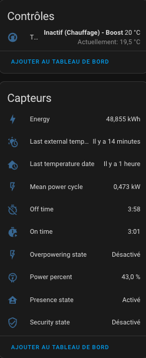
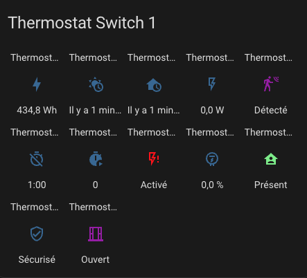
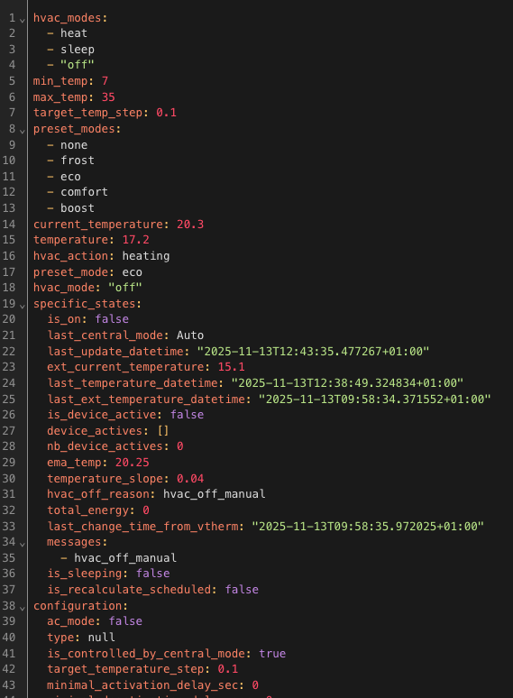

# Documentation de référence

- [Documentation de référence](#documentation-de-référence)
  - [Synthèse des paramètres](#synthèse-des-paramètres)
- [Configuration en mode Expert](#configuration-en-mode-expert)
  - [Paramètres de l'auto-régulation en mode Expert](#paramètres-de-lauto-régulation-en-mode-expert)
  - [Désactivation de la vérification du capteur extérieur en mode sécurité](#désactivation-de-la-vérification-du-capteur-extérieur-en-mode-sécurité)
  - [Limite maximale de puissance de chauffe](#limite-maximale-de-puissance-de-chauffe)
  - [Paramètres de détection automatique d'ouverture de fenêtre](#paramètres-de-détection-automatique-douverture-de-fenêtre)
  - [Rétention des fichiers journaux (Log Buffer)](#rétention-des-fichiers-journaux-log-buffer)
- [Capteurs](#capteurs)
- [Actions (services)](#actions-services)
  - [Forcer la présence/occupation](#forcer-la-présenceoccupation)
  - [Modifier les paramètres de sécurité](#modifier-les-paramètres-de-sécurité)
  - [ByPass Window Check](#bypass-window-check)
  - [Services de verrouillage / déverrouillage](#services-de-verrouillage--déverrouillage)
  - [Changer les paramètres du TPI](#changer-les-paramètres-du-tpi)
  - [Preset temporisé (Timed Preset)](#preset-temporisé-timed-preset)
- [Evènements](#evènements)
- [Attributs personnalisés](#attributs-personnalisés)
  - [Pour un _VTherm_](#pour-un-vtherm)
  - [Pour la configuration centrale](#pour-la-configuration-centrale)
- [Messages d'état](#messages-détat)

## Synthèse des paramètres

| Paramètre                                 | Libellé                                                                           | "over switch" | "over climate"      | "over valve" | "configuration centrale" |
| ----------------------------------------- | --------------------------------------------------------------------------------- | ------------- | ------------------- | ------------ | ------------------------ |
| ``name``                                  | Nom                                                                               | X             | X                   | X            | -                        |
| ``thermostat_type``                       | Type de thermostat                                                                | X             | X                   | X            | -                        |
| ``temperature_sensor_entity_id``          | Temperature sensor entity id                                                      | X             | X (auto-regulation) | X            | -                        |
| ``external_temperature_sensor_entity_id`` | Température de l'exterieur sensor entity id                                       | X             | X (auto-regulation) | X            | X                        |
| ``cycle_min``                             | Durée du cycle (minutes)                                                          | X             | X                   | X            | -                        |
| ``temp_min``                              | Température minimale permise                                                      | X             | X                   | X            | X                        |
| ``temp_max``                              | Température maximale permise                                                      | X             | X                   | X            | X                        |
| ``device_power``                          | Puissance de l'équipement                                                         | X             | X                   | X            | -                        |
| ``use_central_mode``                      | Autorisation du contrôle centralisé                                               | X             | X                   | X            | -                        |
| ``use_window_feature``                    | Avec détection des ouvertures                                                     | X             | X                   | X            | -                        |
| ``use_motion_feature``                    | Avec détection de mouvement                                                       | X             | X                   | X            | -                        |
| ``use_power_feature``                     | Avec gestion de la puissance                                                      | X             | X                   | X            | -                        |
| ``use_presence_feature``                  | Avec détection de présence                                                        | X             | X                   | X            | -                        |
| ``heater_entity1_id``                     | 1er radiateur                                                                     | X             | -                   | -            | -                        |
| ``heater_entity2_id``                     | 2ème radiateur                                                                    | X             | -                   | -            | -                        |
| ``heater_entity3_id``                     | 3ème radiateur                                                                    | X             | -                   | -            | -                        |
| ``heater_entity4_id``                     | 4ème radiateur                                                                    | X             | -                   | -            | -                        |
| ``heater_keep_alive``                     | Intervalle de rafraichissement du switch                                          | X             | -                   | -            | -                        |
| ``proportional_function``                 | Algorithme                                                                        | X             | -                   | -            | -                        |
| ``climate_entity1_id``                    | Thermostat sous-jacent                                                            | -             | X                   | -            | -                        |
| ``climate_entity2_id``                    | 2ème thermostat sous-jacent                                                       | -             | X                   | -            | -                        |
| ``climate_entity3_id``                    | 3ème thermostat sous-jacent                                                       | -             | X                   | -            | -                        |
| ``climate_entity4_id``                    | 4ème thermostat sous-jacent                                                       | -             | X                   | -            | -                        |
| ``valve_entity1_id``                      | Vanne sous-jacente                                                                | -             | -                   | X            | -                        |
| ``valve_entity2_id``                      | 2ème vanne sous-jacente                                                           | -             | -                   | X            | -                        |
| ``valve_entity3_id``                      | 3ème vanne sous-jacente                                                           | -             | -                   | X            | -                        |
| ``valve_entity4_id``                      | 4ème vanne sous-jacente                                                           | -             | -                   | X            | -                        |
| ``ac_mode``                               | utilisation de l'air conditionné (AC) ?                                           | X             | X                   | X            | -                        |
| ``tpi_coef_int``                          | Coefficient à utiliser pour le delta de température interne                       | X             | -                   | X            | X                        |
| ``tpi_coef_ext``                          | Coefficient à utiliser pour le delta de température externe                       | X             | -                   | X            | X                        |
| ``frost_temp``                            | Température en preset Hors-gel                                                    | X             | X                   | X            | X                        |
| ``window_sensor_entity_id``               | Détecteur d'ouverture (entity id)                                                 | X             | X                   | X            | -                        |
| ``window_delay``                          | Délai avant extinction (secondes)                                                 | X             | X                   | X            | X                        |
| ``window_auto_open_threshold``            | Seuil haut de chute de température pour la détection automatique (en °/min)       | X             | X                   | X            | X                        |
| ``window_auto_close_threshold``           | Seuil bas de chute de température pour la fin de détection automatique (en °/min) | X             | X                   | X            | X                        |
| ``window_auto_max_duration``              | Durée maximum d'une extinction automatique (en min)                               | X             | X                   | X            | X                        |
| ``motion_sensor_entity_id``               | Détecteur de mouvement entity id                                                  | X             | X                   | X            | -                        |
| ``motion_delay``                          | Délai avant prise en compte du mouvement (seconds)                                | X             | X                   | X            | -                        |
| ``motion_off_delay``                      | Délai avant prise en compte de la fin de mouvement (seconds)                      | X             | X                   | X            | X                        |
| ``motion_preset``                         | Preset à utiliser si mouvement détecté                                            | X             | X                   | X            | X                        |
| ``no_motion_preset``                      | Preset à utiliser si pas de mouvement détecté                                     | X             | X                   | X            | X                        |
| ``power_sensor_entity_id``                | Capteur de puissance totale (entity id)                                           | X             | X                   | X            | X                        |
| ``max_power_sensor_entity_id``            | Capteur de puissance Max (entity id)                                              | X             | X                   | X            | X                        |
| ``power_temp``                            | Température si délestaqe                                                          | X             | X                   | X            | X                        |
| ``presence_sensor_entity_id``             | Capteur de présence entity id (true si quelqu'un est présent)                     | X             | X                   | X            | -                        |
| ``minimal_activation_delay``              | Délai minimal d'activation                                                        | X             | -                   | -            | X                        |
| ``safety_delay_min``                      | Délai maximal entre 2 mesures de températures                                     | X             | -                   | X            | X                        |
| ``safety_min_on_percent``                 | Pourcentage minimal de puissance pour passer en mode sécurité                     | X             | -                   | X            | X                        |
| ``auto_regulation_mode``                  | Le mode d'auto-régulation                                                         | -             | X                   | -            | -                        |
| ``auto_regulation_dtemp``                 | La seuil d'auto-régulation                                                        | -             | X                   | -            | -                        |
| ``auto_regulation_period_min``            | La période minimale d'auto-régulation                                             | -             | X                   | -            | -                        |
| ``inverse_switch_command``                | Inverse la commande du switch (pour switch avec fil pilote)                       | X             | -                   | -            | -                        |
| ``allow_manual_override``                 | Autoriser le contrôle manuel du switch sous-jacent                                | X             | -                   | -            | -                        |
| ``auto_fan_mode``                         | Mode de ventilation automatique                                                   | -             | X                   | -            | -                        |
| ``auto_regulation_use_device_temp``       | Utilisation de la température interne du sous-jacent                              | -             | X                   | -            | -                        |
| ``use_central_boiler_feature``            | Ajout du controle d'une chaudière centrale                                        | -             | -                   | -            | X                        |
| ``central_boiler_activation_service``     | Service d'activation de la chaudière                                              | -             | -                   | -            | X                        |
| ``central_boiler_deactivation_service``   | Service de desactivation de la chaudière                                          | -             | -                   | -            | X                        |
| ``central_boiler_activation_delay_sec``   | Délai d'activation de la chaudière centrale en secondes                           | -             | -                   | -            | X                        |
| ``used_by_controls_central_boiler``       | Indique si le VTherm contrôle la chaudière centrale                               | X             | X                   | X            | -                        |
| ``use_auto_start_stop_feature``           | Indique si la fonction de démarrage/extinction automatique est activée            | -             | X                   | -            | -                        |
| ``auto_start_stop_level``                 | Le niveau de détection de l'auto start/stop                                       | -             | X                   | -            | -                        |

# Configuration en mode Expert

Versatile Thermostat permet de configurer des paramètres avancés directement dans le fichier `configuration.yaml`. Ces paramètres sont réservés aux utilisateurs avancés et donnent un contrôle fin sur le comportement du thermostat.

## Paramètres de l'auto-régulation en mode Expert

Lorsqu'un _VTherm_ de type `over_climate` utilise le mode **Expert** pour l'auto-régulation, vous pouvez déclarer les paramètres de régulation directement dans votre `configuration.yaml`. Cela vous permet d'affiner précisément le comportement de la régulation.

Pour utiliser cette fonctionnalité, ajoutez les lignes suivantes dans votre `configuration.yaml` :

```yaml
versatile_thermostat:
  auto_regulation_expert:
    kp: 0.6
    ki: 0.1
    k_ext: 0.0
    offset_max: 10
    accumulated_error_threshold: 80
    overheat_protection: true
```

Les paramètres sont les suivants :

| Paramètre                     | Description                                                                                                                                | Type           | Exemple |
| ----------------------------- | ------------------------------------------------------------------------------------------------------------------------------------------ | -------------- | ------- |
| `kp`                          | Facteur proportionnel appliqué à l'erreur brute de température (différence entre la température cible et la température réelle)            | Nombre décimal | 0.6     |
| `ki`                          | Facteur intégral appliqué à l'accumulation des erreurs au fil du temps                                                                     | Nombre décimal | 0.1     |
| `k_ext`                       | Facteur appliqué à la différence entre la température intérieure et la température extérieure. Permet de compenser les variations externes | Nombre décimal | 0.0     |
| `offset_max`                  | Correction maximale (offset) que la régulation peut appliquer à la consigne                                                                | Nombre décimal | 10      |
| `accumulated_error_threshold` | Seuil maximum d'accumulation d'erreur. Évite une accumulation infinie de l'erreur                                                          | Nombre décimal | 80      |
| `overheat_protection`         | Active la protection contre la surchauffe en limitant les corrections positives (optionnel)                                                | Booléen        | true    |

>  _*Remarque importante*_
>
> - Ces paramètres s'appliquent à **tous les _VTherms_ en mode Expert** du système. Il n'est pas possible d'avoir des configurations différentes pour différents thermostats.
> - **Home Assistant doit être redémarré** pour que les changements prennent effet (ou vous pouvez recharger l'intégration Versatile Thermostat via les Outils de développement).
> - Consultez la [documentation de l'auto-régulation](self-regulation.md#lauto-régulation-en-mode-expert) pour des exemples de configurations prédéfinies.

## Désactivation de la vérification du capteur extérieur en mode sécurité

Par défaut, le mode sécurité vérifie que le **capteur de température extérieur** envoie régulièrement des données. Cependant, si votre capteur extérieur est absent ou non critique pour votre installation, vous pouvez désactiver cette vérification.

Pour cela, ajoutez les lignes suivantes dans votre `configuration.yaml` :

```yaml
versatile_thermostat:
  safety_mode:
    check_outdoor_sensor: false
```

| Paramètre              | Description                                                                                                                           | Type    | Défaut |
| ---------------------- | ------------------------------------------------------------------------------------------------------------------------------------- | ------- | ------ |
| `check_outdoor_sensor` | Si `true`, le manque de données du capteur extérieur déclenchera le mode sécurité. Si `false`, seul le capteur intérieur sera vérifié | Booléen | true   |

>  _*Remarque importante*_
>
> - Cette modification s'applique à **tous les _VTherms_** du système
> - Elle affecte la détection pour tous les thermostats en même temps
> - **Home Assistant doit être redémarré** pour que les changements prennent effet

## Limite maximale de puissance de chauffe

Le paramètre `max_on_percent` permet de limiter globalement la puissance maximale de chauffage pour toute l'installation. Cela peut être utile pour respecter des contraintes électriques ou réguler la charge du système.

Pour configurer cette limite, ajoutez la ligne suivante dans votre `configuration.yaml` :

```yaml
versatile_thermostat:
  max_on_percent: 0.9
```

| Paramètre        | Description                                                                                               | Type           | Plage     | Défaut |
| ---------------- | --------------------------------------------------------------------------------------------------------- | -------------- | --------- | ------ |
| `max_on_percent` | Pourcentage maximal de puissance autorisé pour le chauffage. `1.0` = 100% de puissance, `0.9` = 90%, etc. | Nombre décimal | 0.0 à 1.0 | 1.0    |

**Exemples d'utilisation** :
- `0.8` : limite le chauffage à 80% de sa capacité
- `0.5` : limite à 50% (utile en cas de surcharge électrique)
- `1.0` : pas de limitation (comportement par défaut)

>  _*Remarque importante*_
>
> - Cette limitation s'applique à **tous les _VTherms_** du système
> - Elle est appliquée immédiatement sans redémarrage
> - Elle affecte la puissance maximale calculée à chaque cycle

## Paramètres de détection automatique d'ouverture de fenêtre

Lorsque vous utilisez la détection automatique d'ouverture de fenêtre (basée sur la chute de température), vous pouvez affiner les paramètres de lissage de la température pour améliorer la détection.

Pour configurer ces paramètres, ajoutez les lignes suivantes dans votre `configuration.yaml` :

```yaml
versatile_thermostat:
  short_ema_params:
    max_alpha: 0.5
    halflife_sec: 300
    precision: 2
```

| Paramètre      | Description                                                                                                                                   | Type           | Plage     | Défaut |
| -------------- | --------------------------------------------------------------------------------------------------------------------------------------------- | -------------- | --------- | ------ |
| `max_alpha`    | Facteur de lissage maximum (alpha) pour la moyenne mobile exponentielle. Contrôle la sensibilité aux changements rapides de température       | Nombre décimal | 0.0 à 1.0 | 0.5    |
| `halflife_sec` | Durée de demi-vie en secondes pour le calcul de la moyenne mobile. Détermine la rapidité avec laquelle les anciennes valeurs perdent du poids | Nombre entier  | > 0       | 300    |
| `precision`    | Nombre de chiffres après la virgule conservés dans le calcul de la moyenne mobile                                                             | Nombre entier  | > 0       | 2      |

**Signification des paramètres** :
- **`max_alpha`** : une valeur plus élevée rend la détection plus réactive aux changements brusques (détection plus rapide mais plus sensible aux faux positifs)
- **`halflife_sec`** : une durée plus courte rend l'algorithme plus rapide pour oublier les anciennes valeurs (détection plus rapide)
- **`precision`** : contrôle l'arrondi des calculs (rarement besoin de le modifier)

>  _*Ces paramètres sont sensibles*_
>
> - Ces paramètres affectent la détection automatique d'ouverture de fenêtre
> - Ils s'appliquent à **tous les _VTherms_** du système
> - Ne les ajustez que si vous rencontrez des problèmes avec la détection (faux positifs ou non-détection)
> - Consultez la [section dépannage](troubleshooting.md#ajuster-les-paramètres-de-détection-d'ouverture-de-fenêtre-en-mode-automatique) pour plus de détails

## Rétention des fichiers journaux (Log Buffer)

Versatile Thermostat conserve des logs internes pour le dépannage. Vous pouvez configurer la durée de rétention de ces logs.

Pour configurer cette durée, ajoutez la ligne suivante dans votre `configuration.yaml` :

```yaml
versatile_thermostat:
  log_buffer_max_age_hours: 24
```

| Paramètre                  | Description                                                                                               | Type          | Plage | Défaut |
| -------------------------- | --------------------------------------------------------------------------------------------------------- | ------------- | ----- | ------ |
| `log_buffer_max_age_hours` | Durée maximale de conservation des logs en heures. Les logs plus anciens seront automatiquement supprimés | Nombre entier | > 0   | 24     |

**Exemples d'utilisation** :
- `12` : conserve les logs des 12 dernières heures
- `24` : conserve les logs de 24 heures (1 jour)
- `72` : conserve les logs de 72 heures (3 jours) pour un dépannage plus long

>  _*Gestion de la mémoire*_
>
> - Une durée plus longue consomme plus de mémoire
> - Cette configuration affecte **tous les _VTherms_** du système
> - Les logs sont utiles pour le dépannage via l'endpoint de téléchargement des logs

# Capteurs

Avec le thermostat sont disponibles des capteurs qui permettent de visualiser les alertes et l'état interne du thermostat. Ils sont disponibles dans les entités de l'appareil associé au thermostat :



Dans l'ordre, il y a :
1. l'entité principale climate de commande du thermostat,
2. l'entité permettant d'autoriser la fonction auto-start/stop
3. l'entité permettant d'indiquer au _VTherm_ de suivre les changement du sous-jacents,
4. l'énergie consommée par le thermostat (valeur qui s'incrémente en permanence),
5. l'heure de réception de la dernière température extérieure,
6. l'heure de réception de la dernière température intérieure,
7. la puissance moyenne de l'appareil sur le cycle (pour les TPI seulement),
8. le temps passé à l'état éteint dans le cycle (TPI seulement),
9. le temps passé à l'état allumé dans le cycle (TPI seulement),
10. l'état de délestage,
11. le pourcentage de puissance sur le cycle (TPI seulement),
12. l'état de présence (si la gestion de la présence est configurée),
13. l'état de sécurité,
14. l'état de l'ouverture (si la gestion des ouvertures est configurée),
15. l'état du mouvement (si la gestion du mouvements est configurée)
16. le pourcentage d'ouverture de la vanne (pour le type `over_valve`),

La présence de ces entités est conditionnée au fait que la fonction associée soit présente.

Pour colorer les capteurs, ajouter ces lignes et personnalisez les au besoin, dans votre configuration.yaml :

```yaml
frontend:
  themes:
    versatile_thermostat_theme:
      state-binary_sensor-safety-on-color: "#FF0B0B"
      state-binary_sensor-power-on-color: "#FF0B0B"
      state-binary_sensor-window-on-color: "rgb(156, 39, 176)"
      state-binary_sensor-motion-on-color: "rgb(156, 39, 176)"
      state-binary_sensor-presence-on-color: "lightgreen"
      state-binary_sensor-running-on-color: "orange"
```
et choisissez le thème ```versatile_thermostat_theme``` dans la configuration du panel. Vous obtiendrez quelque-chose qui va ressembler à ça :



# Actions (services)

Cette implémentation personnalisée offre des actions (ex service) spécifiques pour faciliter l'intégration avec d'autres composants Home Assistant.

## Forcer la présence/occupation
Ce service permet de forcer l'état de présence indépendamment du capteur de présence. Cela peut être utile si vous souhaitez gérer la présence via un service et non via un capteur. Par exemple, vous pouvez utiliser votre réveil pour forcer l'absence lorsqu'il est allumé.

Le code pour appeler ce service est le suivant :
```yaml
service : versatile_thermostat.set_presence
Les données:
    présence : "off"
cible:
    entity_id : climate.my_thermostat
```

## Modifier les paramètres de sécurité
Ce service permet de modifier dynamiquement les paramètres de sécurité décrits ici [Configuration avancée](#configuration-avancée).
Si le thermostat est en mode ``security`` les nouveaux paramètres sont appliqués immédiatement.

Pour changer les paramètres de sécurité utilisez le code suivant :
```yaml
service : versatile_thermostat.set_safety
data:
    min_on_percent: "0.5"
    default_on_percent: "0.1"
    delay_min: 60
target:
    entity_id : climate.my_thermostat
```

## ByPass Window Check
Ce service permet d'activer ou non un bypass de la vérification des fenetres.
Il permet de continuer à chauffer même si la fenetre est detectée ouverte.
Mis à ``true`` les modifications de status de la fenetre n'auront plus d'effet sur le thermostat, remis à ``false`` cela s'assurera de désactiver le thermostat si la fenetre est toujours ouverte.

Pour changer le paramètre de bypass utilisez le code suivant :
```yaml
service : versatile_thermostat.set_window_bypass
data:
    window_bypass: true
target:
    entity_id : climate.my_thermostat
```

## Services de verrouillage / déverrouillage

Ces services permettent de verrouiller un thermostat afin d'empêcher toute modification de sa configuration, ou de le déverrouiller pour rétablir les changements autorisés :

- `versatile_thermostat.lock` - Verrouille un thermostat pour empêcher les modifications de configuration
- `versatile_thermostat.unlock` - Déverrouille un thermostat pour autoriser à nouveau les modifications de configuration

Voir [Fonction de verrouillage](feature-lock.md) pour plus de détails.
## Changer les paramètres du TPI
Tous les paramètres du TPI configurables [ici](images/config_tpi.png) sont modifiables par un service. Ces changements sont persistants et resistent à un redémarrage. Ils sont appliqués immédiatement et une mise à jour du thermostat est faite instantanément lorsque les paramètres sont changés.

Chaque paramètres est optionnel. Si il n'est pas fourni sa valeur courante est conservée.

Pour changer les paramètres du TPI utilisez le code suivant :
```yaml
action: versatile_thermostat.set_tpi_parameters
data:
  tpi_coef_int: 0.5
  tpi_coef_ext: 0.01
  minimal_activation_delay: 10
  minimal_deactivation_delay: 10
  tpi_threshold_low: -2
  tpi_threshold_high: 5
target:
  entity_id: climate.sonoff_trvzb
```

## Preset temporisé (Timed Preset)
Ces services permettent de forcer temporairement un preset sur un thermostat pour une durée déterminée. Voir [Preset Temporisé](feature-timed-preset.md) pour plus de détails.

Pour activer un preset temporisé :
```yaml
service: versatile_thermostat.set_timed_preset
data:
  preset: "boost"
  duration_minutes: 30
target:
  entity_id: climate.mon_thermostat
```

Pour annuler un preset temporisé avant la fin de sa durée :
```yaml
service: versatile_thermostat.cancel_timed_preset
target:
  entity_id: climate.mon_thermostat
```

# Evènements
Les évènements marquant du thermostat sont notifiés par l'intermédiaire du bus de message.
Les évènements notifiés sont les suivants:

- ``versatile_thermostat_safety_event`` : un thermostat entre ou sort du preset ``security``
- ``versatile_thermostat_power_event`` : un thermostat entre ou sort du preset ``power``
- ``versatile_thermostat_temperature_event`` : une ou les deux mesures de température d'un thermostat n'ont pas été mis à jour depuis plus de `safety_delay_min`` minutes
- ``versatile_thermostat_hvac_mode_event`` : le thermostat est allumé ou éteint. Cet évènement est aussi diffusé au démarrage du thermostat
- ``versatile_thermostat_preset_event`` : un nouveau preset est sélectionné sur le thermostat. Cet évènement est aussi diffusé au démarrage du thermostat
- ``versatile_thermostat_central_boiler_event`` : un évènement indiquant un changement dans l'état de la chaudière.
- ``versatile_thermostat_auto_start_stop_event`` : un évènement indiquant un arrêt ou une relance fait par la fonction d'auto-start/stop
- ``versatile_thermostat_timed_preset_event`` : un évènement indiquant l'activation ou la désactivation d'un preset temporisé

Si vous avez bien suivi, lorsqu'un thermostat passe en mode sécurité, 3 évènements sont déclenchés :
1. ``versatile_thermostat_temperature_event`` pour indiquer qu'un thermomètre ne répond plus,
2. ``versatile_thermostat_preset_event`` pour indiquer le passage en preset ```security```,
3. ``versatile_thermostat_hvac_mode_event`` pour indiquer l'extinction éventuelle du thermostat

Chaque évènement porte les valeurs clés de l'évènement (températures, preset courant, puissance courante, ...) ainsi que les états du thermostat.

Vous pouvez très facilement capter ses évènements dans une automatisation par exemple pour notifier les utilisateurs.

# Attributs personnalisés

Pour régler l'algorithme, vous avez accès à tout le contexte vu et calculé par le thermostat via des attributs dédiés. Vous pouvez voir (et utiliser) ces attributs dans l'IHM "Outils de développement / états" de HA. Entrez votre thermostat et vous verrez quelque chose comme ceci :



## Pour un _VTherm_
Les attributs personnalisés sont les suivants :

| Attribut                                        | Signification                                                                                                                                                                                                       |
| ----------------------------------------------- | ------------------------------------------------------------------------------------------------------------------------------------------------------------------------------------------------------------------- |
| ``hvac_modes``                                  | La liste des modes supportés par le thermostat                                                                                                                                                                      |
| ``temp_min``                                    | La température minimale                                                                                                                                                                                             |
| ``temp_max``                                    | La température maximale                                                                                                                                                                                             |
| ``target_temp_step``.                           | Le pas de température cible                                                                                                                                                                                         |
| ``preset_modes``                                | Les préréglages visibles pour ce thermostat. Les préréglages cachés ne sont pas affichés ici                                                                                                                        |
| ``current_temperature``                         | La température actuelle telle que rapportée par le capteur                                                                                                                                                          |
| ``temperature``                                 | La température cible                                                                                                                                                                                                |
| ``hvac_action``                                 | L'action en cours d'exécution par le réchauffeur. Peut être inactif, chauffage, refroidissement                                                                                                                     |
| ``preset_mode``                                 | Le préréglage actuellement sélectionné. Peut être l'un des 'preset_modes' ou un préréglage caché comme power                                                                                                        |
| ``hvac_mode``                                   | Le mode actuellement sélectionné. Peut être heat, cool, fan_only, off                                                                                                                                               |
| ``friendly_name``                               | Le nom du thermostat                                                                                                                                                                                                |
| ``supported_features``                          | Une combinaison de toutes les fonctionnalités prises en charge par ce thermostat. Voir la documentation officielle sur l'intégration climatique pour plus d'informations                                            |
| ``is_presence_configured``                      | Indique si la fonction de détection de présence est configurée                                                                                                                                                      |
| ``is_power_configured``                         | Indique si la fonction de délestage est configurée                                                                                                                                                                  |
| ``is_motion_configured``                        | Indique si la fonction de détection de mouvement est configurée                                                                                                                                                     |
| ``is_window_configured``                        | Indique si la fonction de détection d'ouverture de fenêtre par capteur est configurée                                                                                                                               |
| ``is_window_auto_configured``                   | Indique si la fonction de détection d'ouverture de fenêtre par chute de température est configurée                                                                                                                  |
| ``is_safety_configured``                        | Indique si la fonction de détection de la perte du capteur de température est configurée                                                                                                                            |
| ``is_auto_start_stop_configured``               | Indique si la fonction d'auto-start/stop est configurée (`over_climate` seulement)                                                                                                                                  |
| ``is_over_switch``                              | Indique si le VTherm est de type `over_switch`                                                                                                                                                                      |
| ``is_over_valve``                               | Indique si le VTherm est de type `over_valve`                                                                                                                                                                       |
| ``is_over_climate``                             | Indique si le VTherm est de type `over_climate`                                                                                                                                                                     |
| ``is_over_climate_valve``                       | Indique si le VTherm est de type `over_climate_valve` (`over_climate` avec contrôle direct de la vanne)                                                                                                             |
| **SECTION `specific_states`**                   | ------                                                                                                                                                                                                              |
| ``is_on``                                       | true si le VTherm est allumé (`hvac_mode` différent de Off)                                                                                                                                                         |
| ``last_central_mode``                           | Le dernier mode central utilisé (None si le VTherm n'est pas controlé en central)                                                                                                                                   |
| ``last_update_datetime``                        | La date et l'heure au format ISO8866 de cet état                                                                                                                                                                    |
| ``ext_current_temperature``                     | La température extérieure courante                                                                                                                                                                                  |
| ``last_temperature_datetime``                   | La date et l'heure au format ISO8866 de la dernière réception de température interne                                                                                                                                |
| ``last_ext_temperature_datetime``               | La date et l'heure au format ISO8866 de la dernière réception de température extérieure                                                                                                                             |
| ``should_device_be_active``                     | true si le sous-jacent est actif                                                                                                                                                                                    |
| ``device_actives``                              | La liste des devices sous-jacents actuellement vus comme actifs                                                                                                                                                     |
| ``nb_device_actives``                           | Le nombre de devices sous-jacents actuellement vus comme actifs                                                                                                                                                     |
| ``ema_temp``                                    | La température courante moyenne. Calculée comme la moyenne mobile exponentielle des valeurs précédentes. Sert au calcul de `temperature_slope`                                                                      |
| ``temperature_slope``                           | La pente de la température courante en °/heure                                                                                                                                                                      |
| ``hvac_off_reason``                             | Indique la raison de l'arrêt (hvac_off) du VTherm. Ce peut être Window, Auto-start/stop ou Manuel                                                                                                                   |
| ``total_energy``                                | Une estimation de l'énergie totale consommée par ce VTherm                                                                                                                                                          |
| ``last_change_time_from_vtherm``                | La date/heure du dernier changement fait par VTherm                                                                                                                                                                 |
| ``messages``                                    | Une liste de messages expliquant le calcul de l'état courant. Cf. [messages d'état](#messages-détat)                                                                                                                |
| ``is_sleeping``                                 | Indique le Vtherm est en mode sommeil (valable pour les VTherm de type `over_climate` avec contrôle direct de la vanne)                                                                                             |
| ``is_recalculate_scheduled``                    | Indique que le recalcule de l'état du sous-jacent a été reporté par le filtrage temporel pour limiter le nombre d'interactions avec l'équipement contrôlé                                                           |
| **SECTION `configuration`**                     | ------                                                                                                                                                                                                              |
| ``ac_mode``                                     | true si l'équipement supporte le mode Refroidissement en plus du mode Chauffage                                                                                                                                     |
| ``type``                                        | Le type de VTherm (`over_switch`, `over_valve`, `over_climate`, `over_climate_valve`)                                                                                                                               |
| ``is_controlled_by_central_mode``               | True si le VTherm peut être controlé de façon centrale                                                                                                                                                              |
| ``target_temperature_step``                     | Le pas de température cible (idem `target_temp_step`)                                                                                                                                                               |
| ``minimal_activation_delay_sec``                | Le délai d'activation minimal en secondes (utilisé avec le TPI uniquement)                                                                                                                                          |
| ``minimal_deactivation_delay_sec``              | Le délai de desactivation minimal en secondes (utilisé avec le TPI uniquement)                                                                                                                                      |
| ``timezone``                                    | La timezone des dates/heures utilisée                                                                                                                                                                               |
| ``temperature_unit``                            | L'unit de température utilisée                                                                                                                                                                                      |
| ``is_used_by_central_boiler``                   | Indique si le VTherm peut contrôler la chaudière centrale                                                                                                                                                           |
| ``max_on_percent``                              | La valeur maximale du pourcentage de puissance (utilisé avec le TPI uniquement)                                                                                                                                     |
| ``have_valve_regulation``                       | Indique si le VTherm utilise la régulation par contrôle direct de la vanne (`over_climate` avec contrôle de la vanne)                                                                                               |
| ``cycle_min``                                   | La durée du cycle en minutes                                                                                                                                                                                        |
| **SECTION `preset_temperatures`**               | ------                                                                                                                                                                                                              |
| ``[eco/confort/boost]_temp``                    | La température configurée pour le préréglage xxx                                                                                                                                                                    |
| ``[eco/confort/boost]_away_temp``               | La température configurée pour le préréglage xxx lorsque la présence est désactivée ou not_home                                                                                                                     |
| **SECTION `current_state`**                     | ------                                                                                                                                                                                                              |
| ``hvac_mode``                                   | Le mode courant calculé                                                                                                                                                                                             |
| ``target_temperature``                          | La température courante calculée                                                                                                                                                                                    |
| ``preset``                                      | Le preset courant calculé                                                                                                                                                                                           |
| **SECTION `requested_state`**                   | ------                                                                                                                                                                                                              |
| ``hvac_mode``                                   | Le mode requis par l'utilisateur                                                                                                                                                                                    |
| ``target_temperature``                          | La température requise par l'utilisateur                                                                                                                                                                            |
| ``preset``                                      | Le preset requis par l'utilisateur                                                                                                                                                                                  |
| **SECTION `presence_manager`**                  | ------ uniquement si `is_presence_configured` vaut `true`                                                                                                                                                           |
| ``presence_sensor_entity_id``                   | L'entité utilisée pour la détection de présence                                                                                                                                                                     |
| ``presence_state``                              | `on` si la présence est détectée. `off` si une absence est détectée                                                                                                                                                 |
| **SECTION `motion_manager`**                    | ------ uniquement si `is_motion_configured` vaut `true`                                                                                                                                                             |
| ``motion_sensor_entity_id``                     | L'entité utilisée pour la détection de mouvement                                                                                                                                                                    |
| ``motion_state``                                | `on` si le mouvement est détectée. `off` si une absence de mouvement est détectée                                                                                                                                   |
| ``motion_delay_sec``                            | Le délai en secondes de détection de mouvement lors du passage de `off` à `on` du capteur                                                                                                                           |
| ``motion_off_delay_sec``                        | Le délai en secondes de non détection de mouvement lors du passage de `on` à `off` du capteur                                                                                                                       |
| ``motion_preset``                               | Le preset à utiliser si le mouvement est détecté                                                                                                                                                                    |
| ``no_motion_preset``                            | Le preset à utiliser si pas de mouvement est détecté                                                                                                                                                                |
| **SECTION `power_manager`**                     | ------ uniquement si `is_power_configured` vaut `true`                                                                                                                                                              |
| ``power_sensor_entity_id``                      | L'entité donnant la puissance consommée du logement                                                                                                                                                                 |
| ``max_power_sensor_entity_id``                  | L'entité donnant la puissance maximale autorisée avant délestage                                                                                                                                                    |
| ``overpowering_state``                          | `on` si la détection de sur-puissance est détectée. `off` sinon                                                                                                                                                     |
| ``device_power``                                | La puissance consommée par le sous-jacent lorsqu'il est actif                                                                                                                                                       |
| ``power_temp``                                  | La température à utiliser lorsque le délestage est activée                                                                                                                                                          |
| ``current_power``                               | La puissance consommée courante du logement telle que remontée par le capteur `power_sensor_entity_id`                                                                                                              |
| ``current_max_power``                           | La puissance maximale autorisée telle que remontée par le capteur `max_power_sensor_entity_id`                                                                                                                      |
| ``mean_cycle_power``                            | Une estimation de la puissance moyenne consommée par l'équipement sur un cycle                                                                                                                                      |
| **SECTION `window_manager`**                    | ------ uniquement si `is_window_configured` ou `is_window_auto_configured` vaut `true`                                                                                                                              |
| ``window_state``                                | `on` si la détection de fenêtre ouverte par capteur est active. `off` sinon                                                                                                                                         |
| ``window_auto_state``                           | `on` si la détection de fenêtre ouverte par l'algorithme de détection automatique est active. `off` sinon                                                                                                           |
| ``window_action``                               | L'action faite lorsque la détection de fenêtre ouverte est effective. Peut être `window_frost_temp`, `window_eco_temp`, `window_turn_off`, `window_fan_only`                                                        |
| ``is_window_bypass``                            | `true` si le by-pass de la détection de fenêtre est activé                                                                                                                                                          |
| ``window_sensor_entity_id``                     | Le capteur de détection de fenêtre ouverte (si `is_window_configured`)                                                                                                                                              |
| ``window_delay_sec``                            | Le délai avant détection lors du changement d'état du capteur de `off` vers `on`                                                                                                                                    |
| ``window_off_delay_sec``                        | Le délai avant fin de détection lors du changement d'état du capteur  de `on` vers `off`                                                                                                                            |
| ``window_auto_open_threshold``                  | Le seuil d'auto-détection en °/heure                                                                                                                                                                                |
| ``window_auto_close_threshold``                 | Le seuil de fin de détection en °/heure                                                                                                                                                                             |
| ``window_auto_max_duration``                    | La durée maximale d'auto détection en minutes                                                                                                                                                                       |
| **SECTION `safety_manager`**                    | ------                                                                                                                                                                                                              |
| ``safety_state``                                | L'état de sécurité. `on` ou `off`                                                                                                                                                                                   |
| ``safety_delay_min``                            | Le délai avant d'activer le mode de sécurité lorsque un des 2 capteurs de température n'envoie plus de mesures                                                                                                      |
| ``safety_min_on_percent``                       | Pourcentage de chauffe en dessous duquel le thermostat ne passera pas en sécurité (pour TPI seulement)                                                                                                              |
| ``safety_default_on_percent``                   | Pourcentage de chauffe utilisé lorsque le thermostat est en sécurité (pour TPI seulement)                                                                                                                           |
| **SECTION `auto_start_stop_manager`**           | ------ uniquement si `is_auto_start_stop_configured`                                                                                                                                                                |
| ``is_auto_stop_detected``                       | `true` si le stop automatique est déclenché                                                                                                                                                                         |
| ``auto_start_stop_enable``                      | `true` si la fonction d'auto-start/stop est autorisée                                                                                                                                                               |
| ``auto_start_stop_level``                       | Le niveau d'auto-start/stop. Peut être `auto_start_stop_none`, `auto_start_stop_very_slow`, `auto_start_stop_slow`, `auto_start_stop_medium`, `auto_start_stop_fast`                                                |
| ``auto_start_stop_dtmin``                       | Le paramètre `dt` en minutes de l'algorithme de auto-start/stop                                                                                                                                                     |
| ``auto_start_stop_accumulated_error``           | La valeur de `accumulated_error` de l'algorithme de auto-start/stop                                                                                                                                                 |
| ``auto_start_stop_accumulated_error_threshold`` | Le seuils de `accumulated_error` de l'algorithme de auto-start/stop                                                                                                                                                 |
| ``auto_start_stop_last_switch_date``            | La date/heure du dernier switch fait par l'algorithme de auto-start/stop                                                                                                                                            |
| **SECTION `timed_preset_manager`**              | ------                                                                                                                                                                                                              |
| ``is_active``                                   | `true` si un preset temporisé est actif                                                                                                                                                                             |
| ``preset``                                      | Le nom du preset temporisé actif (ou `null` si aucun)                                                                                                                                                               |
| ``end_time``                                    | La date/heure de fin du preset temporisé                                                                                                                                                                            |
| ``remaining_time_min``                          | Le temps restant en minutes avant la fin du preset temporisé (entier)                                                                                                                                               |
| **SECTION `vtherm_over_switch`**                | ------ uniquement si `is_over_switch`                                                                                                                                                                               |
| ``is_inversed``                                 | `true` si la commande est inversée (fil pilote avec diode)                                                                                                                                                          |
| ``keep_alive_sec``                              | Le délai de keep-alive ou 0 si non configuré                                                                                                                                                                        |
| ``underlying_entities``                         | la liste des entités contrôlant les sous-jacents                                                                                                                                                                    |
| ``on_percent``                                  | Le pourcentage sur calculé par l'algorithme TPI                                                                                                                                                                     |
| ``on_time_sec``                                 | La période On en sec. Doit être ```on_percent * cycle_min```                                                                                                                                                        |
| ``off_time_sec``                                | La période d'arrêt en sec. Doit être ```(1 - on_percent) * cycle_min```                                                                                                                                             |
| ``function``                                    | L'algorithme utilisé pour le calcul du cycle                                                                                                                                                                        |
| ``tpi_coef_int``                                | Le ``coef_int`` de l'algorithme TPI                                                                                                                                                                                 |
| ``tpi_coef_ext``                                | Le ``coef_ext`` de l'algorithme TPI                                                                                                                                                                                 |
| ``calculated_on_percent``                       | Le ``on_percent`` brut calculé par l'algorithme de TPI                                                                                                                                                              |
| ``vswitch_on_commands``                         | La liste des commandes personnalisées pour allumage du sous-jacents                                                                                                                                                 |
| ``vswitch_off_commands``                        | La liste des commandes personnalisées pour l'extinction du sous-jacents                                                                                                                                             |
| **SECTION `vtherm_over_climate`**               | ------ uniquement si `is_over_climate` ou `is_over_climate_valve`                                                                                                                                                   |
| ``start_hvac_action_date``                      | Date/heure du dernier allumage (`hvac_action`)                                                                                                                                                                      |
| ``underlying_entities``                         | la liste des entités contrôlant les sous-jacents                                                                                                                                                                    |
| ``is_regulated``                                | `true` si l'auto-régulation est configurée                                                                                                                                                                          |
| ``auto_fan_mode``                               | Le mode d'auto-fan. Peut être `auto_fan_none`, `auto_fan_low`, `auto_fan_medium`, `auto_fan_high`, `auto_fan_turbo`                                                                                                 |
| ``current_auto_fan_mode``                       | Le mode courant d'auto-fan. Peut être `auto_fan_none`, `auto_fan_low`, `auto_fan_medium`, `auto_fan_high`, `auto_fan_turbo`                                                                                         |
| ``auto_activated_fan_mode``                     | Le mode activé d'auto-fan. Peut être `auto_fan_none`, `auto_fan_low`, `auto_fan_medium`, `auto_fan_high`, `auto_fan_turbo`                                                                                          |
| ``auto_deactivated_fan_mode``                   | Le mode désactivé d'auto-fan. Peut être `auto_fan_none`, `auto_fan_low`, `auto_fan_medium`, `auto_fan_high`, `auto_fan_turbo`                                                                                       |
| ``follow_underlying_temp_change``               | `true` sie le VTherm doit suivre les modifications faites sur le sous-jacent directement                                                                                                                            |
| ``auto_regulation_use_device_temp``             | `true` sie le VTherm doit utiliser la température du sous-jacents pour le calcul de régulation (ne devrait pas être utilisé dans les cas normaux)                                                                   |
| **SOUS-SECTION `regulation`**                   | ------ uniquement si `is_regulated`                                                                                                                                                                                 |
| ``regulated_target_temperature``                | La température de consigne calculée par l'auto-régulation                                                                                                                                                           |
| ``auto_regulation_mode``                        | Le mode d'auto-régulation. Peut être `auto_regulation_none`, `auto_regulation_valve`, `auto_regulation_slow`, `auto_regulation_light`, `auto_regulation_medium`, `auto_regulation_strong`, `auto_regulation_expert` |
| ``regulation_accumulated_error``                | La valeur de `regulation_accumulated_error` de l'algorithme d'auto-régulation                                                                                                                                       |
| **SECTION `vtherm_over_valve`**                 | ------ uniquement si `is_over_valve`                                                                                                                                                                                |
| ``valve_open_percent``                          | Le pourcentage d'ouverture de la vanne                                                                                                                                                                              |
| ``underlying_entities``                         | la liste des entités contrôlant les sous-jacents                                                                                                                                                                    |
| ``on_percent``                                  | Le pourcentage sur calculé par l'algorithme TPI                                                                                                                                                                     |
| ``on_time_sec``                                 | La période On en sec. Doit être ```on_percent * cycle_min```                                                                                                                                                        |
| ``off_time_sec``                                | La période d'arrêt en sec. Doit être ```(1 - on_percent) * cycle_min```                                                                                                                                             |
| ``function``                                    | L'algorithme utilisé pour le calcul du cycle                                                                                                                                                                        |
| ``tpi_coef_int``                                | Le ``coef_int`` de l'algorithme TPI                                                                                                                                                                                 |
| ``tpi_coef_ext``                                | Le ``coef_ext`` de l'algorithme TPI                                                                                                                                                                                 |
| ``auto_regulation_dpercent``                    | La vanne ne sera pas commandée si le delta d'ouverture est inférieur à cette valeur                                                                                                                                 |
| ``auto_regulation_period_min``                  | La valeur du paramètre de filtrage temporel en minutes. Correspond à l'interval minimal entre 2 commandes de la vanne (hors changement de l'utilisateur).                                                           |
| ``last_calculation_timestamp``                  | La date/heure du dernier envoi d'ouverture de la vanne                                                                                                                                                              |
| ``calculated_on_percent``                       | Le ``on_percent`` brut calculé par l'algorithme de TPI                                                                                                                                                              |
| **SECTION `vtherm_over_climate_valve`**         | ------ uniquement si `is_over_climate_valve`                                                                                                                                                                        |
| ``have_valve_regulation``                       | Indique si le VTherm utilise la régulation par contrôle direct de la vanne (`over_climate` avec contrôle de la vanne). Est toujours `true` dans ce cas                                                              |
| **SOUS-SECTION `valve_regulation`**             | ------ uniquement si `have_valve_regulation`                                                                                                                                                                        |
| ``underlyings_valve_regulation``                | la liste des entités contrôlant l'ouverture de la vanne (`opening degrees`), la fermeture de la vanne (`closing_degrees`) et le calibrage (`offset_calibration`)                                                    |
| ``valve_open_percent``                          | Le pourcentage d'ouverture de la vanne après application du minimum autorisé (cf. `min_opening_degrees`)                                                                                                            |
| ``on_percent``                                  | Le pourcentage sur calculé par l'algorithme TPI                                                                                                                                                                     |
| ``power_percent``                               | Le pourtage de puissance appliqué                                                                                                                                                                                   |
| ``function``                                    | L'algorithme utilisé pour le calcul du cycle                                                                                                                                                                        |
| ``tpi_coef_int``                                | Le ``coef_int`` de l'algorithme TPI                                                                                                                                                                                 |
| ``tpi_coef_ext``                                | Le ``coef_ext`` de l'algorithme TPI                                                                                                                                                                                 |
| ``min_opening_degrees``                         | La liste des ouvertures minimales autorisées (une valeur par sous-jacents)                                                                                                                                          |
| ``auto_regulation_dpercent``                    | La vanne ne sera pas commandée si le delta d'ouverture est inférieur à cette valeur                                                                                                                                 |
| ``auto_regulation_period_min``                  | La valeur du paramètre de filtrage temporel en minutes. Correspond à l'interval minimal entre 2 commandes de la vanne (hors changement de l'utilisateur).                                                           |
| ``last_calculation_timestamp``                  | La date/heure du dernier envoi d'ouverture de la vanne                                                                                                                                                              |

## Pour la configuration centrale

Les attributs personnalisés de la configuration centrale sont accessibles dans Outils de developpement / Etats sur l'entité `binary_sensor.central_configuration_central_boiler` :

| Attribut                                    | Signification                                                                                    |
| ------------------------------------------- | ------------------------------------------------------------------------------------------------ |
| ``central_boiler_state``                    | L'état de la chaudière centrale. Peut être `on` ou `off`                                         |
| ``is_central_boiler_configured``            | Indique si la fonction de chaudière centrale est configurée                                      |
| ``is_central_boiler_ready``                 | Indique si la chaudière centrale est prête                                                       |
| **SECTION `central_boiler_manager`**        | ------                                                                                           |
| ``is_on``                                   | true si la chaudière centrale est allumée                                                        |
| ``activation_scheduled``                    | true si une activation de la chaudière est planifiée (cf. `central_boiler_activation_delay_sec`) |
| ``delayed_activation_sec``                  | Le délai d'activation de la chaudière en secondes                                                |
| ``nb_active_device_for_boiler``             | Le nombre de dispositifs actifs contrôlant la chaudière                                          |
| ``nb_active_device_for_boiler_threshold``   | Le seuil de nombre de dispositifs actifs avant activation de la chaudière                        |
| ``total_power_active_for_boiler``           | La puissance totale active des dispositifs contrôlant la chaudière                               |
| ``total_power_active_for_boiler_threshold`` | Le seuil de puissance totale avant activation de la chaudière                                    |
| **SOUS-SECTION `service_activate`**         | ------                                                                                           |
| ``service_domain``                          | Le domaine du service d'activation (ex: switch)                                                  |
| ``service_name``                            | Le nom du service d'activation (ex: turn_on)                                                     |
| ``entity_domain``                           | Le domaine de l'entité contrôlant la chaudière (ex: switch)                                      |
| ``entity_name``                             | Le nom de l'entité contrôlant la chaudière                                                       |
| ``entity_id``                               | L'identifiant complet de l'entité contrôlant la chaudière                                        |
| ``data``                                    | Les données additionnelles passées au service d'activation                                       |
| **SOUS-SECTION `service_deactivate`**       | ------                                                                                           |
| ``service_domain``                          | Le domaine du service de désactivation (ex: switch)                                              |
| ``service_name``                            | Le nom du service de désactivation (ex: turn_off)                                                |
| ``entity_domain``                           | Le domaine de l'entité contrôlant la chaudière (ex: switch)                                      |
| ``entity_name``                             | Le nom de l'entité contrôlant la chaudière                                                       |
| ``entity_id``                               | L'identifiant complet de l'entité contrôlant la chaudière                                        |
| ``data``                                    | Les données additionnelles passées au service de désactivation                                   |

Exemple de valeurs :

```yaml
central_boiler_state: "off"
is_central_boiler_configured: true
is_central_boiler_ready: true
central_boiler_manager:
  is_on: false
  activation_scheduled: false
  delayed_activation_sec: 10
  nb_active_device_for_boiler: 1
  nb_active_device_for_boiler_threshold: 3
  total_power_active_for_boiler: 50
  total_power_active_for_boiler_threshold: 500
  service_activate:
    service_domain: switch
    service_name: turn_on
    entity_domain: switch
    entity_name: controle_chaudiere
    entity_id: switch.controle_chaudiere
    data: {}
  service_deactivate:
    service_domain: switch
    service_name: turn_off
    entity_domain: switch
    entity_name: controle_chaudiere
    entity_id: switch.controle_chaudiere
    data: {}
device_class: running
icon: mdi:water-boiler-off
friendly_name: Central boiler
```

Ces attributs vous seront demandés lors d'une demande d'aide.

# Messages d'état

L'attribut personnalisé `specific_states.messages` contient une liste de code messages qui explique l'état courant. Les messages peuvent être :
| Code                                | Signification                                                                                |
| ----------------------------------- | -------------------------------------------------------------------------------------------- |
| `overpowering_detected`             | Une situation de sur-puissance est détectée                                                  |
| `safety_detected`                   | Un défaut de mesure de température est détecté ayant entrainé une mise en sécurité du VTherm |
| `target_temp_window_eco`            | La détection de fenêtre a forcé la température cible à celle du preset Eco                   |
| `target_temp_window_frost`          | La détection de fenêtre a forcé la température cible à celle du preset Hors gel              |
| `target_temp_power`                 | La délestage a forcé la température cible avec la valeur configurée pour le délestage        |
| `target_temp_central_mode`          | La température cible a été forcée par le mode central                                        |
| `target_temp_activity_detected`     | La température cible a été forcée par la détection de mouvement                              |
| `target_temp_activity_not_detected` | La température cible a été forcée par la non détection de mouvement                          |
| `target_temp_absence_detected`      | La température cible a été forcée par la détection d'absence                                 |

Note : ces messages sont disponibles dans la [VTherm UI Card](documentation/fr/additions.md#versatile-thermostat-ui-card) sous l'icone d'information.