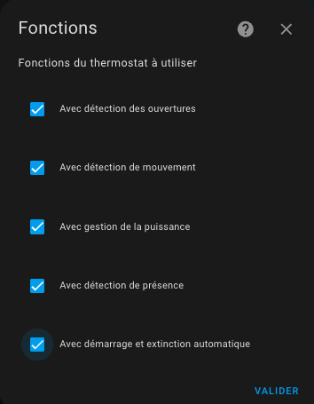

>  _*Historique des dernières versions*_
> * **Release 6.8**:
>   - Ajout d'une nouvelle méthode de régulation pour les Versatile Thermostat de type `over_climate`. Cette méthode nommée 'Contrôle direct de la vanne' permet de contrôler directement la vanne d'un TRV et éventuellement un décalage pour calibrer le thermomètre interne de votre TRV. Cette nouvelle méthode a été testée avec des Sonoff TRVZB et généralisée pour d'autre type de TRV pour lesquels la vanne est directement commandable via des entités de type `number`
> * **Release 6.5** :
>   - Ajout d'une nouvelle fonction permettant l'arrêt et la relance automatique d'un VTherm `over_climate` [585](https://github.com/jmcollin78/versatile_thermostat/issues/585)
>   - Amélioration de la gestion des ouvertures au démarrage. Permet de mémoriser et de recalculer l'état d'une ouverture au redémarage de Home Assistant [504](https://github.com/jmcollin78/versatile_thermostat/issues/504)
> * **Release 6.0** :
>   - Ajout d'entités du domaine Number permettant de configurer les températures des presets [354](https://github.com/jmcollin78/versatile_thermostat/issues/354)
>   - Refonte complète du menu de configuration pour supprimer les températures et utililsation d'un menu au lieu d'un tunnel de configuration [354](https://github.com/jmcollin78/versatile_thermostat/issues/354)
> * **Release 5.4** :
>   - Ajout du pas de température [#311](https://github.com/jmcollin78/versatile_thermostat/issues/311),
>   - ajout de seuils de régulation pour les `over_valve` pour éviter de trop vider la batterie des TRV [#338](https://github.com/jmcollin78/versatile_thermostat/issues/338),
>   - ajout d'une option permettant d'utiliser la température interne d'un TRV pour forcer l' auto-régulation [#348](https://github.com/jmcollin78/versatile_thermostat/issues/348),
>   - ajout d'une fonction de keep-alive pour les VTherm `over_switch` [#345](https://github.com/jmcollin78/versatile_thermostat/issues/345)

Autres versions

> * **Release 5.3** : Ajout d'une fonction de pilotage d'une chaudière centrale [#234](https://github.com/jmcollin78/versatile_thermostat/issues/234) - plus d'infos ici: [Le contrôle d'une chaudière centrale](#le-contrôle-dune-chaudière-centrale). Ajout de la possibilité de désactiver le mode sécurité pour le thermomètre extérieur [#343](https://github.com/jmcollin78/versatile_thermostat/issues/343)
> * **Release 5.2** : Ajout d'un `central_mode` permettant de piloter tous les VTherms de façon centralisée [#158](https://github.com/jmcollin78/versatile_thermostat/issues/158).
> * **Release 5.1** : Limitation des valeurs envoyées aux valves et au température envoyées au climate sous-jacent.
> * **Release 5.0** : Ajout d'une configuration centrale permettant de mettre en commun les attributs qui peuvent l'être [#239](https://github.com/jmcollin78/versatile_thermostat/issues/239).
> * **Release 4.3** : Ajout d'un mode auto-fan pour le type `over_climate` permettant d'activer la ventilation si l'écart de température est important [#223](https://github.com/jmcollin78/versatile_thermostat/issues/223).
> * **Release 4.2** : Le calcul de la pente de la courbe de température se fait maintenant en °/heure et non plus en °/min [#242](https://github.com/jmcollin78/versatile_thermostat/issues/242). Correction de la détection automatique des ouvertures par l'ajout d'un lissage de la courbe de température .
> * **Release 4.1** : Ajout d'un mode de régulation **Expert** dans lequel l'utilisateur peut spécifier ses propres paramètres d'auto-régulation au lieu d'utiliser les pre-programmés [#194](https://github.com/jmcollin78/versatile_thermostat/issues/194).
> * **Release 4.0** : Ajout de la prise en charge de la **Versatile Thermostat UI Card**. Voir [Versatile Thermostat UI Card](https://github.com/jmcollin78/versatile-thermostat-ui-card). Ajout d'un mode de régulation **Slow** pour les appareils de chauffage à latence lente [#168](https://github.com/jmcollin78/versatile_thermostat/issues/168). Changement de la façon dont **la puissance est calculée** dans le cas de VTherm avec des équipements multi-sous-jacents [#146](https://github.com/jmcollin78/versatile_thermostat/issues/146). Ajout de la prise en charge de AC et Heat pour VTherm via un interrupteur également [#144](https://github.com/jmcollin78/versatile_thermostat/pull/144)
> * **Release 3.8**: Ajout d'une **fonction d'auto-régulation** pour les thermostats `over climate` dont la régulation est faite par le climate sous-jacent. Cf. [L'auto-régulation](#lauto-régulation) et [#129](https://github.com/jmcollin78/versatile_thermostat/issues/129). Ajout de la **possibilité d'inverser la commande** pour un thermostat `over switch` pour adresser les installations avec fil pilote et diode [#124](https://github.com/jmcollin78/versatile_thermostat/issues/124).
> * **Release 3.7**: Ajout du type de **Versatile Thermostat `over valve`** pour piloter une vanne TRV directement ou tout autre équipement type gradateur pour le chauffage. La régulation se fait alors directement en agissant sur le pourcentage d'ouverture de l'entité sous-jacente : 0 la vanne est coupée, 100 : la vanne est ouverte à fond. Cf. [#131](https://github.com/jmcollin78/versatile_thermostat/issues/131). Ajout d'une fonction permettant le bypass de la détection d'ouverture [#138](https://github.com/jmcollin78/versatile_thermostat/issues/138). Ajout de la langue Slovaque
> * **Release 3.6**: Ajout du paramètre `motion_off_delay` pour améliorer la gestion de des mouvements [#116](https://github.com/jmcollin78/versatile_thermostat/issues/116), [#128](https://github.com/jmcollin78/versatile_thermostat/issues/128). Ajout du mode AC (air conditionné) pour un VTherm over switch. Préparation du projet Github pour faciliter les contributions [#127](https://github.com/jmcollin78/versatile_thermostat/issues/127)
> * **Release 3.5**: Plusieurs thermostats sont possibles en "thermostat over climate" mode [#113](https://github.com/jmcollin78/versatile_thermostat/issues/113)
> * **Release 3.4**: bug fix et exposition des preset temperatures pour le mode AC [#103](https://github.com/jmcollin78/versatile_thermostat/issues/103)
> * **Release 3.3**: ajout du mode Air Conditionné (AC). Cette fonction vous permet d'utiliser le mode AC de votre thermostat sous-jacent. Pour l'utiliser, vous devez cocher l'option "Uitliser le mode AC" et définir les valeurs de température pour les presets et pour les presets en cas d'absence
> * **Release 3.2** : ajout de la possibilité de commander plusieurs switch à partir du même thermostat. Dans ce mode, les switchs sont déclenchés avec un délai pour minimiser la puissance nécessaire à un instant (on minimise les périodes de recouvrement). Voir [Configuration](#sélectionnez-des-entités-pilotées)
> * **Release 3.1** : ajout d'une détection de fenêtres/portes ouvertes par chute de température. Cette nouvelle fonction permet de stopper automatiquement un radiateur lorsque la température chute brutalement. Voir [Le mode auto](#le-mode-auto)
> * **Release majeure 3.0** : ajout d'un équipement thermostat et de capteurs (binaires et non binaires) associés. Beaucoup plus proche de la philosphie Home Assistant, vous avez maintenant un accès direct à l'énergie consommée par le radiateur piloté par le thermostat et à plein d'autres capteurs qui seront utiles dans vos automatisations et dashboard.
> * **release 2.3** : ajout de la mesure de puissance et d'énergie du radiateur piloté par le thermostat.
> * **release 2.2** : ajout de fonction de sécurité permettant de ne pas laisser éternellement en chauffe un radiateur en cas de panne du thermomètre
> * **release majeure 2.0** : ajout du thermostat "over climate" permettant de transformer n'importe quel thermostat en Versatile Thermostat et lui ajouter toutes les fonctions de ce dernier.

Changements dans la version 6.0

# Changements dans la version 6.0

## Entités de température pour les pre-réglages
Les températures des presets sont maintenant directement acessibles sous la forme d'entités reliés au VTherm.
Exemple :

Les entités Boost, Confort, Eco et Hors-gel permettent de régler directement les températures de ces présets sans avoir à reconfigurer le VTHerm dans les écrans de configuration.
Ces modifications sont persistentent à un redémarrage et sont prises en compte immédiatement par le VTherm.

En fonction des fonctions activées, la liste des températures peut être plus ou moins complète :
1. Si la gestion de présence est activée, les presets en cas d'absence sont créés. Ils sont suffixés par 'abs' pour absence,
2. Si la gestion de la climatisation (Mode AC) est activé, les presets en mode clim sont créés. Ils sont suffixés par 'clim' pour climatisation. Seul le preset Hors gel n'a pas d'équivalent en mode clim,
3. Les différentes combinaison absent et clim peuvent être créés en fonction de la configuration du VTherm

Si un VTherm utilise les preset de la configuration centrale, ces entités ne sont pas créées, car les températures des presets sont gérés par la configuration centrale.

### Dans le cas d'une configuration centrale
Si vous avez configuré une configuration centrale, celle-ci possède aussi ses propres presets qui répondent au même règles qu'énoncées ci-dessus.
Exemple d'une configuration centrale avec gestion de présence et mode AC (climatisation) :

Dans le cas d'un changement d'une température de la configuration centrale, tous les VTherm qui utilisent ce preset sont immédiatement mis à jour.

## Refonte du menu de configuration
Le menu de configuration a été totalement revu. Il s'adapte dynamiquement aux choix de l'utilisateur et permet d'accéder directement aux réglages de la fonction voulue sans avoir à dérouler tous le tunnel de configuration.

Pour créer un nouveau VTherm, il faudra d'abord choisir le type de VTherm :

Puis, vous accédez maintenant au menu de configuration suivant :

Chaque partie à configurer est accessible directement, sans avoir à dérouler tout le tunnel de configuration comme précédemment.

Vous noterez l'option de menu nommée `Fonctions` qui permet de choisir quelles fonctions vont être implémentées pour ce VTherm :

En fonction de vos choix, le menu principal s'adaptera pour ajouter les options nécessaires.

Exemple de menu avec toutes les fonctions cochées :

Vous pouvez constater que les options 'Détection des ouvertures', 'Détection de mouvement', 'Gestion de la puissance' et 'Gestion de présence' ont été ajoutées. Vous pouvez alors les configurer.

### Les options de menu 'Configuration incomplète' et 'Finaliser'

La dernière option du menu est spéciale. Elle permet de valider la création du VTherm lorsque toutes les fonctions ont été correctement configurées.
Si l'une options n'est pas correctement configurée, la dernière option est la suivante :

Sa sélection ne fait rien mais vous empêche de finaliser la création (resp. la modification) du VTherm.
**Vous devez alors chercher dans les options laquelle manque**.

Une fois que toute la configuration est valide, la dernière option se transforme en :

Cliquez sur cette option pour créér (resp. modifier) le VTherm :

Changements dans la version 5.0

# Changements dans la version 5.0

Vous pouvez maintenant définir une configuration centrale qui va vous permettre de mettre en commun sur tous vos VTherms (ou seulement une partie), certains attributs. Pour utiliser cette possibilité, vous devez :
1. Créer un VTherm de type "Configuration Centrale",
2. Saisir les attributs de cette configuration centrale

Pour l'utiliser ensuite dans les autres VTherms, vous devez les reconfigurer et à chaque fois que c'est possible cocher la case "Utiliser la configuration centrale". Cette case à cocher apparait dans tous les groupes d'attributs qui peuvent avoir recours à la configuration centrale : attributs principaux, TPI, ouvertures, mouvement, puissance, présence et paramètres avancés.

Les attributs configurable dans la configuration centrale est listée ici : [Synthèse des paramètres](#synthèse-des-paramètres).

Lors d'un changement sur la configuration centrale, tous les VTherms seront rechargés pour tenir compte de ces changements.

En conséquence toute la phase de paramètrage d'un VTherm a été profondemment modifiée pour pouvoir utiliser la configuration centrale ou surcharger les valeurs de la configuration centrale par des valeurs propre au VTherm en cours de configuration.

