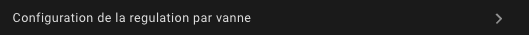
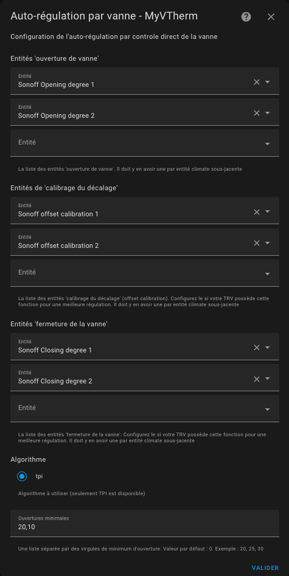

# L'auto-régulation

- [L'auto-régulation](#lauto-régulation)
      - [L'auto-régulation en mode Expert](#lauto-régulation-en-mode-expert)
      - [Synthèse de l'algorithme d'auto-régulation](#synthèse-de-lalgorithme-dauto-régulation)

Vous avez la possibilité d'activer la fonction d'auto-régulation pour les _VTherm_ de type `over_climate` uniquement.

Il y a globalement 2 cas :
1. Si votre sous-jacent est un _TRV_ et que la vanne est commandable directement dans Home Assistant (Sonoff TRVZB par exemple), cette fonction va autoriser _VTherm_ a manipuler directement l'ouverture de la vanne pour effectuer la régulation. L'ouverture est alors calculé par un algorithme de type _TPI_ (cf. [ici](algorithms.md)).
2. Sinon, Versatile Thermostat va adapter la consigne de température donnée au climate sous-jacent afin que la température de la pièce atteigne réellement la consigne.

## Configuration

### auto-régulation par contrôle direct de la vanne

Ce type d'auto-régulation nommé `Controle direct de la vanne` nécessite :
1. une entité de type `climate` qui est mis dans les sous-jacents du _VTherm_,
2. une enité de type `number` qui permet de contrôle du taux d'ouverture de la vanne du _TRV_,
3. une entité facultative de type `number` permettant de calibrer la température interne du sous-jacent,
3. une entité facultative de type `number` permettant le contrôle de la fermeture de la vanne

Lorsque l'auto-regulation choisie est `Contrôle direct de la vanne` sur un _VTherm_ `over_climate` alors une nouvelle page de configuration nommée `Configuration de la régulation par vanne` apparait :



Elle permet de configurer les entités de contrôle de la vanne :



Vous devez donner :
1. autant d'entités de contrôle d'ouverture de la vanne qu'il y a de sous-jacents et dans le même odre. Ces paramètres sont obligatoires,
2. autant d'entités de calibrage du décalage de température qu'il y a de sous-jacents et dans le même ordre. Ces paramètres sont facultatifs ; ils doivent être tous founis ou aucun,
3. autant d'entités de de contrôile du taux de fermture qu'il y a de sous-jacents et dans le même ordre. Ces paramètres sont facultatifs ; ils doivent être tous founis ou aucun,
4. une liste de valeurs minimales d'ouverture de la vanne lorsqu'elle doit être ouverte. Ce champ est une liste d'entier. Si la vanne doit être ouverte, elle le sera au minimum avec cette valeur d'ouverture. Cela permet de laisser passer suffisamment d'eau lorsqu'elle doit être ouverte.

L'algorithme de calcul du taux d'ouverture est basé sur le _TPI_ qui est décrit [ici](algorithms.md). C'est le même algorithme qui est utilisé pour les _VTherm_ `over_switch` et `over_valve`.

Si une entité de type taux de fermeture de la vanne est configurée, il sera positionné avec la valeur 100 - taux d'ouverture pour forcer la vanne dans un état.

Note: pour les Sonoff TRVZB, vous ne devez pas configurer les "closing degree". Cela rend inopérant le `hvac_action` qui est utilisé par _VTherm_ et qui indique que l'équipement est en chauffe.

### autres auto-régulation

Dans ce deuxième cas, le Versatile Thermostat calcule un décalage basé sur les informations suivantes :
1. la différence actuelle entre la température réelle et la température de consigne, appelé erreur brute,
2. l'accumulation des erreurs passées,
3. la différence entre la température extérieure et la consigne

Ces trois informations sont combinées pour calculer le décalage qui sera ajouté à la consigne courante et envoyé au climate sous-jacent.

La fonction d'auto-régulation se paramètre avec :
1. une dégré de régulation :
   1. Légère - pour des faibles besoin en auto-régulation. Dans ce mode, le décalage maximal sera de 1,5°,
   2. Medium - pour une auto-régulation moyenne. Un décalage maximal de 2° est possible dans ce mode,
   3. Forte - pour un fort besoin d'auto-régulation. Le décalage maximal est de 3° dans ce mode et l'auto-régulation réagira fortement aux changements de température.
2. Un seuil d'auto-régulation : valeur en dessous de laquelle une nouvelle régulation ne sera pas appliquée. Imaginons qu'à un instant t, le décalage soit de 2°. Si au prochain calcul, le décalage est de 2.4°, il sera pas appliqué. Il ne sera appliqué que la différence entre 2 décalages sera au moins égal à ce seuil,
3. Période minimal entre 2 auto-régulation : ce nombre, exprimé en minute, indique la durée entre 2 changements de régulation.

Ces trois paramètres permettent de moduler la régulation et éviter de multiplier les envois de régulation. Certains équipements comme les TRV, les chaudières n'aiment pas qu'on change la consigne de température trop souvent.

>  _*Conseil de mise en place*_
> 1. Ne démarrez pas tout de suite l'auto-régulation. Regardez comment se passe la régulation naturelle de votre équipement. Si vous constatez que la température de consigne n'est pas atteinte ou qu'elle met trop de temps à être atteinte, démarrez la régulation,
> 2. D'abord commencez par une légère auto-régulation et gardez les deux paramètres avec leur valeurs par défaut. Attendez quelques jours et vérifiez si la situation s'est améliorée,
> 3. Si ce n'est pas suffisant, passez en auto-régulation Medium, attendez une stabilisation,
> 4. Si ce n'est toujours pas suffisant, passez en auto-régulation Forte,
> 5. Si ce n'est toujours pas bon, il faudra passer en mode expert pour pouvoir régler les paramètres de régulation de façon fine. Voir en-dessous

L'auto-régulation consiste à forcer l'équipement a aller plus loin en lui forçant sa température de consigne régulièrement. Sa consommation peut donc être augmentée, ainsi que son usure.

#### L'auto-régulation en mode Expert

En mode **Expert** pouvez régler finement les paramètres de l'auto-régulation pour atteindre vos objeetifs et optimiser au mieux. L'algorithme calcule l'écart entre la consigne et la température réelle de la pièce. Cet écard est appelé erreur.
Les paramètres réglables sont les suivants :
1. `kp` : le facteur appliqué à l'erreur brute,
2. `ki` : le facteur appliqué à l'accumulation des erreurs,
3. `k_ext` : le facteur appliqué à la différence entre la température intérieure et la température externe,
4. `offset_max` : le maximum de correction (offset) que la régulation peut appliquer,
5. `stabilization_threshold` : un seuil de stabilisation qui lorsqu'il est atteint par l'erreur remet à 0, l'accumulation des erreurs,
6. `accumulated_error_threshold` : le maximum pour l'accumulation d'erreur.

Pour le tuning il faut tenir compte de ces observations :
1. `kp * erreur` va donner l'offset lié à l'erreur brute. Cet offset est directement proportionnel à l'erreur et sera à 0 lorsque la target sera atteinte,
2. l'accumulation de l'erreur permet de corriger le stabilisation de la courbe alors qu'il reste une erreur. L'erreur s'accumule et l'offset augmente donc progressivement ce qui devrait finir par stabiliser sur la température cible. Pour que ce paramètre fondamental est un effet il faut qu'il soit pas trop petit. Une valeur moyenne est 30
3. `ki * accumulated_error_threshold` va donner l'offset maximal lié à l'accumulation de l'erreur,
4. `k_ext` permet d'appliquer tout de suite (sans attendre une accumulation des erreurs) une correction lorsque la température extérieure est très différente de la température cible. Si la stabilisation se fait trop haut lorsqu'il les écarts de température sont importants, c'est que ce paramètre est trop fort. Il devrait pouvoir être annulé totalement pour laisser faire les 2 premiers offset

Les valeurs préprogrammées sont les suivantes :

Slow régulation :

    kp: 0.2  # 20% of the current internal regulation offset are caused by the current difference of target temperature and room temperature
    ki: 0.8 / 288.0  # 80% of the current internal regulation offset are caused by the average offset of the past 24 hours
    k_ext: 1.0 / 25.0  # this will add 1°C to the offset when it's 25°C colder outdoor than indoor
    offset_max: 2.0  # limit to a final offset of -2°C to +2°C
    stabilization_threshold: 0.0  # this needs to be disabled as otherwise the long term accumulated error will always be reset when the temp briefly crosses from/to below/above the target
    accumulated_error_threshold: 2.0 * 288  # this allows up to 2°C long term offset in both directions

Light régulation :

    kp: 0.2
    ki: 0.05
    k_ext: 0.05
    offset_max: 1.5
    stabilization_threshold: 0.1
    accumulated_error_threshold: 10


Medium régulation :

    kp: 0.3
    ki: 0.05
    k_ext: 0.1
    offset_max: 2
    stabilization_threshold: 0.1
    accumulated_error_threshold: 20


Strong régulation :

    """Strong parameters for regulation
    A set of parameters which doesn't take into account the external temp
    and concentrate to internal temp error + accumulated error.
    This should work for cold external conditions which else generates
    high external_offset"""

    kp: 0.4
    ki: 0.08
    k_ext: 0.0
    offset_max: 5
    stabilization_threshold: 0.1
    accumulated_error_threshold: 50

Pour utiliser le mode Expert il vous faut déclarer les valeurs que vous souhaitez utiliser pour chacun de ces paramètres dans votre `configuration.yaml` sous la forme suivante. Exemple de 'Extrem regulation` :
```
versatile_thermostat:
    auto_regulation_expert:
        kp: 0.6
        ki: 0.1
        k_ext: 0.0
        offset_max: 10
        stabilization_threshold: 0.1
        accumulated_error_threshold: 80
```
et bien sur, configurer le mode auto-régulation du VTherm en mode Expert. Tous les _VTherm_ en mode **Expert** utiliseront ces mêmes paramètres, il n'est pas possible d'avoir plusieurs réglages expert différent.

Pour que les modifications soient prises en compte, il faut soit **relancer totalement Home Assistant** soit juste l'intégration Versatile Thermostat (Outils de dev / Yaml / rechargement de la configuration / Versatile Thermostat).

>  _*Notes*_
> 1. En mode expert, il est rarement nécessaire d'utiliser l'option [Compenser la température interne du sous-jacent](over-climate.md#compenser-la-température-interne-du-sous-jacent). Cela risque de générer des consignes vraiment très forte.

## Synthèse de l'algorithme d'auto-régulation

Une synthèse de l'algorithme d'auto-régulation est décrite [ici](algorithms.md#lalgorithme-dauto-régulation-sans-contrôle-de-la-vanne)