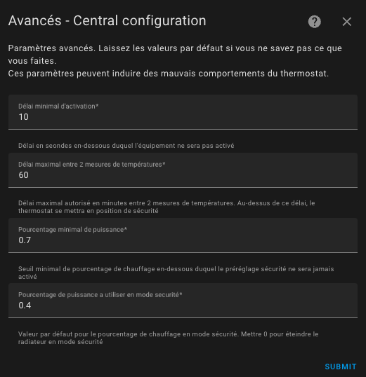

# Exemples de réglage

- [Exemples de réglage](#exemples-de-réglage)
  - [Chauffage électrique](#chauffage-électrique)
  - [Chauffage central (chauffage gaz ou fuel)](#chauffage-central-chauffage-gaz-ou-fuel)
  - [Le capteur de température alimenté par batterie](#le-capteur-de-température-alimenté-par-batterie)
  - [Capteur de température réactif (sur secteur)](#capteur-de-température-réactif-sur-secteur)
  - [Mes presets](#mes-presets)

## Chauffage électrique
- cycle : entre 5 et 10 minutes,
- minimal_activation_delay_sec : 30 secondes

## Chauffage central (chauffage gaz ou fuel)
- cycle : entre 30 et 60 min,
- minimal_activation_delay_sec : 300 secondes (à cause du temps de réponse)

## Le capteur de température alimenté par batterie
Ces capteurs sont souvent paresseux et n'envoit pas toujours de mesure de température lorsqu'elle est stable. Par conséquent, les réglages doivent être laches pour éviter les faux positifs.

- security_delay_min : 60 min (parce que ces capteurs sont paresseux)
- security_min_on_percent : 0,7 (70% - on passe en mode sécurité si le radiateur chauffait plus de 70% du temps)
- security_default_on_percent : 0,4 (40% - en mode sécurité, on garde un fond de chauffe de 40% du temps pour éviter d'avoir trop froid)

Il faut comprendre ces réglages comme suit :

> Si le thermomètre n'envoie plus la température pendant 1 heure et que le pourcentage de chauffe (``on_percent``) était supérieur à 70 %, alors on ramène ce pourcentage de chauffe à 40 %.

A vous d'adapter ces réglages à votre cas !

Ce qui est important c'est de ne pas prendre trop de risque avec ces paramètres : supposez que vous êtes absent pour une longue période, que les piles de votre thermomètre arrivent en fin de vie, votre radiateur va chauffer 40% du temps pendant toute la durée de la panne.

Versatile Thermostat vous permet d'être notifié lorsqu'un évènement de ce type survient. Mettez en place, les alertes qui vont bien dès l'utilisation de ce thermostat. Cf. (#notifications)

## Capteur de température réactif (sur secteur)
Un thermomètre alimenté est censé est très régulier dans l'envoi des températures. Si il n'envoie rien pendant 15 min, il a certainement un soucis et on peut réagir plus vite sans risque de faux positif.
- security_delay_min : 15 min
- security_min_on_percent : 0,5 (50% - on passe en preset ``security`` si le radiateur chauffait plus de 50% du temps)
- security_default_on_percent : 0,25 (20% - en preset ``security``, on garde un fond de chauffe de 20% du temps)

## Mes presets
Ceci est juste un exemple de la façon dont j'utilise le préréglage. A vous de vous adapter à votre configuration mais cela peut être utile pour comprendre son fonctionnement.
``Hors gel`` : 10 °C
``Éco`` : 17 °C
``Confort`` : 19 °C
``Boost`` : 20 °C

Lorsque la présence est désactivée :
``Hors gel`` : 10 °C
``Éco`` : 16,5 °C
``Confort`` : 17 °C
``Boost`` : 17,5 °C

Le détecteur de mouvement de mon bureau est configuré pour utiliser ``Boost`` lorsqu'un mouvement est détecté et ``Eco`` sinon.

Le mode sécurité est réglé comme suit :

