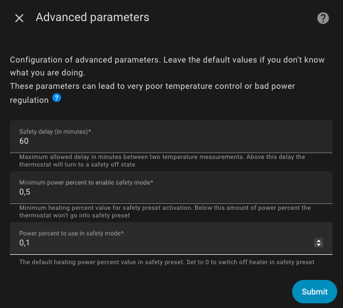

# Konfiguracja zaawansowana

- [Konfiguracja zaawansowana](#advanced-configuration)
  - [Ustawienia zaawansowane](#advanced-settings)
    - [Tryb bezpieczeństwa](#safety-mode)

Ustawienia te udoskonalają działanie termostatu, w szczególności mechanizm bezpieczeństwa dla termostatów. Brak sensorów temperatury (pokojowych lub zewnętrznych) może stanowić zagrożenie dla Twojego domu. Na przykład, jeśli czujnik temperatury utknie na wartości 10°C, urządzenia typu `Termostat na Klimacie` lub `Termostat na Zaworze` będą wymuszać maksymalne ogrzewanie, co może prowadzić do przegrzania pomieszczenia, a nawet uszkodzenia mienia, w najgorszym przypadku stwarzając ryzyko pożaru.

Aby temu zapobiec, VTherm zapewnia regularne raportowanie wartości odczytywanych z termometrów. Jeśli tak się nie dzieje, VTherm przełącza się w specjalny tryb zwany Trybem Bezpieczeństwa (Safety Mode). Ten tryb gwarantuje minimalne ogrzewanie, aby zapobiec przeciwnemu ryzyku całkowitego braku ogrzewania np. w środku zimy.

Problem polega na tym, że niektóre termometry — szczególnie zasilane bateryjnie — wysyłają aktualizacje temperatury tylko wtedy, gdy wartość się zmienia. Zatem całkiem możliwe jest, że przez wiele godzin nie nadejdą żadne aktualizacje temperatury, mimo że termometr działa poprawnie. Poniższe parametry pozwalają na precyzyjne dostrojenie progów aktywacji Trybu Bezpieczeństwa.

Jeśli Twój termometr posiada atrybut `last seen`, wskazujący czas ostatniego kontaktu, możesz określić go w głównych atrybutach VTherm, aby znacznie ograniczyć fałszywe aktywacje Trybu Bezpieczeństwa (patrz: [konfiguracja](base-attributes.md#choosing-base-attributes) oraz [rozwiązywanie problemów](troubleshooting.md#why-does-my-versatile-thermostat-switch-to-safety-mode)).

Dla `termostatu na klimacie` z samoregulacją Tryb Bezpieczeństwa jest niedostępny. W takim przypadku nie ma zagrożenia, istnieje jedynie ryzyko błędnej temperatury.

## Ustawienia zaawansowane

Ekran konfiguracji zaawansowanej wygląda następujaco:



### Tryb bezpieczeństwa

Drugie opóźnienie (`safety_delay_min`) to maksymalny czas pomiędzy dwoma pomiarami temperatury, po którym termostat VTherm przełącza się w Tryb Bezpieczeństwa (Safety Mode).

Trzeci parametr (`safety_min_on_percent`) to minimalna wartość `on_percent`, poniżej której Tryb Bezpieczeństwa nie zostanie aktywowany. To ustawienie zapobiega aktywacji Trybu Bezpieczeństwa, jeśli grzejnik nie nagrzewa się wystarczająco. W takim przypadku nie ma fizycznego zagrożenia dla domu, istnieje jedynie ryzyko przegrzania lub niedogrzania. 
Ustawienie tego parametru na `0.00` spowoduje uruchomienie Trybu Bezpieczeństwa niezależnie od ostatniego ustawienia ogrzewania, natomiast wartość `1.00` nigdy nie uruchomi Trybu Bezpieczeństwa (w praktyce wyłączając tę funkcję). Może to być przydatne do dostosowania mechanizmu bezpieczeństwa do Twoich specyficznych potrzeb.

Czwarty parametr (`safety_default_on_percent`) definiuje wartość `on_percent` używaną, gdy termostat przełącza się w Tryb Bezpieczeństwa. Ustawienie go na `0` wyłączy termostat w Trybie Bezpieczeństwa, natomiast ustawienie na wartość taką jak `0.2` (20%) zapewni pewien poziom ogrzewania, zapobiegając całkowitemu wychłodzeniu pomieszczenia w przypadku awarii termometru.

Możliwe jest wyłączenie Trybu Bezpieczeństwa uruchamianego przez brak danych z termometru zewnętrznego. Ponieważ termometr zewnętrzny zazwyczaj ma niewielki wpływ na regulację (w zależności od konfiguracji), jego niedostępność może nie być krytyczna. Aby to zrobić, dodaj poniższe linie kodu do pliku  `configuration.yaml`:

```yaml
versatile_thermostat:
...
    safety_mode:
        check_outdoor_sensor: false
```

Domyślnie termometr zewnętrzny może uruchomić Tryb Bezpieczeństwa (Safety Mode), jeśli przestanie wysyłać dane. Pamiętaj, że Home Assistant musi zostać ponownie uruchomiony, aby te zmiany zaczęły obowiązywać. To ustawienie dotyczy wszystkich termostatów, które współdzielą termometr zewnętrzny.

>  _*Wskazówki*_
> 1. Gdy czujnik temperatury wznowi raportowanie, ustawienie wstępne zostanie przywrócone do poprzedniej wartości.
> 2. Wymagane są dwa źródła temperatury: wewnętrzne i zewnętrzne. Oba muszą raportować wartości, w przeciwnym razie termostat przełączy się na tryb bezpieczny.
> 3. Dostępna jest akcja umożliwiająca dostosowanie trzech parametrów bezpieczeństwa. Może to pomóc w dopasowaniu Trybu Bezpieczeństwa do Twoich potrzeb.
> 4. W normalnym użytkowaniu `safety_default_on_percent` powinno być niższe niż `safety_min_on_percent`.
> 5. Jeśli korzystasz z karty interfejsu Versatile Thermostat (patrz [tutaj](additions.md#better-with-the-versatile-thermostat-ui-card)), karta termostatu w Trybie Bezpieczeństwa jest pokrywana szarym tłem, wskazując wadliwy termometr oraz czas od ostatniej aktualizacji jego wartości:
>
> .
