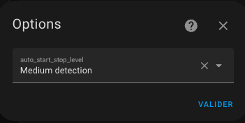

# Auto-start / Auto-stop

- [Auto-start / Auto-stop](#auto-start--auto-stop)
  - [Configure Auto-start/stop](#configure-auto-startstop)
  - [Usage](#usage)

This feature allows _VTherm_ to stop an appliance that doesn't need to be on and restart it when conditions require it. This function includes three settings that control how quickly the appliance is stopped and restarted.
Exclusively reserved for _VTherm_ of type `over_climate`, it applies to the following use case:
1. Your appliance is permanently powered on and consumes electricity even when heating (or cooling) is not needed. This is often the case with heat pumps (_PAC_) that consume power even in standby mode.
2. The temperature conditions are such that heating (or cooling) is not needed for a long period: the setpoint is higher (or lower) than the room temperature.
3. The temperature rises (or falls), remains stable, or falls (or rises) slowly.

In such cases, it is preferable to ask the appliance to turn off to avoid unnecessary power consumption in standby mode.

## Configure Auto-start/stop

To use this feature, you need to:
1. Add the `With auto-start and stop` function in the 'Functions' menu.
2. Set the detection level in the 'Auto-start/stop' option that appears when the function is activated. Choose the detection level between 'Slow', 'Medium', and 'Fast'. With the 'Fast' setting, stops and restarts will occur more frequently.

The 'Very slow' setting allows about 60 minutes between a stop and a restart,
The 'Slow' setting allows about 30 minutes between a stop and a restart,
The 'Medium' setting sets the threshold to about 15 minutes, and the 'Fast' setting puts it at 7 minutes.

Note that these are not absolute settings since the algorithm takes into account the slope of the room temperature curve to respond accordingly. It is still possible that a restart occurs shortly after a stop if the temperature drops significantly.

## Usage

Once the function is configured, you will now have a new `switch` type entity that allows you to enable or disable auto-start/stop without modifying the configuration. This entity is available on the _VTherm_ device and is named `switch.<name>_enable_auto_start_stop`.

Check the box to allow auto-start and auto-stop, and leave it unchecked to disable the feature.

Note: The auto-start/stop function will only turn a _VTherm_ back on if it was turned off by this function. This prevents unwanted or unexpected activations. Naturally, the off state is preserved even after a Home Assistant restart.

>  _*Notes*_
> 1. The detection algorithm is described [here](algorithms.md#auto-startstop-algorithm).
> 2. Some appliances (boilers, underfloor heating, _PAC_, etc.) may not like being started/stopped too frequently. If that's the case, it might be better to disable the function when you know the appliance will be used. For example, I disable this feature during the day when presence is detected because I know my _PAC_ will turn on often. I enable auto-start/stop at night or when no one is home, as the setpoint is lowered and it rarely triggers.
> 3. If you use the Versatile Thermostat UI card (see [here](additions.md#better-with-the-versatile-thermostat-ui-card)), a checkbox is directly visible on the card to disable auto-start/stop, and a _VTherm_ stopped by auto-start/stop is indicated by the icon: .