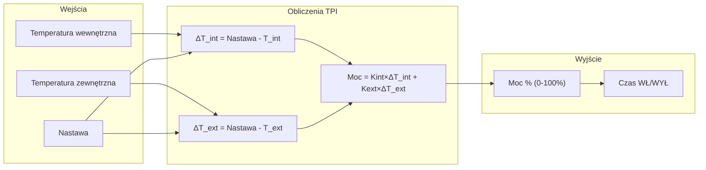
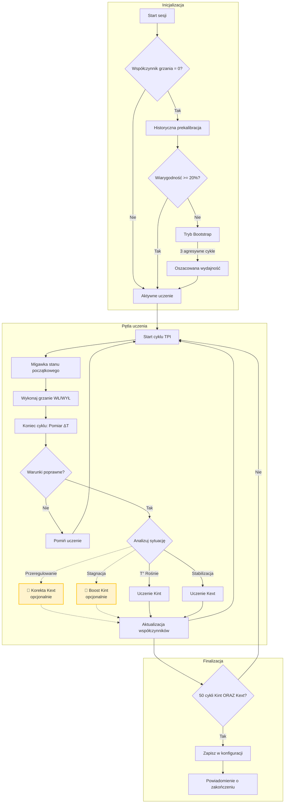
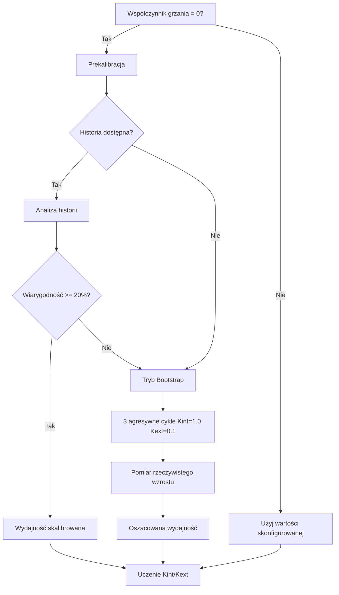
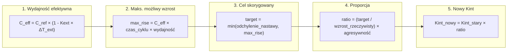
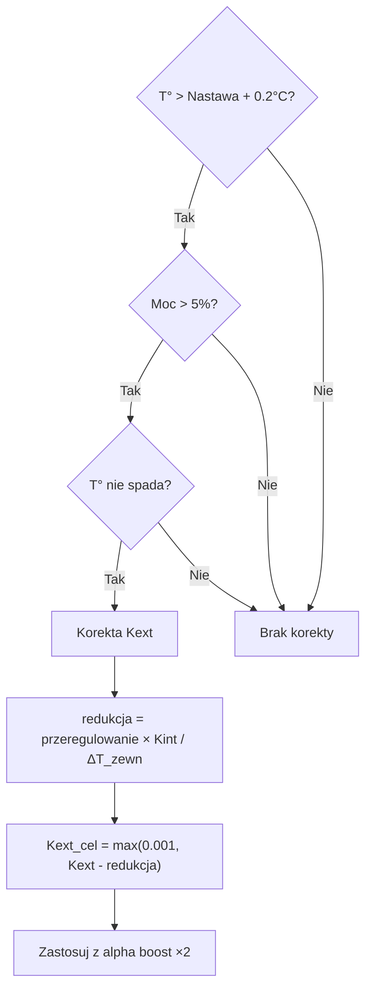
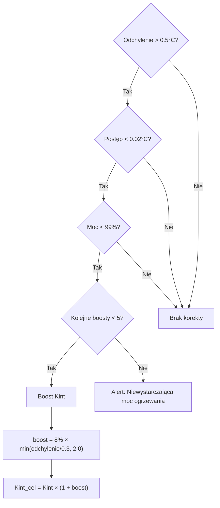
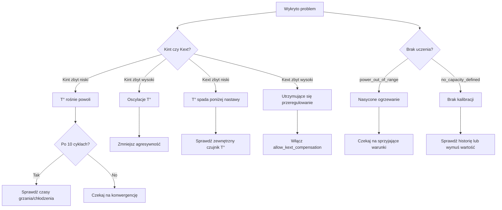

# 🧠 Auto TPI: Pogłębiony przewodnik techniczny

> [!NOTE]
> Ten dokument jest przeznaczony dla zaawansowanych użytkowników, którzy chcą szczegółowo zrozumieć algorytm Auto TPI. Bardziej przystępne wprowadzenie znajduje się w [Przewodniku użytkownika Auto TPI](feature-autotpi.md).

---

## Spis treści

1. [Algorytm TPI](#algorytm-tpi)
2. [Szczegółowy cykl uczenia](#szczegółowy-cykl-uczenia)
3. [Kalibracja wydajności cieplnej](#kalibracja-wydajności-cieplnej)
4. [Algorytmy obliczania współczynników](#algorytmy-obliczania-współczynników)
5. [Mechanizmy automatycznej korekty](#mechanizmy-automatycznej-korekty)
6. [Zaawansowane parametry i stałe](#zaawansowane-parametry-i-stałe)
7. [Usługi i API](#usługi-i-api)
8. [Zaawansowana diagnostyka i rozwiązywanie problemów](#zaawansowana-diagnostyka-i-rozwiązywanie-problemów)

---

## Algorytm TPI

### Podstawowa zasada

Algorytm **TPI** (Time Proportional & Integral) oblicza **procent mocy** w każdym cyklu. Procent ten określa, jak długo grzejnik będzie aktywny podczas cyklu (np. 60% w 10-minutowym cyklu = 6 minut grzania).

### Podstawowy wzór

```
Moc = (Kint × ΔT_wewnętrzna) + (Kext × ΔT_zewnętrzna)
```

Gdzie:
- **Kint** (`tpi_coef_int`): Współczynnik wewnętrzny, reaguje na odchylenie od punktu nastawy
- **Kext** (`tpi_coef_ext`): Współczynnik zewnętrzny, kompensuje straty ciepła
- **ΔT_wewnętrzna** = Nastawa − Temperatura wewnętrzna
- **ΔT_zewnętrzna** = Nastawa − Temperatura zewnętrzna



### Rola współczynników

| Współczynnik | Rola | Sytuacja uczenia |
|-------------|------|-------------------|
| **Kint** | Kontroluje **reaktywność**: im wyższy, tym szybciej ogrzewanie reaguje na odchylenia | Podczas **wzrostu temperatury** (odchylenie > 0,05°C, moc < 99%) |
| **Kext** | Kompensuje **straty ciepła**: im wyższy, tym bardziej ogrzewanie przewiduje ochłodzenie | Podczas **stabilizacji** wokół punktu nastawy (odchylenie < 0,5°C) |

---

## Szczegółowy cykl uczenia

### Przegląd przepływu



> [!NOTE]
> **Żółte ramki z przerywaną linią** (🔸) reprezentują **opcjonalne** mechanizmy korekcyjne. Muszą być wyraźnie włączone za pomocą parametrów usługi `set_auto_tpi_mode`.

### Szczegóły migawki cyklu

Na początku każdego cyklu algorytm rejestruje bieżący stan:

| Rejestrowane dane | Zastosowanie |
|---------------|-------|
| `last_temp_in` | Temperatura wewn. na początku cyklu |
| `last_temp_out` | Temperatura zewn. na początku cyklu |
| `last_order` | Nastawa na początku cyklu |
| `last_power` | Obliczona moc dla tego cyklu (0.0 do 1.0) |
| `last_state` | Tryb HVAC (grzanie/chłodzenie) |

Na końcu cyklu wartości te są porównywane z aktualnymi pomiarami w celu obliczenia postępu.

### Warunki walidacji cyklu

Cykl jest **ignorowany** w procesie uczenia, jeśli:

| Warunek | Powód |
|-----------|--------|
| Moc = 0% lub 100% | Nasycenie: brak użytecznych informacji o wydajności |
| Nastawa zmieniona | Cel został zmieniony w trakcie cyklu |
| Aktywne ograniczanie mocy | Ogrzewanie zostało wymuszone na WYŁ przez Power Manager |
| Wykryto awarię | Wykryto anomalię (brak efektu grzania) |
| Kocioł centralny WYŁ | Termostat zgłasza zapotrzebowanie, ale kocioł nie reaguje |
| Pierwszy cykl po restarcie | Brak wiarygodnych danych referencyjnych |

---

## Kalibracja wydajności cieplnej

### Definicja

**Wydajność cieplna** (lub **współczynnik grzania**) reprezentuje maksymalną prędkość wzrostu temperatury systemu, wyrażoną w **°C na godzinę** (°C/h).

Przykład: Wydajność 2,0 °C/h oznacza, że grzejnik może podnieść temperaturę o 2°C w ciągu jednej godziny przy pełnej mocy (w idealnych warunkach adiabatycznych).

### Metody wyznaczania



### Prekalibracja poprzez analizę historii

Usługa `auto_tpi_calibrate_capacity` analizuje historię czujników:

1. **Pobranie** danych `temperature_slope` i `power_percent` z 30 dni
2. **Filtrowanie**: zachowanie tylko punktów, gdzie `power >= 95%`
3. **Eliminacja wartości odstających** za pomocą metody IQR (rozstęp międzykwartylowy)
4. **Obliczanie 75. percentyla** nachyleń (bardziej reprezentatywny niż mediana)
5. **Korekta adiabatyczna**: `Wydajność = P75 + Kext × ΔT`
6. **Zastosowanie marginesu bezpieczeństwa**: domyślnie 20%

### Tryb Bootstrap

Jeśli historia jest niewystarczająca (wiarygodność < 20%), system przechodzi w **tryb bootstrap**:

- **Agresywne współczynniki**: Kint = 1.0, Kext = 0.1
- **Czas trwania**: minimum 3 cykle
- **Cel**: Wywołanie znacznego wzrostu temperatury w celu pomiaru rzeczywistej wydajności
- **Zabezpieczenie czasowe**: Jeśli po 5 cyklach wystąpi błąd, domyślna wydajność = 0,3 °C/h (wolne systemy)

---

## Algorytmy obliczania współczynników

### Uczenie Kint (Współczynnik wewnętrzny)

Algorytm dostosowuje Kint, gdy temperatura **rośnie** w stronę nastawy.

#### Szczegółowy wzór



#### Użyte zmienne

| Zmienna | Opis | Typowa wartość |
|----------|-------------|---------------|
| `C_ref` | Skalibrowana wydajność referencyjna | 1.5 °C/h |
| `Kext` | Aktualny współczynnik zewnętrzny | 0.02 |
| `ΔT_ext` | Różnica temp. wewn./zewn. | 15°C |
| `czas_cyklu` | W godzinach | 0.167 (10 min) |
| `wydajność` | Użyty procent mocy | 0.70 |
| `agresywność` | Współczynnik moderacji | 0.9 |

### Uczenie Kext (Współczynnik zewnętrzny)

Algorytm dostosowuje Kext, gdy temperatura jest **bliska nastawy** (|odchylenie| < 0,5°C).

#### Wzór

```
Korekta = Kint × (odchylenie_wewn / odchylenie_zewn)
Kext_nowy = Kext_stary + Korekta
```

- Jeśli odchylenie_wewn **ujemne** (przeregulowanie) → Korekta ujemna → **Kext maleje**
- Jeśli odchylenie_wewn **dodatnie** (niedoregulowanie) → Korekta dodatnia → **Kext rośnie**

### Metody wygładzania

Dostępne są dwie metody wygładzania nowych wartości:

#### Średnia ważona (tryb „Discovery”)

```
Kint_finalny = (Kint_stary × licznik + Kint_nowy) / (licznik + 1)
```

| Cykl | Stara waga | Nowa waga | Wpływ nowej wartości |
|-------|------------|------------|------------------|
| 1 | 1 | 1 | 50% |
| 10 | 10 | 1 | 9% |
| 50 | 50 | 1 | 2% |

> Licznik jest ograniczony do 50, aby zachować minimalną reaktywność.

#### EWMA (tryb „Fine Tuning”)

```
Kint_finalny = (1 - α) × Kint_stary + α × Kint_nowy
α(n) = α₀ / (1 + decay_rate × n)
```

| Parametr | Domyślny | Opis |
|-----------|---------|-------------|
| `α₀` (początkowe alfa) | 0.08 | Początkowa waga nowych wartości |
| `decay_rate` | 0.12 | Prędkość spadku wartości alfa |

---

## Mechanizmy automatycznej korekty

### Korekta przeregulowania (Kext Deboost)

> **Aktywacja**: parametr `allow_kext_compensation_on_overshoot` w usłudze `set_auto_tpi_mode`

Wykrywa i koryguje sytuację, gdy temperatura **przekracza nastawę** i nie spada.



### Korekta stagnacji (Kint Boost)

> **Aktywacja**: parametr `allow_kint_boost_on_stagnation` w usłudze `set_auto_tpi_mode`

Wykrywa i koryguje sytuację, gdy temperatura **stoi w miejscu** mimo znaczącego odchylenia.



---

## Zaawansowane parametry i stałe

### Stałe wewnętrzne (niekonfigurowalne)

| Stała | Wartość | Opis |
|----------|-------|-------------|
| `MIN_KINT` | 0.01 | Dolny limit Kint dla zachowania reaktywności |
| `OVERSHOOT_THRESHOLD` | 0.2°C | Próg przeregulowania wyzwalający korektę |
| `OVERSHOOT_POWER_THRESHOLD` | 5% | Min. moc, by uznać przeregulowanie za błąd Kext |
| `OVERSHOOT_CORRECTION_BOOST` | 2.0 | Mnożnik alfa podczas korekty |
| `NATURAL_RECOVERY_POWER_THRESHOLD` | 20% | Maks. moc do pominięcia uczenia przy naturalnym powrocie |
| `INSUFFICIENT_RISE_GAP_THRESHOLD` | 0.5°C | Min. odchylenie wyzwalające boost Kint |
| `MAX_CONSECUTIVE_KINT_BOOSTS` | 5 | Limit przed alertem o niewystarczającej mocy |
| `MIN_PRE_BOOTSTRAP_CALIBRATION_RELIABILITY` | 20% | Min. wiarygodność do pominięcia bootstrapu |

### Parametry konfigurowalne

| Parametr | Typ | Domyślny | Zakres |
|-----------|------|---------|-------|
| **Agresywność** | Suwak | 1.0 | 0.5 - 1.0 |
| **Czas nagrzewania** | Minuty | 5 | 1 - 30 |
| **Czas chłodzenia** | Minuty | 7 | 1 - 60 |
| **Współczynnik grzania** | °C/h | 0 (auto) | 0 - 5.0 |
| **Waga początkowa** (Discovery) | Całkowita | 1 | 1 - 50 |
| **Alpha** (Fine Tuning) | Zmiennoprzec. | 0.08 | 0.01 - 0.3 |
| **Wsp. zaniku** | Zmiennoprzec. | 0.12 | 0.0 - 0.5 |

---

## Usługi i API

### `versatile_thermostat.set_auto_tpi_mode`

Kontroluje start/stop uczenia.

```yaml
service: versatile_thermostat.set_auto_tpi_mode
target:
  entity_id: climate.my_thermostat
data:
  auto_tpi_mode: true                    # true = start, false = stop
  reinitialise: true                     # true = pełny reset, false = wznowienie
  allow_kint_boost_on_stagnation: false  # Boost Kint przy stagnacji
  allow_kext_compensation_on_overshoot: false  # Korekta Kext przy przeregulowaniu
```

### `versatile_thermostat.auto_tpi_calibrate_capacity`

Kalibruje wydajność cieplną na podstawie historii.

```yaml
service: versatile_thermostat.auto_tpi_calibrate_capacity
target:
  entity_id: climate.my_thermostat
data:
  start_date: "2024-01-01T00:00:00+00:00"  # Opcjonalnie
  end_date: "2024-02-01T00:00:00+00:00"    # Opcjonalnie
  min_power_threshold: 95                   # Min % mocy
  capacity_safety_margin: 20                # % marginesu bezpieczeństwa
  save_to_config: true                      # Zapisz w konfiguracji
```

**Zwracane wartości usługi**:

| Klucz | Opis |
|-----|-------------|
| `max_capacity` | Obliczona wydajność brutto (°C/h) |
| `recommended_capacity` | Wydajność po uwzględnieniu marginesu (°C/h) |
| `reliability` | Indeks wiarygodności (%) |
| `samples_used` | Liczba użytych próbek |
| `outliers_removed` | Liczba usuniętych wartości odstających |

---

## Zaawansowana diagnostyka i rozwiązywanie problemów

### Czujnik diagnostyczny

Encja: `sensor.<nazwa>_auto_tpi_learning_state`

| Atrybut | Opis |
|-----------|-------------|
| `active` | Uczenie w toku |
| `heating_cycles_count` | Całkowita liczba zaobserwowanych cykli |
| `coeff_int_cycles` | Zatwierdzone cykle Kint |
| `coeff_ext_cycles` | Zatwierdzone cykle Kext |
| `model_confidence` | Wiarygodność 0.0 - 1.0 |
| `calculated_coef_int` | Bieżący Kint |
| `calculated_coef_ext` | Bieżący Kext |
| `last_learning_status` | Powód ostatniego cyklu |
| `capacity_heat_status` | `learning` lub `learned` |
| `capacity_heat_value` | Bieżąca wydajność (°C/h) |

### Typowe statusy uczenia

| Status | Znaczenie | Sugerowane działanie |
|--------|---------|------------------|
| `learned_indoor_heat` | Kint zaktualizowany pomyślnie | Norma |
| `learned_outdoor_heat` | Kext zaktualizowany pomyślnie | Norma |
| `power_out_of_range` | Moc wynosi 0% lub 100% | Czekaj na cykl nienasycony |
| `real_rise_too_small` | Wzrost < 0,01°C | Sprawdź czujnik lub czas cyklu |
| `setpoint_changed_during_cycle` | Nastawa zmieniona | Unikaj zmieniania nastawy |
| `no_capacity_defined` | Brak skalibrowanej wydajności | Czekaj na kalibrację/bootstrap |
| `corrected_kext_overshoot` | Zastosowano korektę przeregulowania | Norma, jeśli Kext zbyt wysoki |
| `corrected_kint_insufficient_rise` | Zastosowano boost Kint | Norma, jeśli Kint zbyt niski |
| `max_kint_boosts_reached` | 5 kolejnych boostów | **Niewystarczająca moc ogrzewania** |

### Diagnostyczne drzewo decyzyjne



### Plik trwałości

**Lokalizacja**: `.storage/versatile_thermostat_{unique_id}_auto_tpi_v2.json`

Ten plik zawiera kompletny stan uczenia i jest przywracany przy restarcie Home Assistanta. Można go usunąć, aby wymusić pełny reset (niezalecane).

---

## Dodatki

### Zalecane wartości referencyjne

| Typ ogrzewania | Czas nagrzewania | Czas chłodzenia | Typowa wydajność |
|--------------|--------------|--------------|------------------|
| Konwektor elektryczny | 2-5 min | 3-7 min | 2.0-3.0 °C/h |
| Grzejnik akumulacyjny | 5-10 min | 10-20 min | 1.0-2.0 °C/h |
| Ogrzewanie podłogowe | 15-30 min | 30-60 min | 0.3-0.8 °C/h |
| Kocioł centralny | 5-15 min | 10-30 min | 1.0-2.5 °C/h |

### Kompletne wzory matematyczne

**Wydajność efektywna**:
$$C_{eff} = C_{ref} \times (1 - K_{ext} \times \Delta T_{ext})$$

**Adaptacyjne Alfa (EWMA)**:
$$\alpha(n) = \frac{\alpha_0}{1 + k \times n}$$

**Wiarygodność kalibracji**:
$$reliability = 100 \times \min\left(\frac{samples}{20}, 1\right) \times \max\left(0, 1 - \frac{CV}{2}\right)$$

Gdzie CV = Współczynnik zmienności (odchylenie standardowe / średnia)
