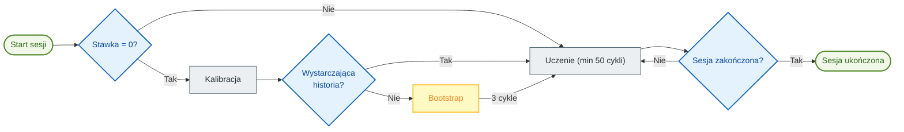

# 🧠 Auto TPI: Automatyczne uczenie

> [!NOTE]
> Ta funkcja jest przeznaczona głównie dla systemów grzewczych typu **Switch** (Włącz/Wyłącz), takich jak grzejniki elektryczne, kotły, ogrzewanie podłogowe lub piece na pelet. Adaptacja dla termostatycznych zaworów grzejnikowych (TRV) pozostaje problematyczna ze względu na ich nieliniowość.

**Auto TPI** pozwala termostatowi samodzielnie nauczyć się charakterystyki cieplnej pomieszczenia. Automatycznie dostosowuje współczynniki $K_{int}$ (bezwładność wewnętrzna) i $K_{ext}$ (izolacja zewnętrzna), aby osiągnąć i utrzymać zadaną temperaturę z optymalną precyzją.

> [!TIP]
> **Dla zaawansowanych użytkowników**: Szczegółowa dokumentacja techniczna wyjaśniająca algorytmy, wzory matematyczne i mechanizmy wewnętrzne jest dostępna tutaj: [Dokumentacja techniczna Auto TPI](feature-autotpi-technical.md).

---

## 🔄 Cykl sesji

Auto TPI działa poprzez **punktowe sesje uczenia**. Podczas sesji system dynamicznie analizuje reakcję pomieszczenia: najpierw ocenia rzeczywistą moc ogrzewania, a następnie dostosowuje Kint i Kext w ciągu co najmniej 50 cykli TPI na każdy współczynnik.

1.  **Inicjalizacja**: Jeśli **Współczynnik grzania** (Heat Rate) wynosi 0, system najpierw próbuje przeprowadzić **Kalibrację**, analizując historyczne dane dotyczące temperatury, nachylenia i mocy (za pomocą usługi `calibrate_capacity`).
2.  **Tryb Bootstrap**: Jeśli historia nie jest wystarczająco wiarygodna, aby oszacować współczynnik grzania, system przechodzi w tryb **Bootstrap**. Wykonuje 3 intensywne cykle grzania w celu okreśzenia wydajności grzewczej grzejnika.
3.  **Aktywne uczenie**: Po ustaleniu współczynnika grzania system precyzyjniej dostosowuje współczynniki TPI w każdym cyklu. Ta faza trwa **minimum 50 cykli** na współczynnik, aby zapewnić ich stabilność.
4.  **Zapisywanie**: Na końcu sesji (po około 48 godzinach) nauczone współczynniki **oraz** końcowy współczynnik grzania są automatycznie zapisywane w stałej konfiguracji.

### Kiedy Kint i Kext są dostosowywane?

System uczy się obu współczynników w różnych sytuacjach:

| Współczynnik | Sytuacja uczenia | Wyjaśnienie |
| :--- | :--- | :--- |
| **Kint** (bezwładność wewnętrzna) | Podczas **wzrostu temperatury**, gdy odchylenie od wartości zadanej jest znaczące (> 0,05°C), a ogrzewanie nie jest nasycone (100%). | Kint kontroluje reaktywność ogrzewania. Dostosowuje się, gdy system musi „nadrobić” temperaturę do wartości zadanej. |
| **Kext** (izolacja zewnętrzna) | Podczas **stabilizacji wokół wartości zadanej**, gdy odchylenie jest małe (< 1°C). | Kext kompensuje straty ciepła na zewnątrz. Dostosowuje się, gdy system utrzymuje temperaturę. |

> [!TIP]
> Dlatego ważne jest, aby podczas uczenia tworzyć różnorodne cykle grzania: wzrost temperatury pozwala na regulację Kint, a stabilizacja pozwala na regulację Kext.

> [!NOTE]
> **Cykle nasycone**: Cykle o mocy **0%** lub **100%** są **ignorowane** przy obliczaniu współczynników Kint i Kext (ponieważ nie dostarczają użytecznych informacji o odpowiedzi termicznej). Jednak cykle o mocy 100% są używane do dostosowania **współczynnika grzania**.

---

## 🚀 Rozpoczęcie uczenia

Gdy funkcja **Auto TPI** zostanie włączona i skonfigurowana dla termostatu, uczenie nie rozpocznie się automatycznie. Musisz je uruchomić ręcznie:

1.  **Za pomocą dedykowanej karty (zalecane)**: Użyj przycisku „Play” na karcie [Auto TPI Learning Card](https://github.com/KipK/auto-tpi-learning-card).
2.  **Za pomocą usługi „Set Auto TPI Mode”**: Wywołaj tę usługę (`set_auto_tpi_mode`) z narzędzi deweloperskich. Usługa ta uruchamia lub zatrzymuje sesję Auto TPI.

---

## ⚙️ Standardowa konfiguracja

Podczas włączania Auto TPI dostępne są następujące parametry:

| Parametr | Opis |
| :--- | :--- |
| **Typ uczenia** | **Discovery** (dla wstępnego uczenia) lub **Fine Tuning** (aby doprecyzować istniejące ustawienia). |
| **Agresywność** | Współczynnik redukcji parametrów (1.0 = 100%). Zmniejsz tę wartość (np. 0.8), jeśli zauważysz częste przeregulowania zadanej temperatury (overshoot). |
| **Czas nagrzewania** | Czas potrzebny sprzętowi do osiągnięcia pełnej mocy (np. 5 min dla grzejnika elektrycznego). |
| **Czas chłodzenia** | Czas potrzebny do ostygnięcia po wyłączeniu (np. 7 min dla grzejnika elektrycznego). |
| **Współczynnik grzania** | Wydajność wzrostu temperatury (°C/godzinę). Pozostaw na **0**, aby system obliczył ją automatycznie poprzez kalibrację lub bootstrap. |

---

## 🛠️ Zaawansowana konfiguracja

Jeśli zaznaczysz „Włącz parametry zaawansowane”, uzyskasz dostęp do precyzyjnych ustawień algorytmów.

### Metoda „Discovery” (Średnia ważona)
Służy do szybkiej stabilizacji nowego systemu.
-   **Waga początkowa** (1 do 50): Definiuje znaczenie obecnych współczynników w porównaniu do nowych odkryć.
    -   Przy **1**: Nowo obliczone współczynniki niemal całkowicie zastępują stare. Uczenie jest szybkie, ale wrażliwe na zakłócenia.
    -   Przy **50**: Stare współczynniki mają znacznie większą wagę. Uczenie jest bardzo powolne, ale bardzo stabilne.
    -   **Porada**: Pozostaw na 1 dla wstępnego uczenia. Jeśli chcesz wznowić przerwane uczenie, zachowując część postępów, użyj wartości pośredniej (np. 25).

### Metoda „Fine Tuning” (EWMA)
Służy do łagodnej i bardzo precyzyjnej adaptacji.
-   **Alpha**: Współczynnik wygładzania. Im wyższy, tym szybciej system reaguje na ostatnie zmiany.
-   **Współczynnik zaniku (Decay Rate)**: Pozwala na stopniowe zmniejszanie prędkości uczenia się, aby ustabilizować się na najlepszych znalezionych wartościach.

---

## 💡 Najlepsze praktyki

### Unikaj zakłóceń zewnętrznych
Podczas sesji uczenia (zwłaszcza w pierwszych godzinach) staraj się unikać:
-   Bezpośredniego nasłonecznienia czujnika temperatury.
-   Korzystania z dodatkowego źródła ciepła (kominek, piec).
-   Silnych przeciągów (otwarte drzwi).
Czynniki te zniekształcają postrzeganie izolacji pomieszczenia przez system.

### Unikaj ekstremalnych warunków

> [!CAUTION]
> **Nie uruchamiaj uczenia, jeśli grzejniki pracują w nasyceniu** (stale 100% mocy). Dzieje się tak zazwyczaj podczas wyjątkowych mrozów, gdy ogrzewanie nie jest w stanie osiągnąć temperatury zadanej. W takich warunkach system nie może się poprawnie uczyć, ponieważ nie ma marginesu na regulację mocy. Poczekaj na łagodniejsze warunki pogodowe, aby rozpocząć sesję uczenia.

### Idealny przebieg sesji „Discovery”

> [!TIP]
> **Konkretny przykład**: Jeśli Twoja zwykła temperatura zadana wynosi **18°C**, tymczasowo obniż ją do **15°C** i poczekaj, aż pomieszczenie się ustabilizuje. Następnie uruchom uczenie i ustaw temperaturę z powrotem na **18°C**. Stworzy to różnicę 3°C, którą system będzie obserwował w celu nauki.

1.  **Przygotowanie**: Obniż temperaturę zadaną o co najmniej 3°C w stosunku do zwykłej temperatury. Pozwól pomieszczeniu ochłodzić się i ustabilizować w tej nowej temperaturze.
2.  **Uruchomienie**: Aktywuj uczenie i **ustaw temperaturę zadaną z powrotem na zwykłą wartość**. System będzie obserwował wzrost temperatury.
3.  **Stabilizacja**: Pozwól systemowi stabilizować temperaturę wokół wartości zadanej przez kilka godzin.
4.  **Bodziec**: Gdy współczynniki przestaną się znacząco zmieniać, wywołaj nowy cykl grzania, obniżając temperaturę zadaną o 2°C, a następnie podnosząc ją z powrotem.
5.  **Stabilizacja**: Pozwól systemowi stabilizować temperaturę wokół wartości zadanej przez kilka godzin.
6.  **Finalizacja**: Jeśli uczenie nie jest jeszcze zakończone, pozwól systemowi pracować do końca, wracając do normalnych nawyków życiowych. Auto TPI zatrzyma się samoczynnie, gdy współczynniki ustabilizują się po co najmniej 50 cyklach każdy.

> [!NOTE]
> **O przeregulowaniu (overshoot)**: Przeregulowanie podczas pierwszego wzrostu temperatury jest **normalne**, a nawet korzystne! Dostarcza cennych danych do nauki. System wykorzysta je do doprecyzowania współczynników. Jeśli jednak przeregulowania **utrzymują się lub nasilają** po kilku cyklach, może to wskazywać na problem z konfiguracją Auto TPI (nieprawidłowe czasy grzania/chłodzenia, zbyt wysoka agresywność) lub problem z samą konfiguracją VTherm.

### Idealny przebieg sesji „Fine Tuning”
1.  **Stabilność**: Zachowaj dotychczasowe nawyki grzewcze, unikając jedynie wyjątkowych zakłóceń (długo otwarte okna, dodatkowe ogrzewanie).
2.  **Obserwacja**: Pozwól systemowi obserwować mikrozmiany i dostosowywać współczynniki w ciągu 50 cykli.
3.  **Ponowna ocena**: Jeśli zauważysz, że współczynniki silnie dryfują lub komfort spada, lepiej jest ponownie uruchomić pełną sesję w trybie **Discovery**.
---

## 📊 Monitorowanie wizualne

Aby śledzić ewolucję uczenia w czasie rzeczywistym, zdecydowanie zaleca się zainstalowanie niestandardowej karty **Auto TPI Learning Card**.

### Instalacja przez HACS

Lub ręcznie dodaj niestandardowe repozytorium: [https://github.com/KipK/auto-tpi-learning-card](https://github.com/KipK/auto-tpi-learning-card)

### Funkcje karty

-   📈 Postęp kalibracji i uczenia w czasie rzeczywistym
-   🔢 Obliczane współczynniki `Kint`, `Kext` oraz współczynnik grzania
-   ▶️ Przycisk kontrolny do uruchamiania/zatrzymywania sesji
-   🔧 Opcje resetowania sesji, włączania Kint Boost lub Kext Deboost
