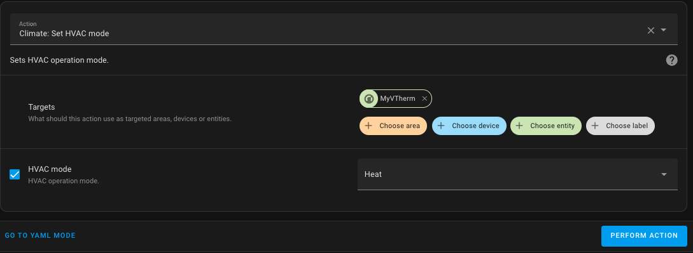
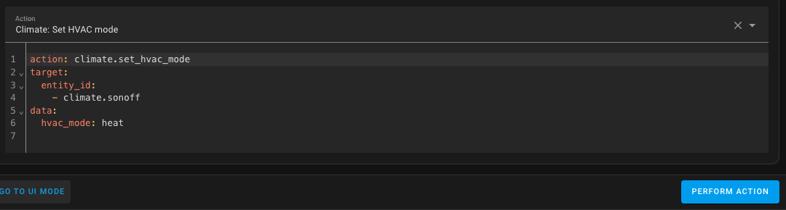

# Sterowanie kotłem głównym

- [Sterowanie kotłem głównym](#le-contrôle-dune-chaudière-centrale-controlling-a-central-boiler)
  - [Zasady](#principle)
  - [Konfiguracja](#configuration)
    - [Jak znaleźć właściwą akcję?](#how-to-find-the-right-action)
  - [Zdarzenia](#events)
  - [Ostrzeżenie](#warning)

Możesz sterować kotłem głównym. Jak długo możliwe jest jego załączanie lub wyłączanie z poziomu Home Assistanta, integracja `Versatile Thermostat` będzie w stanie kontrolować go bezpośrednio.

## Zasady
Podstawowa zasada działania jest następująca:
1. Dodawana jest nowa encja typu `binary_sensor`, domyślnie nazwana `binary_sensor.central_boiler`.
2. W konfiguracji termostatu określasz, czy ma on sterować kotłem. W instalacji heterogenicznej niektóre termostaty _VTherm_ powinny sterować kotłem, a inne nie. Dlatego w konfiguracji każdego termostatu należy wskazać, czy ma on sterować kotłem.
3. `binary_sensor.central_boiler` nasłuchuje zmian stanu w urządzeniach typu _VTherm_ oznaczonych jako sterujące kotłem.
4. Gdy liczba urządzeń sterowanych termostatem _VTherm_, które żądają ogrzewania (tj. gdy ich `hvac_action` zmienia się na `Heating`), przekroczy konfigurowalny próg, `binary_sensor.central_boiler` włącza się, a jeśli skonfigurowano usługę aktywacji, zostanie ona wywołana.
5. Jeśli liczba urządzeń żądających ogrzewania spadnie poniżej progu, `binary_sensor.central_boiler` wyłącza się, a jeśli skonfigurowano usługę dezaktywacji, zostanie ona wywołana.
6. Masz dostęp do dwóch encji:
   - Encja typu `number`, domyślnie nazwana `number.boiler_activation_threshold`, która określa próg aktywacji. Próg ten to liczba urządzeń (grzejników) żądających ogrzewania.
   - Encja typu `sensor`, domyślnie nazwana `sensor.nb_device_active_for_boiler`, która pokazuje liczbę urządzeń żądających ogrzewania. Na przykład termostat z 4 zaworami, z których 3 żądają ogrzewania, spowoduje, że sensor ten pokaże wartość 3. Zalicza się tu tylko te urządzenia spośród tych termostatów _VTherm_, które oznaczone są jako sterujące kotłem głownym.

Dzięki temu masz zawsze pod ręką informacje potrzebne do zarządzania i dostosowywania uruchamiania kotła.

Wszystkie te encje są powiązane z konfiguracją główną.


## Konfiguracja
Aby skonfigurować tę funkcję, użyj konfiguracji głównej (patrz: [konfiguracja](#configuration)) i zaznacz pole `Dodaj kocioł główny`:


W kolejnym oknie konfiguracyjnym możesz podać konfigurację dla akcji (np. usług), które mają być wywoływane przy włączaniu/wyłączaniu kotła:


Akcje (np. usługi) są konfigurowane zgodnie z opisem na stronie:
1. Ogólny format to `entity_id/service_id[/attribute:value]` (gdzie `/attribute:value` jest opcjonalne).
2. `entity_id` to nazwa encji sterującej kotłem w formie `domain.entity_name`. Na przykład: `switch.chaudiere` dla kotła sterowanego przełącznikiem, `climate.chaudière` dla kotła sterowanego termostatem lub dowolna inna encja umożliwiająca sterowanie kotłem (nie ma tu ograniczeń). Możesz także przełączać pomocnicze encje (`helpers`), takie jak `input_boolean` czy `input_number`.
3. `service_id` to nazwa usługi, która ma zostać wywołana, w formie `domain.service_name`. Na przykład: `switch.turn_on`, `switch.turn_off`, `climate.set_temperature`, `climate.set_hvac_mode` są poprawnymi przykładami.
4. Niektóre usługi wymagają parametru. Może to być `HVAC Mode` dla `climate.set_hvac_mode` lub docelowa temperatura dla `climate.set_temperature`. Parametr ten powinien być skonfigurowany w formacie `attribute:value` na końcu ciągu.

Przykłady (dostosuj je do Twojego przypadku):
- `climate.chaudiere/climate.set_hvac_mode/hvac_mode:heat`: aby włączyć termostat kotła w tryb grzania.
- `climate.chaudiere/climate.set_hvac_mode/hvac_mode:off`: aby wyłączyć termostat kotła.
- `switch.pompe_chaudiere/switch.turn_on`: aby włączyć przełącznik zasilający pompę kotła.
- `switch.pompe_chaudiere/switch.turn_off`: aby wyłączyć przełącznik zasilający pompę kotła.
-  ...

### Jak znaleźć właściwą akcję?
Aby wybrać właściwą akcję, możesz przejść w Home Assistancie do sekcji `Narzędzia deweloperskie -> Akcje`, wyszukać akcję do wywołania, encję do sterowania oraz wszelkie wymagane parametry. Kliknij przycisk `Wykonaj akcję`. Jeśli Twój kocioł się uruchomi, oznacza to, że konfiguracja jest poprawna. Następnie przełącz się w tryb YAML i skopiuj parametry.

Przykład:

W sekcji `Narzędzia deweloperskie -> Akcje`:



W trybie YAML:



Konfiguracja akcji załączenia będzie wyglądać następująco: `climate.sonoff/climate.set_hvac_mode/hvac_mode:heat` (zwróć uwagę na usunięcie spacji w `hvac_mode:heat`).

Zrób to samo dla akcji wyłączenia.

## Zdarzenia

Każde pomyślne włączenie lub wyłączenie kotła wysyła zdarzenie z termostatu _VTherm_. Może ono zostać przechwycone przez automatyzację, na przykład w celu powiadomienia Cię o zmianie.
Zdarzenia wyglądają następująco:

Zdarzenie aktywacji:
```yaml
event_type: versatile_thermostat_central_boiler_event
data:
  central_boiler: true
  entity_id: binary_sensor.central_boiler
  name: Kocioł główny
  state_attributes: null
origin: LOCAL
time_fired: "2024-01-14T11:33:52.342026+00:00"
context:
  id: 01HM3VZRJP3WYYWPNSDAFARW1T
  parent_id: null
  user_id: null
```yaml
event_type: versatile_thermostat_central_boiler_event
data:
  central_boiler: true
  entity_id: binary_sensor.central_boiler
  name: Kocioł główny
  state_attributes: null
origin: LOCAL
time_fired: "2024-01-14T11:33:52.342026+00:00"
context:
  id: 01HM3VZRJP3WYYWPNSDAFARW1T
  parent_id: null
  user_id: null
```

Zdarzenie deaktywacji:
```yaml
event_type: versatile_thermostat_central_boiler_event
data:
  central_boiler: false
  entity_id: binary_sensor.central_boiler
  name: Kocioł główny
  state_attributes: null
origin: LOCAL
time_fired: "2024-01-14T11:43:52.342026+00:00"
context:
  id: 01HM3VZRJP3WYYWPNSDAFBRW1T
  parent_id: null
  user_id: null
```

## Ostrzeżenie

>  _*Uwaga*_
>
> Sterowanie kotłem za pomocą oprogramowania lub automatyki domowej może stwarzać ryzyko dla jego prawidłowego działania. Przed użyciem tych funkcji upewnij się, że Twój kocioł posiada odpowiednie zabezpieczenia i że działają one poprawnie.

Na przykład włączenie kotła przy wszystkich zamkniętych zaworach może spowodować nadmierny i niekontrolowany wzrost ciśnienia, co może stwarzać zagrożenie.
