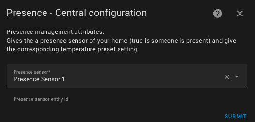

# Presence / Absence Management

- [Presence / Absence Management](#presence--absence-management)
  - [Configure Presence (or Absence)](#configure-presence-or-absence)

## Configure Presence (or Absence)

If this feature is selected, it allows you to dynamically adjust the preset temperatures of the thermostat when presence (or absence) is detected. To do this, you need to configure the temperature to be used for each preset when presence is disabled. When the presence sensor turns off, these temperatures will be applied. When it turns back on, the "normal" temperature configured for the preset will be used. See [preset management](feature-presets.md).

To configure presence, fill out this form:

For this, you simply need to configure an **occupancy sensor** whose state must be 'on' or 'home' if someone is present, or 'off' or 'not_home' otherwise.

Temperatures are configured in the entities of the device corresponding to your _VTherm_ (Settings/Integration/Versatile Thermostat/the vtherm).

WARNING: People groups do not work as a presence sensor. They are not recognized as a presence sensor. You need to use a template as described here [Using a People Group as a Presence Sensor](troubleshooting.md#using-a-people-group-as-a-presence-sensor).

>  _*Notes*_
>
> 1. The temperature change is immediate and is reflected on the front panel. The calculation will consider the new target temperature at the next cycle calculation.
> 2. You can use the direct person.xxxx sensor or a Home Assistant sensor group. The presence sensor handles the states `on` or `home` as present and `off` or `not_home` as absent.
> 3. To pre-heat your home when everyone is absent, you can add an `input_boolean` entity to your people group. If you set this `input_boolean` to 'On', the presence sensor will be forced to 'On' and the presets with presence will be used. You can also set this `input_boolean` to 'On' via an automation, for example, when you leave a zone to start preheating your home.