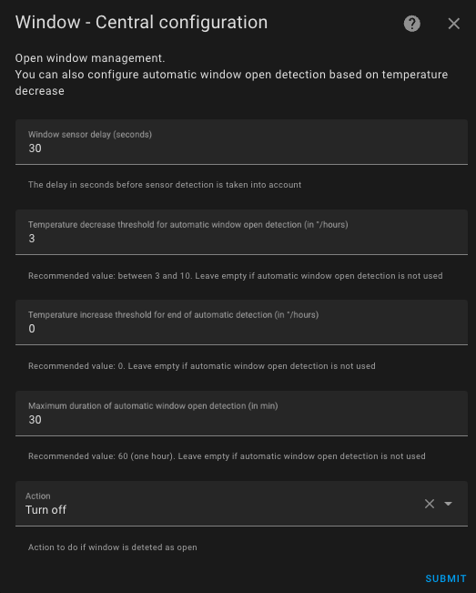

# Detekcja otwarcia drzwi / okien

- [Detekcja otwarcia drzwi / okien](#doorwindow-open-detection)
  - [Sensor Mode](#sensor-mode)
  - [Auto Mode](#auto-mode)

Musisz wybrać funkcję `Detekcja otwarcia okna` na pierwszej stronie konfiguracyjnej, aby przejść do tej sekcji.
Detekcja otwarcia może być realizowane na dwa sposoby:
1. Za pomocą fizycznego czujnika umieszczonego w drzwiach lub oknie (tryb `sensor`),
2. Poprzez wykrycie nagłego spadku temperatury (tryb `auto`)

## Tryb `Sensor`
Aby przełączyć się na tryb `sensor`, należy wskazać encję typu `binary_sensor` lub `input_boolean`.
W tym trybie należy uzupełnić następujące informacje:

1. **Opóźnienie (w sek.)** przed każdą zmianą. Pozwala to na krótko otworzyć okno bez zatrzymywania ogrzewania.
2. Działanie, które ma zostać podjęte, gdy wykryte zostanie otwarcie. Możliwe działania to:
   1. _Wyłącz_: termostat zostanie wyłączony.
   2. _Tylko nawiew_: ogrzewanie lub chłodzenie zostanie wyłączone, ale urządzenie będzie nadal wentylować (dotyczy kompatybilnych urządzeń).
   3. _Ochrona przed mrozem_: temperatura ustawień „Ochrona przez mrozem” zostanie ustawiona na termostacie bez zmiany bieżącego ustawienia wstępnego (patrz notatki poniżej).
   4. _Eko_: temperatura ustawienia „Eko” zostanie ustawiona na termostacie bez zmiany bieżącego ustawienia wstępnego (patrz notatki poniżej).

Gdy detektor wykryje otwarcie:
1. termostat czeka określony czas.
2. jeśli okno jest nadal otwarte po upływie tego czasu, wówczas aktualny stan termostatu (ogrzewanie/chłodzenie, aktualne ustawienia, temperatura docelowa, itp.) jest zapamiętywany i wykonuje się odpowiednia akcja.

Podobnie, gdy detektor wykryje zamknięcie:
1. termostat czeka określony czas.
2. jeśli okno jest nadal zamknięte po upływie tego czasu, wówczas przywracany jest z pamięci zapisany wcześniej, poprzedni stan termostatu (ogrzewanie/chłodzenie, aktualne ustawienia, temperatura docelowa, itp.)

## Tryb `Auto`
W trybie `auto` konfiguracja wygląda następująco:

1. **Opóźnienie** (w sek.) przed każdą zmianą. Pozwala to na krótkie otwarcie okna bez zatrzymywania ogrzewania.
2. **Próg wykrywania** (w stopniach na godzinę). Gdy spadek temperatury przekroczy ten próg, termostat zostanie wyłączony. Im niższa wartość, tym szybsze wykrywanie (z większym ryzykiem fałszywych alarmów).
3. **Próg zakończenia wykrywania** (w stopniach na godzinę). Gdy spadek temperatury przekroczy tę wartość, termostat powróci do poprzedniego trybu.
4. **Maksymalny czas wykrywania**. Po jego przekroczeniu termostat powróci do poprzedniego trybu i ustawień wstępnych, nawet jeśli temperatura nadal spada.
5. **Działanie do wykonania**, gdy zostanie wykryte otwarcie okna. Działania są takie same jak w trybie `sensor` opisanym powyżej.

Aby dostosować progi, zaleca się zacząć od wartości referencyjnych i dostosować progi detekcji. Na przykład:
- Próg wykrywania: 3°C/godz.
- Brak wykrywania: 0°C/godz.
- Maksymalny czas: 30 min.

Dodano nowy sensor o nazwie `slope` do wszystkich termostatów. Wskazuje on nachylenie krzywej temperatury w °C/godz. (lub °K/godz.). Nachylenie jest wygładzane i filtrowane, aby uniknąć błędnych wartości termometru, które mogłyby zakłócić pomiar.

Aby odpowiednio go dostosować, zaleca się wyświetlenie zarówno krzywej temperatury, jak i nachylenia krzywej (`slope`) na tym samym wykresie historycznym:

>  _*Wskazówki*_
>
> 1. Jeśli chcesz używać wielu czujników drzwi/okien do automatyzacji termostatu, po prostu utwórz grupę z typowym zachowaniem (`binary_sensor.group`).
> 2. Jeśli nie masz czujnika drzwi/okna w pokoju, pozostaw identyfikator encji czujnika pusty.
> 3. Dozwolony jest tylko jeden tryb. Nie można skonfigurować termostatu zarówno z czujnikiem, jak i z automatycznym wykrywaniem. Tryby mogą się wzajemnie wykluczać, więc nie mogą być aktywne jednocześnie.
> 4. Nie zaleca się używania trybu `auto` dla urządzeń narażonych na częste i normalne wahania temperatury (korytarze, otwarte przestrzenie itp.).
> 5. Aby nie zakłócać bieżących ustawień, akcje `ochrony przed mrozem` oraz `Eko` zmieniają temperaturę docelową bez zmiany ustawień wstępnych. Możesz więc zauważyć rozbieżność między wybranym ustawieniem wstępnym a wartością docelową.
> 6. Jeśli używasz karty Versatile Thermostat UI Card (patrz: [tutaj](additions.md#even-better-with-the-versatile-thermostat-ui-card)), wykrywanie otwarcia jest reprezentowane jako: .
