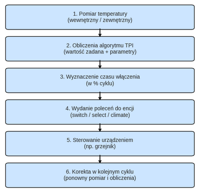
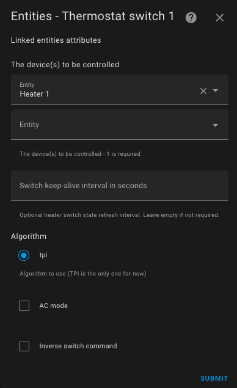
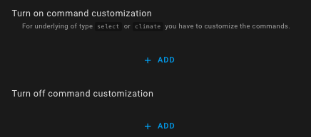

# Typ termostatu `Termostat na Przełączniku`

- [Typ termostatu `Termostat na Przełączniku`](#over_switch-type-thermostat)
  - [Wymagania wstępne](#prerequisites)
  - [Konfiguracja](#configuration)
    - [Podstawowe urządzenia](#the-underlying-devices)
    - [Podtrzymanie aktywności (keep-alive)](#keep-alive)
    - [Tryb AC](#ac-mode)
    - [Inwersja poleceń](#command-inversion)
    - [Dostosowywanie poleceń](#command-customization)

## Wymagania wstępne

Instalacja powinna wyglądać następująco:

1. Ustawienia temperatury docelowej pomieszczenia mogą być realizowane przez użytkownika, automatyzacje, wcześniej zdefiniowany harmonogram, lub mogą pochodzić z ustawień wstępnych integracji.
2. Termometr wewnętrzny (2) lub termometr zewnętrzny (2b) okresowo odczytują temperaturę. Termometr wewnętrzny powinien być umieszczony w odpowiednim miejscu — najlepiej na środku pomieszczenia. Unikaj umieszczania go zbyt blisko okna, termostatu lub grzejnika.
3. Na podstawie wartości zadanych, różnicy temperatur oraz parametrów algorytmu **TPI** (zobacz: [TPI](algorithms.md#lalgorithme-tpi), termostat _VTherm_ obliczy procentowy czas włączenia.
4. Następnie w regularnych odstępach czasu termostat _VTherm_ będzie wydawał polecenia załączania i wyłączania dla encji podrzędnych typu `switch`, `select` lub `climate`.
5. Te encje podrzędne będą sterować fizycznym urządzeniem.
6. Fizyczny przełącznik będzie włączał lub wyłączał grzejnik.  

Wartość `on-time` jest przeliczana przy każdym cyklu na nowo, co umozliwia regulację temperatury pomieszczenia.

Ten schemat pokazuje, że VTherm działa cyklicznie – każdorazowo mierzy temperaturę, oblicza czas włączenia i steruje urządzeniem. Dzięki temu możliwe jest precyzyjne utrzymanie komfortu cieplnego w pomieszczeniu, bez przegrzewania ani wychładzania.

## Konfiguracja

W pierwszej kolejności skonfiguruj ustawienia główne, wspólne dla wszystkich termostatów _VTherm_ (patrz: [ustawienia główne](base-attributes.md)). Następnie wybierz z menu opcję "Encje podstawowe", a zobaczysz poniższy ekran konfiguracji:

### Podstawowe urządzenia

Do listy "Sterowane urządzenia" dodaj encje, które mają być sterowane termostatem. Akceptowane są tu jedynie encje typu `switch`, `input_boolean`, `select`, `input_select`, lub `climate`.

Jeśli jedno z urządzeń podrzędnych nie jest przełącznikiem, wówczas dostosowanie poleceń jest obowiązkowe. Domyślnie dla encji typu `switch` polecenia to standardowe komendy `włącz`/`wyłącz` (`turn_on`, `turn_off`).

Aktualnie dostępny algorytm to TPI. Zobacz: [algorytm](#algorithm). Jeśli skonfigurowano wiele encji, termostat przeplata ich aktywacje, aby zminimalizować liczbę jednocześnie włączonych przełączników. Pozwala to na lepsze rozłożenie mocy, ponieważ każdy grzejnik włącza się po kolei.

VTherm będzie jak najlepiej wygładzać zużycie energii poprzez naprzemienne aktywacje. 
Oto przykład przeplatania aktywacji:

Oczywiście, jeśli żądana moc (`on_percent`) jest zbyt wysoka, nastąpi nakładanie się aktywacji.

### Podtrzymanie aktywności (keep-alive)

Niektóre urządzenia wymagają okresowej aktywacji, aby zapobiegać wyłączeniu awaryjnemu. Funkcja ta, znana jako 'podtrzymywanie aktywności (keep-alive)', może zostać aktywowana poprzez wprowadzenie wartości innej niż zero w polu interwału utrzymywania aktywności termostatu. Aby wyłączyć tę funkcję lub w razie wątpliwości, pozostaw to pole puste lub wpisz zero (wartość domyślna).

### Tryb AC

Można wybrać `termostat na przełączniku` do sterowania klimatyzatorem, zaznaczając pole `Tryb AC`. W takim przypadku widoczny będzie tylko tryb chłodzenia.

### Inwersja poleceń

Jeśli urządzenie jest sterowane przewodem sterującym z diodą, może być konieczne zaznaczenie pola 'Odwróć polecenie'. Spowoduje to ustawienie przełącznika w pozycji załączonej, gdy urządzenie jest wyłączane, i w pozycji wyłączonej, gdy jest załączane. Po wybraniu tej opcji czasy cykli zostaną odwrócone.

### Dostosowywanie poeceń

This configuration section allows you to customize the on and off commands sent to the underlying device.
These commands are mandatory if one of the underlying devices is not a `switch` (for `switch` entities, standard on/off commands are used).

To customize the commands, click on `Add` at the bottom of the page for both the on and off commands:

Then, specify the on and off commands using the format `command[/attribute[:value]]`.
The available commands depend on the type of underlying device:

| Underlying Device Type      | Possible On Commands                  | Possible Off Commands                          | Applies To                        |
| --------------------------- | ------------------------------------- | ---------------------------------------------- | --------------------------------- |
| `switch` or `input_boolean` | `turn_on`                             | `turn_off`                                     | All switches                      |
| `select` or `input_select`  | `select_option/option:comfort`        | `select_option/option:frost_protection`        | Nodon SIN-4-FP-21 and similar (*) |
| `climate` (hvac_mode)       | `set_hvac_mode/hvac_mode:heat`        | `set_hvac_mode/hvac_mode:off`                  | eCosy (via Tuya Local)            |
| `climate` (preset)          | `set_preset_mode/preset_mode:comfort` | `set_preset_mode/preset_mode:frost_protection` | Heatzy (*)                        |

(*) Check the values accepted by your device in **Developer Tools / States** and search for your device. You will see the options it supports. They must be identical, including case sensitivity.

Of course, these examples can be adapted to your specific case.

Example for a Nodon SIN-4-FP-21:

Click "Validate" to confirm the modifications.

If the following error occurs:

> The command customization configuration is incorrect. It is required for non-switch underlying devices, and the format must be 'service_name[/attribute:value]'. More details in the README.

This means that one of the entered commands is invalid. The following rules must be followed:
1. Each command must follow the format `command[/attribute[:value]]` (e.g., `select_option/option:comfort` or `turn_on`) without spaces or special characters except `_`.
2. There must be as many commands as there are declared underlying devices, except when all underlying devices are `switch` entities, in which case command customization is not required.
3. If multiple underlying devices are configured, the commands must be in the same order. The number of on commands must equal the number of off commands and the number of underlying devices (in the correct order). It is possible to mix different types of underlying devices. As soon as one underlying device is not a `switch`, all commands for all underlying devices, including `switch` entities, must be configured.
