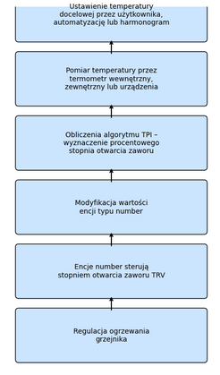

# Typ termostatu `Termostat na Zaworze`

>  _*Wskazówki*_
> 1. Typ `termostat na zaworze` type jest często mylony z typem `termostat na klimacie` wyposżonym w funkcje samoregulacji z bezpośrednim sterowaniem zaworem.
> 2. Ten typ należy wybrać tylko wtedy, gdy nie masz encji `climate` dla _TRV_ w Home Assistant i jeśli masz tylko encję typu `number` do sterowania procentem otwarcia zaworu. Typ `termostat na klimacie` z automatyczną regulacją zaworu jest znacznie bardziej wydajny niż typ `termostat na zaworze`.

## Wymagania wstępne

Instalacja powinna być zbliżona do konfiguracji `termostat na przełączniku`, z tym wyjątkiem, że sprzęt jest sterowany bezpośrednio zaworem _TRV_:

1. Ustawienia temperatury docelowej pomieszczenia mogą być realizowane przez użytkownika, automatyzacje, wcześniej zdefiniowany harmonogram, lub mogą pochodzić z presetów w samej integracji.
2. Termometr wewnętrzny (2), termometr zewnętrzny (2b) lub wewnętrzny termometr urządzenia (2c) okresowo odczytują temperaturę. Termometr wewnętrzny powinien być umieszczony w odpowiednim miejscu — najlepiej na środku pomieszczenia. Unikaj umieszczania go zbyt blisko okna, termostatu lub grzejnika.
3. Na podstawie wartości zadanych, różnicy temperatur oraz parametrów algorytmu **TPI** (patrz: [TPI](algorithms.md#lalgorithme-tpi)), _VTherm_ obliczy procentowy stopień otwarcia zaworu.
4. Następnie VTherm zmodyfikuje wartość encji typu `number`.
5. Te encje podrzędne będą kontrolować stopień otwarcia zaworu w _TRV_.
6. W ten sposób regulowane będzie ogrzewanie grzejnika.  

Wartość procentowa otwarcia zaworu jest przeliczana przy każdym cyklu na nowo, co umozliwia regulację temperatury pomieszczenia.

Ten schemat pokazuje, że VTherm działa w cyklu zamkniętym: od ustawienia temperatury, przez pomiar i obliczenia, aż po sterowanie zaworem i korektę w kolejnym cyklu. Dzięki temu system może precyzyjnie regulować ogrzewanie, zapewniając komfort cieplny i optymalne zużycie energii.

## Konfiguracja

W pierwszej kolejności skonfiguruj ustawienia główne, wspólne dla wszystkich termostatów VTherm (patrz: [ustawienia główne](base-attributes.md)). Następnie wybierz z menu opcję "Encje podstawowe", a zobaczysz poniższy ekran konfiguracji, gdzie dodasz encje `number` sterowane przez termostat _VTherm_. Akceptowane są tu jedynie encje typu `number` i `input_number`.

Aktualnie dostępny algorytm to TPI. Zobacz: [algorytm](#algorithm).

Możliwy jest wybór `termostatu na zaworze` do sterowania klimatyzatorem, jeśli dodatkowo wybierzesz opcję `Tryb AC`. W takm wypadku dostępny będzie jedynie tryb chłodzenia.
