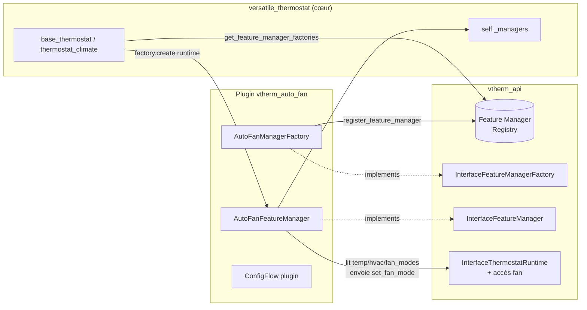

# Plan technique — Migration de `auto-fan` vers un plugin (mécanisme Feature Manager externe)

Ce document décrit le plan complet pour transformer la fonctionnalité **auto-fan**, aujourd'hui codée en dur dans le cœur `versatile_thermostat`, en une **feature packagée sous forme de plugin externe**.

Il sert de référence de travail partagée entre les deux dépôts impliqués :
- `vtherm-api` (le contrat/API partagé — **point de départ des travaux**)
- `versatile_thermostat` (le cœur)
- `vtherm_auto_fan` (le nouveau plugin, à créer)

L'objectif secondaire est de **définir un mécanisme générique de "Feature Manager externe"** qui servira de modèle pour extraire d'autres feature managers vers des plugins.

> **Stratégie retenue : Option A** — introduction d'une *Feature Manager Factory* dans `vtherm-api`, chargée dynamiquement par le cœur et instanciée par thermostat. Ce mécanisme est calqué sur celui déjà existant des *Proportional Algorithm Factory* (utilisé par `hysteresis`, `smartpi`, `pellet`).

---

## 1. État actuel de `auto-fan` (cœur)

Auto-fan est **entièrement intégré** dans `ThermostatOverClimate` (aucun feature manager), et **spécifique à `over_climate`** car il a besoin des `fan_modes` du climate sous-jacent.

| Élément                                                                                                       | Emplacement                                                                       |
| ------------------------------------------------------------------------------------------------------------- | --------------------------------------------------------------------------------- |
| Constantes (`CONF_AUTO_FAN_MODE`, niveaux `none/low/medium/high/turbo`, seuil `±2°C`, modes de désactivation) | `const.py` L121-126, L462-467, L492, L525-526, L393                               |
| Option ConfigFlow (`default=auto_fan_high`)                                                                   | `config_schema.py` L244-247                                                       |
| Variables d'état                                                                                              | `thermostat_climate.py` L60-64                                                    |
| Init depuis la config                                                                                         | `thermostat_climate.py` L117-120                                                  |
| Logique d'envoi (`_send_auto_fan_mode`)                                                                       | `thermostat_climate.py` L331-374                                                  |
| Mapping niveaux → vitesses réelles (`choose_auto_fan_mode`)                                                   | `thermostat_climate.py` L448-568                                                  |
| Appel dans le cycle                                                                                           | `thermostat_climate.py` L871-872                                                  |
| Attributs exposés                                                                                             | `thermostat_climate.py` L625-626                                                  |
| Propriété `auto_fan_mode`                                                                                     | `thermostat_climate.py` L997-999                                                  |
| Service `set_auto_fan_mode` (logique)                                                                         | `thermostat_climate.py` L1282-1308                                                |
| Désactivation forcée (régulation par vanne)                                                                   | `thermostat_climate_valve.py` L450-452                                            |
| Envoi au sous-jacent (`set_fan_mode`, gestion délai issue #1458)                                              | `underlyings.py` L761-801                                                         |
| Enregistrement du service HA                                                                                  | `climate.py` L121-130                                                             |
| Traductions                                                                                                   | `translations/fr.json` L114,131,804-810 ; `translations/en.json` L113,130,802-808 |
| Tests                                                                                                         | `tests/test_auto_fan_mode.py`                                                     |

### Logique métier (résumé factuel)
1. À l'init, `_auto_fan_mode` est lu depuis la config (`auto_fan_none` par défaut runtime).
2. Après init des underlyings, `choose_auto_fan_mode()` mappe le niveau choisi vers un `fan_mode` réel du climate sous-jacent (`_auto_activated_fan_mode`) et un `fan_mode` de désactivation (`_auto_deactivated_fan_mode`), en s'adaptant au nombre de vitesses disponibles.
3. À chaque cycle, `_send_auto_fan_mode()` calcule l'écart `dtemp = cible − courante`. Si `|dtemp| ≥ 2°C` **et** cohérent avec le `hvac_mode`, il envoie `_auto_activated_fan_mode` au sous-jacent, sinon `_auto_deactivated_fan_mode`.
4. Le service `set_auto_fan_mode` permet de changer le niveau à chaud.
5. En régulation par vanne, l'auto-fan est toujours désactivé.

---

## 2. Mécanisme de plugin actuel (`vtherm_api` 0.3.0)

Deux points d'extension existent réellement :

1. **Proportional Algorithm Factory** — `InterfacePropAlgorithmFactory` / `InterfacePropAlgorithmHandler`.
   - Registre côté API : `register_prop_algorithm` / `unregister_prop_algorithm` / `get_prop_algorithm` / `list_prop_algorithms`.
   - Le cœur instancie **un handler par thermostat** via `factory.create(thermostat_runtime)`.
   - Utilisé par `hysteresis`, `smartpi`, `pellet`.

2. **PluginClimate (event-based)** — `register_manager` / `link_to_vtherm` + `PluginClimate`.
   - Écoute les events VTherm (`TEMPERATURE_EVENT`, `HVAC_MODE_EVENT`, …) et agit via `call_linked_vtherm_action()`.
   - Utilisé par `climate_replication`.

### Lacune identifiée (fait vérifié)
Il **n'existe pas** de mécanisme *Feature Manager Factory par thermostat*. `VThermAPI.register_manager()` enregistre **une seule instance** sur les `PluginClimate` **déjà existants** ; il ne gère ni l'instanciation par VTherm, ni les VTherm futurs, ni l'activation par configuration, ni le scope `over_climate`, ni la restauration d'état.

De plus, `InterfaceThermostatRuntime` **n'expose ni les underlyings, ni `fan_modes`, ni `set_fan_mode`** — nécessaires à auto-fan.

C'est précisément ce que l'**Option A** vient combler.

---

## 3. Architecture cible (Option A)

Introduire un mécanisme **Feature Manager Factory** symétrique aux Proportional Algorithm Factory :

- Un plugin enregistre une **factory** de feature manager auprès de l'API.
- Le cœur, à la construction de chaque thermostat éligible, interroge l'API, instancie **un manager par thermostat** via `factory.create(runtime)`, et l'ajoute à `self._managers`.
- Le manager externe bénéficie alors **automatiquement** des boucles de cycle existantes (`post_init`, `start_listening`, `refresh_state`, `stop_listening`, `restore_state`), car il implémente `InterfaceFeatureManager`.
- L'interface runtime est étendue pour donner au manager l'accès nécessaire (température régulée/cible/courante, `hvac_mode`, `fan_modes` du sous-jacent, envoi d'un `fan_mode`).



---

## 4. Phase 1 — `vtherm-api` (point de départ)

Objectif : livrer le contrat sur lequel s'appuieront ensuite le cœur et le plugin.

### 4.1 Nouvelle interface `InterfaceFeatureManagerFactory`
Symétrique à `InterfacePropAlgorithmFactory` :
- Propriété `name: str` → identifiant unique du feature manager (ex. `auto_fan`).
- Méthode `create(thermostat: InterfaceThermostatRuntime) -> InterfaceFeatureManager`.
- (Optionnel) Propriété/méthode indiquant le **scope** d'éligibilité (ex. `over_climate` uniquement), afin que le cœur n'instancie pas le manager sur des thermostats incompatibles. À définir : soit un attribut sur la factory, soit une vérification déléguée (`supports(runtime) -> bool`).

### 4.2 Registre dans `VThermAPI`
Ajouter, calqués sur les prop-algos :
- `register_feature_manager(factory)`
- `unregister_feature_manager(name)`
- `get_feature_manager(name)`
- `list_feature_managers() -> list[str]`
- `get_feature_manager_factories() -> list[InterfaceFeatureManagerFactory]` (le cœur en a besoin pour itérer à la création d'un thermostat).

> Décision : conserver l'ancien `register_manager` (PluginClimate) intact pour ne pas casser `climate_replication`. Le nouveau registre est **distinct**.

### 4.3 Extension de `InterfaceThermostatRuntime`
Auto-fan a besoin d'accéder au sous-jacent. Ajouter (a minima) :
- `regulated_target_temperature` (ou exposer la température de consigne régulée déjà utilisée par `_send_auto_fan_mode`).
- Accès aux `fan_modes` du/des climate(s) sous-jacent(s).
- Une méthode d'envoi d'un `fan_mode` au sous-jacent (`async_set_underlying_fan_mode(fan_mode)` ou équivalent), pour réutiliser la logique de délai existante d'`underlyings.set_fan_mode` (issue #1458).

> Point à trancher : exposer directement les underlyings (plus générique, utile pour de futurs managers) **ou** n'exposer que les 2-3 accès dont auto-fan a besoin (plus fermé, plus sûr). Recommandation : exposer un accès minimal et typé au fan (modes + envoi), plus l'éventuel besoin générique dans une itération ultérieure.

### 4.4 Confirmation du contrat `InterfaceFeatureManager`
Le contrat existe déjà (`post_init`, `start_listening`, `stop_listening`, `refresh_state`, `restore_state`, `is_configured`, `is_detected`, `name`, `hass`). Vérifier qu'il couvre le cycle de vie d'auto-fan ; sinon compléter (ex. hook explicite appelé à chaque cycle si `refresh_state` ne suffit pas).

### 4.5 Versionnement
- Bump de version `vtherm_api` (ex. `0.4.0`).
- Le cœur devra relever la contrainte dans `manifest.json` et `requirements_dev.txt` / `requirements_test.txt`.

### 4.6 Tests `vtherm-api`
- Tests unitaires du registre (register/unregister/get/list).
- Tests du contrat de factory (`create`), du scope, et de l'extension runtime.

---

## 5. Phase 2 — Cœur `versatile_thermostat`

### 5.1 Retraits (extraction de l'auto-fan)
- `config_schema.py` L244-247 (option ConfigFlow).
- `thermostat_climate.py` : variables L60-64, init L117-120, `_send_auto_fan_mode` L331-374, `choose_auto_fan_mode` L448-568, appel cycle L871-872, attributs L625-626, propriété L997-999, `service_set_auto_fan_mode` L1282-1308.
- `thermostat_climate_valve.py` L450-452 (override).
- `climate.py` L121-130 (enregistrement du service).
- `const.py` : constantes auto-fan (L121-126, L462-467, L492, L525-526, retrait de `CONF_AUTO_FAN_MODE` de `DEFAULT_SCHEMA` L393).
- `translations/fr.json` et `en.json` : entrées auto-fan.
- Déplacer `tests/test_auto_fan_mode.py` vers le plugin.

> À conserver : `underlyings.set_fan_mode` (L761-801) fait partie de l'API climate générique (utilisé aussi hors auto-fan). Il sera réutilisé via l'extension runtime de la Phase 1.

### 5.2 Ajouts (support des feature managers externes)
- Au point de construction du thermostat (`base_thermostat` / spécifiquement `thermostat_climate` pour un manager `over_climate`), après l'instanciation des managers internes :
  - interroger l'API (`get_feature_manager_factories`),
  - pour chaque factory éligible au thermostat (scope), `factory.create(self)` puis `self.register_manager(...)`.
- Gérer le cas « factory pas encore enregistrée au moment de la construction » (plugin chargé plus tard), en s'inspirant du **retry au startup** déjà fait pour les prop-algos.
- Implémenter les propriétés/méthodes ajoutées à `InterfaceThermostatRuntime` (accès fan, température régulée).

### 5.3 Compatibilité recorder / attributs
Auto-fan exposait `auto_fan_mode`, `current_auto_fan_mode`, `auto_activated_fan_mode`, `auto_deactivated_fan_mode`. Désormais ces attributs sont fournis par le **manager du plugin**, regroupés sous une **section top-level dédiée** (cf. règle recorder : seuls les clés top-level sont filtrables). Déclarer cette section dans `unrecorded_attributes` du manager si besoin.

---

## 6. Phase 3 — Nouveau plugin `vtherm_auto_fan`

Structure calquée sur `vtherm_hysteresis` / `vtherm_smartpi` :

```
custom_components/vtherm_auto_fan/
  __init__.py         # async_setup / async_setup_entry -> register factory ; unload -> unregister
  manifest.json       # domain, after_dependencies: [versatile_thermostat], dep vtherm_api
  const.py            # niveaux, seuil, modes de désactivation
  factory.py          # AutoFanManagerFactory (name="auto_fan", create(), scope over_climate)
  manager.py          # AutoFanFeatureManager (mapping vitesses, seuil, activation, restore, attrs)
  config_flow.py      # sélection VTherm cible + niveau, defaults globaux
  services.yaml       # service set_auto_fan_mode
  strings.json
  translations/       # fr.json, en.json
  tests/              # depuis test_auto_fan_mode.py
```

Comportement du manager :
- `post_init` : lit la config (niveau) applicable au VTherm.
- Après init des underlyings : calcule le mapping vitesses (`choose_auto_fan_mode`).
- À chaque cycle (`refresh_state` ou hook cycle) : applique `_send_auto_fan_mode` via l'accès fan de l'interface runtime.
- Service `set_auto_fan_mode` : re-mappe et met à jour les attributs.
- `restore_state` : restaure le niveau courant.

---

## 7. Migration / compatibilité utilisateur

Les VTherm existants possèdent `auto_fan_mode` dans leur config entry. Options :
- **Migration assistée** : le plugin lit l'ancienne clé `auto_fan_mode` présente dans l'entry du VTherm cible pour pré-remplir sa configuration.
- **Reconfiguration manuelle** : documentée dans le README du plugin.

> Décision à confirmer avec le mainteneur.

---

## 8. Séquencement des travaux

1. **`vtherm-api`** (container dédié) : interface factory + registre + extension runtime + tests + version.
2. **Cœur** : retraits auto-fan + point de chargement des managers externes + implémentation des accès runtime + màj contrainte `vtherm_api` + nettoyage traductions.
3. **Plugin** : implémentation + config flow + service + traductions + tests migrés.
4. **Docs** : README du plugin, mise à jour doc VTherm (retrait auto-fan du cœur), lien vers ce plan.

---

## 9. Points ouverts à confirmer

- Mécanisme de **scope** de la factory (attribut vs `supports(runtime)`).
- Étendue de l'extension runtime : underlyings génériques vs accès fan minimal.
- **Migration** auto vs manuelle des configs existantes.
- Domaine/nom du plugin (`vtherm_auto_fan`) et domaine du service (`versatile_thermostat` historique vs domaine plugin).
- Faut-il un **hook de cycle explicite** dans le contrat `InterfaceFeatureManager`, ou `refresh_state` suffit-il pour piloter le fan à chaque cycle ?

---

## 10. Précisions d'implémentation — rafraîchissement des managers externes par cycle

Le besoin de piloter le fan « à chaque cycle » impose que les managers externes soient
rafraîchis pendant `async_control_heating`, et pas seulement au démarrage. Six points ont
été tranchés lors de l'implémentation ; chacun est documenté ci-dessous avec la solution retenue.

1. **Emplacement de l'appel de rafraîchissement dans le cycle.**
   - *Solution* : la boucle de rafraîchissement des managers externes est placée dans
     `async_control_heating`, **après** `_control_heating_specific` (l'état de régulation est
     donc déjà calculé) et **avant** le bloc de publication
     (`update_custom_attributes()` + `async_write_ha_state()`). Ainsi les attributs mis à jour
     par un manager externe sont publiés dans le même cycle.

2. **Comportement en sécurité (`safety`).**
   - *Solution* : pour `over_climate`, la sortie anticipée liée à la sécurité intervient
     **avant** `_control_heating_specific`. Les managers externes ne sont donc pas rafraîchis
     pendant un état de sécurité — comportement cohérent avec l'auto-fan historique.

3. **`refresh_state` utilisé comme « tick » de cycle.**
   - *Solution* : plutôt que d'ajouter un hook de cycle dédié au contrat
     `InterfaceFeatureManager`, `refresh_state()` est appelé à chaque cycle et sert de point
     d'entrée pour recalculer/piloter le fan. Convention retenue pour garder le contrat minimal.

4. **Valeur de retour de `refresh_state` ignorée au niveau du cycle.**
   - *Solution* : le `bool` renvoyé par `refresh_state()` n'est pas exploité à cet endroit.
     Limitation connue : un manager externe ne peut pas, via ce point, forcer un recalcul du
     cycle en cours. Acceptable pour l'auto-fan (le fan est appliqué directement par le manager).

5. **Source de vérité unique pour la liste des managers externes.**
   - *Solution* : une liste dédiée `self._external_managers` est peuplée au même endroit que
     `self._external_manager_names`, dans `_load_external_feature_managers()`. La boucle de
     cycle n'itère que sur `self._external_managers` (et non sur l'ensemble `self._managers`),
     afin d'éviter tout double rafraîchissement des managers internes.

6. **Non conditionné au `timestamp`.**
   - *Solution* : le rafraîchissement s'exécute aussi sur les cycles forcés (`force=True`),
     sans être filtré par `timestamp`. L'anti-spam éventuel est délégué à la temporisation de
     `underlyings.set_fan_mode` (cf. issue #1458), pas au point d'appel du cycle.

### Note complémentaire — `add_custom_attributes` optionnel

`add_custom_attributes` **ne fait pas partie** du contrat `InterfaceFeatureManager`. Comme les
managers externes sont ajoutés à `self._managers`, l'appel de `update_custom_attributes()` du
cœur est rendu défensif (`getattr` + `callable`) : un manager externe qui n'expose pas
d'attributs ne provoque pas d'erreur, et un manager qui l'implémente (ex. l'auto-fan) publie
bien ses attributs. Les managers internes possédant tous la méthode, leur comportement est
inchangé.

---

## 11. Test de validation ajouté

Fichier : `tests/test_external_feature_manager.py`.

- Enregistre une **fausse factory** (`InterfaceFeatureManagerFactory`) + un **faux manager**
  via `VersatileThermostatAPI.get_vtherm_api(hass).register_feature_manager(...)`.
- Construit un VTherm `over_climate` (avec climate sous-jacent mocké), déclenche
  `async_control_heating(force=True)` et vérifie que `refresh_state()` du faux manager est
  appelé **une fois par cycle**.
- Vérifie aussi l'instanciation (présence dans `_external_managers` / `_external_manager_names`,
  appel de `post_init`).
- Le faux manager **n'implémente pas** `add_custom_attributes` : il valide donc le garde-fou
  défensif décrit en section 10.

État : **passe**. Non-régression vérifiée sur `test_auto_fan_mode.py` + `test_sensors.py` (15 tests OK).

---

## 12. État de testabilité en local (faits vérifiés le 2026-08-15)

### 12.1 Environnement d'exécution HA

- **Pas de `.venv`** dans le projet. HA s'exécute depuis
  `~/.local/lib/python3.14/site-packages` (même environnement que le shell de dev).
- `vtherm_api` **0.4.0** y est installé en **éditable** (source :
  `custom_components/vtherm_api/src/vtherm_api`). Le HA lancé par `./container start`
  utilise donc bien la 0.4.0 (avec `register_feature_manager` / `get_feature_manager_factories`).
- `config/deps` **ne contient pas** `vtherm_api` (rien à nettoyer côté deps HA).
- Le `manifest.json` du cœur déclare toujours `vtherm_api>=0.3.0` ; comme la 0.4.0 est
  **déjà installée**, HA voit la contrainte satisfaite et **ne réinstalle pas** (pas de
  downgrade vers la 0.3.0 de PyPI).

> **Conclusion** : un test en local dans ce dev container est possible **sans rien publier**.

### 12.2 État du plugin `vtherm_auto_fan_extended` (relu)

- Manifeste : `domain=vtherm_auto_fan_extended`, `version=0.1.0`, `config_flow=true`,
  `after_dependencies=[versatile_thermostat]`, `integration_type=service`.
  **Aucun `requirements`** : le plugin compte sur le cœur pour amener `vtherm_api`.
- `__init__.py` : `async_setup` / `async_setup_entry` enregistrent la factory
  (`register_feature_manager`) + les services, puis rechargent les entries VTherm
  `over_climate` concernées pour qu'elles réinstancient le manager.
- `factory.py` : `supports()` limite le scope aux `over_climate`
  (`entry_infos[CONF_THERMOSTAT_TYPE] == over_climate`, avec repli sur `underlying_fan_modes`).
- `manager.py` :
  - `_resolve_level()` lit la config **des entries du plugin** par priorité :
    entrée par-thermostat (`target_vtherm_unique_id`) > entrée globale >
    clé legacy `auto_fan_mode` de l'entry VTherm > défaut.
  - S'enregistre dans `hass.data[DOMAIN][DATA_MANAGERS]` (clé = `unique_id`) pour être
    joignable par le service `set_auto_fan_mode`.

### 12.3 Conclusion de testabilité

**Prêt à tester en local dès maintenant**, en tenant compte des points de coordination
ci-dessous (section 13).

---

## 13. Points de coordination à trancher avant/pendant le test

1. **L'auto-fan du cœur est toujours présent** (extraction destructive différée, cf. section 5.1).
   - *Risque* : si le VTherm `over_climate` de test a `auto_fan_mode` ≠ `none` côté cœur,
     **le cœur ET le plugin pilotent le ventilo** (double contrôle).
   - *Recommandation de test* : utiliser un VTherm dont l'auto-fan cœur est à `none`,
     puis configurer le plugin.

2. **Double déclenchement du pilotage fan (non bloquant).**
   - Le plugin réévalue déjà l'auto-fan via **son propre listener** de changement d'état du
     VTherm (`manager.start_listening` → `async_track_state_change_event`).
   - Notre boucle `refresh_state` par cycle (section 10) fait donc **doublon** — idempotent
     grâce à `_last_sent_fan_mode`.
   - *Décision à prendre* : conserver la boucle Phase 2 côté cœur (mécanisme générique
     réutilisable par d'autres feature managers) **ou** laisser le plugin seul maître via son
     listener. Les deux peuvent coexister sans régression, mais c'est une redondance à assumer.

3. **Bump de la contrainte `vtherm_api` (avant merge / install de prod).**
   - PyPI n'expose que jusqu'à **0.3.0** (versions publiées : 0.1.0, 0.2.0, 0.2.1, 0.3.0).
     La **0.4.0 n'est pas publiée**.
   - Tant que non publiée, garder `vtherm_api>=0.3.0` dans le `manifest.json` du cœur
     (sinon CI cassée à l'install pip).
   - Une install HA « propre » (hors dev container, qui installe depuis PyPI) récupérerait
     0.3.0 → le plugin échouerait (`register_feature_manager` absent). D'où l'intérêt de
     publier une version avant tout test hors dev container.

4. **Versionnement de la release `vtherm_api`.**
   - La source est en `0.4.0`. Une proposition de release en **`4.0.0.beta1`** sauterait en
     majeur 4.
   - *À confirmer* : préférer **`0.4.0b1`** (pré-release cohérente avec la source) sauf volonté
     explicite de passer en 4.x.
   - Si publication d'une **pré-release** : pour que pip l'accepte, le specifier doit l'autoriser
     explicitement, ex. `vtherm_api>=0.4.0b1` dans le `manifest.json` du cœur, et idéalement
     ajouter `requirements: ["vtherm_api>=0.4.0b1"]` au **manifeste du plugin** (aujourd'hui
     sans `requirements`).
